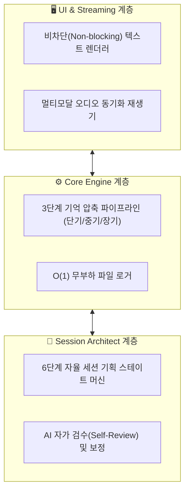

# GRC (GenAI Roleplay Chat): 프로젝트 개요

> **한 줄 요약**: 단 한 줄의 프롬프트로 세계관과 캐릭터를 창조하고, 수백 턴의 장기 롤플레잉을 쾌적하게 즐길 수 있는 고성능 AI 역할극 데스크톱 클라이언트.

---

## 저장소 안내 (Repository Overview)

GRC 프로젝트 관련 코드와 기술 명세는 아래 링크에서 확인할 수 있습니다.

- [GRC 소스코드 (GitHub)](https://github.com/jin20203458/GRC) - 클라이언트 구현체
- [지식베이스 (Obsidian.Agent)](https://github.com/jin20203458/Obsidian.Agent) - 본 문서를 포함한 기술 명세서 모음

---

## 왜 만들었는가 (Why)

생성형 AI(LLM)의 발전으로 AI와 텍스트 기반의 역할극(TRPG, 캐릭터 롤플레잉)을 즐기는 유저들이 폭발적으로 증가했습니다. 기존에도 오픈소스 웹 클라이언트들이 존재하지만, **유저 편의성과 아키텍처 관점**에서 볼 때 뚜렷한 한계들이 있었습니다.

1.  **컨텍스트 윈도우 한계**: 서사가 진행될수록 누적된 대화가 AI의 입력 한계를 초과하며, 이로 인해 기억을 잃거나 엄청난 토큰 비용이 발생합니다.
2.  **높은 진입 장벽 (Prompt Engineering)**: 캐릭터 스탯, 세계관, 로어북, 시스템 프롬프트를 유저가 일일이 텍스트로 깎아야 합니다.
3.  **UI 동시성 제어 부재**: 장문의 텍스트 스트리밍과 무거운 JSON 파싱이 메인 스레드를 묶어버려, 채팅 중 간헐적으로 UI가 멈추는(Freeze) 현상이 빈번합니다.

GRC는 이러한 문제들을 **단순한 클라이언트가 아닌 서버 아키텍처 레벨의 엔지니어링**으로 해결하여, 누구나 쾌적하고 깊이 있는 역할극을 즐길 수 있도록 고안된 네이티브 데스크톱 애플리케이션입니다.

---

## 무엇을 하는 프로젝트인가 (What)

**장르**: 생성형 AI 기반 대규모 서사 관리 및 자율 콘텐츠 저작 클라이언트

사용자는 GRC 클라이언트를 통해 자신만의 TRPG 세션을 기획하고 AI와 상호작용합니다.

| 사용자 행동 | 예시 |
|---|---|
| **자율 세션 생성** | "사이버펑크 세계관의 하수구 생존기"라고 입력하면, AI가 세계관, 캐릭터, 초기 시나리오를 알아서 기획하고 세팅합니다. |
| **롤플레잉 텍스트 대화** | 생성된 캐릭터와 수백 턴 이상의 장기 롤플레잉을 진행하며 서사를 전개합니다. |
| **멀티모달 감정 몰입** | 단순한 텍스트를 넘어, 상황과 감정에 맞는 성우의 목소리로 캐릭터의 대사를 실시간 청취합니다. |

---

## 어떻게 작동하는가 (How)

클라이언트는 단순한 뷰어를 넘어, 크게 세 가지의 논리적 엔진 계층으로 작동합니다.

| 계층 | 하는 일 |
|---|---|
| **UI & Streaming** | AI의 응답을 60FPS로 부드럽게 화면에 그리고, 대사에 맞춰 미리 생성된 오디오를 지연 없이 재생합니다. |
| **Core Engine** | 100턴 이상의 긴 대화를 단기-중기-장기 기억으로 압축하여 LLM에 주입하며, 디스크 I/O 병목 없이 기록을 저장합니다. |
| **Session Architect** | 사용자의 짧은 아이디어를 바탕으로 복잡한 TRPG 세팅(로어북, 스탯 등)을 스스로 작성하고 문맥 오류를 검수합니다. |

---

## 무엇이 다른가 (Differentiator)

기존 롤플레잉 클라이언트(예: SillyTavern 등)의 한계를 넘어서기 위해 GRC가 다르게 설계한 지점들입니다.

| 과제 | 기존 웹 클라이언트 | GRC (GenAI Roleplay Chat) |
|---|---|---|
| **세션 준비** | 유저가 직접 수천 자의 프롬프트 작성 및 세팅 | 한 줄의 키워드만으로 AI가 6단계에 걸쳐 자율 생성 및 세팅 |
| **기억 관리** | 단순 텍스트 잘라내기(Truncation) 또는 벡터 DB 의존 | 단기/중기(Flash)/장기(Pro) 모델을 혼용한 능동적 연대기 압축 |
| **UI 응답성** | 무거운 DOM 렌더링 및 동기적 I/O로 인한 프레임 드랍 | 채널 기반 스트리밍과 O(1) 파일 쓰기로 0초 지연(Zero-Delay) 달성 |

---

## 사양서 지도 (Spec Map)

상세한 구현 명세 및 아키텍처 딥다이브는 아래 문서에서 확인할 수 있습니다.

| 문서 | 내용 |
|---|---|
| **[현재 문서]** 00_project_overview | 프로젝트 기획 철학, 비전, 고수준 구조 |
| [01_grc_architecture](./01_grc_architecture.md) | 3-Tier 메모리, O(1) 로거, 비차단 스트리밍에 대한 구현 딥다이브 |
