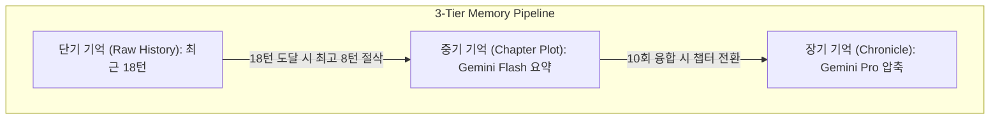

# GRC Architecture & Deep Dive
> **부제**: GRC 기술 아키텍처 및 C#/.NET 동시성/메모리 관리 딥다이브

본 문서는 GRC(GenAI Roleplay Chat) 클라이언트의 핵심 엔진 구조와, C#/.NET 8.0 환경에서 달성한 동시성 제어 및 메모리 관리 기법을 상세히 기술합니다.

---

<memory_pipeline>

## 1. 3단계 메모리 파이프라인 (3-Tier Memory Pipeline)

대규모 롤플레잉 서사를 진행할 때, 모든 대화를 프롬프트에 누적하면 AI 모델의 컨텍스트 윈도우를 초과하여 심각한 비용 폭발과 품질 저하(Lost in the middle)를 유발합니다. 이를 방지하기 위해 3단계 압축 아키텍처를 설계했습니다.

`[IMPLEMENTED]` 메모리 파이프라인 제어 로직은 [MemoryManagerService.cs](../../../GRC/GRC/Services/MemoryManagerService.cs)에 구현되어 있습니다.

### 1) 단기 기억 (Raw History)
*   가장 최근에 주고받은 날것의 대화 18턴을 보존합니다.
*   **비동기 압축 트리거**: 18턴에 도달하면 가장 오래된 8턴을 절삭하여 백그라운드 스레드(`Task.Run`)에서 중기 기억 요약을 시작합니다. 압축 도중 유저가 채팅을 계속 입력하여 상태가 변하는 것을 방지하기 위해 `_shortTermVersion`이라는 낙관적 락(Optimistic Lock) 개념을 도입하여 일관성을 보장합니다.

### 2) 중기 기억 (Chapter Plot)
*   잘려나간 8턴의 대화는 **Gemini Flash 3.5** 모델을 통해 현재 챕터의 누적 줄거리(Plot)로 병합됩니다.
*   중기 기억이 10회 융합되면(약 80턴 경과) 하나의 챕터가 끝난 것으로 간주하여 챕터를 전환하고, 이전 챕터를 큐(Queue)로 밀어냅니다.

### 3) 장기 기억 (Chronicle)
*   챕터 큐가 가득 차면(Max 3), 가장 오래된 챕터가 큐에서 빠져나와 **Gemini Pro** 모델에 전달됩니다.
*   여기서 단순 요약이 아닌, **살리언스 증발(Salience Evaporation)** 기법을 적용하여 자잘한 대화는 날려버리고 서사의 핵심 인과율과 세계관의 변화(Canon Events)만을 선별해 1,500자 이내의 대과거 연대기로 영구 보존합니다.

</memory_pipeline>

---

<storage_optimization>

## 2. O(1) 무부하 파일 쓰기 (Zero-Deserialize JSON Append)

대화 이력을 디스크에 영구 저장(`FullHistory.json`)할 때 발생하는 오버헤드를 극단적으로 최적화했습니다.

`[IMPLEMENTED]` 파일 조작 알고리즘은 [FullHistoryLogger.cs](../../../GRC/GRC/Helpers/FullHistoryLogger.cs)에 구현되어 있습니다.

*   **문제점**: 일반적으로 JSON 배열에 요소를 추가할 때 전체 파일을 메모리로 읽어 역직렬화(Deserialize)한 뒤, 리스트에 Add하고 다시 직렬화하여 덮어씁니다. 서사가 길어질수록 이 과정에서 발생하는 GC(가비지 컬렉터) 스파이크와 I/O 지연이 UI를 멈추게 합니다.
*   **해결책 (`FullHistoryLogger.cs`)**:
    역직렬화를 완전히 포기하고 바이너리 스트림 조작으로 대체했습니다.
    1.  `FileStream`으로 파일을 엽니다.
    2.  끝에서부터 역방향으로 탐색(Seek)하여 배열을 닫는 괄호 `]`를 찾습니다.
    3.  새로운 메시지 텍스트를 바이트 단위로 직접 주입(Append)하고 다시 `]`를 덮어씌웁니다.
    4.  결과적으로 파일의 크기가 10MB이든 1GB이든 **O(1)의 일정한 시간 복잡도**로 파일 쓰기가 완료됩니다.

</storage_optimization>

---

<concurrency_streaming>

## 3. 비차단 동시성 제어 및 60FPS 스트리밍

네트워크 통신과 UI 렌더링 간의 병목을 완벽히 격리하여 '0초 지연(Zero-Delay)' 타이핑 경험을 제공합니다.

`[IMPLEMENTED]` 렌더링 틱 제어는 [StatefulStreamingHelper.cs](../../../GRC/GRC/Helpers/StatefulStreamingHelper.cs)에, 통신 채널은 [ChatWorkflowService.cs](../../../GRC/GRC/Services/ChatWorkflowService.cs)에 분리 구현되어 있습니다.

### 생산자-소비자 스트리밍 격리 (`System.Threading.Channels`)
*   `ChatWorkflowService` 내부에서 Gemini API로부터 문자 스트림을 받아오는 스레드(생산자)와, WPF 대화창에 문자를 그리는 스레드(소비자)를 `Channel<char>`로 분리했습니다. 네트워크 지연(Lag)이 발생해도 생산자 큐만 대기할 뿐 UI 렌더러는 절대 굳지 않습니다.

### 60FPS 배치 렌더링 (`StatefulStreamingHelper.cs`)
*   문자가 들어올 때마다 WPF의 `Dispatcher`를 호출하면 윈도우 메시지 루프가 포화되어 렌더링 스레드가 마비됩니다.
*   이를 막기 위해 유입되는 문자를 `ConcurrentQueue<char>`에 담아둡니다.
*   `DispatcherTimer`를 `DispatcherPriority.Render` 우선순위로 16ms(60FPS)마다 한 번씩 틱(Tick)을 발생시켜, 큐에 쌓인 문자를 일괄 Drain한 뒤 **틱당 단 한 번만 UI에 반영(FlushBuffer)**합니다.

</concurrency_streaming>

---

<session_architect>

## 4. AI Session Architect (자율 저작 에이전트)

유저가 기획서를 작성할 필요 없이, 키워드 한 줄만으로 TRPG 세션을 빌드해 주는 6단계 에이전트입니다.

`[IMPLEMENTED]` 6단계 스테이트 머신은 [SessionArchitectService.cs](../../../GRC/GRC/Services/SessionArchitectService.cs)에 구현되어 있습니다.

*   **상태 기계(State Machine)**: 기획(Planning) → 세계관 → 로어북 → 스탯 → 초기 시나리오 → GM 지시문으로 이어지는 단계별 컨텍스트 상속 모델을 구축했습니다.
*   **AI 감사관 자가 검수(Self-Review)**:
    자동 모드를 켜면, 매 단계가 끝날 때마다 또 다른 내부 AI(Auditor)가 생성된 JSON 규격과 개연성을 검사합니다.
    오류가 발견되면 `{ "pass": false, "issues": "문제 사유" }`를 반환하며, 이 사유를 바탕으로 `ReviseContentAsync`를 호출해 인간의 개입 없이 코드를 스스로 수정하고 다음 단계로 전진합니다.

</session_architect>

---

<multimodal_sync>

## 5. 멀티모달 감정 연기 TTS 동기화

텍스트가 렌더링되는 동안 발생하는 빈 시간을 활용하여 오디오를 미리 생성(Prefetch)하고 싱크를 맞춥니다.

`[IMPLEMENTED]` 보이스 프리페치 및 재생은 [GeminiTtsService.cs](../../../GRC/GRC/Services/GeminiTtsService.cs)와 연동됩니다.

1.  **실시간 대사 파싱**: 스트리밍 루프가 따옴표(`"..."`)를 만나면 이를 감지하여 대화 버퍼를 열고, 닫는 따옴표가 등장하면 즉시 백그라운드에서 `GeminiTtsService`로 오디오 번역 및 음성 합성(WAV)을 요청합니다.
2.  **재생 동기화 대기 (Sync Hold)**: UI 소비자가 문자를 그리다가 닫는 따옴표에 도달하면, 프리페치 큐에서 방금 생성 완료된 음성을 꺼내 재생합니다. 이때 `TaskCompletionSource`를 사용하여 음성 재생이 완전히 끝날 때까지 다음 지문 텍스트의 출력을 멈추어(Hold) 소리와 자막의 완벽한 템포를 맞춥니다.

</multimodal_sync>
