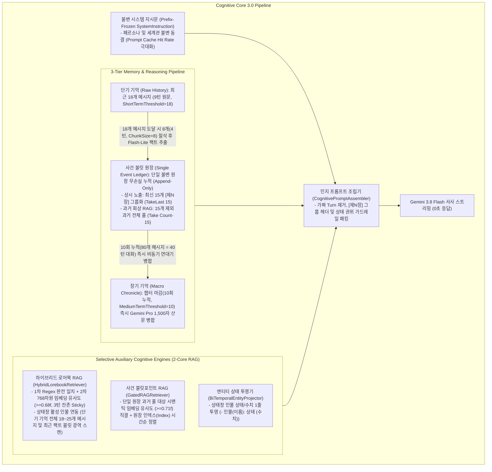
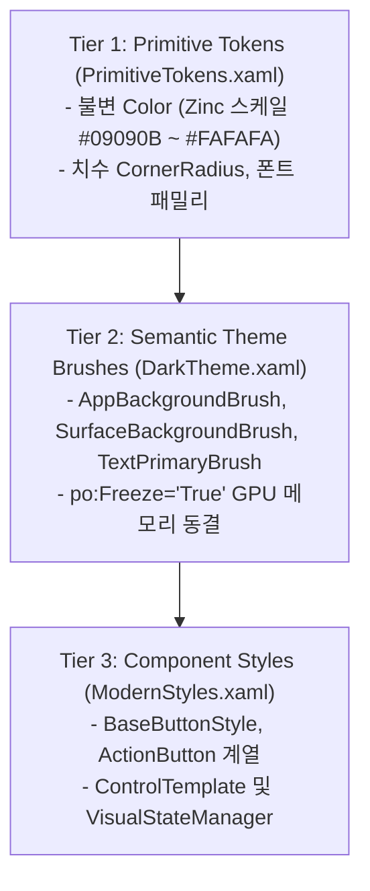
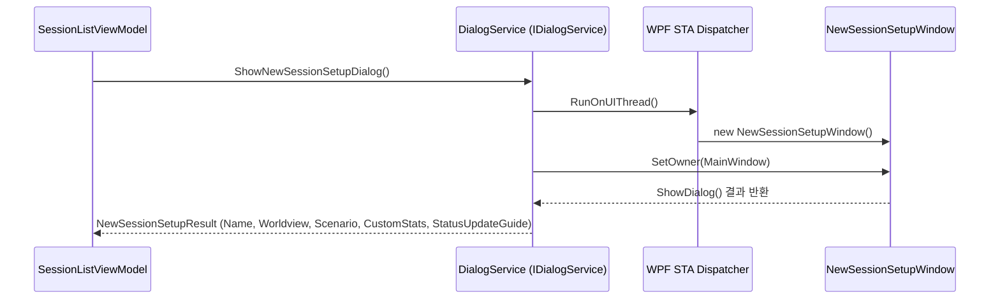

# GRC Architecture & Deep Dive

본 문서는 GRC(GenAI Roleplay Chat) 클라이언트의 핵심 엔진 구조와, C#/.NET 8.0 환경에서 달성한 동시성 제어 및 메모리 관리 기법을 상세히 기술합니다.

---

<memory_pipeline>

## 1. 인지 코어 3.0 메모리 파이프라인 (Cognitive Core 3.0 Memory Pipeline)

대규모 롤플레잉 서사를 진행할 때, 모든 대화를 프롬프트에 무제한 누적하면 컨텍스트 윈도우 초과, 프롬프트 캐시 미스, 비용 폭발 및 서사 왜곡(Lost in the middle)이 발생합니다. GRC v3.0은 이를 해결하기 위해 **불변 접두사 동결(Prefix-Frozen SystemInstruction)**, **사건 렛저(Event Ledger) 팩트/비밀 추출**, **2대 핵심 게이티드 RAG(하이브리드 로어북, 사건 불릿포인트)**를 유기적으로 결합한 Cognitive Core 3.0 클린 아키텍처를 탑재했습니다.

`[IMPLEMENTED]` 메모리 파이프라인 및 인지 모듈 구현체:
- 파이프라인 총괄: [MemoryManagerService.cs](../../../GRC/GRC/Services/MemoryManagerService.cs)
- 인지 프롬프트 조립기: [CognitivePromptAssembler.cs](../../../GRC/GRC/Services/Cognitive/CognitivePromptAssembler.cs)
- 사건 렛저 추출기: [EventLedgerExtractor.cs](../../../GRC/GRC/Services/Cognitive/EventLedgerExtractor.cs)
- 하이브리드 로어북 인출기: [HybridLorebookRetriever.cs](../../../GRC/GRC/Services/Cognitive/HybridLorebookRetriever.cs)
- 살리언스 게이티드 RAG: [GatedRAGRetriever.cs](../../../GRC/GRC/Services/Cognitive/GatedRAGRetriever.cs)
- 시간 인식 관계 투영기: [BiTemporalEntityProjector.cs](../../../GRC/GRC/Helpers/BiTemporalEntityProjector.cs)
- SIMD 벡터 연산 헬퍼: [VectorMathHelper.cs](../../../GRC/GRC/Helpers/VectorMathHelper.cs)

```mermaid
flowchart TB
    subgraph COGNITIVE_CORE ["Cognitive Core 3.0 Pipeline"]
        SYS["불변 시스템 지시문 (Prefix-Frozen SystemInstruction)<br>- 페르소나 및 세계관 불변 동결 (Prompt Cache Hit Rate 극대화)"]
        
        subgraph TIERS ["3-Tier Memory & Reasoning Pipeline"]
            M1["단기 기억 (Raw History): 최근 18개 메시지 (9턴 원문, ShortTermThreshold=18)"]
            M2["사건 불릿 원장 (Single Event Ledger): 단일 불변 원장 무손실 누적 (Append-Only)<br>- 상시 노출: 최신 15개 [제N장] 그룹화 (TakeLast 15)<br>- 과거 회상 RAG: 15개 제외 과거 전체 풀 (Take Count-15)"]
            M3["장기 기억 (Macro Chronicle): 챕터 마감(10회 누적, MediumTermThreshold=10) 즉시 Gemini Pro 1,500자 산문 병합"]
            
            M1 -->|"18개 메시지 도달 시 8개(4턴, ChunkSize=8) 절삭 후 Flash-Lite 팩트 추출"| M2
            M2 -->|"10회 누적(80개 메시지 = 40턴 대화) 즉시 비동기 연대기 병합"| M3
        end
        
        subgraph AUXILIARY ["Selective Auxiliary Cognitive Engines (2-Core RAG)"]
            HL["하이브리드 로어북 RAG (HybridLorebookRetriever)<br>- 1차 Regex 완전 일치 + 2차 768차원 임베딩 유사도 (>=0.68f, 3턴 잔존 Sticky)<br>- 상태창 활성 인물 연동 (단기 기억 전체 18~25개 메시지 및 최근 팩트 불릿 광역 스캔)"]
            GR["사건 불릿포인트 RAG (GatedRAGRetriever)<br>- 단일 원장 과거 풀 대상 시맨틱 임베딩 유사도 (>=0.71f) 직결 + 원장 인덱스(Index) 시간순 정렬"]
            BP["엔티티 상태 투영기 (BiTemporalEntityProjector)<br>- 상태창 인물 상태/수치 1줄 투영 (- 인물(이름): 상태 (수치))"]
        end
        
        ASSEMBLER["인지 프롬프트 조립기 (CognitivePromptAssembler)<br>- 가짜 Turn 제거, [제N장] 그룹 헤더 및 상태 권위 가드레일 패킹"]
        
        SYS --> ASSEMBLER
        TIERS --> ASSEMBLER
        AUXILIARY --> ASSEMBLER
        ASSEMBLER --> LLM["Gemini 3.8 Flash 서사 스트리밍 (0초 응답)"]
    end
```

### 1) 불변 접두사 동결 (Prefix-Frozen SystemInstruction)
*   세계관, 시스템 페르소나, 불변 지시문을 `SystemInstruction`에 완전히 격리하여 고정합니다.
*   **서술 기본 원칙(`FormatRule`) 및 퓨샷 규격**: 대사는 큰따옴표(`" "`), 독백 및 속마음은 낫표(`「 」`), 행동/배경은 기호 없는 평문 소설체로 명시하고, 마크다운 강조(*별표* 등) 배제 지침과 4줄 직관적 `<example>` 퓨샷을 고정 주입하여 UI 파서와의 일관성을 유지합니다.
*   동적으로 변하는 로어북, 사건 렛저, 대서사 연대기는 최신 유저 메시지 직전의 **동적 컨텍스트 슬롯(Dynamic Context Slot)**에 주입함으로써, LLM 엔진의 프롬프트 캐시 적중률을 극대화하고 문체 오염을 방지합니다.

### 2) 단기 기억 (Raw History)
*   가장 최근에 주고받은 날것의 대화 18개 메시지(9턴 대화, `ShortTermThreshold = 18`)를 손실 없이 보존합니다.
*   **비동기 압축 트리거**: 18개 메시지에 도달하면 가장 오래된 8개 메시지(4턴 대화, `MemoryCompressionChunkSize = 8`)를 절삭하여 백그라운드 태스크(`Task.Run`)에서 사건 팩트 추출을 시작합니다. 낙관적 락(`_shortTermVersion`)을 통해 동시성 정합성을 보장합니다.

### 3) 사건 불릿 원장 (Single Event Ledger 및 [제N장] 시간축 앵커)
*   **단일 원장 무손실 누적 (Append-Only)**: 절삭된 8개 메시지는 **Gemini 3.5 Flash-Lite** 모델을 통해 대명사('그', '그녀' 등)를 배제하고 `[원인/배경 + 명시적 고유명사 주체 + 행동/사건 + 결과/변화]`를 담은 1~2문장의 자기완결형 인과 팩트 불릿(최대 3~5개)으로 추출됩니다. 응답은 `LlmJsonParser`를 통해 내결함성 파싱(프리앰블 스킵 및 잘린 JSON 복구)되며, Google 768차원 다국어 임베딩(`text-multilingual-embedding-002`)과 함께 `_currentContext.EventLedgers` 단일 리스트에 영구 누적됩니다.
*   **가짜 Turn 메타태그 완전 적출**: 4턴 배치 단위로 동일하게 찍히던 왜곡된 가짜 Turn 번호를 완전히 제거하고, 단일 원장 인덱스(`Index`)를 통해 100% 발생 시간순 인과관계를 보존합니다.
*   **챕터 전환 시 무손실 승계**: 1개 챕터가 끝나 새 챕터로 전환될 때도 단일 원장 전체를 그대로 승계하여 챕터 전환 직후 상시 불릿이 증발하는 결함을 원천 차단합니다.
*   **상시 노출 칸 (`<internal_chronicle_facts>`)**: 단일 원장의 **최신 15개(`TakeLast(15)`)**를 항상 노출하며, 장 번호가 변경될 때만 `[제N장]` 그룹 헤더를 1회 출력하여 중복 토큰을 없애고 챕터 경계 인과를 보존합니다. 헤더에 `(현재 제N장 진행 중)`을 명시하여 시간 기준점을 확립합니다.
*   **과거 회상 RAG 풀 (`<recalled_history>`)**: 단일 원장에서 **최신 15개를 제외한 앞쪽 전체(`Take(Count - 15)`)**가 자동으로 과거 회상 검색 대상이 됩니다.

### 4) 장기 연대기 (Macro Chronicle 즉시 병합)
*   과거 레거시 3개 챕터 지연 대기 큐(`_mediumBuffers`, `PrevContexts`)를 전면 폐지하고, **10회 압축 누적(80개 메시지 = 40턴 대화, `MediumTermThreshold = 10`)으로 챕터가 마감되는 즉시** 해당 장의 불릿들을 **Gemini Pro** 모델에 비동기 전달합니다.
*   **살리언스 증발(Salience Evaporation)** 기법을 적용하여 1,500자 이내의 대서사 산문 연대기(`_longTermSummary`)로 즉시 병합 보존하여 서사의 거시적 대의명분 공백을 완전히 해소합니다.

### 5) 보조 인지 엔진 (2-Core RAG & Relational Projector)
*   **하이브리드 로어북 RAG (`HybridLorebookRetriever`)**: 정규식 1차 키워드 스캔(직전 `model` 응답 + 현재 유저 입력 결합 스캔)과 시맨틱 임베딩 2차 유사도 검색(벡터 희석 방지를 위해 현재 유저 입력 단독 임베딩 사용, 임계치 `0.68f`, 3턴 잔존 Sticky)을 결합하여 설정집을 누락 없이 인출합니다. 또한 단기 기억 버퍼 전체(18~25개 메시지) 및 최근 사건 불릿(3개)에 등장하는 활성 인물(`activeChars`)을 광역 스캔하며, 각 단계 내부는 `Priority` 오름차순(`0 = 최우선순위`)으로 동적 패킹(최대 3,000토큰)하여 대명사 구간의 로어북 유지와 초장기 세션 퇴장 조연의 예산 잠식 방지를 동시에 달성합니다.
*   **사건 불릿포인트 RAG (`GatedRAGRetriever`)**: 레거시 키워드 게이팅 데드코드를 전면 적출하고, 매 턴 계산된 768차원 유저 쿼리 임베딩을 실측 기반 순수 코사인 유사도(**$\ge 0.71f$**) 스캔에 직결하여 상위 2개를 핀포인트 인출합니다. 인출 결과는 단일 원장 인덱스(`Index`) 발생 시간순으로 정렬하여 선후 인과 역전을 차단하며, 헤더에 `[떠오른 과거의 기억 - 현재 상태와 상충 시 현재 상태가 우선함]`을 명시하여 현재 상태 오판을 원천 방어합니다.
*   **엔티티 상태 투영기 (`BiTemporalEntityProjector`)**: 불필요한 필드 및 중복 상태 텍스트 버그를 제거하고, `- 인물(이름): 상태 (수치)` 또는 `- 인물(이름): 상태` 형태로 간결하고 명확하게 투영합니다.

</memory_pipeline>

---

<storage_optimization>

## 2. O(1) 무부하 파일 쓰기 (Zero-Deserialize JSON Append)

대화 이력을 디스크에 영구 저장(`FullHistory.json`)할 때 발생하는 오버헤드를 극단적으로 최적화했습니다.

`[IMPLEMENTED]` 파일 조작 알고리즘은 [FullHistoryLogger.cs](../../../GRC/GRC/Helpers/FullHistoryLogger.cs)에 구현되어 있습니다.

*   **문제점**: 일반적으로 JSON 배열에 요소를 추가할 때 전체 파일을 메모리로 읽어 역직렬화(Deserialize)한 뒤, 리스트에 Add하고 다시 직렬화하여 덮어씁니다. 서사가 길어질수록 이 과정에서 발생하는 GC(가비지 컬렉터) 스파이크와 I/O 지연이 UI를 멈추게 합니다.
*   **해결책 (`FullHistoryLogger.cs`)**:
    역직렬화를 완전히 포기하고 바이너리 스트림 조작으로 대체했습니다.
    1.  `FileStream`으로 파일을 엽니다.
    2.  끝에서부터 역방향으로 탐색(Seek)하여 배열을 닫는 괄호 `]`를 찾습니다.
    3.  새로운 메시지 텍스트를 바이트 단위로 직접 주입(Append)하고 다시 `]`를 덮어씌웁니다.
    4.  결과적으로 파일의 크기가 10MB이든 1GB이든 **O(1)의 일정한 시간 복잡도**로 파일 쓰기가 완료됩니다.

</storage_optimization>

---

<concurrency_streaming>

## 3. 비차단 동시성 제어 및 60FPS 스트리밍

네트워크 통신과 UI 렌더링 간의 병목을 완벽히 격리하여 '0초 지연(Zero-Delay)' 타이핑 경험을 제공합니다.

`[IMPLEMENTED]` 렌더링 틱 제어는 [StatefulStreamingHelper.cs](../../../GRC/GRC/Helpers/StatefulStreamingHelper.cs)에, 통신 채널은 [ChatWorkflowService.cs](../../../GRC/GRC/Services/ChatWorkflowService.cs)에 분리 구현되어 있습니다.

### 생산자-소비자 스트리밍 격리 (`System.Threading.Channels`)
*   `ChatWorkflowService` 내부에서 Gemini API로부터 문자 스트림을 받아오는 스레드(생산자)와, WPF 대화창에 문자를 그리는 스레드(소비자)를 `Channel<char>`로 분리했습니다. 네트워크 지연(Lag)이 발생해도 생산자 큐만 대기할 뿐 UI 렌더러는 절대 굳지 않습니다.
*   **실시간 마크다운 별표(*) 필터링**: 생산자 태스크에서 청크를 수신할 때 `c == '*'`를 즉시 드롭하여, AI가 실수로 출력한 `**` 기호가 스트리밍 화면에 노출되거나 완료 후 텍스트와 불일치를 일으키는 현상을 원천 방어합니다.

### 60FPS 배치 렌더링 (`StatefulStreamingHelper.cs`)
*   문자가 들어올 때마다 WPF의 `Dispatcher`를 호출하면 윈도우 메시지 루프가 포화되어 렌더링 스레드가 마비됩니다.
*   이를 막기 위해 유입되는 문자를 `ConcurrentQueue<char>`에 담아둡니다.
*   `DispatcherTimer`를 `DispatcherPriority.Render` 우선순위로 16ms(60FPS)마다 한 번씩 틱(Tick)을 발생시켜, 큐에 쌓인 문자를 일괄 Drain한 뒤 **틱당 단 한 번만 UI에 반영(FlushBuffer)**합니다.

</concurrency_streaming>

---

<session_architect>

## 4. AI Session Architect (자율 저작 에이전트)

유저가 기획서를 작성할 필요 없이, 키워드 한 줄만으로 TRPG 세션을 빌드해 주는 6단계 에이전트입니다.

`[IMPLEMENTED]` 6단계 스테이트 머신은 [SessionArchitectService.cs](../../../GRC/GRC/Services/SessionArchitectService.cs)에 구현되어 있습니다.

*   **상태 기계(State Machine)**: 기획(Planning) → 세계관 → 로어북 → 스탯 → 초기 시나리오 → GM 지시문으로 이어지는 단계별 컨텍스트 상속 모델을 구축했습니다.
*   **AI 감사관 자가 검수(Self-Review)**:
    자동 모드를 켜면, 매 단계가 끝날 때마다 또 다른 내부 AI(Auditor)가 생성된 JSON 규격과 개연성을 검사합니다.
    오류가 발견되면 `{ "pass": false, "issues": "문제 사유" }`를 반환하며, 이 사유를 바탕으로 `ReviseContentAsync`를 호출해 인간의 개입 없이 코드를 스스로 수정하고 다음 단계로 전진합니다.

</session_architect>

---

<multimodal_sync>

## 5. 멀티모달 감정 연기 TTS 동기화

텍스트가 렌더링되는 동안 발생하는 빈 시간을 활용하여 오디오를 미리 생성(Prefetch)하고 싱크를 맞춥니다.

`[IMPLEMENTED]` 보이스 프리페치 및 재생은 [GeminiTtsService.cs](../../../GRC/GRC/Services/GeminiTtsService.cs)와 연동됩니다.

1.  **실시간 대사 파싱**: 스트리밍 루프가 따옴표(`"..."`)를 만나면 이를 감지하여 대화 버퍼를 열고, 닫는 따옴표가 등장하면 즉시 백그라운드에서 `GeminiTtsService`로 오디오 번역 및 음성 합성(WAV)을 요청합니다.
2.  **재생 동기화 대기 (Sync Hold)**: UI 소비자가 문자를 그리다가 닫는 따옴표에 도달하면, 프리페치 큐에서 방금 생성 완료된 음성을 꺼내 재생합니다. 이때 `TaskCompletionSource`를 사용하여 음성 재생이 완전히 끝날 때까지 다음 지문 텍스트의 출력을 멈추어(Hold) 소리와 자막의 완벽한 템포를 맞춥니다.

</multimodal_sync>

---

<design_tokens>

## 6. 3계층 디자인 토큰 아키텍처 (3-Tier Design Token Architecture)

확장성과 테마 일관성을 확보하고 렌더링 성능을 극대화하기 위해 UI 자원을 3개 계층으로 분리하여 관리합니다.

`[IMPLEMENTED]` 토큰 및 스타일 정의는 [PrimitiveTokens.xaml](../../../GRC/GRC/Themes/PrimitiveTokens.xaml), [DarkTheme.xaml](../../../GRC/GRC/Themes/DarkTheme.xaml), [ModernStyles.xaml](../../../GRC/GRC/Themes/ModernStyles.xaml)에 구현되어 있습니다.

```mermaid
flowchart TD
    T1["Tier 1: Primitive Tokens (PrimitiveTokens.xaml)<br>- 불변 Color (Zinc 스케일 #09090B ~ #FAFAFA)<br>- 치수 CornerRadius, 폰트 패밀리"]
    T2["Tier 2: Semantic Theme Brushes (DarkTheme.xaml)<br>- AppBackgroundBrush, SurfaceBackgroundBrush, TextPrimaryBrush<br>- po:Freeze='True' GPU 메모리 동결"]
    T3["Tier 3: Component Styles (ModernStyles.xaml)<br>- BaseButtonStyle, ActionButton 계열<br>- ControlTemplate 및 VisualStateManager"]
    
    T1 --> T2 --> T3
```

1. **Tier 1 (Primitive Tokens)**: 특정 테마에 종속되지 않는 절대적 색상(Zinc 팔레트 10단계), 상태 팔레트(Emerald, Amber, Rose, Cyan), UI 치수(`CornerRadiusCard`, `CornerRadiusBubble`) 및 타이포그래피 상수를 정의합니다.
2. **Tier 2 (Semantic Theme Brushes)**: 역할 기반(Background, Surface, Border, Text Primary/Muted)으로 시맨틱 SolidColorBrush를 구성합니다. 모든 브러시에는 `po:Freeze="True"` 속성을 선언하여 WPF 렌더링 파이프라인에서 불변(Frozen) 상태로 캐싱되도록 함으로써 멀티스레드 접근 안정성을 보장하고 드로우콜 오버헤드를 최소화합니다.
3. **Tier 3 (Component Styles & Controls)**: 시맨틱 브러시를 조합하여 암시적 버튼 스타일, 스크롤바, 리스트뷰 아이템 템플릿 등을 구성합니다.

</design_tokens>

---

<mvvm_dialog_service>

## 7. IDialogService 기반 순수 MVVM 분리 (Pure MVVM Decoupling)

뷰모델(ViewModel)이 구체적인 XAML 뷰(`Window`)를 직접 생성하거나 참조하는 강결합을 해제하여 테스트 가능성과 확장성을 확보했습니다.

`[IMPLEMENTED]` 다이얼로그 서비스 규격은 [IDialogService.cs](../../../GRC/GRC/Services/IDialogService.cs)에 정의되어 있습니다.

```mermaid
sequenceDiagram
    participant VM as SessionListViewModel
    participant DS as DialogService (IDialogService)
    participant UI as WPF STA Dispatcher
    participant W as NewSessionSetupWindow

    VM->>DS: ShowNewSessionSetupDialog()
    DS->>UI: RunOnUIThread()
    UI->>W: new NewSessionSetupWindow()
    DS->>W: SetOwner(MainWindow)
    W-->>DS: ShowDialog() 결과 반환
    DS-->>VM: NewSessionSetupResult (Name, Worldview, Scenario, CustomStats, StatusUpdateGuide)
```

* **뷰모델 순수성 보장**: `SessionListViewModel` 및 `ChatViewModel`은 `Views.*` 네임스페이스를 일체 참조하지 않으며, 모든 팝업 및 창 전환을 `IDialogService` 추상화 인터페이스를 통해 비동기로 위임합니다.
* **STA 스레드 격리 및 소유자 바인딩**: 백그라운드 스레드에서 다이얼로그 메서드가 호출되더라도 `RunOnUIThread` 캡슐화를 통해 안전하게 UI 스레드로 전환되며, `SetOwner(MainWindow)` 가드를 통해 창의 최소화/복원 시 팝업이 뒤로 숨겨지는 Z-Order 버그를 방지합니다.

</mvvm_dialog_service>

---

<domain_service_extraction>

## 8. 도메인 서비스 추출 및 ChatViewModel 경량화

단일 책임 원칙(SRP)을 준수하고 AI 에이전트의 유지보수 컨텍스트를 최적화하기 위해, 거대해지기 쉬운 `ChatViewModel`의 부가 책임을 독립 도메인 서비스로 격리했습니다.

* **음성 합성 및 번역 캡슐화 ([GeminiTtsService.cs](../../../GRC/GRC/Services/GeminiTtsService.cs))**: 대사 스트리밍 도중 발생하는 일본어 번역 전처리, Google Cloud Vertex AI 음성 합성 호출, 취소 토큰(`CancellationToken`) 생명주기를 서비스 내부로 은닉했습니다.
* **오디오 재생 스레드 안전성 ([AudioService.cs](../../../GRC/GRC/Services/AudioService.cs))**: `MediaPlayer` 인스턴스의 STA 스레드 친화성을 보장하기 위해 생성자에서 UI `Dispatcher`를 캡처하고, 모든 재생 및 정지 명령을 디스패처로 보호했습니다.
* **타이핑 사운드 수명주기 관리 ([ChatWorkflowService.cs](../../../GRC/GRC/Services/ChatWorkflowService.cs))**: 텍스트 타이핑 효과음의 시작과 정지를 스트리밍 루프 및 `try-finally` 블록 내부에 결합하여 예외 발생 시에도 소리가 무한 반복되는 누수를 방지했습니다.
* **스탯 UI 파싱 팩토리 ([StatusPayload.cs](../../../GRC/GRC/Models/StatusPayload.cs))**: 뷰모델에 흩어져 있던 비정형 스탯 문자열 파싱 로직을 `CustomStatUI.Create` 도메인 팩토리 메서드로 이전하여 `CultureInfo.InvariantCulture`, finite 검증 등 방어적 파싱을 일원화했습니다.

</domain_service_extraction>

---

<smart_autoscroll>

## 9. 스마트 오토스크롤 (SmartAutoScroll) 무결성 알고리즘

LLM 토큰 단위 스트리밍 출력과 사용자의 과거 대화 탐색(Upward Scrolling) 간의 충돌을 수학적 판정식으로 해결했습니다.

`[IMPLEMENTED]` 스크롤 판정 로직은 [AutoScrollHelper.cs](../../../GRC/GRC/Helpers/AutoScrollHelper.cs)에 구현되어 있습니다.

* **ScrollViewer.Tag 오염 제거 및 사용자 의도 상태 머신 (`IsAutoScrollActive`)**: 과거 레거시에서 스크롤 상태 플래그를 컨트롤의 `Tag` 속성에 의존하던 방식을 완전히 폐기하고, ScrollViewer별 `IsAutoScrollActive` Attached DependencyProperty 기반의 유한 상태 머신으로 전환했습니다.
* **사용자 상향 스크롤 즉각 해제 (Zero-Latency Disengage)**:
  - 마우스 휠 상향 회전(`PreviewMouseWheel e.Delta > 0`) 또는 순수 뷰포트 상향 이동(`isPureUserScroll && e.VerticalChange < 0`) 감지 즉시 `IsAutoScrollActive = false`로 전이하여 추가 토큰 유입이나 가상화 높이 변동에 의한 하이재킹을 원천 차단합니다.
  - 비동기 디스패처 큐잉(`DispatcherPriority.Loaded`) 실행 시점에도 `if (GetIsAutoScrollActive(sv))` 지연 재검증(Lazy Guard)을 수행하여 큐 대기 시간 중 발생한 휠 조작을 보호합니다.
* **1틱 상향 스크롤 탈출 트랩 및 창 리사이징 오인 방어**:
  - 스트리밍 토큰 유입(`ExtentHeightChange > 0, VerticalChange == 0`) 시 24px 이내 상향 스크롤 유저가 바닥으로 되돌아가지 않도록 능동적 하향 조작(`e.VerticalChange > 0`) 또는 스크롤바 부재(`sv.ScrollableHeight <= 0`) 시에만 재활성화합니다.
  - 창 최대화/세로 확장(`ViewportHeightChange > 0`)으로 인한 클램핑 역방향 오프셋 변동은 사용자 상향 스크롤로 오인하지 않도록 `isPureUserScroll` 가드로 격리합니다.
* **컨텐츠 팽창/축소 조건부 판정식**:
  $$\text{referenceHeight} = \begin{cases} \text{scrollableHeight} - \Delta\text{extentHeight}, & \text{if } \Delta\text{extentHeight} > 0 \\ \text{scrollableHeight}, & \text{otherwise} \end{cases}$$
  컨텐츠가 아래로 스트리밍 팽창할 때(`extentHeightChange > 0`)는 직전 프레임의 바닥 높이를 역산하여 사용자가 바닥에 있었는지를 정확히 판정(24px 허용오차 적용)하고, 접기/삭제 등 컨텐츠가 축소될 때(`extentHeightChange <= 0`)는 현재 가용 높이와 직접 비교함으로써 사용자의 스크롤 뷰포트를 강제로 하단으로 끌고 내려가는 스크롤 하이재킹(Scroll Hijacking)을 원천 차단했습니다.

</smart_autoscroll>

