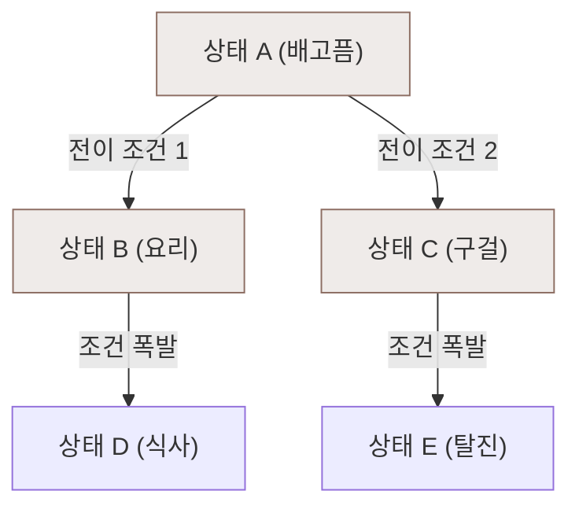

# 상태머신형 시뮬레이션의 한계와 패러다임의 전환

이 문서는 유틸리티 AI(Utility AI), 유한 상태 머신(FSM), 행동 트리(Behavior Tree) 등 LLM 등장 이전의 **전통적인 상태 머신 기반 에이전트 시뮬레이션이 지닌 기술적/공학적 한계**를 분석하고, 이를 극복하기 위한 현대적 대안을 정리한 백서입니다.

---

## 1. 근본적 한계: 의미론적 봉쇄 (Semantic Block)

전통적인 상태 머신 에이전트는 세계의 정보를 진짜로 이해하고 사고하는 것이 아닙니다. 사전에 기획되고 코딩된 규칙에 따라 작동하는 **'정교한 조건부 반사 신경(Reactive Reflex)'**에 불과합니다.

*   **지식 합성의 불가능성**: 
    *   에이전트는 새로운 정보가 입력되었을 때, 이를 기존 지식과 결합하여 새로운 신념(Belief)을 연역적으로 유도해낼 수 없습니다.
    *   *예*: "A가 B의 칼을 훔쳤다"와 "B는 내 친구다"라는 두 사실이 주어져도, 개발자가 미리 연관 관계 식을 코딩해두지 않았다면 에이전트는 스스로 "A를 경계해야겠다"는 결론에 도달하지 못합니다.
*   **수치 비교로 환원되는 세계**:
    *   모든 심리적, 물리적 환경 요소가 배고픔 점수(Hunger=30), 친밀도 수치(Relationship=12) 같은 **단순 숫자(Float)**로 강제 치환됩니다. 수치 뒤에 숨은 의미론적 맥락(예: 동정심, 원한, 정치적 묵계 등)을 시뮬레이션에 담아내기 어렵습니다.

---

## 2. 공학적 한계: 조합의 폭발 (Combinatorial Explosion)

상태 머신은 에이전트가 처할 수 있는 상태(State)와 환경 변수가 늘어날수록 전이 조건 분기(Transition Branch)가 기하급수적으로 증가하는 문제를 안고 있습니다.



*   **상태 전이 그래프의 비대화**:
    *   변수가 10개만 되어도 이들 사이의 관계를 제어하기 위한 조건문(If-Else)과 전이 선들이 거미줄처럼 엉켜 스파게티 코드가 됩니다.
    *   이를 해결하기 위해 행동 트리(BT)나 계층형 상태 머신(HFSM)을 사용해 구조화하더라도, 근본적으로 **예외 상황에 대한 예외 코드를 일일이 하드코딩해야 한다**는 설계적 피로도는 해결되지 않습니다.
*   **유연성(Flexibility) 부족**:
    *   월드에 새로운 오브젝트나 시스템을 추가할 때마다, 기존 에이전트의 상태 트리(ThinkTree)를 뜯어고쳐 새로운 조건 분기를 심어주어야 합니다. (심즈의 스마트 오브젝트 방식이 다형성으로 이 문제를 일부 해결했으나, 에이전트 자체의 지능을 떨어뜨리는 트레이드오프가 있었습니다.)

---

## 3. 심리학적 매핑: 제임스 깁슨의 '직접 지각'에 머무는 에이전트

전통적인 시뮬레이션 에이전트들의 행동 방식은 인지심리학적으로 제임스 깁슨(James J. Gibson)의 **직접 지각론(Direct Perception)**과 완벽히 궤를 같이합니다.

*   **어포던스(Affordance) 결합**:
    *   에이전트는 뇌 속에서 세계에 대한 표상(Representation)을 생성하거나 추론하지 않고, 사물과 환경이 던져주는 **'행동 유도성(Affordance) 자극'**에 이끌려 행동을 결정합니다.
*   **추론 없는 행동 유도**:
    *   의자 ➔ 앉기 가능(Sitting-ability) 감지 ➔ 앉기 실행.
    *   이 구조는 직관적이고 연산 비용이 전혀 들지 않아 실시간 게임 구동에 매우 유리하지만, 에이전트의 주체적 자아나 예측 불가능한 사회적 서사를 만들어내기에는 깊이가 너무 얕습니다.

---

## 4. 패러다임의 쉬프트: LLM의 등장이 가져온 변화

**LLM(대형 언어 모델)**의 도입은 시뮬레이션 AI를 직접 지각(반응형) 단계에서 **의미론적 추론(Semantic Reasoning) 단계**로 격상시켰습니다.

```
[전통적인 상태 머신]
조건 만족 (Hunger < 30) ──> 반사 행동 실행 (Go to Kitchen)

[현대적 LLM 시뮬레이션]
새로운 신념 (A가 밥을 먹음) 
       │
       ▼ (LLM 의미론적 추론)
신념 업데이트 (A는 배가 고프지 않을 것이다, 고로 음식을 양보해달라고 조르지 않겠다)
       │
       ▼
자율적 계획 수립 (A가 없는 조용한 시간에 식사하러 가야겠다)
```

*   **의미론적 합성 (Semantic Synthesis)**: 자연어로 구성된 신념 목록을 토대로 LLM이 동적인 인과관계를 추론하여, 코딩되지 않은 사건 사이의 유기적인 결론을 도출해냅니다.
*   **계획 분해와 자율성**: 하루 일정을 시간 단위로 조율하고, 타인과의 관계 변화를 스스로 판단하여 행동의 우선순위를 즉석에서 재조정합니다.

---

## 5. 결론: 현대 시뮬레이션의 하이브리드 아키텍처 모델

상태 머신을 완전히 버리는 것은 어리석은 일입니다. LLM은 연산이 무겁고 실시간 물리 반응(예: 충돌 회피, 길찾기)에는 적합하지 않기 때문입니다. 따라서 현대적 시뮬레이션은 다음과 같은 **하이브리드 아키텍처**를 지향해야 합니다.

1.  **반사 신경 레이어 (C++ 물리/동작 엔진)**:
    *   림월드식의 **행동 트리(Behavior Tree) 및 토일(Toils) 시퀀스**를 활용하여 물리적인 자원 예약, 이동, 충돌 대처, 취소 인터럽트를 20Hz 이상의 빠른 속도로 deterministic하게 처리합니다. (깁슨의 직접 지각 모델 구현)
2.  **대뇌 피질 레이어 (C# 인지/LLM 엔진)**:
    *   심즈식의 **욕구 홈오브제 시스템**과 **LLM 신념 추론 엔진**을 결합하여, 실시간 수치와 사회적 기억을 융합한 의미론적 판단 및 스케줄링을 내립니다. (기호주의/의미론적 사고 구현)
