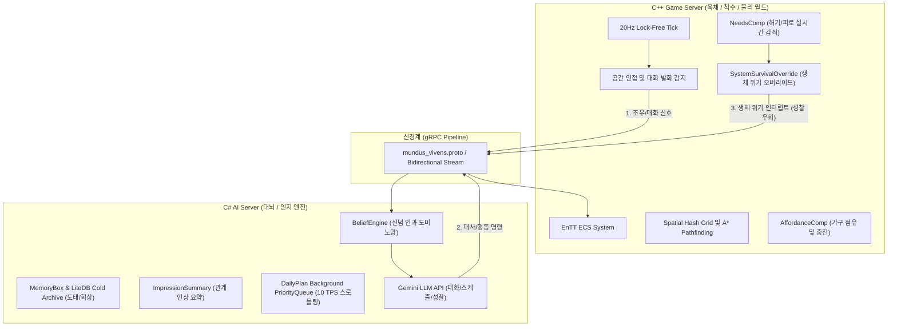

# Mundus Vivens: 통합 시스템 아키텍처 명세서 (Current Architecture)

본 문서는 NPC들이 스스로 기억을 관리하고 사회적 상호작용을 수행하는 자율 에이전트 시뮬레이션 엔진 **Mundus Vivens**의 최종 통합 아키텍처 명세서입니다. 본 설계는 C# (대뇌/LLM 인지)와 C++ (척수/물리 엔진)의 하이브리드 결합 모델을 기반으로 하며, Chunk A~C 리팩토링 단계의 최신 구현 사항을 반영하고 있습니다.

---

## 1. 설계 배경: 하이브리드 아키텍처 (Hybrid Architecture)

전통적인 FSM(유한 상태 머신)이나 행동 트리(Behavior Tree) 기반 시뮬레이션은 연산이 빠르고 결정론적이지만, 모든 상황에 대한 전이 조건(If-Else)을 하드코딩해야 하므로 복잡성이 커질수록 '조합의 폭발'이 발생합니다. 반면, LLM만을 사용하는 시뮬레이션(예: 스탠퍼드 스몰빌)은 의미론적 추론이 가능하나 실시간 물리 반응(충돌 회피, 길찾기 등)을 처리하기에는 연산 비용과 지연 시간(Latency)이 치명적으로 높습니다.

이에 따라 Mundus Vivens는 두 모델의 장점을 융합한 **하이브리드 아키텍처**를 채택했습니다.



* **반사 신경 레이어 (C++ 물리/동작 엔진)**: EnTT ECS와 Spatial Hash Grid 기반으로 물리 틱(20Hz), 실시간 감각/조우 감지, 길찾기, 생체 욕구(Needs) 임계치 제어 및 사물(Affordance) 점유를 락프리(Lock-Free) 구조로 신속히 해결합니다.
* **대뇌 피질 레이어 (C# 인지/LLM 엔진)**: 기억 보관/도태/회상, 신념 인과망 처리, 관계성 인상 요약, 그리고 Gemini API 연동을 통한 고차원 의미론적 대화 및 일간 계획 수립을 비동기적으로 처리합니다.

---

## 2. 실시간 인지 루프 (Cognitive Loop) 작동 원리

에이전트의 인지 및 상호작용 흐름은 아래의 5단계 파이프라인을 거치며 동작합니다.

### 1단계: 감각 수용 및 이원화 큐잉 (Sensory & API Routing)
1. **조우 감지**: C++ 서버가 공간 해시 그리드에서 NPC 간의 조우를 감지하고 C# 백엔드로 `TriggerDialogue(A, B)` gRPC 호출을 보냅니다.
2. **이원화 큐잉 및 API 스로틀링 (Chunk A)**:
   * ⚡ **1:1 대화 및 실시간 상호작용 (Fast Track)**: 플레이어 대화나 NPC 간 마주침은 즉각적인 반응이 필요하므로 큐를 거치지 않고 **패스트트랙으로 즉시 LLM API를 호출**합니다.
   * ⚠️ **일간 계획 수립 및 성찰 (Background PriorityQueue)**: 대규모 인프라 부하 및 API Rate Limit(429)을 방지하기 위해, 하루 계획 생성 및 성찰 요청은 백그라운드 우선순위 큐에 들어가며 **최대 10 TPS(초당 10회) 스로틀링 및 지수 백오프(Exponential Backoff)**가 적용됩니다.

### 2단계: 맥락 인출 및 장기 기억 회상 (Memory Box & Cold Archive) (Chunk B)
1. **기억 도태와 Cold Archive**: 에이전트의 단기 Working Memory(`MemoryBox`)의 크기가 임계치(40개)를 초과하면, 가장 가치가 낮은 기억이 자동으로 도태되어 **LiteDB 영구 저장소(`cold_archive`)**로 이관됩니다.
2. **연상 기억 회상 (Recall)**: 대화에 진입하거나 장소 이동 시, 대상 인물(`SubjectId`) 및 공간(`location`)을 키워드로 `cold_archive`에서 회상 연산을 가동합니다.
   * **Heuristic Scoring**:
     $$\text{Recall Score} = \text{대상 일치}(+5.0) + \text{장소 일치}(+3.0) + \text{기억 중요도}(\text{최대 } +2.0) + \text{최신성}(\text{최대 } +1.5)$$
   * 점수가 가장 높은 상위 기억(Top-K)이 Working Memory로 동적 복구됩니다.
3. **신념 인과 도미노망**: 부모 신념의 확신도가 떨어지거나 모순이 밝혀지면, 신념 인과망(`DerivedFrom`, `SupersededBy`)을 따라 하위 자식 신념들의 확신도(`Confidence`)를 자동으로 비례 감쇠시키는 재귀 전파 로직이 가동됩니다.

### 3단계: 소문 왜곡 및 관계인상 주입 (Reasoning & Impression) (Chunk B)
1. **관계 인상 요약 (ImpressionSummary)**: 매일 밤 성찰 시 기존 `ReflectOnEpisodesAsync` API 응답에 관계 갱신을 병합해 추가 비용 없이 상대에 대한 중기적 인상 요약(`ImpressionSummary`)을 자동 업데이트합니다.
2. **소문 왜곡 제어**: 대화 상대의 관계 인상 및 성격(외향성 등)을 대조하여 소문의 왜곡 레벨을 계산한 뒤, Gemini API 프롬프트에 주입하여 대사 및 감정 변화를 유도합니다.

### 4단계: 실시간 피드백 및 시각적 애니메이션 마스킹 (Visuals & Broadcast) (Chunk A)
1. **대사 실시간 중계**: 생성된 대본 라인들은 C++ 및 Unity로 1초 간격 딜레이를 주며 순차 브로드캐스트됩니다.
2. **애니메이션 마스킹 (`SystemBusyAmbient`)**: 성찰 연산이나 대화 계산 등으로 LLM 지연시간이 발생할 때, C++ 서버는 대상 NPC에게 `BusyTag`(`Dialogue`, `Reflection`, `ScheduleWait` 상태 구분)를 부여하고, 속도를 `0`으로 잠근 채 주변을 서성이거나 골똘히 생각하는 대기 애니메이션을 연출하여 지연 시간을 시각적으로 완전히 은닉합니다.

### 5단계: 육체 행동 전이 및 영구 복원
1. **스케줄 전이**: 대화 결과 합의된 이동 지점이나 다음 할 일(`NextJobs`)이 C++ 서버로 내려가면, 이동 컴포넌트를 통해 해당 위치로 A* 길찾기가 가동됩니다.
2. **계획 영구 보원**: 에이전트의 현재 일과, 다음 일과 및 일정 만료 시각(`PlanExpirationTick`)은 실시간으로 LiteDB에 영구 스냅샷 백업이 이루어져, 서버 재부팅 시에도 일관된 행동 스케줄을 자동으로 이어 나갑니다.

---

## 3. 물리적 본능 및 사물 상호작용 (Needs & Affordances) (Chunk C)

에이전트는 대뇌 피질(C#)의 스케줄에 따르면서도, 척수 레벨(C++ 20Hz 틱)에서 작동하는 본능적 생존 주기 시스템의 제어를 받습니다.

```
[평시 상태] C# 발급 스케줄 수행 (이동, 노동 등)
       │
       ▼ (NeedsComp 틱당 감쇠: 허기 < 15.0 또는 피로 < 15.0)
[위기 상태] SystemSurvivalOverride 발동 ➔ C# 스케줄 강제 중단 (ReportJobStatus)
       │
       ├─► C# 대뇌: 복잡한 LLM 성찰 우회 (대뇌 락 설정, 요금 절약)
       │
       ▼ (C++ 척수: 주변 구역 내 Smart Object 탐색 및 경로 탐색)
[해결 상태] SystemAffordanceResolver 구동 ➔ 의자/침대/식탁 등 점유 및 Snap 이동
       │
       ▼ (점유 행동 수행 및 실시간 Needs 게이지 회복, 해결 중 감쇠 면제)
[완충 상태] Needs >= 95.0 도달 ➔ 사물 점유 해제 및 C# 복귀 완료 보고
       │
       ▼
[복귀 상태] C# 대뇌 락 해제 ➔ 정상 일과 스케줄 복귀 및 재배포
```

* **시간 스케일 최적화**: 하루(게임 시간 24시간, 현실 240초 기준) 동안 1~2회의 식사와 수면을 청하도록 틱당 욕구 감소율(`hunger -= 0.018f`, `fatigue -= 0.012f`)이 튜닝되어 있습니다.
* **대화 인터럽트 안전망**: 에이전트가 다른 NPC 혹은 플레이어와 대화 중이더라도 생체 욕구가 임계치 이하로 떨어지면 대화 상태(`BusyTag`)를 강제로 취소/파괴하고 생존 경로로 이동합니다.
* **Smart Objects**: 술집의 바 테이블(Drink), 성당의 제단(Pray), 각 거처의 침대(Sleep) 등 고유의 `AffordanceType`을 가진 가구들이 맵 구역에 동적으로 스폰되어 에이전트들의 마이크로 액션을 물리적으로 유도합니다.

---

## [부록] 스탠퍼드 스몰빌(Generative Agents)과의 통신 효율 대조

스몰빌 시뮬레이터는 한 번의 대화 시 턴 단위로 API를 쪼개어 호출하는 비효율적인 구조를 채택하여 극심한 비용 문제를 겪었습니다. Mundus Vivens는 이를 오케스트레이터 패턴으로 통합하여 획기적으로 개선했습니다.

| 항목 | 스탠퍼드 스몰빌 (Generative Agents) | Mundus Vivens (통합 오케스트레이터) |
| :--- | :--- | :--- |
| **8턴 대화 1회당 호출 수** | **최소 12회 ~ 최대 20회**<br>(대화 판정 2회 + 턴당 대사 생성 8회 + 사후 요약 2회 + 성찰 트리거 시 8회 추가) | **단 1회** (Fast-Track 직접 호출)<br>(단 1회의 통합 API 호출로 전체 대본, 감정 변화, 관계 변화, 스케줄 동기화를 JSON 포맷으로 일괄 도출) |
| **성찰(Reflection) 처리** | 개별 에이전트의 중요도 150점 누적 시 실시간 API 강제 연쇄 호출 | **자정 백그라운드 배치 및 Staggering**<br>(자정에 스로틀링 큐를 통해 일괄 분산 처리하며 관계 인상 갱신을 성찰 응답에 통합 병합) |