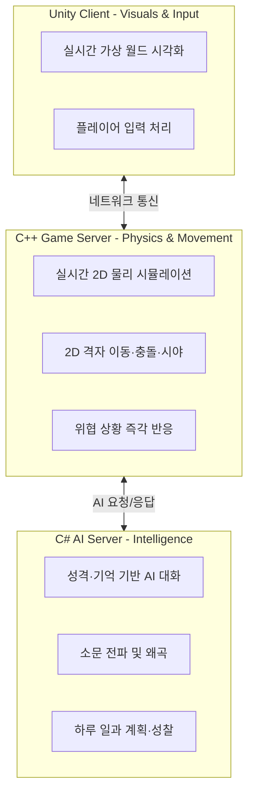

# Project Overview
> **부제**: Mundus Vivens 프로젝트 개요

> **한 줄 요약**: 대본 없이 스스로 생각하고, 기억하고, 소문을 퍼트리는 AI 주민들이 살아가는 중세 판타지 마을 시뮬레이션.

---

## 저장소 안내 (Repository Overview)

Mundus Vivens 프로젝트는 기능별로 레포지토리가 분리되어 관리됩니다. 코드 및 아키텍처 구현체는 아래 링크에서 확인할 수 있습니다.

- [C# AI 서버 (MundusVivens)](https://github.com/jin20203458/MundusVivens) - AI 오케스트레이션, LLM 프롬프트 최적화, 메모리 캐시 계층 구현체
- [C++ 게임 서버 (MundusVivens.GameServer.Cpp)](https://github.com/jin20203458/MundusVivens.GameServer.Cpp) - 20Hz 메인 루프, 3-스레드 분리(I/O, Main, gRPC), EnTT ECS, 2D 물리·충돌·위협 판정 구현체
- [지식베이스 (Obsidian.Agent)](https://github.com/jin20203458/Obsidian.Agent) - 본 문서를 포함한 프로젝트 공식 기술 명세서 및 아키텍처 문서 모음

---

## 왜 만들었는가 (Why)

기존 게임의 NPC는 플레이어가 다가가야만 반응하고, 똑같은 대사를 반복하며, 서로 간에 아무런 관계도 맺지 않습니다. 플레이어가 보지 않는 곳에서는 아무 일도 일어나지 않는 **무대 뒤의 마네킹**에 가깝습니다.

2023년, 스탠포드 대학의 연구팀이 이 문제에 대한 하나의 답을 보여주었습니다. **Smallville (Generative Agents)** — 25명의 AI 캐릭터가 작은 마을에서 자율적으로 생활하는 학술 시뮬레이션입니다. 각 캐릭터에게 ChatGPT 같은 AI를 두뇌로 연결하자, NPC들이 스스로 파티를 기획하고, 선거에 출마하고, 데이트 약속을 잡는 놀라운 창발적 행동이 나타났습니다.

이 논문을 보고 강한 영감을 받았고, 동시에 한계도 보였습니다. Smallville은 2D 타일맵 위의 학술 실험이었고, 이틀 돌리는 데 수천 달러의 AI 비용이 들었으며, 소문이 퍼지거나 전투가 벌어지는 현실적인 사회 역학은 다루지 않았습니다.

Mundus Vivens는 여기서 출발했습니다:

> *"이 개념을 진짜 게임으로 만들 수 있을까?"*

- 플레이어가 없어도 NPC끼리 만나서 대화하고, 소문을 퍼트리고, 감정이 변하면?
- 소문이 입에서 입으로 전해지면서 과장되거나 왜곡된다면?
- 어제 목격한 사건 때문에 오늘의 행동과 태도가 달라진다면?

이 프로젝트는 **대규모 언어 모델(LLM)을 NPC의 두뇌로 사용**하여, 각 캐릭터가 고유한 성격·기억·관계망을 바탕으로 자율적으로 판단하고 행동하는 **살아 있는 세계**를 구현하는 것을 목표로 합니다.

---

## 무엇을 하는 프로젝트인가 (What)

**장르**: 중세 판타지 마을 배경의 자율 사회 시뮬레이션 샌드박스

플레이어는 Unity 클라이언트를 통해 가상 마을에 접속하여 NPC들의 삶을 관찰하고, 원한다면 직접 개입할 수 있습니다.

| 플레이어 행동 | 예시 |
|---|---|
| **관찰** | NPC들이 광장에서 만나 대화하고, 술집에서 소문을 속삭이는 모습을 지켜본다 |
| **대화 개입** | NPC에게 말을 걸어 거짓 정보를 흘리거나, 관계를 이간질한다 |
| **물리적 개입** | NPC를 공격하면, 주변 NPC들이 도망치거나 반격하며 트라우마로 기억한다 |

핵심은 **플레이어가 아무것도 하지 않아도 세계가 스스로 돌아간다**는 점입니다. NPC들은 매일 아침 일어나 하루 일과를 계획하고, 일하러 가고, 길에서 마주친 이웃과 대화하고, 들은 소문을 다른 사람에게 전하며, 하루가 끝나면 오늘 겪은 일을 되새기며 생각이 바뀌기도 합니다.

---

## 어떻게 작동하는가 (How)

시스템은 세 개의 독립된 계층으로 나뉘어, 각각 **눈**, **육체**, **뇌**의 역할을 담당합니다.

| 계층 | 비유 | 하는 일 |
|---|---|---|
| **Unity 클라이언트** | 눈과 손 | 세계를 화면에 그리고, 플레이어의 조작을 전달 |
| **C++ 게임 서버** | 육체 | 캐릭터의 2D 격자 상의 걷기·달리기·충돌 등 물리적 움직임을 초당 20회 계산 |
| **C# AI 서버** | 뇌 | 캐릭터의 생각·기억·감정·대화를 AI(LLM)로 생성 |

이렇게 분리한 이유는 단순합니다. **육체의 반응 속도와 뇌의 사고 속도는 전혀 다르기 때문입니다.** 칼이 날아오면 0.05초 안에 피해야 하지만, "오늘 하루 뭘 할지"는 1~2초 생각해도 됩니다. 이 두 가지를 하나의 시스템에 섞으면 둘 다 느려지므로, 완전히 분리하여 각각 최적의 속도로 작동하게 했습니다.

---

## 무엇이 다른가 (Differentiator)

Smallville의 한계를 넘어서기 위해 Mundus Vivens가 다르게 설계한 지점들입니다.

| 과제 | Smallville (학술 시뮬레이션) | Mundus Vivens |
|---|---|---|
| **비용** | 25명이 이틀 돌리면 수천 달러 | 호출 통합·우회 설계로 비용 대폭 절감 |
| **기억** | 모든 기억을 매번 전부 탐색 | 자주 쓰는 기억만 빠른 메모리에, 나머지는 DB에 보관 |
| **소문** | 지원하지 않음 | 소문이 전파되면서 과장·왜곡되는 현실적 정보 흐름 |
| **물리** | 단순 타일 이동 연산 | 2D 타일맵 기반 실시간 물리·전투·충돌 시뮬레이션 |

> 정량적 성능 실측 데이터는 [C++ 프로파일링 보고서](./04_cpp_server_profiling.md) 및 [C# AI 프로파일링 보고서](./05_csharp_ai_profiling.md)에서 확인할 수 있습니다.

---

## NPC의 하루 (A Day in the Life)

NPC 한 명의 하루를 따라가 보면 시스템이 어떻게 맞물리는지 자연스럽게 이해할 수 있습니다.

1. **아침 (Morning)** — AI가 어제의 기억과 장기 목표를 고려해 오늘의 일과를 계획합니다.
2. **이동 (Movement)** — 계획에 따라 대장간, 술집 등 목적지를 향해 걸어갑니다. (C++ 물리 엔진이 길찾기와 충돌을 처리)
3. **마주침 (Encounter)** — 길에서 다른 NPC와 가까워지면 대화가 시작됩니다. 서로의 성격·관계·감정에 따라 AI가 대사를 생성합니다.
4. **소문 (Rumor)** — 대화 중 들은 이야기를 기억하고, 나중에 다른 NPC에게 전할 때 자신의 성격에 따라 과장하거나 축소합니다.
5. **돌발 (Incident)** — 누군가에게 공격당하면 즉시 도망치거나 반격합니다. 이 트라우마는 장기 기억에 각인됩니다.
6. **성찰 (Reflection)** — 하루가 끝나면 오늘 겪은 일을 되돌아보며 타인에 대한 인상이 바뀌고, 내일의 계획에 반영합니다.

---

## 사양서 지도 (Spec Map)

보다 상세한 구현 명세는 아래 문서들에서 확인할 수 있습니다.

| 문서 | 내용 |
|---|---|
| **[현재 문서]** 00_project_overview | 프로젝트 정체성, 비전, 고수준 구조 |
| [01_game_server_architecture](./01_game_server_architecture.md) | C++ 물리 서버 내부 구조 (스레드 모델, 틱 동기화, 길찾기) |
| [02_agent_design](./02_agent_design.md) | C# AI 서버 내부 구조 (기억 체계, 일과 스케줄러, 위협 인지) |
| [03_future_roadmap](./03_future_roadmap.md) | 향후 개발 로드맵 및 우선순위 |
| [04_cpp_server_profiling](./04_cpp_server_profiling.md) | C++ 서버 성능 실측 보고서 |
| [05_csharp_ai_profiling](./05_csharp_ai_profiling.md) | C# AI 서버 비용·성능 비교 보고서 |
