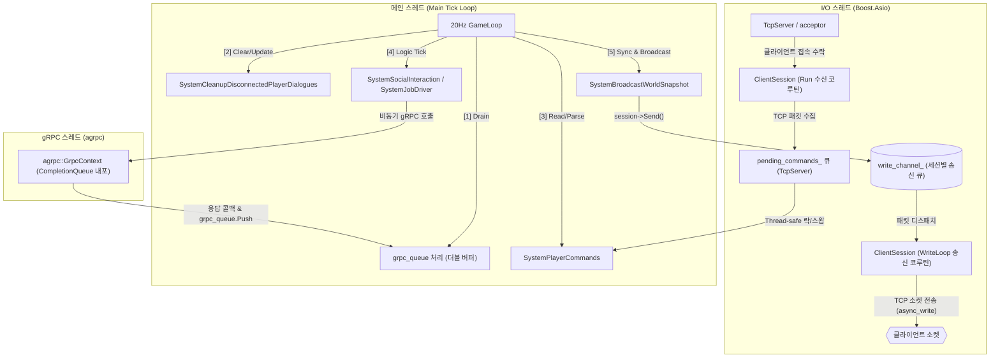
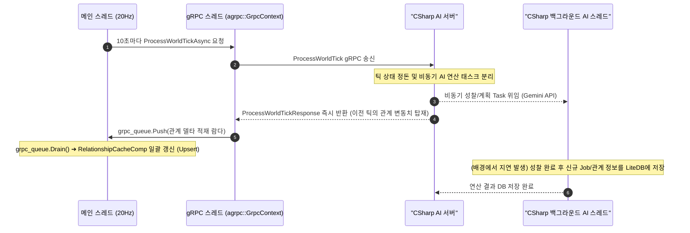
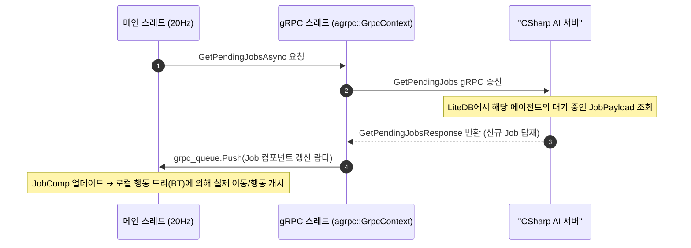
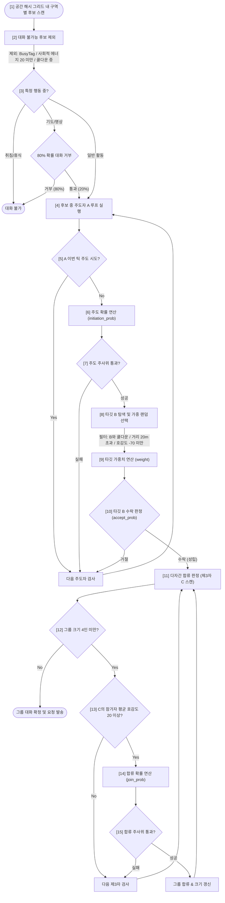
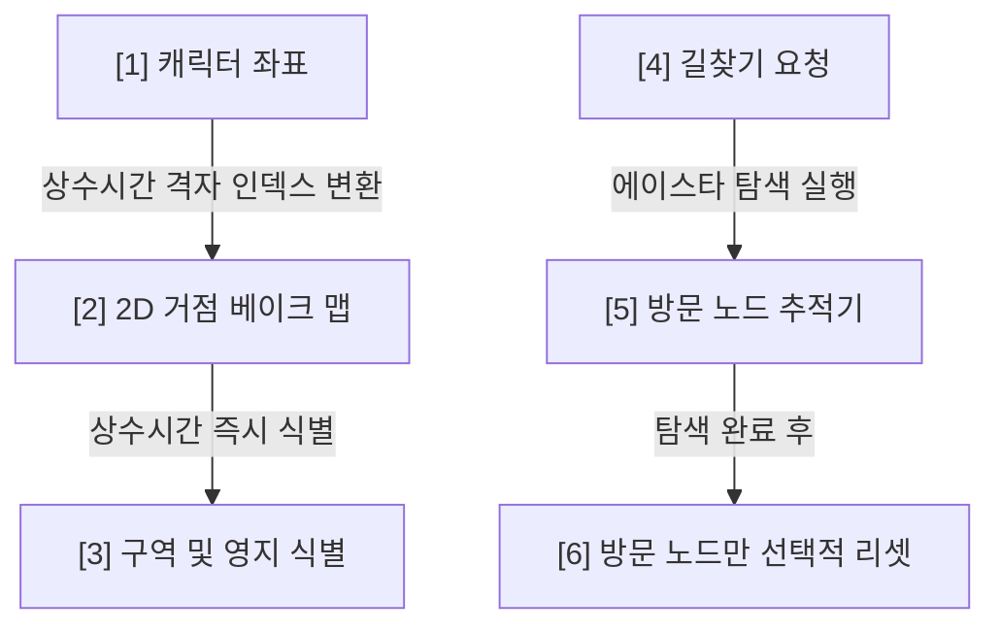

# Mundus Vivens: C++ Game Server Architecture Map

본 문서는 C++ 게임 서버의 아키텍처 명세 및 시스템 흐름을 설명합니다.

---

<thread_model>

## [1] 3-스레드 멀티 리액터 모델 (Thread Model)

서버는 데이터 레이스(Data Race)를 원천 차단하고 실시간 물리 연산과 비동기 통신의 지연(Latency) 병목을 분리하기 위해 3개의 스레드로 역할을 엄격하게 쪼개어 가동합니다.

`[IMPLEMENTED]` 3-스레드 분리 아키텍처는 [main.cpp](../../../MundusVivens.GameServer.Cpp/main.cpp)의 초기화 루틴에 구현되어 있습니다.

*   **메인 스레드**: 물리 연산, ECS 레지스트리 제어, 스케줄 이동 등 **게임 월드의 모든 상태 변화**를 락(Lock) 없이 독점 처리합니다. (Logic Tick 계열은 10초 단위 물리적 틱 동기화 시에만 실행)
*   **I/O 스레드**: [TcpServer.cpp](../../../MundusVivens.GameServer.Cpp/TcpServer.cpp)에서 외부 유저(클라이언트)와의 소켓 통신(패킷 송수신)만 전담합니다.
*   **gRPC 스레드**: [AsyncGrpcClient.cpp](../../../MundusVivens.GameServer.Cpp/AsyncGrpcClient.cpp)에서 C# AI 서버와의 AI 백엔드 통신(gRPC RPC)만 전담합니다.
</thread_model>

---

<tick_sync_flow>

## [2] 틱 동기화 및 데이터 흐름 명세 (Synchronization & Data Flow)

C++ 게임 서버와 C# AI 서버 간의 비동기 시간선 일관성(Determinism)과 스케줄을 동기화하기 위한 명세입니다. 복잡도를 낮추고 향후 확장성(전투/인터럽트 등)을 확보하기 위해 동기화 흐름과 스케줄 수거 흐름을 각각 분리하여 기술합니다.

### ① 틱 동기화 및 관계 델타 흐름 (ProcessWorldTick Flow)
`[IMPLEMENTED]` C++ 메인 스레드가 10초(200 물리 틱)마다 C# 서버와 논리 시간선을 일치시키고 최신 호감도/신뢰도를 수거하는 경로입니다. C# 서버는 무거운 LLM 연산(성찰 등)은 백그라운드로 미루고 동기화 응답은 수 ms 내로 즉각 반환합니다.

### ② 일일 스케줄 및 Job 수거 흐름 (GetPendingJobs Flow)
`[IMPLEMENTED]` C++ 메인 스레드가 각 NPC의 스케줄 갱신이 필요할 때 C# 데이터베이스(LiteDB)에 보관된 최신 Job 일거리를 수거해 가는 Pull 방식의 경로입니다.

</tick_sync_flow>

---

<social_interaction>

## [3] 대화 트리거 & 다자간 합류 로직 (Dialogue Trigger Logic)

`[IMPLEMENTED]` 매 10초(논리 틱)마다 [SystemSocial.cpp](../../../MundusVivens.GameServer.Cpp/SystemSocial.cpp) 내부의 `SystemSocialInteraction` 시스템에서 공간 인접 NPC들 간의 2단계(주도/수락) 대화 성사 및 제3자 다자간 합류 확률을 계산합니다.

#### 대화 확률 공식
#### **[1] 주도자(Initiator) 대화 주도 확률**
    `initiation_prob = 15% * (0.3 + extroversion_i) * location_modifier`
    *   최소/최대 제한: `[2%, 60%]`
    *   장소 계수 (`location_modifier`): Tavern(1.8), Market(1.5), Square(1.2), Church(0.3), 기타(1.0)
    
#### **[2] 타깃(Target) 대화 수락 확률**
    `accept_prob = 50% + (extroversion_t * 25%) + (liking_t_to_i / 200) + ((location_modifier - 1.0) * 15%)`
    *   최소/최대 제한: `[10%, 95%]`
    *   타깃 선택 가중치 (필터 통과 시 가중 랜덤): `weight = max(1.0, liking_i_to_t + 60)`
    
#### **[3] 제3자(Bystander) 다자간 대화 합류 확률**
    *   선제 조건: 제3자의 **기존 참가자 평균 호감도 ≥ 20**
    *   관계 계수: `relationship_coeff = 1.0 + (avg_liking / 100) + ((avg_trust - 50) / 100)`
    *   그룹 크기 감쇠: `group_penalty = 2.0 / group_size`
    *   합류 확률: `join_prob = 25% * (0.5 + extroversion_c) * relationship_coeff * group_penalty`
    *   최소/최대 제한: `[0%, 50%]`, 최대 그룹 제한: `4명`

#### 대화 트리거 흐름도 (Flowchart)

</social_interaction>

---

<spatial_pathfinding_optimizations>

## [4] 공간 및 길찾기 성능 최적화 (Spatial & Pathfinding Optimizations)

C++ 게임 서버의 20Hz 실시간 시뮬레이션을 보장하기 위한 공간 판정 및 길찾기 컴포넌트 구조입니다.

*   **2D 거점 베이크 맵 (Region Bake Map):** 부트스트랩 시 거점 영역(반경 8m)을 격자 배열에 미리 마스킹하여, 이동 틱마다 $O(1)$ 상수 시간에 Region ID와 Territory ID를 판정합니다.
*   **A\* Visited Node Reset:** 길찾기 연산 시 전체 그리드가 아닌 실제 탐색 과정에서 방문한 노드($K$개)만 추적 및 부분 리셋하여 오버헤드를 억제합니다.

</spatial_pathfinding_optimizations>