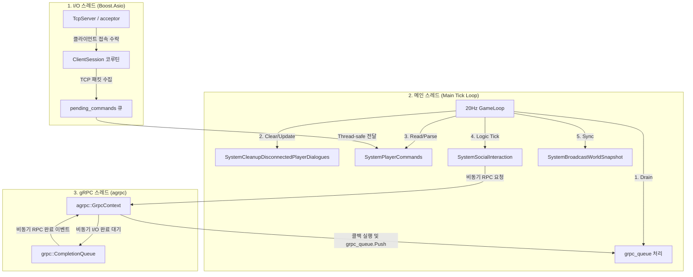
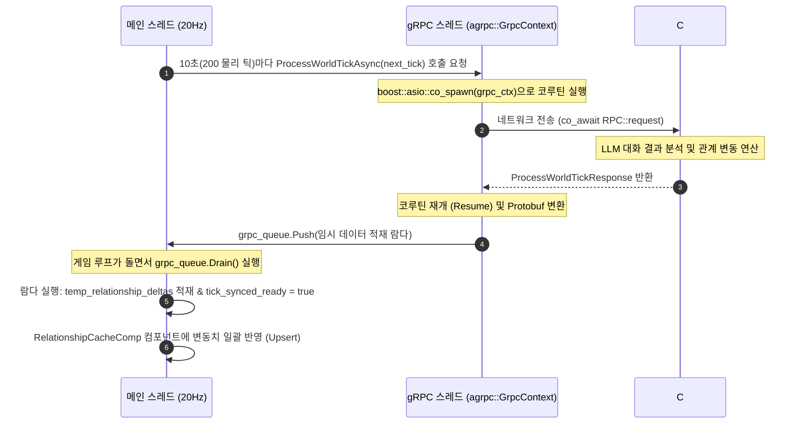

# Mundus Vivens: C++ Game Server Architecture Map

본 문서는 C++ 게임 서버의 아키텍처 명세 및 시스템 흐름을 설명합니다.

---

## <thread_model>
### 1. 3-스레드 멀티 리액터 모델 (Thread Model)

서버는 데이터 레이스(Data Race)를 원천 차단하고 실시간 물리 연산과 비동기 통신의 지연(Latency) 병목을 분리하기 위해 3개의 스레드로 역할을 엄격하게 쪼개어 가동합니다.

`[IMPLEMENTED]` 3-스레드 분리 아키텍처는 [main.cpp](../../MundusVivens.GameServer.Cpp/main.cpp)의 초기화 루틴에 구현되어 있습니다.



*   **메인 스레드**: 물리 연산, ECS 레지스트리 제어, 스케줄 이동 등 **게임 월드의 모든 상태 변화**를 락(Lock) 없이 독점 처리합니다. (Logic Tick 계열은 10초 단위 물리적 틱 동기화 시에만 실행)
*   **I/O 스레드**: [TcpServer.cpp](../../MundusVivens.GameServer.Cpp/TcpServer.cpp)에서 외부 유저(클라이언트)와의 소켓 통신(패킷 송수신)만 전담합니다.
*   **gRPC 스레드**: [AsyncGrpcClient.cpp](../../MundusVivens.GameServer.Cpp/AsyncGrpcClient.cpp)에서 C# AI 서버와의 AI 백엔드 통신(gRPC RPC)만 전담합니다.
</thread_model>

---

## <tick_sync_flow>
### 2. 틱 동기화 및 관계 델타 데이터 흐름 (ProcessWorldTick Flow)

`[IMPLEMENTED]` C# AI 서버에서 연산된 복잡한 인지 결과와 관계 변동 수치(`RelationshipDelta`)가 C++ 서버의 ECS(엔티티 컴포넌트 시스템)로 유입되는 스레드 안전 경로입니다. (관련 로직: [AsyncGrpcClient.cpp](../../MundusVivens.GameServer.Cpp/AsyncGrpcClient.cpp#L22))


</tick_sync_flow>

---

## <social_interaction>
### 3. 대화 트리거 & 다자간 합류 로직 (Dialogue Trigger Logic)

`[IMPLEMENTED]` 매 10초(논리 틱)마다 [Systems.cpp](../../MundusVivens.GameServer.Cpp/Systems.cpp) 내부의 `SystemSocialInteraction` 시스템에서 공간 인접 NPC들 간의 2단계(주도/수락) 대화 성사 및 제3자 다자간 합류 확률을 계산합니다.

#### 대화 확률 공식
1.  **주도자(Initiator) 대화 주도 확률**
    `initiation_prob = 15% * (0.3 + extroversion_i) * location_modifier`
    *   최소/최대 제한: `[2%, 60%]`
    *   장소 계수 (`location_modifier`): Tavern(1.8), Market(1.5), Square(1.2), Church(0.3), 기타(1.0)
2.  **타깃(Target) 대화 수락 확률**
    `accept_prob = 50% + (extroversion_t * 25%) + (liking_t_to_i / 200) + ((location_modifier - 1.0) * 15%)`
    *   최소/최대 제한: `[10%, 95%]`
    *   타깃 선택 가중치 (필터 통과 시 가중 랜덤): `weight = max(1.0, liking_i_to_t + 60)`
3.  **제3자(Bystander) 다자간 대화 합류 확률**
    *   선제 조건: 제3자의 **기존 참가자 평균 호감도 ≥ 20**
    *   관계 계수: `relationship_coeff = 1.0 + (avg_liking / 100) + ((avg_trust - 50) / 100)`
    *   그룹 크기 감쇠: `group_penalty = 2.0 / group_size`
    *   합류 확률: `join_prob = 25% * (0.5 + extroversion_c) * relationship_coeff * group_penalty`
    *   최소/최대 제한: `[0%, 50%]`, 최대 그룹 제한: `4명`

#### 대화 트리거 흐름도 (Flowchart)
```mermaid
flowchart TD
    Start([1. 공간 해시 그리드 내 구역별 후보 스캔]) --> FilterCandidates[2. 대화 불가능 후보 제외]
    FilterCandidates -->|제외: BusyTag / 사회적 에너지 < 20 / 쿨다운 중| CheckActivity{3. 특정 행동 중?}
    
    CheckActivity -- 취침/휴식 --> Reject([대화 불가])
    CheckActivity -- 기도/명상 --> RollMeditate{80% 확률 대화 거부}
    RollMeditate -- 거부 (80%) --> Reject
    RollMeditate -- 통과 (20%) --> LoopInitiator
    CheckActivity -- 일반 활동 --> LoopInitiator[4. 후보 중 주도자 A 루프 실행]
    
    LoopInitiator --> InitCheck{5. A 이번 틱 주도 시도?}
    InitCheck -- Yes --> NextInitiator[다음 주도자 검사]
    InitCheck -- No --> CalcInitProb["6. 주도 확률 연산 (initiation_prob)"]
    
    CalcInitProb --> DiceInit{7. 주도 주사위 통과?}
    DiceInit -- 실패 --> NextInitiator
    DiceInit -- 성공 --> TargetSelect[8. 타깃 B 탐색 및 가중 랜덤 선택]
    
    TargetSelect -->|필터: B와 쿨다운 / 거리 > 20m / 호감도 < -70| CalcWeight["9. 타깃 가중치 연산 (weight)"]
    CalcWeight --> DiceTargetAccept{10. 타깃 B 수락 판정 (accept_prob)}
    
    DiceTargetAccept -- 거절 --> NextInitiator
    DiceTargetAccept -- 수락 (성립) --> JoinStage[11. 다자간 합류 판정 (제3자 C 스캔)]
    
    JoinStage --> JoinLimit{12. 그룹 크기 < 4인?}
    JoinLimit -- No --> EstablishDialogue([그룹 대화 확정 및 요청 발송])
    JoinLimit -- Yes --> LikingGate{13. C의 참가자 평균 호감도 >= 20?}
    
    LikingGate -- No --> NextBystander[다음 제3자 검사]
    LikingGate -- Yes --> CalcJoinProb["14. 합류 확률 연산 (join_prob)"]
    
    CalcJoinProb --> DiceJoin{15. 합류 주사위 통과?}
    DiceJoin -- 실패 --> NextBystander
    DiceJoin -- 성공 --> AddMember[그룹 합류 & 크기 갱신]
    AddMember --> JoinStage
    NextBystander --> JoinStage
    NextInitiator --> LoopInitiator
```
</social_interaction>
