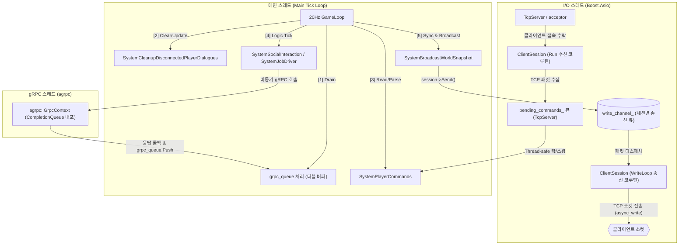
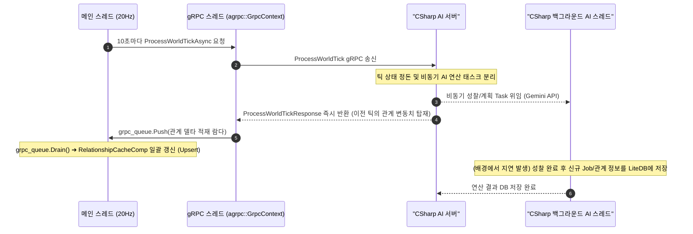
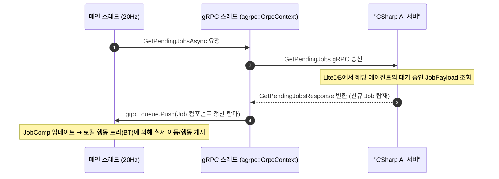
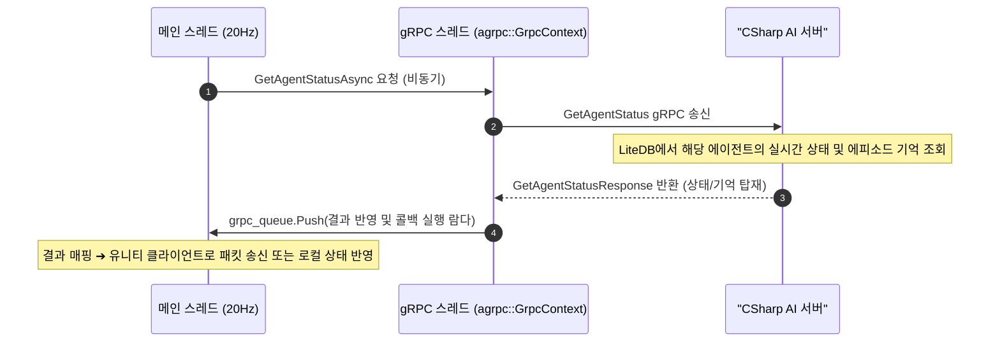
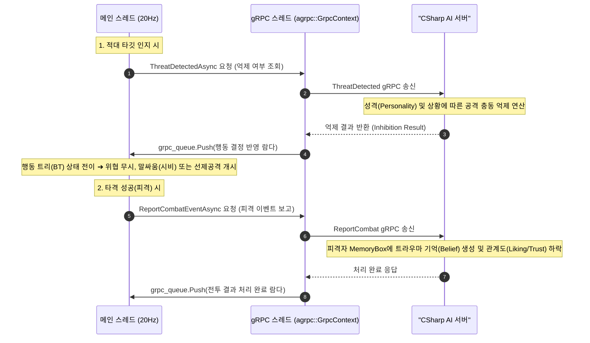
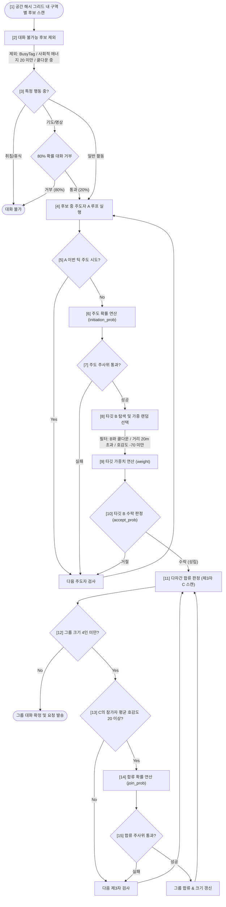
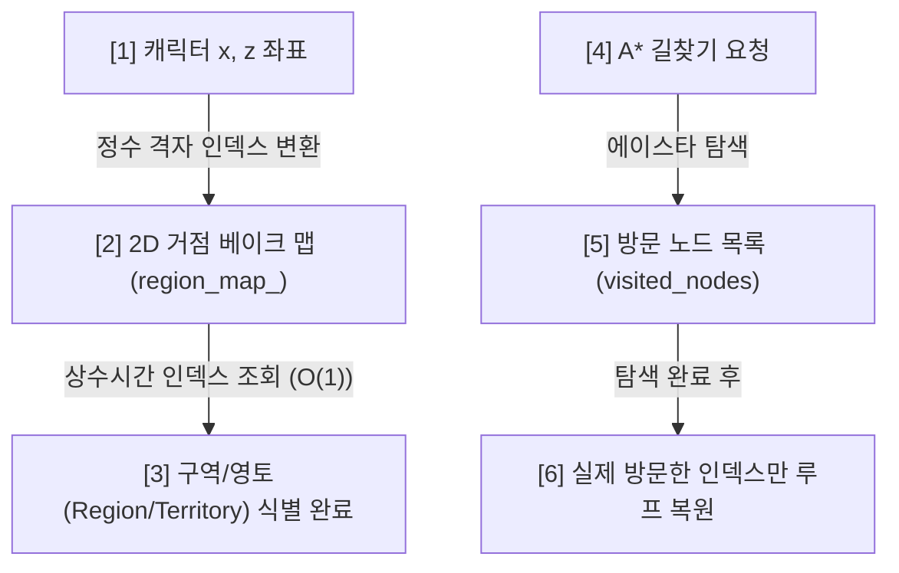

# Game Server Architecture
> **부제**: Mundus Vivens C++ 게임 서버 아키텍처 명세 및 시스템 흐름

본 문서는 C++ 게임 서버의 아키텍처 명세 및 시스템 흐름을 설명합니다.

---

<thread_model>

## [1] 3-스레드 **Proactor** 모델 (Thread Model)

서버는 데이터 레이스(Data Race)를 원천 차단하고 실시간 물리 연산과 비동기 통신의 지연(Latency) 병목을 분리하기 위해 3개의 스레드로 역할을 엄격하게 쪼개어 가동합니다.

`[IMPLEMENTED]` 3-스레드 분리 아키텍처는 [main.cpp](../../../MundusVivens.GameServer.Cpp/main.cpp)의 초기화 루틴에 구현되어 있습니다.

*   **메인 스레드**: 물리 연산, ECS 레지스트리 제어, 스케줄 이동 등 **게임 월드의 모든 상태 변화**를 락(Lock) 없이 독점 처리합니다. (Logic Tick 계열은 10초 단위 물리적 틱 동기화 시에만 실행)
*   **I/O 스레드**: [TcpServer.cpp](../../../MundusVivens.GameServer.Cpp/TcpServer.cpp)에서 외부 유저(클라이언트)와의 소켓 통신(패킷 송수신)만 전담합니다.
*   **gRPC 스레드**: [AsyncGrpcClient.cpp](../../../MundusVivens.GameServer.Cpp/AsyncGrpcClient.cpp)에서 C# AI 서버와의 AI 백엔드 통신(gRPC RPC)만 전담합니다.
</thread_model>

---

<tick_sync_flow>

## [2] 틱 동기화 및 데이터 흐름 명세 (Synchronization & Data Flow)

C++ 게임 서버와 C# AI 서버 간의 비동기 시간선 일관성(Determinism)과 스케줄을 동기화하기 위한 명세입니다. 복잡도를 낮추고 향후 확장성(전투/인터럽트 등)을 확보하기 위해 동기화 흐름과 스케줄 수거 흐름을 각각 분리하여 기술합니다.

### ① 틱 동기화 및 관계 델타 흐름 (ProcessWorldTick Flow)
`[IMPLEMENTED]` C++ 메인 스레드가 10초(200 물리 틱)마다 C# 서버와 논리 시간선을 일치시키고 최신 호감도/신뢰도를 수거하는 경로입니다. C# 서버는 무거운 LLM 연산(성찰 등)은 백그라운드로 미루고 동기화 응답은 수 ms 내로 즉각 반환합니다.

### ② 일일 스케줄 및 Job 수거 흐름 (GetPendingJobs Flow)
`[IMPLEMENTED]` C++ 메인 스레드가 각 NPC의 스케줄 갱신이 필요할 때 C# 데이터베이스(LiteDB)에 보관된 최신 Job 일거리를 수거해 가는 Pull 방식의 경로입니다.

### ③ 비동기 상대 NPC 상태 조회 흐름 (GetAgentStatusAsync Flow)
`[IMPLEMENTED]` 플레이어 또는 외부 시각 클라이언트(Unity)가 특정 NPC의 상세 상태(기억 목록, 현재 감정, 활동 요약 등)를 조회 요청할 때 경유하는 비동기 데이터 경로입니다. 

### ④ 위협 인지 및 피격 알림 흐름 (Threat & Combat Flow)
`[IMPLEMENTED]` 전투 시스템 개입 단계에서 추가된 위협 판단 억제 흐름과 피격 시의 트라우마 기억 보고 경로입니다.

</tick_sync_flow>

---

<social_interaction>

## [3] 대화 트리거 & 다자간 합류 로직 (Dialogue Trigger Logic)

`[IMPLEMENTED]` 매 10초(논리 틱)마다 [SystemSocial.cpp](../../../MundusVivens.GameServer.Cpp/SystemSocial.cpp) 내부의 `SystemSocialInteraction` 시스템에서 공간 인접 NPC들 간의 2단계(주도/수락) 대화 성사 및 제3자 다자간 합류 확률을 계산합니다.

#### 대화 확률 공식
#### **[1] 주도자(Initiator) 대화 주도 확률**
    `initiation_prob = 15% * (0.3 + extroversion_i) * location_modifier`
    *   최소/최대 제한: `[2%, 60%]`
    *   장소 계수 (`location_modifier`): Tavern(1.8), Market(1.5), Square(1.2), Church(0.3), 기타(1.0)
    
#### **[2] 타깃(Target) 대화 수락 확률**
    `accept_prob = 50% + (extroversion_t * 25%) + (liking_t_to_i / 200) + ((location_modifier - 1.0) * 15%)`
    *   최소/최대 제한: `[10%, 95%]`
    *   타깃 선택 가중치 (필터 통과 시 가중 랜덤): `weight = max(1.0, liking_i_to_t + 60)`
    
#### **[3] 제3자(Bystander) 다자간 대화 합류 확률**
    *   선제 조건: 제3자의 **기존 참가자 평균 호감도 ≥ 20**
    *   관계 계수: `relationship_coeff = 1.0 + (avg_liking / 100) + ((avg_trust - 50) / 100)`
    *   그룹 크기 감쇠: `group_penalty = 2.0 / group_size`
    *   합류 확률: `join_prob = 25% * (0.5 + extroversion_c) * relationship_coeff * group_penalty`
    *   최소/최대 제한: `[0%, 50%]`, 최대 그룹 제한: `4명`

#### 대화 트리거 흐름도 (Flowchart)

</social_interaction>

---

<spatial_pathfinding_optimizations>

## [4] 공간 및 길찾기 성능 최적화 구조 (Spatial & Pathfinding Optimizations)

C++ 게임 서버의 20Hz 실시간 시뮬레이션을 지연 없이 보장하기 위해 설계된 공간 관리 및 길찾기 데이터 구조입니다.

### 1. 2D 거점 베이크 맵 (Region Bake Map) 구조
*   **데이터 구조**:
    *   [LocationRegistry.h](../../../MundusVivens.GameServer.Cpp/LocationRegistry.h) 클래스 내부에서 전체 맵 크기($2000 \times 2000$ 타일)에 대응하는 `std::vector<uint32_t> region_map_` 1차원 플랫 배열을 유지합니다.
*   **동작 구조**:
    *   **초기 베이크**: 서버 기동 시 각 거점 위치의 중심점 좌표를 기준으로 반경 8m(`LOCATION_RADIUS`) 이내에 속하는 모든 격자 셀 인덱스에 고유한 `zone_id` 값을 미리 할당해 둡니다. (마스킹 되지 않은 영역은 기본값 `0: Wilderness`로 채워짐)
    *   **실시간 판정**: 에이전트가 이동할 때마다 자신의 현재 위치 $(X, Z)$ 좌표를 반올림하여 1차원 배열 인덱스(`x * height + z`)로 즉시 조회합니다. 대상을 순회하며 비교하지 않고 단 한 번의 배열 접근($O(1)$)만으로 속한 구역을 식별합니다.

### 2. A* 방문 노드 부분 초기화 (A* Visited Node Reset) 구조
*   **데이터 구조**:
    *   [GridMap.cpp](../../../MundusVivens.GameServer.Cpp/GridMap.cpp)의 길찾기 내부 로직에서 스레드별로 독립된 메모리 공간인 `thread_local std::vector<int> visited_nodes` 목록을 관리합니다.
*   **동작 구조**:
    *   **기록 단계**: A* 탐색 경로를 추적하는 과정에서 방문한 모든 격자 노드의 인덱스를 `visited_nodes` 백터에 순차적으로 적재(`push_back`)합니다.
    *   **복원 단계**: 길찾기 연산이 종료되면 전체 400만 칸의 맵 데이터 전체를 초기화하지 않고, `visited_nodes` 백터에 담겨 있는 실제 탐색 노드 인덱스들만 순회하며 방문 플래그(Flag)를 이전 상태로 개별 복원한 뒤 백터를 비웁니다.

### 3. 실시간 동적 추적 최적화 (Dynamic Target Tracking) 구조
*   **Pathfinding Thresholding (경로 재계획 임계치 판정)**:
    *   에이전트가 움직이는 타깃(예: 도망치는 플레이어, 배회하는 몬스터)을 추적할 때 매 프레임 A* 길찾기를 수행하면 엄청난 CPU 과부하가 걸립니다.
    *   이를 방지하기 위해 타깃의 현재 위치와 이전 경로 계산 시점의 타깃 좌표(`last_target_x`, `last_target_z`) 간의 유클리드 거리를 계산합니다.
    *   타깃이 최소 **2.0 유닛(m) 이상 이동**한 경우에만 기존 경로(`waypoints`)를 파기하고 새롭게 A* 탐색을 트리거하도록 임계치 판정 구조를 구축했습니다.
*   **Line-of-Sight (LOS) Direct-Seek Bypass (시야 확보 시 에이스타 우회)**:
    *   매 프레임 캐릭터와 최종 목표점 사이에 장애물이 없는지 시야 판정(`map.IsPathBlocked`)을 수행합니다.
    *   장애물이 없는 빈 평지(Line-of-Sight 확보)로 판명되면, 복잡한 A* 노드 탐색을 완전히 생략(Bypass)하고 목표 좌표를 향해 직선 최단거리 조향 벡터(`Seek Force`)를 직접 꽂아 이동하도록 구동합니다.

### 4. 동적 조향 및 장애물 회피 (Dynamic Steering & Avoidance) 구조
*   **장애물 회피 조향력 (Separation Force)**:
    *   캐릭터가 고정된 이동 경로(A* 노드)만 따라가다 서로 겹치거나 벽에 끼는 것을 방지하기 위해 조향력(Steering Force) 개념을 사용합니다.
    *   [SystemMovement.cpp](../../../MundusVivens.GameServer.Cpp/SystemMovement.cpp) 시스템은 에이전트의 진행 방향 전방 1.5m 이내에 벽이나 타 에이전트가 감지될 경우, 인접 엔티티 목록을 기반으로 밀쳐내는 힘(Separation Force)을 계산하여 기존 속도 벡터에 결합합니다. 이를 통해 동적인 충돌 방지 및 부드러운 우회 이동을 구현합니다.

</spatial_pathfinding_optimizations>