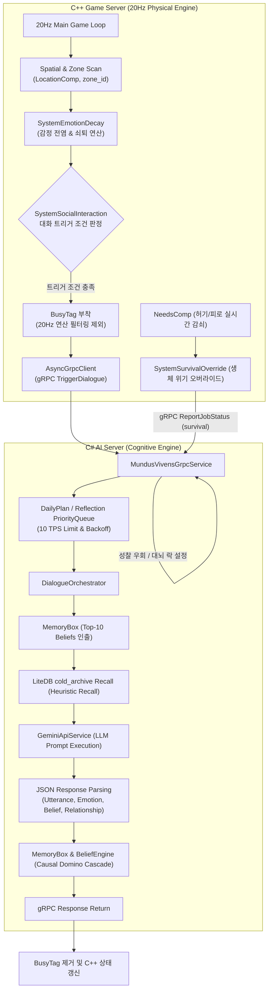
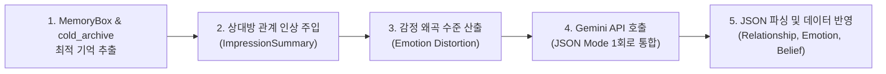

# Mundus Vivens: Agent Execution Architecture & Memory Systems

이 문서는 `Mundus Vivens` 게임 서버(C++) 및 AI 서버(C#) 환경에서 에이전트(NPC)의 물리적 연산, 감정 전염, 대화 트리거, 기억(Belief) 관리, 그리고 일일 스케줄링이 작동하는 **실제 구현 레벨의 상세 아키텍처 명세(Technical Spec)**입니다.

---

## 1. 분산 아키텍처 및 역할 분담 구조

본 프로젝트는 물리/공간 연산을 구동하는 **C++ 게임 서버**와 인지/대화/LLM 연산을 구동하는 **C# AI 서버**가 gRPC 프로토콜을 통해 비동기로 통신하는 2-서버 구조로 작동합니다.



---

## 2. C++ 게임 서버: 물리 및 감정 연산 시스템 (`Systems.cpp`)

C++ 서버는 EnTT ECS(Entity Component System) 기법을 사용하여 에이전트의 상태를 관리합니다.

### A. 감정 쇠퇴 및 구역(Zone) 감정 전염 (`SystemEmotionDecay`)
1.  **구역 스캔**: 매 틱마다 `LocationComp`와 `EmotionComp`를 가진 모든 엔티티를 스캔하여, 각 `zone_id`에 존재하는 부정적 감정("분노", "적대", "공포") 목록을 수집합니다.
2.  **연산 배제 (`entt::exclude<BusyTag>`)**: LLM 연산 대기 중이거나 대화 중인 엔티티(`BusyTag` 소유)는 감정 쇠퇴 및 전염 연산 대상에서 즉시 제외됩니다.
3.  **감정 쇠퇴**: `decay_ticks_remaining` 카운터가 감소하여 0에 도달하면 `current_emotion`이 `base_emotion`으로 자동 복귀합니다.
4.  **감정 전염 (Contagion)**:
    *   동일 구역에 부정적 감정을 가진 NPC가 존재할 때, 주변의 평온한 NPC가 감염될 확률은 다음과 같이 계산됩니다:
        $$\text{InfectChance} = \min(0.45, \text{Count}(\text{NegativeEmotions}) \times 0.15)$$
    *   확률 통과 시 대리 감정("불안" 또는 "경계")으로 상태가 전이되며 5틱 동안 지속됩니다.

### B. 대화 트리거 및 하드 판정 (`SystemSocialInteraction`)
1.  **활동 집중도 판정 (`IsNPCFocusedOnActivity`)**:
    *   "취침", "휴식" 활동 중 ➔ 대화 트리거 차단.
    *   "기도", "명상" 활동 중 ➔ 80% 확률로 대화 트리거 차단.
2.  **기본 확률 및 변조**:
    *   8% 기본 확률에 감정 상태 및 NPC 간 관계성 수치를 더해 최종 확률을 산출합니다.
3.  **`BusyTag` 부착 및 비동기 발송**:
    *   대화가 성사되면 해당 엔티티에 `BusyTag`를 컴포넌트로 부착하고, C# 서버로 gRPC `TriggerDialogue` 메시지를 발송합니다.

---

## 3. C# AI 서버: 기억(Belief) 및 인지 모델 (`Models/`)

### A. 통합 믿음 모델 (`Belief.cs`)
에이전트의 모든 기억과 사실 정보는 단일 `Belief` 클래스로 포맷팅되어 관리됩니다.

```csharp
public class Belief
{
    public string BeliefId { get; set; }
    public string SubjectId { get; set; }
    public string Content { get; set; }
    public BeliefType Type { get; set; } // Core, Witnessed, Heard, Overheard
    
    public double Confidence { get; set; }      // 확신도 (0.0 ~ 1.0)
    public double Salience { get; set; }        // 현저성 (0.0 ~ 1.0)
    public double EmotionalCharge { get; set; } // 정서적 강도 (0.0 ~ 1.0)
    
    public string SourceAgentId { get; set; }
    public List<string> PropagationPath { get; set; }
    public HashSet<string> SharedWith { get; set; }
    public DateTime AcquiredAt { get; set; }
    public float[]? ContentEmbedding { get; set; }

    // 🆕 신념 인과망 연쇄 파기를 위한 필드
    public string? DerivedFrom { get; set; }
    public string? SupersededBy { get; set; }
}
```

### B. 믿음 중요도(Importance) 수식 및 예산 도태 (Eviction)와 영구 보관 (Archive)
기억 저장소(`MemoryBox`)는 예산 제한 한도(`MaxTotalBeliefs = 40`, `MaxCoreBeliefs = 5`)를 가집니다.

1.  **중요도(Importance) 계산 공식**:
    $$\text{Importance} = (\text{Confidence} \times 0.4) + (\text{Salience} \times 0.35) + (\text{EmotionalCharge} \times 0.25)$$
2.  **Core 예산 초과 시 강등 (Demotion)**:
    *   `Core` 타입 믿음이 5개를 초과하면, `Importance`가 가장 낮은 `Core` 믿음이 `Witnessed` 타입으로 강등되고 `AcquiredAt` 타임스탬프가 재조정됩니다.
3.  **전체 예산 초과 시 도태 (Eviction) 및 Cold Archive 이관 (Chunk B)**:
    *   전체 믿음 수가 40개를 초과하면, `Type != Core`인 일반 믿음 중 `Importance` 점수가 가장 낮은 객체가 `MemoryBox.Beliefs` 딕셔너리에서 방출됩니다.
    *   이때 방출된 기억은 그냥 소멸하지 않고, `OnBeliefEvicted` 이벤트를 통해 **LiteDB 영구 보관소(`cold_archive` 컬렉션)**로 이관됩니다.
4.  **연상 기억 회상 (Heuristic Recall) (Chunk B)**:
    *   대화 시작이나 특정 공간 진입 시, 해당 대상 인물(`SubjectId`) 및 공간(`location`) 정보를 매칭하여 LiteDB에서 관련 과거 기억들을 회상합니다.
    *   **Heuristic Scoring 공식**:
        $$\text{Recall Score} = \text{대상 일치}(+5.0) + \text{장소 일치}(+3.0) + \text{중요도 가중치}(\text{최대 } +2.0) + \text{최신성}(\text{최대 } +1.5)$$
    *   최종 합산 점수가 가장 높은 상위 기억(Top-K)이 Working Memory로 복원됩니다.

### C. 신념 인과 도미노 전파 (Causal Cascade) (Chunk B)
*   어떤 신념의 확신도가 떨어지거나 대체될 때, `PropagateCausalCascade` 재귀 메서드가 가동되어 해당 신념으로부터 유도된 하위 자식 신념들의 확신도를 자동으로 비례 감쇠시켜 신념 정합성을 확보합니다.

### D. 틱 기반 현저성 감쇠 (Salience Decay)
매 동기화 틱마다 `BeliefEngine.cs`에 의해 타입별로 `Salience`가 차등 감소합니다.

| Belief Type | 틱당 감소량 (Decay Rate) | 특징 |
| :--- | :--- | :--- |
| **Core** | `-0.001` / tick | 정체성 및 핵심 신념 (Eviction 면역) |
| **Witnessed** | `-0.002` / tick | 직접 눈으로 목격한 사실 |
| **Heard** | `-0.005` / tick | 타인에게 전달받은 정보 |
| **Overheard** | `-0.010` / tick | 엿들음 (가장 빠르게 감쇠) |

*   **발설 감속 룰**: 에이전트가 해당 믿음을 타인에게 발설하여 `SharedWith` 셋에 상대방 ID가 추가되면, 감소율이 50%(`* 0.5`)로 감소하여 뇌 속에 오래 유지됩니다.

---

## 4. 대화 오케스트레이션 및 LLM 파이프라인 (`DialogueOrchestrator.cs`)

`SystemSocialInteraction`에 의해 대화가 요청되면 `DialogueOrchestrator`가 다음 순서로 대화를 처리합니다.



1.  **기억 인출 & Recall**: `MemoryBox` 활성 기억과 LiteDB 연상 기억 회상 결과를 병합해 대화의 배경 컨텍스트로 활용합니다.
2.  **관계 인상 주입 (ImpressionSummary) (Chunk B)**: 자정 성찰(`ReflectOnEpisodesAsync`) 시 `relationship_updates`를 추가 비용 없이 병합 산출하여 얻은 상대방 인상 요약본을 대화 프롬프트에 주입해 NPC의 대화 태도(Stance)를 제어합니다.
3.  **감정 왜곡 적용**: 현재 `EmotionComp` 상태에 따라 대사 톤 및 표현에 가중치 매개변수를 주입합니다.
4.  **LLM 프롬프트 발송**: Gemini API(JSON 모드)로 대사 생성 요청을 전달합니다. (단 1회 호출로 대본, 감정 변화, 관계 변화, 스케줄 동기화를 일괄 생성하여 스몰빌 대비 효율을 극대화)
5.  **결과 반영**: 관계 수치 갱신, 감정 정보 저장, 공유된 지식의 와전 여부(`isMutated`)를 설정하여 믿음을 전파합니다.

---

## 5. 일일 성찰 및 스케줄링 시스템 (`DailyPlanService.cs`)

에이전트는 하루 24시간을 0시부터 23시까지의 시간 단위 틱(Tick)으로 분할하여 생활합니다.

### A. 23:00 틱 성찰 및 스케줄 생성 프로세스
1.  **트리거**: 월드 시계가 23:00 틱에 진입하면 `ProcessWorldTickAsync`가 가동됩니다.
2.  **데이터 수집**: `MemoryBox`에서 오늘 진행된 `ActiveConversation` 대화록과 신규 변동된 `Belief` 목록을 수집합니다.
3.  **성찰(Reflection) 프롬프트 실행 (`ReflectOnEpisodesAsync`)**:
    *   LLM에게 오늘 하루 동안 발생한 에피소드(`Witnessed` 믿음 리스트)를 수집하여 전달하고, 깊이 깨달은 장기 기억(`core_facts`)을 도출하도록 프롬프트를 실행합니다.
    *   성찰 결과는 초기 현저성(`Salience = 1.0`)을 가진 `BeliefType.Witnessed` 타입으로 등록되어 자연스러운 감쇠 및 예산 도태(Eviction) 순환 구조에 참여합니다.
4.  **다음 날 스케줄 생성**:
    *   00:00 ~ 23:00까지 24시간 분량의 1시간 단위 스케줄(목표 장소 `TargetLocation`, 활동 내용 `Activity`)을 JSON 배열로 생성합니다.
5.  **좌표 변환**: `LocationCoordinateRegistry`를 조회하여 장소 텍스트(예: "도서관", "광장")를 C++ 물리 엔진이 이해할 수 있는 이동 좌표(Waypoint)로 변환해 C++ 서버로 전달합니다.

### B. API 429 완화 및 예측형 큐잉 (Chunk A)
*   **시차 분산 배치**: NPC들의 첫날(Day 1) 일과 종료 시각([world_config.json](../../MundusVivens/MundusVivens.Prototype/Data/World/world_config.json))을 시차 분산 설계하여 자정에 모든 NPC가 동시에 성찰을 트리거해 API Spike가 발생하는 것을 차단합니다.
*   **예측형 더블 버퍼링**: 스케줄 만료 4시간 전에 디바이스 백그라운드 큐(`PriorityQueue`)에 성찰 요청을 밀어 넣고, 최대 10 TPS 스로틀링 및 지수 백오프를 통해 순차 분산 연산을 처리한 뒤, 다음 날 일과를 `NextSchedule` 버퍼에 넣어두어 물리 틱 끊김 없이 교체(Swap) 처리합니다.

### C. Bounding Box 기반 계층형 공간 LOD 및 Clamped 이동 연산 (Phase 2)
*   **AABB 기반 공간 판단**: 국가/도시 등 광범위 지역을 Min/Max 경계 좌표(Bounding Box - AABB)로 정의하고, 요원의 현재 좌표와의 포함 여부(`IsInBox`)를 계산합니다.
*   **계층형 공간 LOD 필터링**: 에이전트의 현재 물리적 위치를 실시간 스캔하여 자신이 소속된 `City` 내부의 세부 `Place`들은 디테일하게 노출하고, 타 도시나 타 국가는 상위 영역명(LOD)으로 축약 노출함으로써 프롬프트 토큰과 요금을 대폭 절감합니다.
*   **경계선 Clamping 및 거리 연산**: 목표 지점이 Bounding Box 영역일 때, 출발지 좌표 기준으로 가장 가까운 사각 경계선 좌표(`Math.Clamp` 연산)를 도출하여 최종 A* 이동 좌표 및 거리를 계산합니다.

### D. 원정 중 오토런(Auto-Continue) 스케줄 연장 (Phase 3)
*   **LLM API 우회**: 자정에 다음 날의 일과를 생성할 때, 요원의 현재 좌표와 최종 목적지 간의 잔여 이동 거리를 계산하여 목적지에 도달하지 못했다면 LLM 호출을 100% 우회합니다.
*   **스케줄 자동 연장**: 하루 전체(`0 ~ 23시`)를 목적지로 이동하는 단일 스케줄(`"[목적지]로 이동"`)로 채운 Daily Plan을 생성하여 메모리 버퍼에 강제 주입(Auto-Continue)하며, 원정 기간 동안 API 요금을 0원으로 동결시킵니다.

### E. 목적지 도착 완료 즉각 조기 취소 및 재성찰 (Phase 3)
*   **Completed 인터럽트 및 단축**: C++ 서버로부터 원정 이동 잡의 완료(`Completed`)가 수신되는 즉시, 오늘 남은 이동 스케줄의 EndHour를 현재 시간(`currentHour`)으로 단축해 파기합니다.
*   **도착 즉시 동적 재성찰**: **"방금 목적지 [OOO]에 도착했습니다. 오늘 남은 시간을 어떻게 보낼까요?"**라는 컨텍스트를 담은 Gemini API를 즉시 동기식으로 호출하여 현지에서의 새로운 일과를 즉석에서 결정합니다.
*   **스케줄 즉각 교체**: 결정된 행동을 오늘 남은 스케줄(`currentHour + 1 ~ 23시`)에 삽입하고 C++ 서버로 신규 `NewJob` 페이로드를 즉각 발송하여 대기 없이 신규 행동을 마저 하도록 가이드합니다.

---

## 6. 물리적 본능 오버라이드 및 사물 어포던스 (Chunk C)

에이전트는 C++ 서버 20Hz 틱 수준에서 동작하는 물리적 본능의 지배를 받으며, 대뇌(C#)의 스케줄은 이에 능동적으로 인터럽트될 수 있습니다.

### A. 생체 위기 감지 및 인터럽트 (`SystemSurvivalOverride`)
*   C++ 서버에서 NPC의 허기나 피로 수치가 `15.0f` 이하로 떨어지면, 진행 중이던 C# Job 스케줄을 즉시 중단하고 로컬에서 식사/휴식을 해결하기 위해 목적지 거점으로 경로를 강제 변경합니다.
*   gRPC `ReportJobStatus`를 통해 C# 서버로 `"survival_hunger"` / `"survival_fatigue"` 에러 컨텍스트를 전달합니다.
*   C# 서버는 이를 수신하면 **고비용의 LLM 성찰 연산을 우회(Skip)하고 대뇌 락을 세팅**하여 C#과 C++ 간의 행동 불일치를 원천 예방하고 불필요한 API 요금 낭비를 막습니다.

### B. 사물 점유 및 충전 (`SystemAffordanceResolver`)
*   NPC가 위기 해결을 위해 지정 거점(술집, 거처 등)에 도착하면 주변 구역(Zone) 내의 빈 스마트 오브젝트(의자, 침대 등 `AffordanceComp` 탑재 사물)를 동적으로 스캔하여 점유합니다.
*   가구에 Snap 이동되어 점유 상태가 유지되는 동안 틱마다 Needs 게이지가 급속 충전(이때 틱당 감쇠는 일시 면제)됩니다.
*   충전이 완료(`Needs >= 95.0f`)되면 사물 점유를 안전하게 해제하고, C# 서버에 완료 보고를 보내 대뇌 락을 풀고 정상 AI 스케줄로 복귀시킵니다.
