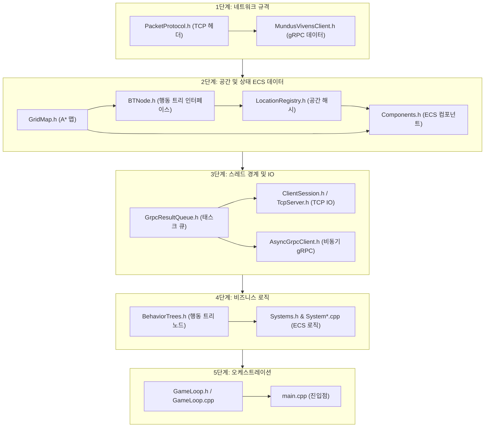

# C++ Server Architecture Study Notes
> **부제**: Mundus Vivens C++ 게임 서버 코드 리뷰 로드맵

이 문서는 C++ 게임 서버(`MundusVivens.GameServer.Cpp`)를 분석하고 리뷰할 때, **하위 의존성(의존성이 없는 원시 타입/자료구조)부터 시작해 상위 오케스트레이터 계층으로 점진적으로 학습**할 수 있도록 설계된 로드맵입니다. 

이 순서를 따르면 특정 클래스를 이해하려다 정의되지 않은 외부 의존성을 만나 분석이 중단되는 현상을 최소화할 수 있습니다.

---

## 전체 로드맵 요약

C++ 서버는 **3-스레드 프로액터(Main, TCP I/O, gRPC)** 및 **EnTT ECS(Entity Component System)** 구조를 띄고 있습니다. 따라서 하위 데이터 모델부터 스레드 경계를 지나 메인 루프로 이어지는 아래 순서의 공부를 강력히 권장합니다.

---

## 단계별 학습 리스트 & 핵심 리뷰 포인트

### 1단계: 네트워크 프로토콜 및 데이터 규격 (최하위 의존성)
외부 인프라(클라이언트/C# AI 서버)와 데이터를 주고받을 때 사용되는 원시 스키마와 상수를 먼저 파악합니다.
*   [x] **[PacketProtocol.h](../../../MundusVivens.GameServer.Cpp/PacketProtocol.h)**
    *   *리뷰 포인트*: 클라이언트(Unity)와 통신하는 TCP 패킷의 헤더 포맷(Big-Endian 4바이트) 및 패킷 ID 상수 구조 분석.
    *   *핵심 구조*: 소형 패킷의 힙 할당을 방지하기 위한 `PacketBuffer` (하이브리드 SBO) 구조 확인.
*   [x] **[MundusVivensClient.h](../../../MundusVivens.GameServer.Cpp/MundusVivensClient.h)**
    *   *리뷰 포인트*: C# AI 서버와 연동되는 gRPC 통신용 데이터 구조체(`DialogueResult`, `WorldBootstrapData`, `RelationshipDelta` 등)의 역할 이해.

### 2단계: 공간 및 시뮬레이션 데이터 모델 (ECS 컴포넌트)
게임 루프에서 엔티티가 가질 상태와 맵 데이터 구조를 학습합니다.
*   [x] **[GridMap.h](../../../MundusVivens.GameServer.Cpp/GridMap.h)**
    *   *리뷰 포인트*: A* 알고리즘의 타일 기반 길찾기 구조와 고정 그리드 맵 정보 로드 방식.
*   [ ] **[BTNode.h](../../../MundusVivens.GameServer.Cpp/BTNode.h)**
    *   *리뷰 포인트*: 행동 트리(Behavior Tree)의 핵심이 되는 `Selector`, `Sequence`, `Inverter` 노드 구현체 분석.
*   [x] **[LocationRegistry.h](../../../MundusVivens.GameServer.Cpp/LocationRegistry.h)**
    *   *리뷰 포인트*: 거리 기반 스캔 속도를 최적화하기 위해 구현된 `CELL_SIZE(8.0f)` 기반 **공간 해시 그리드(Spatial Hash Grid)** 구조 분석.
*   [x] **[Components.h](../../../MundusVivens.GameServer.Cpp/Components.h)**
    *   *리뷰 포인트*: EnTT ECS에 등록될 NPC들의 상태 데이터 컴포넌트(`IdentityComp`, `CooldownComp`, `NeedsComp`, `AffordanceComp` 등)의 유기적 매핑 구조.

### 3단계: 스레드 경계와 비동기 I/O (비동기 데이터 흐름)
게임 서버 아키텍처의 핵심인 **3-스레드 모델**에서 락(Lock)을 타지 않고 안전하게 통신하는 구조를 학습합니다.
*   [x] **[GrpcResultQueue.h](../../../MundusVivens.GameServer.Cpp/GrpcResultQueue.h)**
    *   *리뷰 포인트*: IO/gRPC 스레드가 메인 스레드로 작업을 전달할 때 임계 구역(Lock)을 최소화하기 위해 사용되는 **더블 버퍼 스왑(Double Buffer Swap - Drain 방식)** 기법 분석.
*   [x] **[ClientSession.h](../../../MundusVivens.GameServer.Cpp/ClientSession.h) & [TcpServer.h](../../../MundusVivens.GameServer.Cpp/TcpServer.h)**
    *   *리뷰 포인트*: Boost.Asio C++20 코루틴을 사용한 비동기 TCP 세션 수락 및 수신 패킷의 명령어 큐잉(`PlayerCommand`).
    *   *핵심 로직*: C# AI 서버 처리 지연 시 유입량을 조절하는 **백프레셔 흐름 제어(CheckBackpressure)** 설계 확인.
*   [x] **[AsyncGrpcClient.h](../../../MundusVivens.GameServer.Cpp/AsyncGrpcClient.h)**
    *   *리뷰 포인트*: Asio-gRPC(`agrpc`)를 활용하여 C# AI 서버로 비동기 gRPC 요청을 보내고 코루틴으로 받아오는 흐름 확인.

### 4단계: 시뮬레이션 시스템 및 도메인 로직 (비즈니스 로직)
ECS 구조의 핵심인 '로직 시스템'과 구체적인 NPC 판단/행동 알고리즘을 분석합니다.
*   [ ] **[BehaviorTrees.h](../../../MundusVivens.GameServer.Cpp/BehaviorTrees.h)**
    *   *리뷰 포인트*: 구체적인 NPC의 행동 노드들(이동, 식사, 수면, 기도 등)이 BT 노드로 어떻게 매핑되는지 파악.
*   [ ] **[Systems.h](../../../MundusVivens.GameServer.Cpp/Systems.h) & System*.cpp 파일들**
    *   *리뷰 포인트*: 메인 스레드 틱에서 EnTT Registry를 조회하며 상태를 업데이트하는 실제 시스템 알고리즘.
    *   *중점 분석 대상*: 
        *   `SystemSocialInteraction.cpp`: 인접 NPC 간 대화 수락/다자간 합류 확률 공식 및 트리거 로직.
        *   `SystemPlayer.cpp` / `SystemMovement.cpp`: 플레이어 입력 처리 및 NPC 이동 제어.
        *   `SystemSurvival.cpp` / `SystemJobDriver.cpp`: NPC 생리 욕구 및 C# AI가 할당한 Job 가이드.

### 5단계: 루프 및 전체 오케스트레이션 (최상위 진입점)
전체 시스템이 모여 하나의 서버 인스턴스로 구동되는 구성을 분석합니다.
*   [ ] **[GameLoop.h](../../../MundusVivens.GameServer.Cpp/GameLoop.h) / [GameLoop.cpp](../../../MundusVivens.GameServer.Cpp/GameLoop.cpp)**
    *   *리뷰 포인트*: 20Hz(50ms 간격) 정밀 타임 루프의 동작 구조와 루프 이탈 방지 기법.
*   [ ] **[main.cpp](../../../MundusVivens.GameServer.Cpp/main.cpp)**
    *   *리뷰 포인트*: 전반적인 초기화 시퀀스(gRPC 채널 생성, Bootstrap 정보 수신, 맵 파싱, 스레드 풀 구동)의 최종 흐름 이해.

---

> [!NOTE]
> 코드 리뷰 도중 전체 서버의 아키텍처 철학이나 스레드 상호 작용 구조가 헷갈린다면, 지식 베이스의 아키텍처 문서인 [01_architecture.md](../docs/01_game_server_architecture.md)를 함께 열어두고 비교해 보시기 바랍니다.
