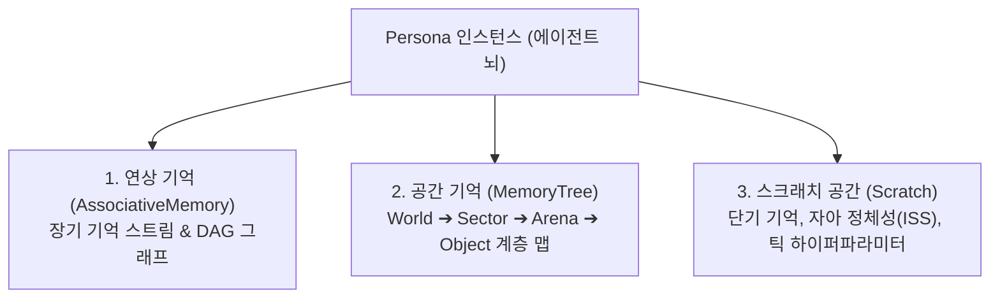
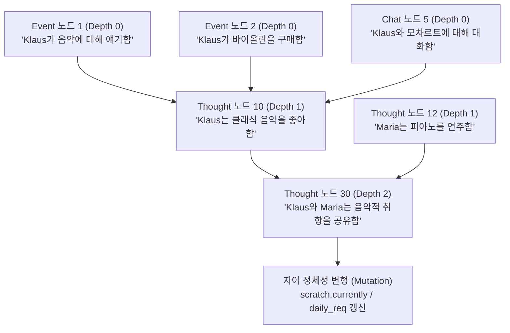
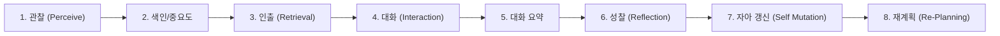
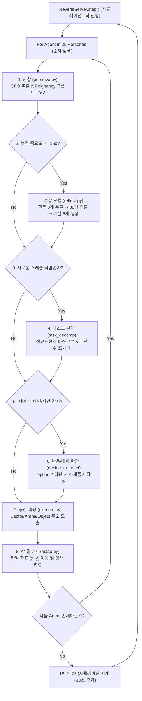

# 스몰빌(Smallville - Generative Agents) 인지 아키텍처, 기억 그래프 및 자아 변형 심층 백서

이 보고서는 스탠퍼드 대학교의 **Generative Agents (Smallville)** 프로젝트(Park et al., ACM CHI 2023)의 파이썬 오픈소스 소스코드(`joonspk-research/generative_agents`)를 코드 레벨에서 완벽하게 해부한 최종 마스터 백서입니다. 본 문서 한 편으로 스몰빌의 기억 관리 구조, 메모리 그래프 엣지, 상호작용에 따른 자아(Identity) 변형 및 프롬프트 파이프라인 전체를 완벽히 이해할 수 있도록 작성되었습니다.

---

## 1. 3대 핵심 메모리 구조 및 파이썬 클래스 설계

스몰빌 에이전트의 뇌는 에이전트 인스턴스(`Persona`) 내부의 **3가지 독립된 메모리 모듈**로 나누어 관리됩니다.



### A. 연상 기억 스트림 (`AssociativeMemory` / Memory Stream)
모든 관찰, 대화, 성찰(생각) 노드가 시간순 및 역인덱스(Inverted Index) 형태로 보관되는 핵심 저장소입니다.

#### `ConceptNode` 클래스 필드 구조
*   `node_id` (str): 노드의 고유 키 (예: `"node_104"`)
*   `type` (str): 노드 유형 (`"event"`, `"thought"`, `"chat"`)
*   `depth` (int): **메모리 트리의 깊이** (원시 관찰/대화 = $0$, 성찰 가설 = $\ge 1$)
*   `created` / `last_accessed` (datetime): 생성 시각 및 마지막 인출 시각
*   `subject`, `predicate`, `object` (S, P, O): 주어-술어-목적어 튜플 (예: `("Klaus Mueller", "is", "reading a book")`)
*   `description` (str): 자연어 텍스트 설명
*   `poignancy` (int): 중요도 점수 ($1 \sim 10$)
*   `keywords` (set): 역인덱스 검색용 소문자 키워드 집합
*   `filling` (list): **그래프 엣지 포인터 배열** (상위 성찰 노드가 참조하는 하위 증거 노드 ID 목록)
*   `embedding_key` (str): OpenAI `text-embedding-ada-002` 1536차원 벡터 캐시 키

### B. 공간 기억 트라이 (`MemoryTree`)
월드 공간을 텍스트 4단계 트라이(Trie) 구조로 들고 있어, 목적지 주소 도출 및 길찾기 타깃 계산에 사용됩니다:
$$\text{World (The Ville)} \longrightarrow \text{Sector (Oak Hill)} \longrightarrow \text{Arena (Bathroom)} \longrightarrow \text{Game Object (shower)}$$

### C. 스크래치 공간 (`Scratch` - 자아 정체성 & 단기 상태)
*   **자아 정체성 집합 (Identity Stable Set - ISS)**:
    *   **L0 타고난 성격 (Innate)**: 불변의 고유 성격 (예: `"kind, inquisitive, organized"`)
    *   **L1 자란 환경/과거 (Learned)**: 배역의 성장 배경 및 장기 목표
    *   **L2 동적 자아 상태 (`currently`)**: 성찰 및 대화를 통해 **실시간으로 변형(Mutation)되는 동적 상태** (예: `"Isabella의 파티 준비를 돕는 중"`)
*   **실행 하이퍼파라미터**:
    *   `vision_r` = $4$ (시야 반경 4타일)
    *   `att_bandwidth` = $3$ (한 틱당 최대로 주의를 기울이는 이벤트 수)
    *   `importance_trigger_max` = $150$ (성찰을 발동시키는 누적 중요도 임계치)

---

## 2. 메모리 그래프 엣지 (Observation ➔ Reflection DAG)

스몰빌의 기억은 단순한 일차원 배열이 아니라, 원시 단서로부터 고차원 신념으로 연결되는 **방향성 비순환 그래프(DAG, Directed Acyclic Graph)**를 형성합니다.



### 엣지 포인터 메커니즘 (`filling` 배열)
1.  성찰 모듈(`reflect.py`)이 LLM을 호출하여 고차원 가설을 추출할 때, LLM은 가설 문장과 함께 **증거가 된 과거 기억의 번호 목록**을 함께 리턴합니다.
2.  성찰 모듈은 해당 번호를 실제 노드 ID(예: `["node_12", "node_18"]`)로 변환하여 새 `thought` 노드의 `filling` 필드에 엣지 포인터로 기록합니다.
3.  **트리 깊이(Depth) 계산 공식**:
    $$\text{depth}_{\text{thought}} = 1 + \max_{n \in \text{filling}} \left( \text{depth}(n) \right)$$
    *   원시 관찰 및 대화 노드: $\text{depth} = 0$
    *   1차 성찰 노드 (원시 관찰들을 요약): $\text{depth} = 1$
    *   2차 성찰 노드 (기존 성찰 노드들을 재요약): $\text{depth} = 2$
    *   이 구조를 통해 에이전트는 아무리 고차원적인 가설을 세우더라도, 엣지를 타고 내려가 **자신이 언제 무슨 눈으로 보았는지 원시 단서(Provenance)까지 역추적**할 수 있습니다.

---

## 3. 상호작용 ➔ 기억 ➔ 자아(Identity) 변형의 8단계 전체 인지 생애주기

에이전트들이 타인과 만나 대화를 나누고, 이 상호작용이 어떻게 기억에 남으며, 최종적으로 **자아(Identity)와 향후 스케줄을 변화시키는지**의 8단계 완전 파이프라인입니다.



### 1단계: 관찰 (`perceive.py`)
*   시야 반경(4타일) 내의 공간 타일 및 타인의 행동을 감지합니다.
*   감지된 이벤트를 SPO 삼원소 `<Subject> <Predicate> <Object>`로 포맷팅합니다.

### 2단계: 색인 및 중요도 평가 (`associative_memory.py`)
*   새 노드를 생성하고 LLM(`poignancy_event_v1.txt`)을 호출하여 $1 \sim 10$점의 중요도(`poignancy`)를 부여합니다.
*   키워드 역인덱스(`kw_to_event`)에 등록하고 `importance_trigger_curr` 게이지를 차감합니다:
    $$\text{importance trigger curr} \longleftarrow \text{importance trigger curr} - \text{poignancy}$$

### 3단계: 삼요소 인출 연산 (`retrieve.py`)
*   현재 상황 또는 대화 상대방을 쿼리 $q$로 삼아 세 가지 가중 합산 점수를 연산합니다:

$$\text{Score}(n) = \alpha_{\text{rec}} \cdot \tilde{S}_{\text{rec}}(n) + \alpha_{\text{rel}} \cdot \tilde{S}_{\text{rel}}(n) + \alpha_{\text{imp}} \cdot \tilde{S}_{\text{imp}}(n)$$

*   **최근성 ($S_{\text{rec}}$)**: $\gamma^{i} \quad (\gamma = 0.99, \text{순번 기반 감쇠})$
*   **유사도 ($S_{\text{rel}}$)**: OpenAI 임베딩 벡터 코사인 유사도
*   **중요도 ($S_{\text{imp}}$)**: `node.poignancy` 점수
*   세 변수를 Min-Max 정규화한 후 합산($\alpha_{\text{rec}}=0.5, \alpha_{\text{rel}}=3.0, \alpha_{\text{imp}}=2.0$)하여 상위 $K$개 기억을 추출합니다.

### 4단계: 실시간 대화 생성 (`converse.py`)
*   `decide_to_talk_v2.txt`로 대화 시작 여부를 판단합니다.
*   상대방에 대한 과거 관계 기억을 인출하여 최대 8턴 동안 1:1 대사(`agent_chat_v1.txt`)를 생성합니다.

### 5단계: 대화 후처리 및 요약 (`plan.py` & `reflect.py`)
*   대화가 종료되면 `summarize_conversation_v1.txt`를 실행해 대화 전체를 한 줄로 요약합니다.
*   요약문을 `node_type = "chat"` 노드로 연상 기억 스트림에 저장합니다.

### 6단계: 대화 직후 전용 성찰 (Post-Dialogue Reflection)
대화가 끝난 즉시 `reflect.py`는 해당 대화 노드 ID를 `filling`에 연결하면서 **두 개의 전용 성찰 노드**를 뇌 속에 강제 생성합니다:
1.  **스케줄용 성찰 노드**: `For {name}'s planning: <대화로 인해 변경된 약속 내용>`
2.  **관계성/상대방 신념 성찰 노드**: `{name} <상대방에 대해 새롭게 갖게 된 느낌/믿음>`

### 7단계: 자아(Identity) 변형 파이프라인 (`revise_identity`)
*   매일 아침 시뮬레이션이 시작되거나 거시적 일과가 변경될 때 `revise_identity` 모듈이 가동됩니다.
*   대화 직후 생성된 관계성 성찰 노드들과 과거 기억들을 수집하여 LLM에게 전달합니다.
*   LLM이 에이전트의 **동적 자아 상태 (`scratch.currently`)** 문장을 직접 수정 덮어씁니다:
    *   *기존 자아*: `"Klaus는 혼자 도서관에서 연구하는 중이다."`
    *   *변형된 자아*: `"Klaus는 Isabella의 파티 초대를 받아 그녀를 돕기 위해 선물과 약품을 준비하는 중이다."`

### 8단계: 자아 변형에 따른 향후 재계획 (`generate_new_decomp_schedule`)
*   변형된 자아 상태 (`scratch.currently`)가 `daily_plan_req` 프롬프트의 입력으로 주입됩니다.
*   에이전트는 덮어써진 자아를 바탕으로 오늘 남아있는 5분~15분 단위 세부 행동 큐(Decomposition Queue)를 통째로 다시 쪼개어 재작성합니다.
*   이로써 **"타인과의 대화 ➔ 대화 요약 ➔ 관계성 성찰 ➔ 자아 상태 변형 ➔ 스케줄 재작성 ➔ 물리 이동"**으로 이어지는 완전한 인지적 닫힌 루프(Closed Loop)가 완성됩니다.

---

## 4. 6대 인지 모듈 프롬프트 템플릿 & 정규표현식 파싱 명세

### A. 관찰 중요도 평가 (`poignancy_event_v1.txt`)
```text
Here is a brief description of {persona_name}:
{persona_iss}

On a scale of 1 to 10, where 1 is purely mundane (e.g., brushing teeth, making bed) and 10 is extremely poignant (e.g., a breakup, college acceptance), rate the poignancy of the following event for {persona_name}.

Event: {event_description}
Rate (number only):
```

### B. 아침 기상 및 하루 거시 일정 (`daily_planning_v6.txt`)
```text
Name: {persona_name}
Innate traits: {innate_traits}
Lifestyle: {lifestyle}
Yesterday's plan: {yesterday_plan}
Current Date: {date}

In 5 to 10 bullet points, write down a broad daily schedule for {persona_name} today starting from {wake_up_hour}.
Format:
1) wake up and completion of morning routine at 7:00 AM
2) ...
```

### C. 세부 타스크 분해 및 파이썬 파싱 (`task_decomp_v3.txt`)
```text
Here is {persona_name}'s activity for the next hour ({hour_str}): {hourly_task}.
Decompose this activity into specific sub-tasks with durations (in minutes) that sum up to {total_minutes} minutes.

Format:
- sub-task description (duration in minutes)
```

*   **파이썬 정규표현식 파싱 패턴**:
    ```python
    pattern = r"^(.*?)\s*\((?:duration in minutes:\s*)?(\d+)\s*mins?\)"
    # 리턴 튜플: ("making coffee", 10)
    ```

### D. 대화 생성 프롬프트 (`agent_chat_v1.txt`)
```text
[Context regarding Persona A and Persona B]
{relationship_summary}
{retrieved_memories}

Generate a realistic conversation between {persona_a} and {persona_b} about {topic}.
Format:
{persona_a}: "..."
{persona_b}: "..."
```

### E. 성찰 3대 질문 및 고차원 가설 도출 (`insight_and_evidence_v1.txt`)
```text
Statements about {persona_name}:
1. Klaus is researching gentrification in Oak Hill.
2. Klaus expressed frustration about high rent to Isabella.
3. Klaus read 3 books about urban economics yesterday.

What 5 high-level insights can you infer from the statements above?
Output format:
Insight: <insight text> [Statements: <comma-separated indices>]
```
*   **파싱 예시**: `Insight: Klaus is deeply concerned about local economic inequality. [Statements: 1, 2, 3]`

---

## 5. 단일 스레드 락스텝 엔진 메인 루프 다이어그램 (`reverie.py`)

스몰빌의 메인 서버 틱(`ReverieServer.step()`)이 돌아갈 때 25명의 에이전트 연산이 파이썬 루프 내에서 어떻게 동기적으로 대기(Blocking)하는지를 보여주는 전체 실행도입니다.



---

## 6. 스몰빌 아키텍처의 6대 구조적 결함 총정리

1.  **동기식 락스텝 블로킹 (Synchronous Lock-Step)**:
    *   25명의 에이전트가 순차적으로 HTTP POST API 요청을 쏘므로, 한 명이라도 대답이 늦어지면 **전체 게임 월드의 시계와 다른 모든 NPC가 얼어붙어 대기**합니다.
2.  **소프트 감쇠로 인한 $O(N)$ 메모리 비대화**:
    *   기억 도태(Hard Eviction)가 없어 날수가 지날수록 DB 탐색 대상이 무제한 누적됩니다. 3일만 지나도 임베딩 유사도 연산량과 토큰 비용이 수백만 원으로 폭증합니다.
3.  **환각의 영구 고착화 (Hallucination Loop)**:
    *   LLM이 단 한 번이라도 거짓(환각)을 뱉어내면 그것이 관찰 노드로 기록되고 성찰 노드로 요약되어, 에이전트의 동적 자아(`scratch.currently`)를 영구적으로 망뜨립니다.
4.  **성긴 시간 해상도의 마네킹 버그 (Mannequin Bug)**:
    *   행동 분해가 5분~15분 단위로 이루어져, 일을 일찍 끝낸 에이전트가 다음 시간 타스크가 올 때까지 타일 위에서 `<waiting>` 상태로 멀뚱히 서 있는 버그가 빈번합니다.
5.  **하드코딩 예외 처리의 팽창**:
    *   LLM 무한 수다를 막기 위해 야간 대화 금지, 800틱 대화 방지 쿨타임 버퍼(`chatting_with_buffer`) 등 수많은 룰을 C#/Python 하드코딩으로 강제 차단했습니다.
6.  **운동 제어(Motor Control)의 부재**:
    *   "요리하기"는 가스레인지 타일 상태 텍스트를 바꾸는 것에 불과하며, 칼을 쥐거나 재료를 써는 구체적인 소근육/물리 상호작용 레이어가 결여되어 상용 게임 렌더링에 적합하지 않습니다.
