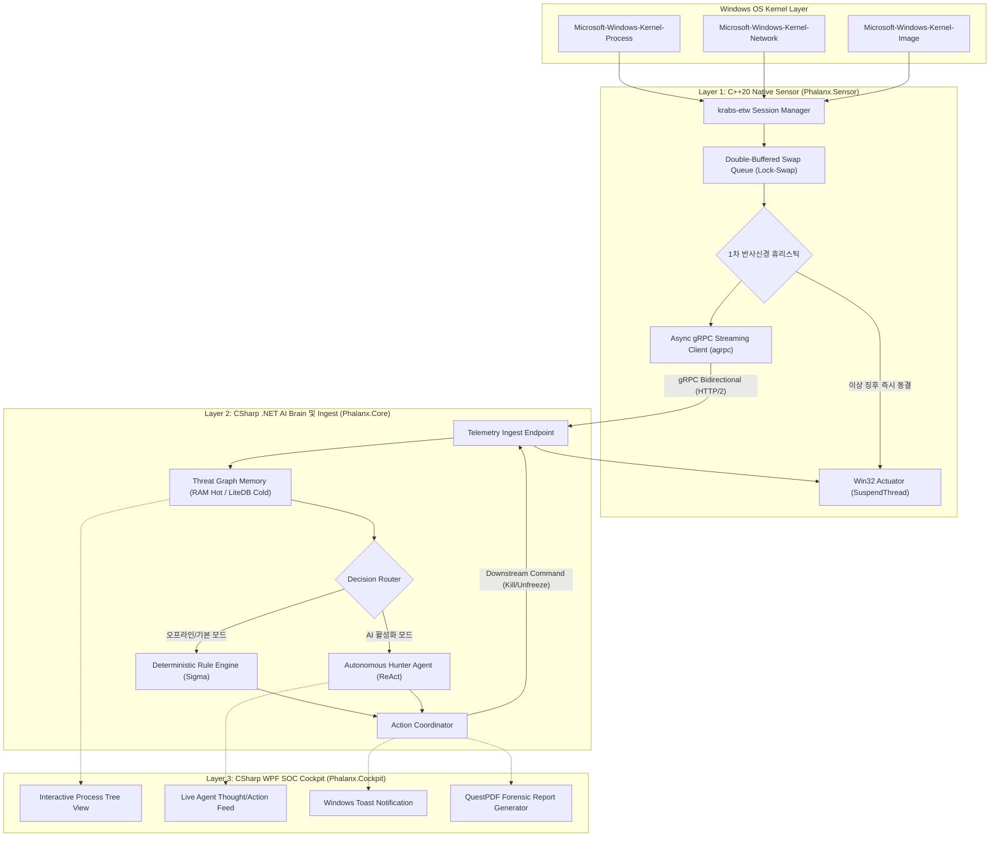

# Phalanx System Architecture & Pipeline Specification

본 문서는 `Phalanx` EDR 시스템을 구성하는 **C++ 고성능 센서(Sensor)**, **gRPC 양방향 통신 계층**, **C# AI 대뇌 코어(Core)**, 그리고 **WPF 관제 콘솔(Cockpit)**의 기술적 결합 구조와 세부 구현 명세를 정의합니다.

---

## 1. 계층형 시스템 토폴로지 (System Topology)

시스템은 OS 커널과 접점을 가지는 네이티브 수집 엔진과 고차원 인지/관제를 담당하는 관리 계층으로 이원화 분리되어 동작합니다.



---

## 2. C++ 센서 계층 상세 설계 (`Phalanx.Sensor`)

### A. ETW 텔레메트리 세션 관리 (`krabs-etw`)
* 순수 Win32 `OpenTrace` / `ProcessTrace` API의 복잡한 C 포인터 캐스팅 오버헤드를 배제하고, 마이크로소프트의 모던 C++ 라이브러리인 `krabs-etw`를 사용하여 안정적인 유저모드 트레이스 세션을 구동합니다.
* **구독 프로바이더 및 캡처 필드**:
  1. `Kernel-Process`: ProcessID, ParentProcessID, ImageFileName, CommandLine, SessionID, TokenElevationType.
  2. `Kernel-Network`: ProcessID, LocalAddress, RemoteAddress, LocalPort, RemotePort, Protocol.
  3. `Kernel-Image`: ProcessID, ImageBase, ImageSize, FileName.

### B. 더블 버퍼드 락-스왑 큐 (Double-Buffered Lock-Swap Ingestion)
초당 수만 개에 달하는 커널 이벤트 폭주 시 수집 스레드가 락(Lock)에 의해 블로킹되어 이벤트가 드롭되는 문제를 원천 차단하며, 힙 메모리 파편화(Heap Fragmentation)를 방지하기 위해 **사전 할당된 2개의 고정 용량 버퍼 간 포인터 스왑(Pointer Swap)** 방식으로 구동합니다.

```cpp
template <typename T, size_t InitialCapacity = 8192>
class DoubleBufferedSwapQueue {
public:
    DoubleBufferedSwapQueue() {
        buffer_a_.reserve(InitialCapacity);
        buffer_b_.reserve(InitialCapacity);
        write_buffer_ = &buffer_a_;
        read_buffer_ = &buffer_b_;
    }

    void Push(T&& item) {
        std::lock_guard<std::mutex> lock(write_lock_);
        // 메모리 상한선(Safety Cap) 초과 시 오래된 이벤트 드롭 또는 링버퍼 오버라이트 방어
        if (write_buffer_->size() < InitialCapacity * 4) {
            write_buffer_->push_back(std::move(item));
        }
    }

    // 힙 재할당 없이 포인터만 맞교환 (Zero Dynamic Heap Allocation)
    std::vector<T>* SwapAndFlush() {
        std::lock_guard<std::mutex> lock(write_lock_);
        std::swap(write_buffer_, read_buffer_);
        read_buffer_->clear(); // 이전 소비 완료된 버퍼 초기화 (Capacity 유지)
        return write_buffer_;  // 워커 스레드가 락 없이 일괄 소비할 버퍼 반환
    }

private:
    std::mutex write_lock_;
    std::vector<T> buffer_a_;
    std::vector<T> buffer_b_;
    std::vector<T>* write_buffer_{nullptr};
    std::vector<T>* read_buffer_{nullptr};
};
```
* **동작 주기**: ETW 콜백 스레드는 오직 `Push`만 수행(지연 시간 1μs 미만)하며, 센서 메인 루프 워커가 10ms(100Hz) 주기로 버퍼 포인터만 교체(Swap)하여 일괄 직렬화 및 필터링을 수행합니다.

### C. 1차 반사신경 엔진 및 스레드 동결 (Freeze Mechanism & Execution Window)
* **ETW 비동기 특성과 방어 윈도우 (Early Execution Window)**:
  * 커널 드라이버(`PsSetCreateProcessNotifyRoutineEx`)와 달리 ETW는 비동기 유저모드 통지 메커니즘입니다. 따라서 프로세스 생성 전 완벽한 사전 차단(Pre-execution Block)이 아니라, 스크립트 엔진(`powershell.exe`, `wscript.exe`)이 런타임/CLR을 초기화하는 **수십~수백 ms의 초기 기동 구간(Warm-up Window) 내에 스레드를 동결(Early Execution Interruption)**하는 방식을 취합니다.
* **스레드 ID 식별 및 동결 절차**:
  1. `Kernel-Process` ETW 이벤트는 프로세스 생성 시점에 `ProcessID`를 전달하지만 메인 스레드 ID는 누락되어 있습니다.
  2. 위험 체인 패턴(`winword.exe` ➔ `powershell.exe`) 감지 즉시, `CreateToolhelp32Snapshot(TH32CS_SNAPTHREAD, 0)` 및 `Thread32First`/`Thread32Next`를 호출하여 해당 `th32OwnerProcessID == target_pid`인 메인 스레드 ID를 고속 열거합니다.
  3. 타깃 스레드 핸들을 `OpenThread(THREAD_SUSPEND_RESUME, FALSE, tid)`로 획득한 후 `SuspendThread`를 호출하여 실행을 즉시 정지(Freeze)시킵니다.
* 동결 완료 플래그(`is_suspended = true`)를 포함한 텔레메트리를 gRPC를 통해 상위 계층으로 발송합니다.

---

## 3. 통신 프로토콜 스키마 (`phalanx.proto`)

센서와 코어 간의 모든 통신은 Protocol Buffers v3로 엄격히 직렬화됩니다.

```protobuf
syntax = "proto3";
package phalanx;

// 텔레메트리 이벤트 타입
message ProcessEvent {
    uint32 process_id = 1;
    uint32 parent_process_id = 2;
    string image_name = 3;
    string command_line = 4;
    uint64 timestamp_ns = 5;
    bool is_suspended = 6;
    uint32 session_id = 7;
    uint32 token_elevation_type = 8;
}

message NetworkEvent {
    uint32 process_id = 1;
    string source_address = 2;
    uint32 source_port = 3;
    string destination_address = 4;
    uint32 destination_port = 5;
    string protocol = 6;
    uint64 timestamp_ns = 7;
}

message ImageEvent {
    uint32 process_id = 1;
    uint64 image_base = 2;
    uint64 image_size = 3;
    string file_name = 4;
    uint64 timestamp_ns = 5;
}

message TelemetryBatch {
    repeated ProcessEvent process_events = 1;
    repeated NetworkEvent network_events = 2;
    repeated ImageEvent image_events = 3;
}

// C# 대뇌에서 하달하는 방어 명령
message MitigationCommand {
    enum ActionType {
        ACTION_KILL = 0;
        ACTION_RESUME = 1;      // 스레드 동결 해제 (Unfreeze)
        ACTION_BLOCK_IP = 2;    // 센서 레벨 패킷 차단 또는 코어 방화벽 연동
    }
    ActionType action = 1;
    uint32 target_pid = 2;
    string target_ip = 3;
    string reason = 4;
}

service PhalanxService {
    // 센서 <-> 코어: 실시간 양방향 텔레메트리 스트리밍 및 방어 명령 실시간 하달
    rpc StreamTelemetry(stream TelemetryBatch) returns (stream MitigationCommand);
}
```

---

## 4. C# 코어 계층 상세 설계 (`Phalanx.Core`)

### A. 인과 행위 그래프 (Threat Graph Memory)
* `LiteDB`를 임베디드 백엔드로 채택하여 수신된 프로세스 및 네트워크 이벤트를 Directed Acyclic Graph (DAG) 형태로 매핑합니다.
* **노드 속성**: `PID`, `PPID`, `ImageHash`, `CommandLine`, `CreationTime`, `MitreTags`.
* **엣지 속성**: `Spawns`, `ConnectsTo`, `ModifiesFile`.
* 부모-자식 트리 역추적을 통해 루트 진입점(Initial Access, 예: 메일 클라이언트 또는 웹 브라우저)을 O(h) 복잡도로 신속하게 규명합니다.

### B. 이중화 디시전 라우터 (Decision Router)
* **결정론적 룰 엔진 (Deterministic Engine)**:
  * 명확한 시그니처 및 Sigma 룰 조건 매칭 시 외부 API 호출 없이 즉시 `ACTION_KILL` 명령을 생성.
* **자율 AI 에이전트 (Autonomous Agent)**:
  * 모호한 회색지대(Unknown / Heuristic Score 경계치) 이벤트 감지 시 활성화되어 ReAct 루프를 가동 (세부 사양은 [02_ai_agent_investigation_design.md](./02_ai_agent_investigation_design.md) 참조).

---

## 5. C# WPF 관제 콘솔 (`Phalanx.Cockpit`)

* **프레임워크**: `.NET 8/9`, `CommunityToolkit.Mvvm`, `ModernWpfUI`.
* **프로세스 트리 시각화 Canvas**:
  * 부모-자식 프로세스 관계를 실시간 노드 그래프로 렌더링.
  * 안전 프로세스(초록), 조사 중 프로세스(주황 펄스 애니메이션), 차단 완료 프로세스(빨강 및 KILLED 배지) 상태 가시화.
* **실시간 AI 사고 스트리밍 패널**:
  * 에이전트의 사고(`Thought`)와 도구 호출(`Action`) 및 결과(`Observation`)를 실시간 타이핑 효과와 함께 터미널 피드로 출력.
* **QuestPDF 포렌식 리포트 엔진**:
  * 버튼 1회 클릭으로 침해 일시, 공격 유입 다이어그램, 증거 데이터, MITRE 기법 분석, 대응 조치 내역을 포함하는 상용 등급 A4 PDF 포렌식 리포트 출력.
