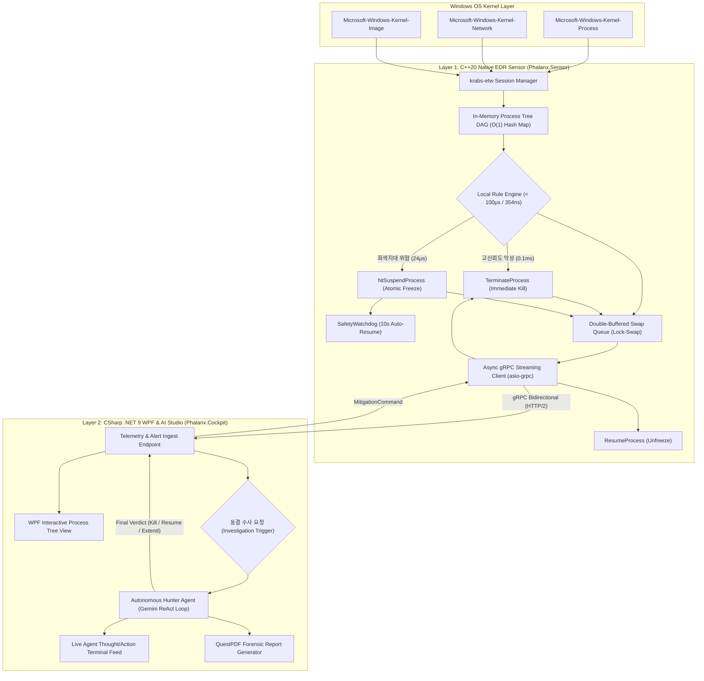
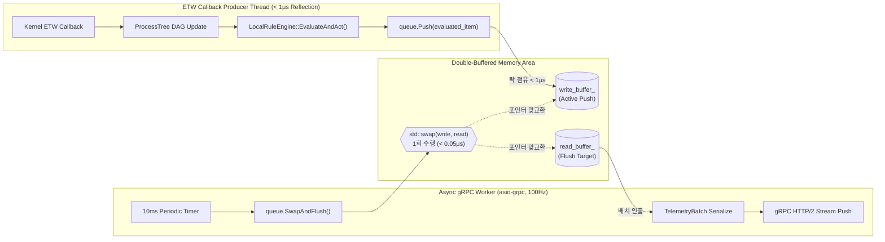

# Phalanx System Architecture & Pipeline Specification
> **부제**: Phalanx 2계층 EDR 시스템 아키텍처 및 동시성 파이프라인 명세

본 문서는 `Phalanx` EDR 시스템을 구성하는 **C++20 네이티브 실시간 탐지/방어 센서(`Phalanx.Sensor`)**, **gRPC 양방향 비동기 통신 계층**, 그리고 **C# .NET 9 AI 관제 콘솔(`Phalanx.Cockpit`)**의 기술적 결합 구조, 동시성 스레드 모델 및 세부 구현 명세를 정의합니다.

---

## 1. 2계층 시스템 토폴로지 (Two-Tier Architecture)

Phalanx는 불필요한 다계층 복잡성을 배제하고, **C++ 네이티브 실시간 탐지/방어 센서(Layer 1)**와 **C# AI 오케스트레이션 및 관제 콘솔(Layer 2)**의 명확한 2계층 구조로 동작합니다.



### 컴포넌트별 전담 역할 및 소스 구현체

| 계층 | 컴포넌트 | 핵심 구현체 소스 링크 | 전담 역할 및 성능 SLA |
| :--- | :--- | :--- | :--- |
| **Layer 1** | **ETW 세션 관리자** | [EtwKernelCollector.h](../../../Phalanx/src/Phalanx.Sensor/Collector/EtwKernelCollector.h) | `krabs-etw` 기반 무중단 유저모드 커널 이벤트 수집 (Zero BSOD) |
| **Layer 1** | **더블 버퍼 락-스왑 큐** | [DoubleBufferedSwapQueue.h](../../../Phalanx/src/Phalanx.Sensor/Queue/DoubleBufferedSwapQueue.h) | 100만 건 무손실, 생산자 락 점유 < 1μs, 10ms 주기 포인터 스왑 |
| **Layer 1** | **인메모리 프로세스 트리** | [ProcessTree.h](../../../Phalanx/src/Phalanx.Sensor/Process/ProcessTree.h) | `std::unordered_map` 기반 O(1) DAG 유지, 족보 역추적 0.436μs |
| **Layer 1** | **초고속 로컬 룰 엔진** | [LocalRuleEngine.h](../../../Phalanx/src/Phalanx.Sensor/Rules/LocalRuleEngine.h) | 비할당 `string_view` 기반 0.354μs (초당 257만 건) 결정론적 룰 평가 |
| **Layer 1** | **프로세스 제어 액추에이터** | [ProcessActuator.h](../../../Phalanx/src/Phalanx.Sensor/Actuator/ProcessActuator.h) | 0.1ms 현장 사살(`TerminateProcess`) 및 24μs 원자적 동결(`NtSuspendProcess`) |
| **Layer 1** | **세이프티 워치독** | [SafetyWatchdog.h](../../../Phalanx/src/Phalanx.Sensor/Actuator/SafetyWatchdog.h) | 기본 10초 타임아웃, AI 수사 시 +50초 1회 연장 가드, 만료 시 자동 복구 |
| **Layer 1** | **비동기 gRPC 클라이언트** | [GrpcStreamClient.h](../../../Phalanx/src/Phalanx.Sensor/Ipc/GrpcStreamClient.h) | `asio-grpc` 기반 단방향 텔레메트리 스트리밍 및 대응 명령 수신 |
| **Layer 2** | **gRPC 수신 서비스** | [PhalanxGrpcService.cs](../../../Phalanx/src/Phalanx.Cockpit/Services/PhalanxGrpcService.cs) | Kestrel HTTP/2 기반 텔레메트리 배치 수신 및 양방향 대응 명령 스트림 |
| **Layer 2** | **CQRS 트리 프로젝션** | [ProcessTreeProjectionManager.cs](../../../Phalanx/src/Phalanx.Cockpit/CQRS/ProcessTreeProjectionManager.cs) | C++ 덤프 및 델타 이벤트 기반 C# 로컬 RAM 완전 복제본 DAG 유지 (0초 족보 조회) |
| **Layer 2** | **자율 AI 위협 헌터** | [AutonomousHunterAgent.cs](../../../Phalanx/src/Phalanx.Cockpit/Agent/AutonomousHunterAgent.cs) | Gemini 3.7 Flash ReAct 루프 기반 5대 OS 도구 자율 호출 및 최종 판결 |
| **Layer 2** | **포렌식 아카이브 매니저** | [ForensicArchiveManager.cs](../../../Phalanx/src/Phalanx.Cockpit/Storage/ForensicArchiveManager.cs) | 임베디드 `LiteDB 5.0.21` 기반 침해사고 영구 보존 및 서사 관리 |

---

## 2. C++ 네이티브 센서 동시성 모델 (`Phalanx.Sensor`)

`[IMPLEMENTED]` C++ 센서는 고주파 커널 인터럽트와 네트워크/연산 병목을 완벽히 분리하기 위해 **3대 전담 스레드 파이프라인**으로 구동됩니다.



### A. 더블 버퍼 락-스왑(Double-Buffered Lock-Swap) 동시성 불변식
* **생산자 스레드의 동기식 반사신경 및 비블로킹 푸시**:
  * ETW 콜백 스레드는 커널 이벤트 수신 즉시 인메모리 프로세스 트리를 갱신하고 `LocalRuleEngine::EvaluateAndAct`를 동기식으로 실행하여 현장 사살(0.1ms) 또는 선제 동결(24μs)을 즉각 집행합니다.
  * 조치가 완료된 후 평가 플래그(`is_suspended`, `is_terminated`)가 태깅된 이벤트를 활성 쓰기 버퍼(`write_buffer_`)에 푸시하며, 뮤텍스 락 점유 시간은 **1마이크로초 미만(실측 < 0.05μs)**으로 제한됩니다.
* **비동기 100Hz 무할당 포인터 스왑 (O(1) Pointer Swap)**:
  * `asio-grpc` 워커 스레드는 10ms(100Hz) 타이머 주기로 두 버퍼의 포인터만 맞교환(`std::swap`)한 후, 새로 쓰여질 버퍼를 `clear()`하되 기할당된 용량(`reserve(InitialCapacity)`)은 유지합니다.
  * 힙 메모리 재할당(Heap Allocation) 오버헤드가 발생하지 않아 초당 수만 건의 버스트 상황에서도 **유실률 0.0%**를 보증합니다 ([04_performance_benchmarks.md](./04_performance_benchmarks.md) 실측치 참조).
* **센서의 3대 전담 스레드 구성**:
  1. **ETW 콜백 및 실시간 룰 집행 스레드**: 유저모드 ETW 수집, 0.436μs 족보 탐색, 0.354μs 로컬 룰 판정, 24μs 원자적 동결 집행 및 큐 `Push`.
  2. **asio-grpc I/O 및 100Hz 스트리밍 스레드**: 10ms 주기 `SwapAndFlush`, `TelemetryBatch` 직렬화, HTTP/2 양방향 스트리밍 송수신.
  3. **SafetyWatchdog 백그라운드 감시 스레드**: 200ms 주기(5Hz) 만료 시한 검사 루프, 데드락 방지 10s/50s 타이머 관리 및 만료 시 자동 복구(Auto-Resume).
* **상세 구현 참조**: [DoubleBufferedSwapQueue.h](../../../Phalanx/src/Phalanx.Sensor/Queue/DoubleBufferedSwapQueue.h), [EtwKernelCollector.cpp](../../../Phalanx/src/Phalanx.Sensor/Collector/EtwKernelCollector.cpp), [GrpcStreamClient.cpp](../../../Phalanx/src/Phalanx.Sensor/Ipc/GrpcStreamClient.cpp)

### B. 인메모리 프로세스 트리(DAG) 및 로컬 룰 엔진
* **인메모리 프로세스 트리 ([ProcessTree.h](../../../Phalanx/src/Phalanx.Sensor/Process/ProcessTree.h))**:
  * `std::unordered_map<uint32_t, ProcessNode>`를 통해 활성 프로세스의 부모-자식 관계망을 C++ RAM 상에 유지합니다.
  * 기동 시 `InitializeFromSnapshot()`으로 335개 OS 프로세스를 사전 웜업 적재하고, PID 재사용 방어 및 10,000개 Tombstone 상한으로 메모리를 30MB 이내로 엄격히 통제합니다.
  * 부모 프로세스의 족보 역추적(`GetAncestry`)을 **실측 0.436μs (< 10μs 기준 통과)** 만에 즉시 완료합니다.
* **로컬 룰 판정 (< 100μs / [LocalRuleEngine.h](../../../Phalanx/src/Phalanx.Sensor/Rules/LocalRuleEngine.h))**:
  * 힙 메모리 할당이 없는 `std::string_view`와 고속 ASCII 대소문자 무시 비교(< 20ns)를 통해 룰을 평가합니다.
  * 50,000회 연속 평가 실측 결과 **평균 0.354μs (초당 257만 건 처리, P99 0.7μs)**를 기록하여 요구 기준(100μs) 대비 280배 고속 판정을 달성했습니다.
* **이원화 즉각 조치 (Dual Mitigation Actuator / [ProcessActuator.h](../../../Phalanx/src/Phalanx.Sensor/Actuator/ProcessActuator.h))**:
  1. **고신뢰도 악성 사살 (Immediate Kill, 0.1ms)**: 볼륨 섀도 복사본 삭제(`vssadmin.exe delete shadows`) 등 확정적 악성 행위 감지 시 `TerminateProcess`를 현장에서 즉각 집행합니다 (`is_terminated = true`).
  2. **회색지대 선제 동결 (Atomic Suspend, 24μs)**: 오피스/브라우저의 스크립트 실행기 스폰 등 LOLBAS 행위 감지 시 `ntdll!NtSuspendProcess`를 동적 호출하여 **24~27μs** 만에 프로세스 전체를 원자적으로 동결합니다. 타깃 RAM을 보존한 후 세이프티 워치독(10초)을 가동하고 C# AI 관제기에 수사를 의뢰합니다 (`is_suspended = true`).

---

## 3. 실시간 침해 수사 폐루프 시퀀스 (Closed-Loop Defense Flow)

`[IMPLEMENTED]` C++ 센서의 24μs 원자적 선제 동결부터 C# AI 에이전트의 멀티턴 ReAct 수사, 워치독 SLA 연장, 그리고 현장 사살 명령 하달까지의 완전한 닫힌 루프(Closed-Loop) 시퀀스입니다.

```mermaid
sequenceDiagram
    autonumber
    participant Kernel as "Windows OS 커널"
    participant Sensor as "C++ Sensor (LocalRuleEngine)"
    participant Watchdog as "SafetyWatchdog (10s/50s)"
    participant Grpc as "gRPC 스트림 (HTTP/2)"
    participant Cockpit as "C# Cockpit (ProcessTree CQRS)"
    participant AI as "Autonomous Hunter (Gemini 3.7 Flash)"

    Kernel->>Sensor: ProcessStart 이벤트 (winword.exe ➔ powershell.exe)
    Note over Sensor: 로컬 룰 엔진 평가 (0.354μs) ➔ 회색지대 위협 판정
    Sensor->>Kernel: ntdll!NtSuspendProcess (24μs 원자적 동결 집행)
    Sensor->>Watchdog: RegisterSuspended(PID, 10,000ms 기본 타임아웃 등록)
    Sensor->>Grpc: StreamTelemetry (ProcessEvent: is_suspended=true)

    Grpc->>Cockpit: 델타 이벤트 수신 및 CQRS 로컬 메모리 노드 투영
    Cockpit->>AI: 동결 프로세스 수사 태스크 트리거 (InvestigateAsync)

    rect rgb(30, 45, 60)
        Note over AI, Grpc: [SLA 연장] LLM 심층 수사 진입 시 선제 예산 확보
        AI->>Grpc: MitigationCommand (ACTION_EXTEND_TIMEOUT, +50초)
        Grpc->>Sensor: 명령 수신 ➔ Watchdog.ExtendTimeout(PID, 50,000ms)
        Note over Watchdog: 만료 시한 60초로 갱신 (1회 한정 연장 가드 작동)
    end

    rect rgb(20, 40, 30)
        Note over AI, Cockpit: [ReAct 자율 조사 루프 (최대 5턴)]
        AI->>Cockpit: 0초 로컬 족보 문맥 조회 (Ancestry: winword ➔ powershell)
        AI->>AI: Turn 1: DecodePayloadTool 호출 (Base64 인자 해독)
        AI->>AI: Turn 2: ProcessMemoryScanTool / ThreatReputationTool (C2 IP 확인)
        AI->>AI: Turn 3: 위협 확신도 90% 이상 도출 ➔ ACTION_KILL 최종 확정
    end

    AI->>Grpc: MitigationCommand (ACTION_KILL, target_pid, reason)
    Grpc->>Sensor: 사살 명령 인입 ➔ Watchdog.Deregister(PID)
    Sensor->>Kernel: TerminateProcess (0.1ms 현장 사살 완료)
    Sensor-->>Grpc: TelemetryBatch (LIFECYCLE_TERMINATED)
    Cockpit->>Cockpit: WPF Canvas 사살 상태 반영 및 QuestPDF 리포트 생성
```



---

## 4. 프로세스 트리 상태 동기화 및 통신 프로토콜 (`phalanx.proto`)

### A. CQRS 기반 하이브리드 프로젝션 (Process Tree Synchronization)

Phalanx는 고성능 엔드포인트 보안 시스템의 정형적 패턴인 **CQRS(Command Query Responsibility Segregation) 하이브리드 프로젝션** 모델을 채택합니다.

```
[ C++ 네이티브 엔진 (Command Master) ]
  • 역할: 100μs 룰 평가, 0.1ms 사살, 24μs 원자적 동결을 집행하는 실시간 상태 단일 원본(SSOT).
  • 특징: C# 관제기의 읽기 질의(RPC Query)를 원천 배제하여 rw_lock_ 경합을 차단하고 10,000개 Tombstone 상한으로 메모리를 바운딩.
        │
        ▼ (비동기 gRPC 단방향 스트림: 최초 스냅샷 1회 덤프 + 실시간 생명주기 델타 이벤트)
[ C# 관제 콘솔 (Query Projection) ]
  • 역할: 60FPS 인터랙티브 WPF 캔버스 렌더링 및 Gemini ReAct AI 헌터의 심층 족보 수사용 읽기 모델(Read Model).
  • 특징: C++이 푸시하는 이벤트를 수신하여 로컬 RAM에 완전한 프로세스 트리 DAG를 실시간 투영. C++로의 역질의 없이 로컬 0초 족보 탐색.
```

1. **초기 스냅샷 핸드셰이크 (Snapshot Handshake)**:
   * C# 관제기가 gRPC 스트림에 접속할 때, C++ `ProcessTree`에 캐싱된 현재 OS 활성 프로세스(약 330~400개)를 `LIFECYCLE_SNAPSHOT` 배치로 1회 일괄 전송하여 C# 메모리에 기저 트리를 즉각 완성합니다.
2. **실시간 생명주기 델타 스트리밍 (Lifecycle Delta Streaming)**:
   * 프로세스 생성(`LIFECYCLE_START`), 종료(`LIFECYCLE_STOP`), 선제 동결(`LIFECYCLE_SUSPENDED`), 즉각 사살(`LIFECYCLE_TERMINATED`) 이벤트를 실시간으로 C#에 스트리밍하여 로컬 트리의 노드를 갱신합니다.
3. **PID 재사용 방지를 위한 `ProcessGuid` 체계**:
   * Windows 환경의 빠른 PID 재할당으로 인한 부모-자식 노드 뒤엉킴을 방지하기 위해, C++ 엔진은 프로세스 생성 시점에 `(start_time_ns << 32) | pid` 조합의 전역 고유 식별자(`process_guid`)를 발급하여 모든 이벤트에 태깅합니다.

### B. 프로토콜 버퍼 스키마 명세 (`phalanx.proto`)

`[IMPLEMENTED]` 센서/엔진과 관제 콘솔 간의 통신은 [phalanx.proto](../../../Phalanx/proto/phalanx.proto) 규격으로 직렬화됩니다.

```protobuf
syntax = "proto3";

package phalanx;

option csharp_namespace = "Phalanx.Shared.Protos";

// 프로세스 생명주기 상태 구분
enum ProcessLifecycle {
    LIFECYCLE_UNKNOWN = 0;
    LIFECYCLE_SNAPSHOT = 1;     // 엔진 기동/재연결 시 기존 프로세스 일괄 주입
    LIFECYCLE_START = 2;        // 신규 프로세스 생성 (ProcessStart)
    LIFECYCLE_STOP = 3;         // 프로세스 정상 종료 (ProcessStop)
    LIFECYCLE_SUSPENDED = 4;    // 24μs 원자적 동결 집행 완료
    LIFECYCLE_TERMINATED = 5;   // 0.1ms 현장 사살 완료
}

// 프로세스 생명주기 이벤트
message ProcessEvent {
    uint32 process_id = 1;
    uint32 parent_process_id = 2;
    string image_name = 3;
    string command_line = 4;
    uint64 timestamp_ns = 5;
    bool is_suspended = 6;
    uint32 session_id = 7;
    uint32 token_elevation_type = 8;
    bool is_terminated = 9;
    ProcessLifecycle lifecycle = 10;
    uint64 process_guid = 11;        // PID 재사용 방지용 전역 고유 ID
    uint64 parent_process_guid = 12; // 부모 고유 ID
    uint64 exit_code = 13;           // LIFECYCLE_STOP 시 프로세스 종료 코드
}

// 네트워크 연결 이벤트
message NetworkEvent {
    uint32 process_id = 1;
    string source_address = 2;
    uint32 source_port = 3;
    string destination_address = 4;
    uint32 destination_port = 5;
    string protocol = 6;
    uint64 timestamp_ns = 7;
}

// 모듈 / DLL 로드 이벤트
message ImageEvent {
    uint32 process_id = 1;
    uint64 image_base = 2;
    uint64 image_size = 3;
    string file_name = 4;
    uint64 timestamp_ns = 5;
}

// 무손실 스트리밍을 위한 배치 컨테이너
message TelemetryBatch {
    repeated ProcessEvent process_events = 1;
    repeated NetworkEvent network_events = 2;
    repeated ImageEvent image_events = 3;
}

// C# 코어 관제 콘솔에서 하달되는 위협 완화 및 대응 명령
message MitigationCommand {
    enum ActionType {
        ACTION_KILL = 0;            // 악성 프로세스 즉각 강제 사살
        ACTION_RESUME = 1;          // 동결된 프로세스/스레드 복구 (동결 해제)
        ACTION_BLOCK_IP = 2;        // 네트워크 IP 격리 차단
        ACTION_EXTEND_TIMEOUT = 3;  // AI 심층 조사를 위한 1회성 타임아웃 연장 (+50초, 최대 1회 제한)
        ACTION_SUSPEND = 4;         // AI 심층 조사를 위한 타깃 프로세스 원자적 동결 (메모리 보존)
    }
    ActionType action = 1;
    uint32 target_pid = 2;
    string target_ip = 3;
    string reason = 4;
}

// 양방향 스트리밍 텔레메트리 gRPC 서비스
service PhalanxService {
    rpc StreamTelemetry(stream TelemetryBatch) returns (stream MitigationCommand);
}
```

---

## 5. C# WPF 관제 콘솔 및 AI 스튜디오 (`Phalanx.Cockpit`)

### A. WPF 관제 대시보드 (Modern SOC Cockpit)
* **프레임워크**: `.NET 9.0`, `CommunityToolkit.Mvvm`, `ModernWpfUI` 다크 테마.
* **CQRS 로컬 트리 프로젝션 ([ProcessTreeProjectionManager.cs](../../../Phalanx/src/Phalanx.Cockpit/CQRS/ProcessTreeProjectionManager.cs))**:
  * C++ 엔진에서 수신한 초기 스냅샷 및 생명주기 델타 이벤트를 바탕으로 C# 로컬 RAM 상에 완전한 `ObservableCollection` 기반 프로세스 트리 DAG를 실시간 유지합니다.
  * C++로의 추가 쿼리(RPC) 없이 로컬 메모리에서 즉시 족보를 순회하여 WPF Canvas 60FPS 렌더링 및 Gemini AI 에이전트의 0초 족보 조회를 지원합니다.
* **인터랙티브 프로세스 트리 Canvas**:
  * 안전 프로세스(초록), 동결 수사 중 프로세스(파랑 펄스 애니메이션), 사살 완료 프로세스(빨강 및 `[KILLED]` 배지), 정상 종료 프로세스(회색 톰스톤) 상태 가시화.

### B. 자율 AI 위협 헌터 ([AutonomousHunterAgent.cs](../../../Phalanx/src/Phalanx.Cockpit/Agent/AutonomousHunterAgent.cs))
* **ReAct 추론 루프**:
  * C++ 엔진에서 회색지대 위협(`is_suspended = true`)이 인입되는 순간에만 활성화됩니다 (평상시 API 비용 0원).
  * **Gemini 3.7 Flash** (`gemini-3.7-flash`) 기반의 ReAct(Thought ➔ Action ➔ Observation) 루프를 통해 5대 OS 도구를 직접 호출합니다.
* **상용 1티어 5대 OS 수사 도구 (Tools)**:
  1. `DecodePayloadTool`: [DecodePayloadTool.cs](../../../Phalanx/src/Phalanx.Cockpit/Tools/DecodePayloadTool.cs) - Base64, Hex, Gzip 압축 다단계 난독화 인자 재귀적 디코딩.
  2. `ProcessMemoryScanTool`: [ProcessMemoryScanTool.cs](../../../Phalanx/src/Phalanx.Cockpit/Tools/ProcessMemoryScanTool.cs) - 동결된 타깃 RAM 가상 메모리(`ReadProcessMemory`) 정규식/C2 도메인 스캔.
  3. `ThreatReputationTool`: [ThreatReputationTool.cs](../../../Phalanx/src/Phalanx.Cockpit/Tools/ThreatReputationTool.cs) - 로컬 내장 위협 DB 및 IP/도메인 평판 조회.
  4. `MitreClassifierTool`: [MitreClassifierTool.cs](../../../Phalanx/src/Phalanx.Cockpit/Tools/MitreClassifierTool.cs) - 관찰된 행위를 MITRE ATT&CK Matrix 기법(ID)으로 자동 매핑.
  5. `SystemFirewallTool`: [SystemFirewallTool.cs](../../../Phalanx/src/Phalanx.Cockpit/Tools/SystemFirewallTool.cs) - 식별된 C2 IP에 대한 Windows 방화벽(Netsh) 인/아웃바운드 즉시 차단.
* **판결 집행**:
  * 수사 결과 악성 확신도 90% 이상 시 `ACTION_KILL` 하달.
  * 정상 관리자 작업 확인 시 `ACTION_RESUME` 하달 (오탐 복구).

### C. 포렌식 인과 저장소 및 리포트 엔진
* **LiteDB 아카이브 ([ForensicArchiveManager.cs](../../../Phalanx/src/Phalanx.Cockpit/Storage/ForensicArchiveManager.cs))**:
  * 종결된 사건의 침해사고 서사(JSON), AI 사고 추적 로그(Thought/Action Traces), 대응 내역을 임베디드 `LiteDB 5.0.21`에 영구 보관합니다.
* **QuestPDF 리포트 엔진**:
  * AI 수사 완료 시, 침해 일시, 공격 체인 다이어그램, 발견된 C2 IoC, MITRE 매핑, 대응 조치 내역을 포함하는 상용 등급 **A4 1장 벡터 PDF 리포트**를 1초 이내에 자동 렌더링합니다.
