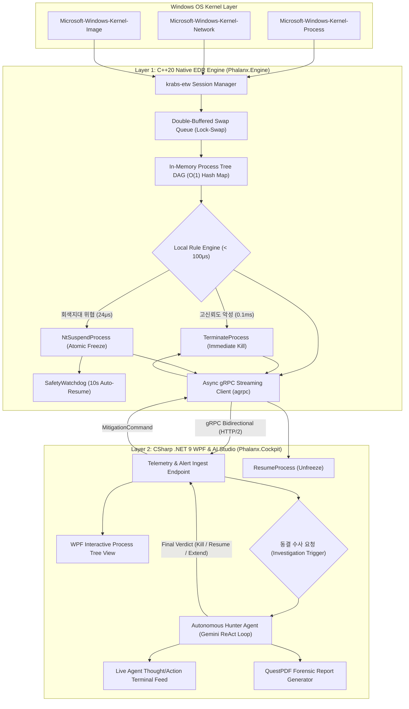

# Phalanx System Architecture & Pipeline Specification

본 문서는 `Phalanx` EDR 시스템을 구성하는 **C++20 네이티브 실시간 탐지 엔진(`Phalanx.Engine`)**, **gRPC 비동기 통신 계층**, 그리고 **C# .NET 9 AI 관제 콘솔(`Phalanx.Cockpit`)**의 기술적 결합 구조와 세부 구현 명세를 정의합니다.

---

## 1. 2계층 시스템 토폴로지 (Two-Tier Architecture)

Phalanx는 인위적인 다계층 복잡성을 배제하고, **C++ 네이티브 실시간 탐지/방어 엔진(Layer 1)**과 **C# AI 오케스트레이션 및 관제 콘솔(Layer 2)**의 명확한 2계층 구조로 동작합니다.



---

## 2. C++ 네이티브 엔진 상세 설계 (`Phalanx.Engine`)

### A. ETW 텔레메트리 세션 관리 (`krabs-etw`)
* 순수 Win32 `OpenTrace` / `ProcessTrace` API의 복잡한 C 포인터 캐스팅 오버헤드를 배제하고, 마이크로소프트의 모던 C++ 라이브러리인 `krabs-etw`를 사용하여 안정적인 유저모드 트레이스 세션을 구동합니다.
* 커널 드라이버를 직접 작성하지 않고 커널이 제공하는 표준 ETW 파이프라인을 구독하므로 **커널 크래시(Zero BSOD Risk)**를 보장합니다.
* **구독 프로바이더 및 캡처 필드**:
  1. `Kernel-Process`: ProcessID, ParentProcessID, ImageFileName, CommandLine, SessionID, TokenElevationType.
  2. `Kernel-Network`: ProcessID, LocalAddress, RemoteAddress, LocalPort, RemotePort, Protocol.
  3. `Kernel-Image`: ProcessID, ImageBase, ImageSize, FileName.

### B. 더블 버퍼드 락-스왑 큐 (Double-Buffered Lock-Swap Ingestion)
초당 수만 개에 달하는 커널 이벤트 폭주 시 수집 스레드가 락(Lock)에 의해 블로킹되어 이벤트가 드롭되는 문제를 원천 차단하며, 힙 메모리 파편화(Heap Fragmentation)를 방지하기 위해 **사전 할당된 2개의 고정 용량 버퍼 간 포인터 스왑(Pointer Swap)** 방식으로 구동합니다.

```cpp
template <typename T, size_t InitialCapacity = 8192>
class DoubleBufferedSwapQueue {
public:
    DoubleBufferedSwapQueue() {
        buffer_a_.reserve(InitialCapacity);
        buffer_b_.reserve(InitialCapacity);
        write_buffer_ = &buffer_a_;
        read_buffer_ = &buffer_b_;
    }

    void Push(T&& item) {
        std::lock_guard<std::mutex> lock(write_lock_);
        if (write_buffer_->size() < InitialCapacity * 4) {
            write_buffer_->push_back(std::move(item));
        }
    }

    std::vector<T>* SwapAndFlush() {
        std::lock_guard<std::mutex> lock(write_lock_);
        std::swap(write_buffer_, read_buffer_);
        read_buffer_->clear();
        return write_buffer_;
    }

private:
    std::mutex write_lock_;
    std::vector<T> buffer_a_;
    std::vector<T> buffer_b_;
    std::vector<T>* write_buffer_{nullptr};
    std::vector<T>* read_buffer_{nullptr};
};
```
* **동작 특성**: ETW 콜백 스레드는 오직 `Push`만 수행(지연 시간 1μs 미만)하며, 락-스왑 워커가 10ms(100Hz) 주기로 버퍼 포인터만 맞교환하여 소비합니다.

### C. 인메모리 프로세스 트리 (In-Memory DAG) & 로컬 룰 엔진
* **인메모리 프로세스 트리**:
  * `std::unordered_map<uint32_t, ProcessNode>`를 통해 활성 프로세스의 부모-자식 관계망(DAG)을 C++ RAM 상에 유지합니다.
  * 신규 프로세스 생성 시 부모 프로세스의 실행 경로, 커맨드라인, 서명 정보를 **O(1) (1μs 미만)** 시간 복잡도로 즉시 역추적합니다.
* **로컬 룰 판정 (< 100μs)**:
  * C++ 인메모리 프로세스 트리 상에서 지연 없이 직접 규칙을 평가합니다:
    * **고신뢰도 악성 체인**: `excel.exe`, `winword.exe` ➔ `powershell.exe`, `cmd.exe` 및 인자에 `-enc`, `DownloadString` 포함.
    * **랜섬웨어 복구 파괴**: `vssadmin.exe delete shadows`, `bcdedit /set ignoreallfailures`.
    * **자격증명 탈취**: `comsvcs.dll MiniDump` (LSASS 덤프 시도).
* **이원화 즉각 조치 (Dual Mitigation Actuator)**:
  1. **고신뢰도 악성 사살 (Immediate Kill, 0.1ms)**: `TerminateProcess`를 호출하여 파워셸 CLR 런타임 웜업(150~250ms)의 1%도 안 되는 시점에 즉각 사살.
  2. **회색지대 선제 동결 (Atomic Suspend, 24μs)**: `ntdll!NtSuspendProcess`를 동적 호출하여 24μs 만에 프로세스 원자적 동결 집행 및 타깃 RAM 보존 ➔ 10초 `SafetyWatchdog` 가동 ➔ C# AI 에이전트에 수사 의뢰.

---

## 3. 통신 프로토콜 스키마 (`phalanx.proto`)

센서/엔진과 관제 콘솔 간의 통신은 Protocol Buffers v3로 엄격히 직렬화됩니다.

```protobuf
syntax = "proto3";

package phalanx;

option csharp_namespace = "Phalanx.Shared.Protos";

message ProcessEvent {
    uint32 process_id = 1;
    uint32 parent_process_id = 2;
    string image_name = 3;
    string command_line = 4;
    uint64 timestamp_ns = 5;
    bool is_suspended = 6;
    uint32 session_id = 7;
    uint32 token_elevation_type = 8;
}

message NetworkEvent {
    uint32 process_id = 1;
    string source_address = 2;
    uint32 source_port = 3;
    string destination_address = 4;
    uint32 destination_port = 5;
    string protocol = 6;
    uint64 timestamp_ns = 7;
}

message ImageEvent {
    uint32 process_id = 1;
    uint64 image_base = 2;
    uint64 image_size = 3;
    string file_name = 4;
    uint64 timestamp_ns = 5;
}

message TelemetryBatch {
    repeated ProcessEvent process_events = 1;
    repeated NetworkEvent network_events = 2;
    repeated ImageEvent image_events = 3;
}

message MitigationCommand {
    enum ActionType {
        ACTION_KILL = 0;
        ACTION_RESUME = 1;          // 스레드 동결 해제 (Unfreeze)
        ACTION_BLOCK_IP = 2;        // 네트워크 격리
        ACTION_EXTEND_TIMEOUT = 3;  // AI 심층 수사 진입 시 1회성 타임아웃 연장 (+10초, 최대 1회 엄격 제한)
        ACTION_SUSPEND = 4;         // AI 심층 수사를 위한 타깃 프로세스 원자적 동결 (메모리 보존)
    }
    ActionType action = 1;
    uint32 target_pid = 2;
    string target_ip = 3;
    string reason = 4;
}

service PhalanxService {
    rpc StreamTelemetry(stream TelemetryBatch) returns (stream MitigationCommand);
}
```

---

## 4. C# WPF 관제 콘솔 및 AI 스튜디오 (`Phalanx.Cockpit`)

### A. WPF 관제 대시보드 (Modern SOC Cockpit)
* **프레임워크**: `.NET 9`, `CommunityToolkit.Mvvm`, `ModernWpfUI` 다크 테마.
* **인터랙티브 프로세스 트리 Canvas**:
  * C++ 엔진에서 스트리밍되는 활성 프로세스 트리를 실시간 렌더링.
  * 안전 프로세스(초록), 동결 수사 중 프로세스(파랑 펄스 애니메이션), 사살 완료 프로세스(빨강 및 `[KILLED]` 배지) 상태 가시화.
* **토스트 알림 (Windows Notification)**:
  * 0.1ms 차단 발생 시 작업 표시줄에 토스트 알림 표시.

### B. 자율 AI 위협 헌터 (Autonomous Hunter Agent)
* **ReAct 추론 루프**:
  * C++ 엔진에서 회색지대 위협(`is_suspended = true`)이 인입되는 순간에만 활성화 (평상시 API 비용 0원).
  * Gemini 2.0 Flash 기반의 ReAct(Thought ➔ Action ➔ Observation) 루프를 통해 5대 OS 도구를 직접 호출.
* **5대 OS 수사 도구 (Tools)**:
  1. `DecodePayloadTool`: Base64, Hex 다단계 해독.
  2. `ProcessMemoryScanTool`: 동결된 타깃 RAM에서 C2 URL/IP 정규식 스캔.
  3. `ThreatReputationTool`: 로컬 악성 IoC 및 평판 조회.
  4. `MitreClassifierTool`: MITRE ATT&CK TTP 매핑.
  5. `SystemFirewallTool`: 네트워크 방화벽 차단.
* **판결 집행**:
  * 수사 결과 악성 확신도 90% 이상 ➔ `ACTION_KILL` 하달.
  * 정상 관리자 작업 확인 시 ➔ `ACTION_RESUME` 하달 (오탐 복구).

### C. QuestPDF 침해사고 포렌식 리포트 엔진
* AI 수사 완료 시, 침해 일시, 공격 체인 다이어그램, 발견된 C2 IoC, MITRE 매핑, 대응 조치 내역을 포함하는 상용 등급 **A4 1장 벡터 PDF 리포트**를 1초 이내에 자동 렌더링하여 화면에 팝업.
