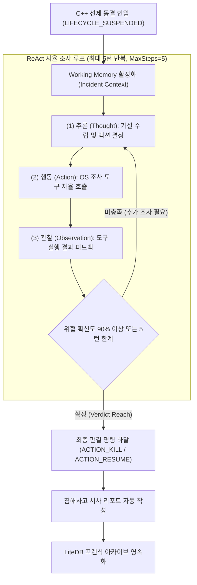
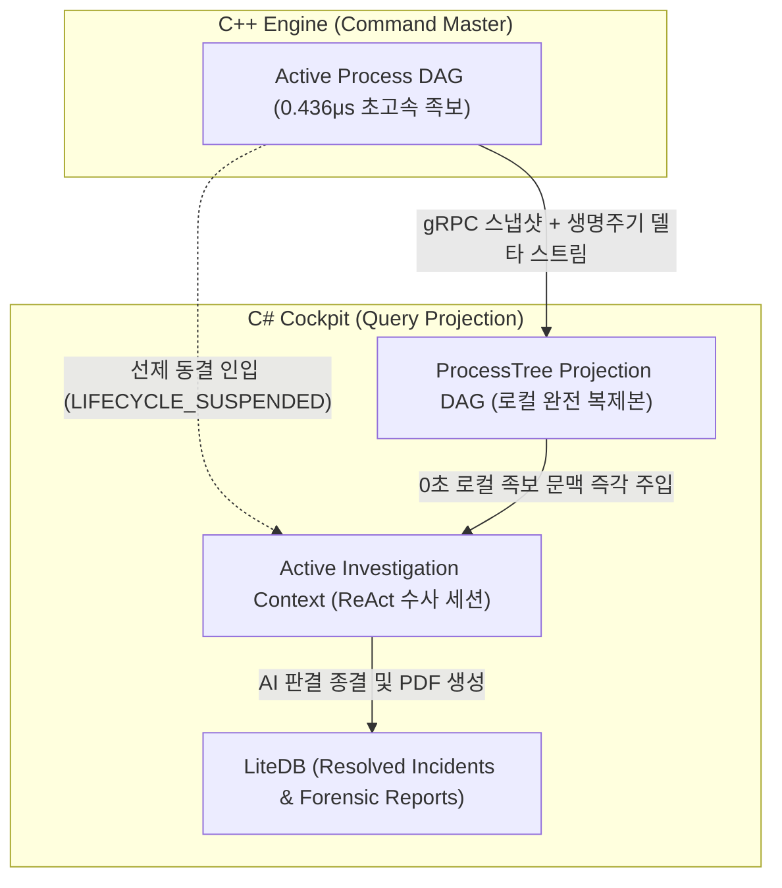

# Phalanx AI Agent Investigation & Reasoning Engine Specification

본 문서는 `Phalanx.Cockpit`에 내장된 **자율 위협 헌팅 에이전트(Autonomous Hunter Agent)**의 인지 모델, 도구 호출(Tool Calling) 생태계, ReAct 추론 파이프라인 및 침해사고 서사(Incident Narrative) 생성 메커니즘을 정의합니다.

---

## 1. 에이전트 인지 모델 (Cognitive Model)

Phalanx의 AI 에이전트는 단순한 텍스트 챗봇이 아니라, **운영체제 내부 상태를 직접 관찰하고 개입하는 자율 제어기(Autonomic Controller)**로 동작합니다.



---

## 2. ReAct 추론 파이프라인 상세

에이전트는 사건을 단편적으로 보지 않고, 가설-검증(Hypothesis-Testing) 루프를 자율적으로 순환합니다.

### A. 4단계 루프 단계 (ReAct Cycle)
1. **Thought (사고)**:
   * 입력된 프로세스 트리 및 명령줄 인자를 분석하여 잠재적 공격 기법(TTP)을 추론합니다.
   * *예: "winword.exe가 powershell.exe를 기동했으며 인자에 `-enc` 플래그가 포함됨. 인자 난독화 해독 및 메모리 조사가 필요함."*
2. **Action (도구 호출)**:
   * 정의된 `InvestigationTools` 중 가장 적합한 도구를 선정하여 인자(Argument)와 함께 호출합니다 (`is_final_verdict: false`).
3. **Observation (결과 관찰)**:
   * 도구의 반환 결과(디코딩된 스크립트, 메모리 내 URL, C2 평판 정보)를 수집하여 `[Observation]` 메시지로 LLM 대화 히스토리에 피드백합니다.
4. **Final Verdict (최종 판정)**:
   * 피드백된 관찰 결과를 평가하여 확신도가 충족되면 `is_final_verdict: true`와 함께 최종 판결(ACTION_KILL/ACTION_RESUME), 침해 서사, MITRE 매핑을 확정합니다.

### B. 멀티턴 에이전트 루프 및 SLA 보장 메커니즘
* **진짜 멀티턴 상호작용 (True Multi-Turn ReAct)**:
  * 1턴 조기 판결(One-Shot Guess) 숏컷을 원천 차단하고, LLM이 도구 실행 결과를 실제로 관찰(Observation)한 후 결론을 내리도록 대화 히스토리(`List<Content>`) 핑퐁을 유지합니다.
* **세이프티 워치독 SLA 계약 및 레이스 컨디션 방어**:
  * C++ `SafetyWatchdog`는 기본 10초(10,000ms) 안전 타임아웃을 적용하며, C# 오프라인 결정론적 수사 엔진(실측 23.1ms) 동작 시에는 타임아웃 연장 없이 기본 10초 내에 즉시 완결되어 데드락 복구를 보장합니다 (C++ 로컬 룰 엔진은 0.354μs 만에 사전 선제 조치 완료).
  * 외부 LLM(Gemini) 심층 수사 진입 시 다중 왕복 통신 지연을 수용하기 위해 즉시 1회성 `ACTION_EXTEND_TIMEOUT`(+50,000ms) 티켓을 선제 발송하여 총 60초 예산을 확보합니다 ([SafetyWatchdog.h:55](../../../Phalanx/src/Phalanx.Sensor/Actuator/SafetyWatchdog.h#L55), [AutonomousHunterAgent.cs:120-125](../../../Phalanx/src/Phalanx.Cockpit/Agent/AutonomousHunterAgent.cs#L120-L125)).
  * C++ 워치독 자동 동결 해제(Auto-Resume)와의 데드락/좀비 프로세스 레이스 컨디션을 원천 차단하기 위해 C# 상위 타임아웃 CTS는 **50초(50,000ms)**로 설정하여 워치독 만료 10초 전 안전 마진을 보장합니다 (`troubleshooting/phalanx.md:43`).
* **루프 한계 도달 시 Fail-Secure 정책**:
  * 최대 5턴(`MaxSteps = 5`) 소진 시까지 결론이 도출되지 않을 경우, 선제 동결된 회색지대 타깃을 방치하지 않고 즉시 사살(`ACTION_KILL`) 격리를 집행하여 시스템 안전을 최우선 보장합니다.
* **도구 예외 방어 및 자가 치유(Self-Correction)**:
  * 미등록 도구 요청이나 예외 발생 시 크래시 없이 `[도구 실행 오류]` Observation을 피드백하여 모델이 스스로 도구를 정정할 수 있도록 보호합니다.

---

## 3. 에이전트 전용 Tool Calling 생태계

에이전트가 호출할 수 있는 도구(Tool)들은 OS 런타임에 직접 접근하는 안전한 C# 래퍼로 구현됩니다.

| 도구명 (Tool Name) | 매개변수 (Parameters) | 수행 작업 (Functionality) | 반환값 (Return) | 구현 소스 링크 |
| :--- | :--- | :--- | :--- | :--- |
| `DecodePayloadTool` | `string encodedCommand` | Base64, Hex 등 다단계 난독화 인자 재귀적 디코딩 | 원본 텍스트 스크립트 및 URL 목록 | [DecodePayloadTool.cs](../../../Phalanx/src/Phalanx.Cockpit/Tools/DecodePayloadTool.cs) |
| `ProcessMemoryScanTool` | `uint32 targetPid` | 타깃 RAM 가상 메모리(`ReadProcessMemory`) 정규식/YARA 스캔 | 발견된 C2 도메인, IP, 특이 문자열 | [ProcessMemoryScanTool.cs](../../../Phalanx/src/Phalanx.Cockpit/Tools/ProcessMemoryScanTool.cs) |
| `ThreatReputationTool` | `string targetIndicator` | 로컬 내장 위협 인텔리전스 IoC 캐시 및 악성 IP/도메인 블랙리스트 조회 | 평판 점수 (0~100) 및 알려진 악성 그룹명 | [ThreatReputationTool.cs](../../../Phalanx/src/Phalanx.Cockpit/Tools/ThreatReputationTool.cs) |
| `MitreClassifierTool` | `string observedBehavior` | 관찰된 행위 문자열을 MITRE ATT&CK Matrix 기법(ID)으로 자동 매핑 | `T1059.001`, `T1566` 등의 기법 코드 및 설명 | [MitreClassifierTool.cs](../../../Phalanx/src/Phalanx.Cockpit/Tools/MitreClassifierTool.cs) |
| `SystemFirewallTool` | `string maliciousIp` | Windows Filtering Platform(WFP) 또는 Netsh 명령으로 해당 IP 인/아웃바운드 즉시 차단 | 차단 성공 여부 (bool) | [SystemFirewallTool.cs](../../../Phalanx/src/Phalanx.Cockpit/Tools/SystemFirewallTool.cs) |

> **설계 원칙 및 구현 완료 상태 (Implementation Status)**:
> * 본 문서는 에이전트와 도구 간의 상위 인터페이스 규격을 정의하며, 5대 OS 수사 도구는 Phase 3에서 독립 구현 및 단위 검증(`InvestigationToolsTests`, Exit Code 0)이 완료되었습니다.
> * 각 도구는 다단계 디코딩 재귀 종료 조건(최대 5회, 512KB 상한 Zip Bomb 방어), `ReadProcessMemory` 기반 VAD 스캔, 로컬 위협 DB 캐시, WFP 방화벽 로컬호스트 차단 방지 가드를 갖추고 있습니다.
> * **추론 레이턴시 특성**: 실측 벤치마크 기준 전형적 2턴 조기 종결 시나리오는 약 7~10초, 10대 실무 시나리오 평균(2.4턴) 완결은 12.57초가 소요되며, 복합 회피 공격의 5턴 심층 수사 완주 시에는 36.5초가 소요됩니다 (C# 상위 타임아웃 50초 SLA 예산 내 안전 완결).

---

## 4. 포렌식 인과 저장소 (Incident Forensic Store & LiteDB)

Phalanx는 CQRS 아키텍처에 따라 C++ 네이티브 엔진과 C# 관제 콘솔 간의 상태 저장소를 분리하여 운용합니다. C++ 엔진은 100μs 실시간 룰 집행을 위한 인메모리 DAG를 소유하며, C# 관제 콘솔은 gRPC 스트림으로 수신한 스냅샷과 델타 이벤트를 바탕으로 로컬 메모리에 완전한 `ProcessTree Projection DAG`를 유지합니다. AI 에이전트는 C++로의 추가 질의(RPC) 없이 로컬 프로젝션에서 즉시 0초 만에 족보를 조회하여 수사를 진행하며, 종결된 사건은 임베디드 `LiteDB`에 영구 보관합니다.



1. **C++ In-Memory Process DAG (실시간 활성 메모리, Command Master)**:
   * 현재 OS에서 실행 중인 활성 프로세스의 부모-자식 관계와 실행 인자를 C++ RAM 상에서 나노초 단위로 관리하며 100μs 룰 엔진의 현장 사살/동결 판정에 직접 사용됩니다.
2. **C# ProcessTree Projection DAG (로컬 완전 복제본, Query Read Model)**:
   * C++ 엔진에서 수신된 스냅샷과 생명주기 델타 이벤트를 로컬 RAM에 투영한 완전한 프로세스 트리입니다.
   * AI 에이전트가 ReAct 루프를 순환할 때 C++로 네트워크 역질의를 하지 않고 로컬 메모리에서 즉시(0초) 부모-자식-조부모 체인을 프롬프트에 주입할 수 있도록 보장합니다.
3. **C# Cold Forensic Archive (LiteDB)**:
   * AI 수사가 완료된 침해사고 객체, AI의 사고 과정(Thought/Action 추적 로그), 그리고 최종 JSON 서사는 `LiteDB`에 영구 보관됩니다.
   * 사용자가 언제든지 과거 침해사고를 조회하고 동일한 QuestPDF 포렌식 리포트를 재출력할 수 있도록 지원합니다.

---

## 5. 침해사고 서사(Incident Narrative) 생성

사고 조사가 완료되면, LLM은 보안 지식이 부족한 일반 관리자도 즉시 상황을 파악할 수 있도록 **타임라인 기반의 구조화된 서사(Narrative)**를 작성합니다.

### 출력 JSON 스키마 규격
```json
{
  "incident_id": "INC-20260907-001",
  "confidence_score": 0.98,
  "mitre_tactics": ["T1566.001", "T1059.001", "T1071.001"],
  "summary_title": "악성 오피스 매크로를 통한 파일리스 C2 다운로더 침투 시도",
  "narrative": "16시 56분, 사용자 계정에서 실행된 2026_09_invoice.docm 문서가 winword.exe를 통해 난독화된 파워셸을 은밀히 기동했습니다. Phalanx 센서가 24μs(0.024ms) 만에 프로세스를 원자적으로 동결하였으며, AI 에이전트의 메모리 역추적 결과 해외 악성 C2(185.220.101.5)로의 통신 시도가 확인되어 프로세스를 강제 종료하고 IP를 차단했습니다.",
  "root_cause_process": "winword.exe (PID: 3104)",
  "terminated_processes": ["powershell.exe (PID: 8492)"],
  "remediation_status": "SECURED"
}
```

---

## 6. 회복탄력성 및 Fallback 설계 (Graceful Degradation)

* **API 키 미등록 / 네트워크 단절 시**:
  * AI 에이전트 인스턴스는 활성화되지 않으며, C++ 네이티브 엔진의 `LocalRuleEngine` 및 `SafetyWatchdog`이 단독으로 로컬 방어를 완결합니다.
  * 차단 내역은 표준 포맷 텍스트로 대시보드와 리포트에 정상 출력됩니다.
* **로컬 LLM (Ollama) 지원**:
  * 외부 인터넷이 차단된 폐쇄망 환경에서는 `http://localhost:11434` 엔드포인트를 통해 로컬 Qwen 2.5 또는 Llama 3 모델로 추론을 라우팅할 수 있는 플러그인 구조를 갖춥니다.
