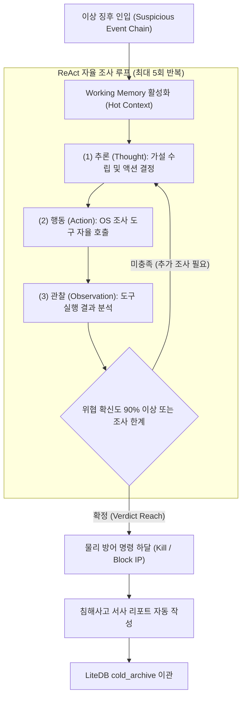
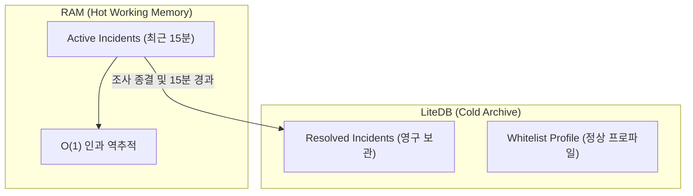

# Phalanx AI Agent Investigation & Reasoning Engine Specification

본 문서는 `Phalanx.Core`에 내장된 **자율 위협 헌팅 에이전트(Autonomous Hunter Agent)**의 인지 모델, 도구 호출(Tool Calling) 생태계, ReAct 추론 파이프라인 및 침해사고 서사(Incident Narrative) 생성 메커니즘을 정의합니다.

---

## 1. 에이전트 인지 모델 (Cognitive Model)

Phalanx의 AI 에이전트는 단순한 텍스트 챗봇이 아니라, **운영체제 내부 상태를 직접 관찰하고 개입하는 자율 제어기(Autonomic Controller)**로 동작합니다.



---

## 2. ReAct 추론 파이프라인 상세

에이전트는 사건을 단편적으로 보지 않고, 가설-검증(Hypothesis-Testing) 루프를 자율적으로 순환합니다.

### A. 4단계 루프 단계 (ReAct Cycle)
1. **Thought (사고)**:
   * 입력된 프로세스 트리 및 명령줄 인자를 분석하여 잠재적 공격 기법(TTP)을 추론합니다.
   * *예: "winword.exe가 powershell.exe를 기동했으며 인자에 `-enc` 플래그가 포함됨. 인자 난독화 해독 및 메모리 조사가 필요함."*
2. **Action (도구 호출)**:
   * 정의된 `InvestigationTools` 중 가장 적합한 도구를 선정하여 인자(Argument)와 함께 호출합니다.
3. **Observation (결과 관찰)**:
   * 도구의 반환 결과(디코딩된 스크립트, 메모리 내 URL, C2 평판 정보)를 수집하여 컨텍스트 윈도우에 피드백합니다.
4. **Final Verdict (최종 판정)**:
   * 확신도(0.0 ~ 1.0)를 계산하여 0.9 이상이면 악성 침해로 최종 확정하고 대응 파이프라인으로 전환합니다.

---

## 3. 에이전트 전용 Tool Calling 생태계

에이전트가 호출할 수 있는 도구(Tool)들은 OS 런타임에 직접 접근하는 안전한 C# 래퍼로 구현됩니다.

| 도구명 (Tool Name) | 매개변수 (Parameters) | 수행 작업 (Functionality) | 반환값 (Return) |
| :--- | :--- | :--- | :--- |
| `DecodePayloadTool` | `string rawEncodedText` | Base64, Hex, URL, Gzip 압축 스크립트를 다단계 자동 해독 | 해독된 평문 스크립트 문자열 |
| `ProcessMemoryScanTool` | `uint targetPid` | `OpenProcess` ➔ `VirtualQueryEx`로 타깃 프로세스 메모리 영역에서 URL, IPv4, 악성 API 패턴 정규식 스캔 | 발견된 C2 주소 및 인젝션 흔적 리스트 |
| `ThreatReputationTool` | `string indicator` (IP/Domain/Hash) | 로컬 알려진 악성 IoC 데이터베이스 및 외부 평판 엔진 조회 | 위험도 점수 및 위협 분류 카테고리 |
| `MitreClassifierTool` | `string observedBehavior` | 관찰된 행위 문자열을 MITRE ATT&CK Matrix 기법(ID)으로 자동 매핑 | `T1059.001`, `T1566` 등의 기법 코드 및 설명 |
| `SystemFirewallTool` | `string maliciousIp` | Windows Filtering Platform(WFP) 또는 Netsh 명령으로 해당 IP 인/아웃바운드 즉시 차단 | 차단 성공 여부 (bool) |

---

## 4. Threat Graph Memory 계층화 구조

계층화된 핫/콜드 작업 메모리(Tiered Working Memory) 아키텍처를 적용하여 토큰 소모를 최소화하고 조사 속도를 극대화합니다.



1. **Hot Working Memory (RAM)**:
   * 현재 시스템에서 활성화되어 있거나 최근 15분 이내에 발생한 프로세스 트리만 그래프 노드로 유지합니다.
   * 부모-자식 탐색 및 엣지 추가가 인메모리에서 지연 없이 수행됩니다.
2. **Cold Archive (LiteDB)**:
   * 조사가 완료된 침해사고 객체와 정상으로 판정된 일상 프로세스 프로파일은 디스크 상의 LiteDB로 즉시 이관(Eviction)됩니다.
   * Threat Graph 인메모리 작업 캐시를 30MB 이하로 유지하는 핵심 메커니즘입니다.

---

## 5. 침해사고 서사(Incident Narrative) 생성

사고 조사가 완료되면, LLM은 보안 지식이 부족한 일반 관리자도 즉시 상황을 파악할 수 있도록 **타임라인 기반의 구조화된 서사(Narrative)**를 작성합니다.

### 출력 JSON 스키마 규격
```json
{
  "incident_id": "INC-20260907-001",
  "confidence_score": 0.98,
  "mitre_tactics": ["T1566.001", "T1059.001", "T1071.001"],
  "summary_title": "악성 오피스 매크로를 통한 파일리스 C2 다운로더 침투 시도",
  "narrative": "16시 56분, 사용자 계정에서 실행된 2026_09_invoice.docm 문서가 winword.exe를 통해 난독화된 파워셸을 은밀히 기동했습니다. Phalanx 센서가 0.02초 만에 스레드를 동결하였으며, AI 에이전트의 메모리 역추적 결과 해외 악성 C2(185.220.101.5)로의 통신 시도가 확인되어 프로세스를 강제 종료하고 IP를 차단했습니다.",
  "root_cause_process": "winword.exe (PID: 3104)",
  "terminated_processes": ["powershell.exe (PID: 8492)"],
  "remediation_status": "SECURED"
}
```

---

## 6. 회복탄력성 및 Fallback 설계 (Graceful Degradation)

* **API 키 미등록 / 네트워크 단절 시**:
  * AI 에이전트 인스턴스는 인스턴스화되지 않으며, `DeterministicRuleEngine`이 단독으로 디시전을 담당합니다.
  * 룰 기반으로 판정된 차단 내역은 표준 텍스트 템플릿 기반으로 포맷팅되어 대시보드와 리포트에 정상 노출됩니다.
* **로컬 LLM (Ollama) 지원**:
  * 외부 인터넷이 차단된 환경에서는 `http://localhost:11434` 엔드포인트를 통해 로컬 Qwen 2.5 또는 Llama 3 모델로 추론을 라우팅할 수 있는 플러그인 구조를 갖춥니다.
