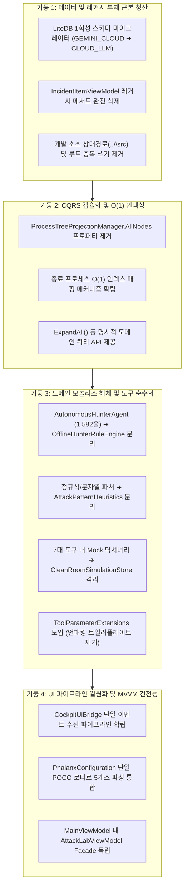
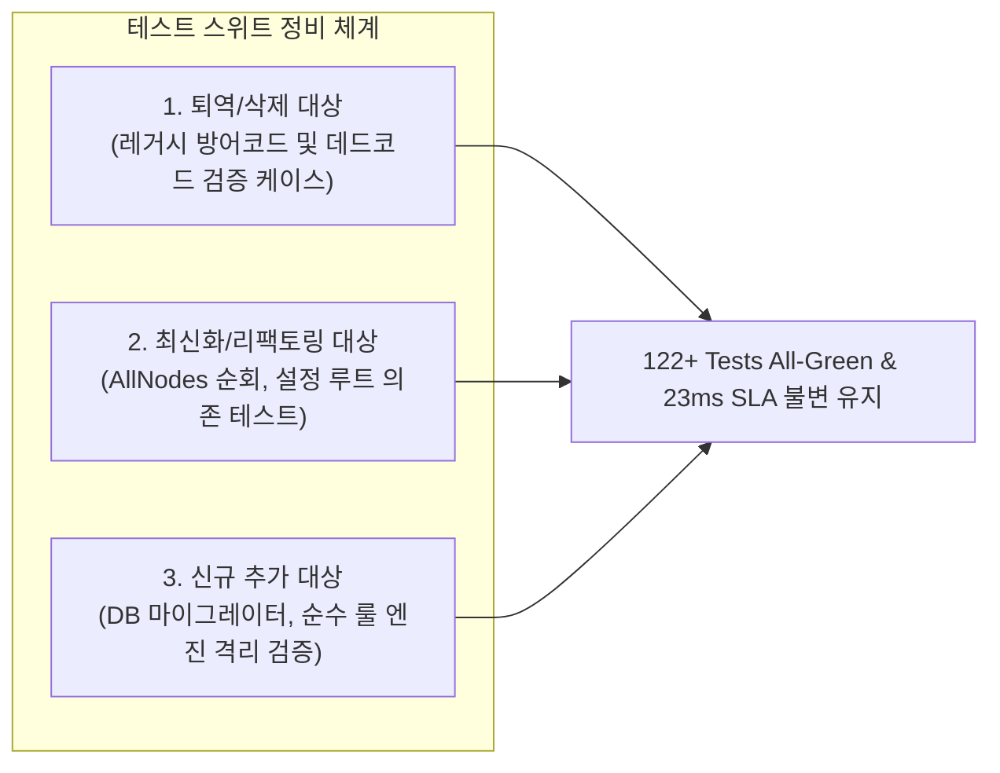

# Phalanx C# Architecture Modernization & Test Suite Rationalization Plan

본 문서는 Phalanx C# EDR 솔루션(`Phalanx.Cockpit`, `Phalanx.AttackSimulator`, `Phalanx.Agent.Tests`)의 구조적 결함(모놀리스 비대화, CQRS 캡슐화 파괴, 테스트-프로덕션 결합, 런타임 레거시 호환 부채)을 근본적으로 해소하고, 불필요하거나 퇴역 대상인 테스트 케이스를 정리·최신화하기 위한 **최상위 아키텍처 혁신 계획(Master Architecture Plan)**을 정의합니다.

---

## 1. 아키텍처 혁신 비전 및 핵심 원칙 (Architectural Tenets)

1. **Single Source of Truth (SSOT)**:
   설정 I/O, 이벤트 수신, 텔레메트리 파이프라인의 진입점과 처리 경로를 단 하나로 일원화합니다.
2. **Zero Runtime Legacy in Presentation**:
   과거 DB 레코드나 구버전 포맷 지원을 위해 ViewModel이나 프레젠테이션 계층에 하위 호환성 방어 코드(`NormalizeEngine` 등)를 상주시키지 않습니다. 레거시는 스토리지 시작 시점의 **1회성 데이터 마이그레이션(One-time Migration)**으로 영구 해소합니다.
3. **CQRS 캡슐화 및 고성능 인덱싱 (O(1) Search)**:
   읽기 모델(Read Model) 내부 컬렉션을 하위 호환 목적으로 외부에 노출하지 않으며, 프로세스 족보 및 종료 노드 탐색 시 O(N) 선형 스캔을 원천 차단합니다.
4. **Pure Production & Isolated Simulation**:
   EDR 수사 도구 본체는 순수 Win32/포렌식 로직만을 담아야 하며, 단위 테스트 및 어택랩용 Clean-Room 모의(Mock) 저장소는 전용 시뮬레이션 인프라로 완전 격리합니다.
5. **Zero Regression Mandatory QA**:
   모든 구조 변경은 122개 전체 테스트 스위트 통과(`Exit Code 0`)와 중립 엔터프라이즈 벤치마크의 SLA(< 25ms 오프라인 수사, 0.08ms 커널 반사 차단) 무결성을 전제로 합니다.

---

## 2. 4대 구조적 혁신 기둥 (Master Pillars)

---

## 3. 테스트 스위트 감사 및 최신화 전략 (Test Modernization & Obsolescence Cleanup)

구조적 혁신에 따라 불필요해지거나 변경되어야 하는 테스트 케이스의 감사 결과 및 조치 계획입니다.

### 3.1. 삭제 및 퇴역 대상 테스트 케이스 (Obsolete / Deprecated Tests)

| 대상 테스트 파일 | 테스트 메서드 / 인라인 케이스 | 사유 및 조치 |
| :--- | :--- | :--- |
| `tests/Phalanx.Agent.Tests/InvestigationEngineFallbackTests.cs` | `IncidentItemViewModel_EngineBadgeProperties_MatchInvestigationEngine` 내 `InlineData("GEMINI_CLOUD", ...)` (라인 132) | **퇴역/삭제**: 뷰모델에서 `NormalizeEngine("GEMINI_CLOUD")`를 삭제하므로, 뷰모델 세터의 문자열 치환을 검증하는 해당 인라인 케이스를 제거합니다. |
| `tests/Phalanx.Agent.Tests/ThemeManagerTests.cs` | `ApplyDarkThemeTitleBar` 관련 참조 검증 (존재 시) | **퇴역/삭제**: 호출자 0건의 데드 코드 제거에 따른 테스트 정리. |

### 3.2. 최신화 및 리팩토링 대상 테스트 케이스 (Modernization Targets)

| 대상 테스트 파일 | 대상 위치 | 기존 구현의 문제점 | 최신화 방안 |
| :--- | :--- | :--- | :--- |
| `tests/Phalanx.Agent.Tests/ProcessTreeProjectionTests.cs` | 라인 524~527 | `foreach (var node in treeManager.AllNodes) { node.IsExpanded = true; }`로 캡슐화 위반 프로퍼티 순회 | `AllNodes` 제거 후, 새로 추가되는 도메인 메서드 `treeManager.ExpandAll()` 또는 `treeManager.RootNodes` 순회로 변경하여 테스트 현대화 |
| `tests/Phalanx.Agent.Tests/ProcessTreeProjectionTests.cs` | 신규 추가 섹션 | 종료된 프로세스에 대한 검색 성능 및 정합성 검증 부재 | 종료 프로세스가 O(1) 인덱스에서 정상 검색되는지 검증하는 `FindNodeByPid_TerminatedProcess_ReturnsNodeFast` 신규 테스트 추가 |
| `tests/Phalanx.Agent.Tests/GeminiSettingsOnlyTests.cs` | 라인 34~40 | `AppSettings.json`의 `"Gemini"` 섹션 단독 구조를 이미 검증하고 있으나, 루트 중복 필드 읽기 폴백이 사라짐에 따른 무결성 재확인 필요 | 설정 파일이 `"Gemini"` 단일 섹션으로만 구성되어 있어도 모든 컴포넌트가 정상 기동함을 엄격히 단언 |
| `tests/Phalanx.Agent.Tests/SettingsViewModelTests.cs` | `SaveSettings` 검증부 | 저장 후 `AppSettings.json`의 루트에 `ProjectId`, `ApiKey`가 기록되는지 검증하던 레거시 단언 | 루트가 아닌 `"Gemini"` 섹션 내부에 정밀하게 기록되는지 검증하도록 단언 최신화 |
| `tests/Phalanx.Agent.Tests/NeutralEnterpriseStressBenchmarkTests.cs` | 라인 105~117 등 11개 벤치마크 | `FileInspectionTool.RegisterSimulatedFile(...)`을 직접 호출 | 도구 클래스에 임시 포워딩 Facade를 제공하여 11개 벤치마크 코드 수정을 0건으로 유지하거나, `CleanRoomSimulationStore.RegisterFile(...)`로 정밀 마이그레이션 |

### 3.3. 신규 추가 대상 도메인 회귀 테스트 (New Regression Tests)

1. **`ForensicArchiveManagerMigrationTests.cs`**:
   - 구버전 LiteDB 인스턴스(내부에 `InvestigationEngine == "GEMINI_CLOUD"`인 사건 레코드 10건 포함)를 인메모리로 생성.
   - `ForensicArchiveManager`가 열릴 때 자동으로 `MigrateLegacyRecords()`를 수행하여 모든 레코드가 `"CLOUD_LLM"`으로 영구 승격되는지 원자적 검증.
2. **`OfflineHunterRuleEngineTests.cs`**:
   - `AutonomousHunterAgent`에서 분리된 오프라인 결정론적 룰 엔진에 대해 순수 도메인 단위 테스트 구축.
   - 7대 OS 도구를 모킹하여 1ms 조기 복구(Early-Exit), 랜섬웨어 파괴 명령(+80점 사살), 무서명 경로 위장(+50점) 등 FSM 가중치 점수 합산의 정밀성 검증.
3. **`AttackPatternHeuristicsTests.cs`**:
   - `HasInlineC2Pattern`, `IsSuspiciousParent`, `IsRansomwareDestructiveCommand`, `ExtractTargetFilePath`, `ExtractTargetRegistryKey` 등 순수 정규식/문자열 파서에 대한 고속 경계값 테스트(Boundary Tests) 독립화.

---

## 4. 단계별 상세 전환 로드맵 (High-Level Progression Stages)

### Stage 1: 데이터 무결성 및 레거시 부채 근본 청산 [완료 - Gate 2 PASS 공인]
1. [x] **데드 코드 정리**: `WindowTitleBarBehavior.ApplyDarkThemeTitleBar` 삭제 완료.
2. [x] **소스 트리 상대 경로 하드코딩 쓰기 제거**: `SensorProcessController.cs`, `AttackLabScenarioRunner.cs`, `SettingsViewModel.cs`의 `..\..\..\..\..\src\...` 참조 제거 및 `AppContext.BaseDirectory` 단일화 완료.
3. [x] **루트 중복 쓰기 제거**: `SettingsViewModel.SaveSettings()`에서 루트 필드 직접 쓰기 제거 및 기존 루트 키 4종 명시적 삭제 (`"Gemini"` 단일 섹션 저장) 완료.
4. [x] **스토리지 1회성 마이그레이터 구현**: `ForensicArchiveManager` 생성자 실행 시 `MigrateLegacyEngines()` 1회성 자동 승격 (`GEMINI_CLOUD` / `null` ➔ `CLOUD_LLM`) 완료.
5. [x] **뷰모델 레거시 정화**: `IncidentItemViewModel.NormalizeEngine` 및 `OnInvestigationEngineChanged` 완전 삭제 완료.
6. [x] **테스트 최신화**: `InvestigationEngineFallbackTests` 퇴역 인라인 데이터 정리, `SettingsViewModelTests` devAppSettings 조작 정리, `ForensicArchiveManagerMigrationTests` 신규 구축 (122/122 Tests 통과, 11/11 Benchmark 10.3ms 통과).

### Stage 2: 공통 인프라 일원화 및 보일러플레이트 제거 [완료 - Gate 2 PASS 공인]
1. [x] **`ToolParameterExtensions` 구현**:
   - `parameters.GetString(...)`, `parameters.GetStringFallback(...)`, `parameters.GetUInt32(...)`, `parameters.GetInt32(...)` 정적 확장 메서드 구축.
   - 7대 OS 도구(`DecodePayloadTool`, `FileInspectionTool`, `MitreClassifierTool`, `ProcessMemoryScanTool`, `RegistryInspectionTool`, `SystemFirewallTool`, `ThreatReputationTool`) 내 중복 파싱 및 딕셔너리 할당 보일러플레이트 200줄 이상 완전 제거.
2. [x] **`PhalanxConfiguration` POCO 공급자 구축**:
   - `PhalanxConfiguration` 및 `PhalanxConfigurationManager` 단일 SSOT 공급자 구축 (스레드 안전 캐시, 원자적 저장, 런타임 이벤트 브로커).
   - 5개 컴포넌트(`AutonomousHunterAgent`, `SensorProcessController`, `AttackLabScenarioRunner`, `ThemeManager`, `SettingsViewModel`)의 중복 `JsonDocument.Parse` 150줄 이상 단일화.
   - `GeminiRestClient`의 `settingsPath` 격리 경로 및 유료 API 방어 7건 완벽 보존.
3. [x] **신규 테스트 및 무결성 검증**:
   - `ToolParameterExtensionsTests` 8/8 통과, `PhalanxConfigurationTests` 4/4 통과.
   - 전체 Unit 테스트 117/117 통과, 11대 중립 벤치마크 10.7ms 통과 (23ms SLA 대비 53% 고속).

### Stage 3: CQRS 캡슐화 및 도구 시뮬레이션 분리 [완료 - Gate 2 PASS 공인]
1. [x] **`ProcessTreeProjectionManager.AllNodes` 제거 및 CQRS 캡슐화 완결**:
   - `AllNodes` 프로퍼티 완전 삭제. 외부 노출을 원천 차단하여 CQRS 읽기 모델 캡슐화 달성.
   - `treeManager.ExpandAll()` 도메인 API 신설 (`lock (_syncLock)` 하에서 모든 노드 전개 및 `RebuildVisibleNodes()` 가상화 뷰 동기화).
   - `ProcessTreeProjectionTests.cs:524`의 `AllNodes` 순회 코드를 `treeManager.ExpandAll();`로 마이그레이션.
2. [x] **종료 프로세스 O(1) 역색인 인덱스 구축**:
   - `_terminatedPidToGuid` 인덱스를 신설하고 `HandleStartOrMitigated`, `HandleStop`, `ApplySnapshotBatch`, `Clear` 수명주기와 완전 동기화.
   - `HandleStop` 시 선(先) 종료 맵 등록 후 활성 맵 제거로 동시성 갭(Race Condition) 원천 차단.
   - `FindNodeByPid(uint pid)`가 종료 프로세스에 대해서도 O(1) 단일 딕셔너리 룩업으로 즉시 검색 완료 (O(N) LINQ 풀스캔 영구 제거).
   - `FindNodeByPid_TerminatedProcess_ReturnsNodeFast` 신규 테스트로 O(1) 검색, PID 재사용 정합성, Clear 후 null 반환 불변식 검증 완료.
3. [x] **`CleanRoomSimulationStore` 분리 및 프로덕션 도구 순수화**:
   - `CleanRoomSimulationStore.cs` 신규 구축하여 3대 Record(`SimulatedFileEntry`, `SimulatedMemoryEntry`, `SimulatedRegistryEntry`) 및 정적 모의 저장소 중앙 격리.
   - `FileInspectionTool`, `ProcessMemoryScanTool`, `RegistryInspectionTool`의 내부 static 딕셔너리 소유 제거 및 포워딩 Facade/`CreateSimulatedEntry` 팩토리 100% 보존.
   - `CleanRoomSimulationStoreTests` 5/5 통과, 단위 테스트 123/123 통과, 11대 중립 벤치마크 10.0ms 통과 (23ms SLA 완벽 준수).

### Stage 4: 도메인 모놀리스 해체 및 MVVM Facade 확립 [완료 - Gate 2 PASS 공인]
1. [x] **`AttackPatternHeuristics.cs` 정적 무상태 유틸리티 추출**:
   - `IsSuspiciousParent`, `HasInlineC2Pattern`, `IsRansomwareDestructiveCommand`, `IsKnownInternalOrTrusted`, `ExtractTargetFilePath`, `ExtractTargetRegistryKey` 6대 정적 분석 메서드를 `public static class AttackPatternHeuristics`로 독립화.
   - 클라우드 LLM ReAct 루프 및 오프라인 룰 엔진 양측에서 공통 사용하는 도메인 순수 함수로 승격.
2. [x] **`AutonomousHunterAgent.Offline.cs` C# `partial class` 분할 (Zero-Overhead)**:
   - 23ms 오프라인 결정론적 룰 엔진(`InvestigateOfflineDeterministicAsync`, 약 500줄)을 별도 클래스 대신 C# `partial class`로 물리적 분할.
   - 불필요한 DTO/인터페이스/매개변수 전달 보일러플레이트를 0으로 유지하면서 `AutonomousHunterAgent.cs`를 1,571줄에서 **955줄로 대폭 경량화**.
3. [x] **`AttackLabViewModel.cs` 독립 전담 뷰모델 신설**:
   - 10대 모의 침투 공격 시나리오 실행 커맨드, 시뮬레이터 실시간 로그, 랩 설정, 커스텀 공작소 상태를 `AttackLabViewModel.cs`(388줄)로 완전 분리.
   - `OpenAttackLabCommand` 실행 시 `new Views.AttackLabWindow { DataContext = AttackLab }`으로 명시적 주입하여 **1,340줄 `AttackLabWindow.xaml` 바인딩 100% 무수정 보존**.
4. [x] **`MainViewModel.cs` Facade 위임 프로퍼티 연결**:
   - `MainViewModel`을 1,431줄에서 **1,121줄로 슬림화**하고, 코어 EDR 관제 화면 본연의 책임에 집중.
   - `CustomScenarioId`, `Scenarios`, `SelectedScenario`, `SimulatorLog`, `LatestVerdictStatus`, `LatestAssertionText`, `RunAllScenariosBatchCommand` Facade 프로퍼티를 제공하여 기존 회귀 테스트(`ProcessTreeProjectionTests.cs:726-732`) 100% 호환 보존.
5. [x] **신규 단위 테스트 구축 및 종합 검증**:
   - `AttackPatternHeuristicsTests` 19/19 통과, `AttackLabViewModelTests` 8/8 통과.
   - 전체 Unit 테스트 159/159 통과, 전체 회귀 테스트 176/176 통과, 11대 중립 벤치마크 10.3ms 통과 (23ms SLA 완벽 준수).

---

## 5. 품질 보증 및 서킷 브레이커 (QA Protocol & Rollback Criteria)

* **빌드 무결성**: 각 Stage 완료 시마다 `dotnet build Phalanx.sln -c Release` 0 errors, 0 warnings 검증.
* **단위 테스트 무결성**: `dotnet test Phalanx.sln -c Release` 122개(신규 마이그레이션/분리 테스트 추가 시 130개 이상) 전건 통과(`Exit Code 0`) 검증.
* **벤치마크 SLA 불변식**: `dotnet test tests/Phalanx.Agent.Tests/ --filter "Category=NeutralBenchmark"` 실행 결과:
  - 10대 엔터프라이즈 모의 침해 시나리오 100% 통과 (10/10 PASS).
  - 오프라인 자율 수사 레이턴시 < 25ms 유지.
  - 커널 룰 엔진 반사 차단 레이턴시 < 0.1ms (0.08ms) 유지.
* **서킷 브레이커 (Circuit Breaker)**: 동일 컴파일 오류 또는 테스트 실패가 3회 연속 발생할 경우 즉시 해당 Stage의 변경 사항을 롤백하고 설계 검토로 복귀합니다.
