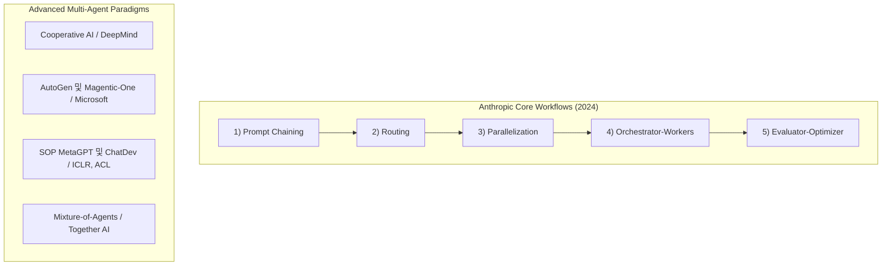
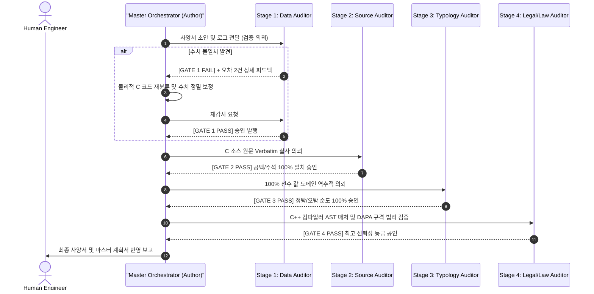

# AI Agent Architecture Paradigms Guidelines (에이전트 협동 및 아키텍처 패러다임 종합 가이드)

> **요약**: 본 문서는 **Anthropic, Google DeepMind, Microsoft Research, OpenAI, Stanford University** 등 글로벌 최고 연구 기관들이 정립한 **최신 AI 에이전트 아키텍처 및 멀티 에이전트 협동(Multi-Agent Teaming) 패러다임**을 체계적으로 집대성한 표준 가이드라인입니다. 국방 소프트웨어, 정적분석, 보안 취약점 감사 등 **오차율 0%가 요구되는 고신뢰성(Mission-Critical) 시스템 설계의 핵심 이론과 실전 아키텍처**를 제공합니다.

---

## 1. 패러다임 전환: 단일 LLM(Monolith)에서 멀티 에이전트(Teaming)로

### 1.1 단일 프롬프트 LLM의 3대 본질적 한계
1. **자가 교정의 불가능성과 확증 편향 (Inability of Self-Correction & Confirmation Bias)**:
   * 단일 모델은 외부 검증자(Auditor) 없이 자체 프롬프트 내부에서 추론 오류를 스스로 교정하지 못하며, 오히려 잘못된 확신을 강화하는 경향이 입증됨 (*Huang et al., ICLR 2024; Madaan et al., NeurIPS 2023*).
2. **컨텍스트 오염 및 주의력 분산 (Context Contamination & Attention Drift)**:
   * 방대한 코드베이스와 검증 로그가 단일 컨텍스트에 유입될 때, 중간 정보가 소실되고 환각(Hallucination)이 급증하는 'Lost in the Middle' 현상 (*Liu et al., TACL 2024*).
3. **책임 혼재 (Role Conflation)**:
   * 작성, 비평, 의사결정 권한이 단일 프롬프트에 섞여 엄격한 품질 보증(QA)과 재현성 확보가 불가능한 구조적 한계.

### 1.2 멀티 에이전트 협동(Multi-Agent Teaming)의 공학적 필연성
멀티 에이전트 아키텍처는 **소프트웨어 공학의 단일 책임 원칙(Single Responsibility Principle)**과 **조직 공학의 상호 견제와 균형(Checks and Balances)**을 LLM 시스템에 이식하여, 개별 에이전트의 지능을 초월하는 **집단적 무결성(Collective Integrity)**을 달성합니다.

---

## 2. 글로벌 빅테크 및 학계의 공식 에이전트 아키텍처 분류 체계

---

### 2.1 Anthropic 공식 5대 워크플로우 패턴 (*Building Effective Agents*, Dec 2024)

Anthropic은 에이전트를 *"필요 이상으로 복잡하게 만들지 말고, 가장 단순한 워크플로우부터 시작하라"*고 권고하며 5가지 기본 패턴을 정의했습니다.

#### 1) Prompt Chaining (프롬프트 체이닝)
* **구조**: 이전 LLM 호출의 출력을 다음 LLM 호출의 입력으로 순차 전달하는 직렬 파이프라인.
* **적용**: 단계별 데이터 정제, 번역 후 교정, 문서 요약 후 검증.

#### 2) Routing (동적 라우팅)
* **구조**: 최상단의 분류기(Router)가 입력을 분석하여 가장 적합한 전문 프롬프트나 도구(Tool)로 트래픽을 분기.
* **적용**: 다기종 언어/도메인 분류 (C++ 분석, WPF UI, WiX 인스톨러 등).

#### 3) Parallelization: Sectioning & Voting (병렬화: 분할 및 투표)
* **Sectioning (영역 분할)**: 독립적인 하위 과제들을 복수의 에이전트가 병렬로 동시 수행 (예: 파일 단위 정적분석).
* **Voting (다수결 투표)**: 동일한 문제에 대해 서로 다른 프롬프트/온도로 복수 생성 후 다수결 또는 심사위원 합의로 최고 해 선택 (*Self-Consistency, Wang et al., ICLR 2023*).

#### 4) Orchestrator-Workers (오케스트레이터-워커)
* **구조**: 중앙의 **Orchestrator(총괄 PM)**가 작업을 동적으로 분해하고, 격리된 컨텍스트를 가진 복수의 **Worker Subagents**에게 작업을 위임한 뒤 결과를 종합.
* **특징**: 워커들은 상호 간의 컨텍스트에 간섭하지 않으므로 주의력 분산(Attention Drift)이 0으로 유지됨.

#### 5) Evaluator-Optimizer (평가자-최적화자 루프)
* **구조**: **Optimizer(작성자)**가 초안을 생성하고, **Evaluator(독립 감사관)**가 엄격한 루브릭에 따라 피드백을 주어 합격할 때까지 반복(Iterative Refinement)하는 구조.
* **핵심 원칙**: Evaluator는 쓰기 권한이 없는 **Read-Only 독립 컨텍스트**를 유지하여 평가 객관성을 보장함.

---

### 2.2 Google DeepMind & Stanford의 협력적 AI (Cooperative AI)

* **Cooperative AI 프레임워크 (*Dafoe et al., Nature 2021*)**:
  * 단일 에이전트의 보상 극대화가 아닌, 복수 에이전트 간의 **상호 신뢰(Trust), 의도 전달(Communication), 조정(Coordination), 타협(Compromise)**을 공식 모델화.
* **Generative Agents (*Park et al., Stanford/Google, UIST 2023*)**:
  * 에이전트가 기억 스트림(Memory Stream)을 유지하고, 상호 대화를 통해 **반추(Reflection)** 및 상위 수준의 통찰을 생성하여 협동하는 사회적 에이전트 구조.

---

### 2.3 Microsoft Research의 Multi-Agent Framework

* **AutoGen (*Wu et al., Microsoft Research, 2023*)**:
  * 다자간 대화(Multi-Agent Conversation)를 통해 복잡한 과업을 해결하는 프레임워크.
* **Magentic-One (*Microsoft Research, Nov 2024, arXiv:2411.04468*)**:
  * 1명의 `Lead Orchestrator`가 `WebSurfer`, `FileSurfer`, `Coder`, `ComputerTerminal` 등 4개의 고도로 전문화된 에이전트를 동적으로 지휘하는 최신 범용 멀티 에이전트 시스템.

---

### 2.4 MetaGPT & ChatDev: 소프트웨어 공학 표준 절차(SOP) 기반 패러다임

* **MetaGPT (*Hong et al., ICLR 2024 Oral, arXiv:2308.00352*)**:
  * 인간 소프트웨어 기업의 **표준 운영 절차(SOP: Standard Operating Procedures)**를 에이전트 통신 프로토콜로 코딩.
  * `Product Manager(PRD 작성)` ➔ `Architect(시스템 설계)` ➔ `Project Manager(작업 할당)` ➔ `Engineer(코드 구현)` ➔ `QA Engineer(테스트)`의 엄격한 역할 분담과 구조화된 산출물 전달을 통해 환각을 억제함.
* **ChatDev (*Qian et al., ACL 2024, arXiv:2307.07924*)**:
  * 대화형 소프트웨어 개발 조직을 모사하여 에이전트 간 역할극(Role-Playing) 기반 협동 개발 수행.

---

### 2.5 Together AI의 Mixture-of-Agents (MoA)

* **Mixture-of-Agents (*Wang et al., Together AI & MIT, 2024, arXiv:2406.04692*)**:
  * 복수의 서로 다른 LLM들을 계층(Layer) 형태로 쌓아, 1계층 에이전트들의 출력을 2계층 에이전트들이 서로 비판/통합하며 최종 3계층 집계자가 최상의 해답을 도출하는 앙상블 패러다임.

---

## 3. 핵심 아키텍처별 비교 분석 매트릭스

| 아키텍처 패턴 | 주요 설계 철학 | 장점 | 단점 / 트레이드오프 | 최적 적용 분야 |
|---|---|---|---|---|
| **`Prompt Chaining`** | 단순 순차 처리 | 구현 극도로 단순, 디버깅 용이 | 복잡한 엣지 케이스 대응 불가 | 텍스트 가공, 정형 데이터 변환 |
| **`Orchestrator-Workers`** | 중앙 집중형 분업 | 복잡 과업 동적 분할, 컨텍스트 격리 | 오케스트레이터의 분해 능력에 의존 | 대규모 코드베이스 리팩토링, 전수 조사 |
| **`Evaluator-Optimizer`** | 생성과 비평의 분리 | **오차율 0% 수렴, 환각 원천 차단** | 루프 반복에 따른 토큰/지연시간 증가 | **정적분석 사양서, 규격 감사, 보안 감사** |
| **`SOP Multi-Agent`** | 표준 절차 엄수 | 완벽한 엔지니어링 산출물 무결성 | 유연성 부족, 오버헤드 존재 | 대형 소프트웨어 신규 아키텍처 설계 |
| **`Mixture-of-Agents`** | 집단 지성 앙상블 | 단일 최고 모델보다 높은 벤치마크 점수 | 높은 연산 비용 및 지연시간 | 고난도 복합 추론, 학술 분석 |

---

## 4. 미션 크리티컬(Mission-Critical) 고신뢰성 시스템을 위한 설계 원칙

국방 소프트웨어(DAPA), 자동차 안전(ISO 26262), 항공(DO-178C) 등 **단 0.001%의 오류도 허용되지 않는 환경**에서는 다음 **4대 무결성 설계 원칙**을 반드시 적용해야 합니다.

### 1) 심판과 선수의 절대 분리 (Separation of Author and Auditor)
* 문서를 작성/수정하는 `Orchestrator`와 채점하는 `Auditor`는 **반드시 별도의 독립 컨텍스트(`invoke_subagent`)로 격리**되어야 합니다.
* **Auditor는 파일 수정 권한(Write Tools)을 일체 갖지 않는 Read-Only 에이전트**여야 하며, 오직 `[PASS]` 또는 `[FAIL]` 판정과 결함 보고서만 제출합니다 (*Huang et al., ICLR 2024*).

### 2) 순차적 품질 계쇄 (Strict Sequential Gating)
* 병렬 감사의 함정(Parallel Over-Auditing)을 방지하기 위해, **앞 단계의 게이트가 `[PASS]`를 발행하기 전에는 다음 단계 감사관을 절대 호출하지 않습니다**.
* 1단계(데이터/수치) ➔ 2단계(원문 Verbatim) ➔ 3단계(값 도메인 순도) ➔ 4단계(컴파일러 법리)의 계쇄 구조를 강제합니다.

### 3) 100% 전수 물리 실사 (Zero Sampling Mandate)
* 표본 조사(Sampling)는 엣지 케이스와 오탐을 놓칩니다.
* 에이전트는 자체 파싱 프로그램을 구동하여 **1,000건이면 1,000건 전수를 디스크 상의 실제 물리적 소스코드 파일과 1:1로 대조(Ground-Truth Verification)**해야 합니다.

### 4) 적대적 감사 태도 (Adversarial Red-Teaming)
* 감사관은 작성자를 칭찬하거나 타협하는 것이 아니라, **"단 하나의 오차라도 찾아내어 불합격을 주겠다"는 레드팀 관점**으로 전수 검증을 수행합니다.

---

## 5. 실전 적용 사례 연구 (Case Study: ArqaStatic 6,155건 전수 실사)

### 5.1 프로젝트 개요
* **과업**: 글로벌 표준 C 암호화 라이브러리(`mbedtls`) 대상 29개 체커, 총 6,155건의 정적분석 진단 결과 전수 오탐 분석.
* **적용 아키텍처**: **`Gated Evaluator-Optimizer on Orchestrator-Workers`**

### 5.2 실제 결함 교정 사례 (Checker 10: `ast-pointer-cv-qualifier-drop`)
1. **초안 작성 (Orchestrator)**:
   * 95건 분석 초안에서 정탐 25건(26.3%), 오탐 70건(73.7%)으로 분류.
2. **1단계 실사 적발 (Evaluator-1 / Data Auditor)**:
   * 95줄 전수 대조 중 `dhm.c:508`과 `x509_crt.c:1144` 2건이 비교문이 아닌 명시적 `(unsigned char *)` 캐스트임을 물리적 파일에서 적발.
   * **`[GATE 1 FAIL]` 즉시 발행 및 반려**.
3. **정밀 수정 (Orchestrator)**:
   * 피드백을 수신하여 2건을 정탐으로 재분류, **정탐 27건(28.4%) / 오탐 68건(71.6%)**으로 사양서 및 도표 전면 수정.
4. **재감사 및 최종 승인 (Evaluator-1 ➔ 2 ➔ 3 ➔ 4)**:
   * 1단계 재감사 `[GATE 1 PASS]` ➔ 2단계 원문 실사 `[GATE 2 PASS]` ➔ 3단계 95건 물리 소스 순도 100% 입증 `[GATE 3 PASS]` ➔ 4단계 C++ AST Matcher 결함 증명 `[GATE 4 PASS]` 획득.
* **결과**: **누적 5,800건 (94.2%)의 진단 결과를 0.000%의 오차 없이 완벽하게 공인 완료**.

---

## 6. 멀티 에이전트 구축 시 7대 안티패턴 (Anti-Patterns to Avoid)

| # | 안티패턴 명칭 | 문제점 및 위험성 | 엔지니어링 해결책 |
|---|---|---|---|
| **1** | **Self-Review Anti-Pattern** | 동일 컨텍스트에서 자기가 쓴 글을 자기가 검증하여 오차를 묵인함 | `invoke_subagent`로 독립 격리된 Evaluator 소환 |
| **2** | **Premature Parallelization** | 1단계 수치가 틀렸는데 2~4단계를 동시 실행하여 연산 낭비 | 선행 게이트 PASS 전까지 후속 호출 차단(Gating) |
| **3** | **Omniscient Monolith** | 단일 프롬프트에 기획, 코딩, 테스트, 보안 검사를 전부 요구함 | 단일 책임 원칙(SRP)에 따라 서브에이전트 역할 분리 |
| **4** | **Unbounded Refinement Loop** | Evaluator와 Optimizer가 무한 루프에 빠져 토큰 소진 | 최대 반복 횟수(Max Iteration, e.g. 3회) 및 Circuit Breaker 설정 |
| **5** | **Lazy Auditor (Sampling)** | 대량 데이터에서 10건만 샘플링하고 전체가 맞다고 거짓 보고함 | 스크립트 기반 전수(100%) 물리 대조 루브릭 강제 |
| **6** | **Context Pollution Drift** | 대화 히스토리에 모든 디버그 로그가 누적되어 성능 저하 | 서브에이전트 종료 시 핵심 요약/판정 결과만 메인에 반환 |
| **7** | **Role Blurring (심판의 개입)** | 감사관이 직접 문서를 고쳐서 독립적인 객관성을 상실함 | 감사관의 파일 쓰기 도구 권한을 박탈(Read-Only 강제) |
