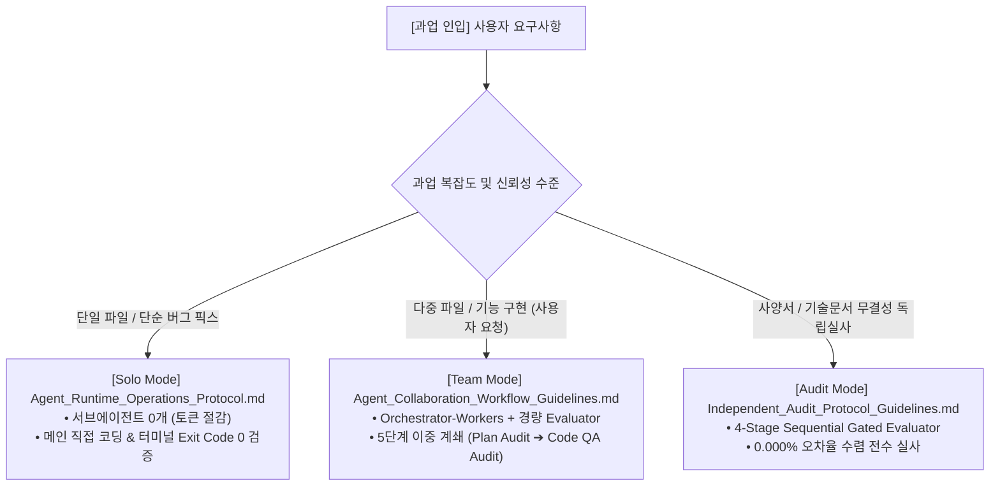

# AI Agent Architecture Paradigms Guidelines (에이전트 협동 메타 아키텍처 설계도 - Meta-Architecture Blueprint)

본 문서는 메인 에이전트가 새로운 과업, 도메인 또는 서브시스템을 마주했을 때, **하위 서브에이전트 팀을 동적으로 조직하거나 신규 작업 SOP/협동 템플릿을 직접 설계할 때 준수해야 하는 공식 메타 아키텍처 설계도(Meta-Architecture Blueprint)**입니다.

---

## 1. 글로벌 5대 핵심 워크플로우 패턴 카탈로그

복잡성에 매몰되지 않고, 해결하려는 과업의 본질에 가장 적합한 최소 단위의 워크플로우 패턴을 선택하여 조립합니다.

| 패턴 명칭 | 핵심 토폴로지 | 주요 메커니즘 | 최적 적용 과업 |
|---|---|---|---|
| **1) Prompt Chaining** | 직렬 파이프라인 | 이전 단계의 출력을 다음 단계의 입력으로 순차 전달 | 단계별 텍스트 정제, 포맷 변환, 코드 주석화 |
| **2) Routing** | 분류기 기반 분기 | 상위 라우터가 입력을 분석해 전문 프롬프트/도구로 트래픽 분기 | 다기종 언어/도메인 분류 (C++, WPF, WiX 등) |
| **3) Parallelization** | 병렬 분할/투표 | 하위 과제를 동시 수행하거나(Sectioning), 복수 결과 비교 합의(Voting) | 대규모 파일 전수 스캔, 독립 모듈 동시 분석 |
| **4) Orchestrator-Workers** | 중앙 지휘 분업 | 메인 에이전트가 과업을 동적으로 쪼개고 하위 워커에게 위임 후 취합 | **복합 기능 개발, 대규모 리팩토링, 탐색** |
| **5) Evaluator-Optimizer** | 생성-비평 루프 | 작성자(Writer)와 독립 감사관(Auditor)이 루브릭 기반으로 합격 시까지 반복 | **정적분석 사양서, 규격/보안 독립감사** |

---

## 2. 서브에이전트 조직 4대 설계 불변식 (Design Invariants)

서브에이전트를 동적으로 소환하거나 템플릿을 작성할 때, 에이전트 환각과 컨텍스트 오염을 방지하기 위해 다음 4대 규칙을 강제해야 합니다.

1. **단일 목적 분업 (Single Responsibility Principle)**:
   * 1명의 서브에이전트에게 복수의 역할을 혼재시키지 않습니다. (1 Worker = 1 Goal).
   * 과도한 에이전트 증식을 방지하며, 1명의 Orchestrator 당 **최대 2~3명의 소수 정예 워커**로 팀을 제한합니다.
2. **비대칭 권한 격리 (Asymmetric Authority Boundary)**:
   * 작성자(Main/Coder)에게만 소스코드 쓰기 권한을 부여합니다.
   * 감사관(Auditor/Evaluator)은 반드시 **파일 수정 도구 권한이 배제된 Read-Only 컨텍스트**로 소환하여 자가 확증 편향(Confirmation Bias)을 차단합니다.
3. **상태 원장(Progress Ledger) 기반 통신 프로토콜**:
   * 에이전트 간에 원시 대화 로그(Raw Logs)나 방대한 파일 전문을 교환하는 행위를 금지합니다.
   * 서브에이전트는 메인에게 회신할 때 반드시 **`[1. 작업 완료 상태, 2. 핵심 요약/포인터 목록, 3. 다음 권고 액션]`으로 압축된 상태 원장(Ledger)** 형태로 반환해야 합니다.
4. **터미널 네이티브 물리적 탈출 조건 (Terminal-Native Ground Truth)**:
   * 서브에이전트 루프나 게이트의 종료(PASS) 조건은 에이전트의 멘탈 판단에 의존할 수 없습니다.
   * 반드시 **백그라운드 터미널의 물리적 실행 결과(`Exit Code 0`, 무결점 로그, 테스트 통과)**만을 유일한 탈출 조건(Exit Condition)으로 삼아야 합니다.

---

## 3. 과업 복잡도별 아키텍처 선택 매트릭스

메인 에이전트는 과업 요구 수준에 따라 최적의 공식 실행 프로토콜을 선택합니다.

```mermaid
flowchart TD
    Task["[과업 인입] 사용자 요구사항"] --> Classify{"과업 복잡도 및 신뢰성 수준"}

    Classify -- "단일 파일 / 단순 버그 픽스" --> P1["[Solo Mode] Agent_Runtime_Operations_Protocol.md<br>• 서브에이전트 0개 (토큰 절감)<br>• 메인 직접 코딩 & 터미널 Exit Code 0 검증"]
    
    Classify -- "다중 파일 / 기능 구현 (사용자 요청)" --> P2["[Team Mode] Agent_Collaboration_Workflow_Guidelines.md<br>• Orchestrator-Workers + 경량 Evaluator<br>• 5단계 이중 계쇄 (Plan Audit ➔ Code QA Audit)"]
    
    Classify -- "사양서 / 기술문서 무결성 독립실사" --> P3["[Audit Mode] Independent_Audit_Protocol_Guidelines.md<br>• 4-Stage Sequential Gated Evaluator<br>• 0.000% 오차율 수렴 전수 실사"]
```

| 과업 성격 | 채택 아키텍처 토폴로지 | 공식 실행 프로토콜 (SOP) | 핵심 검증 오라클 |
|---|---|---|---|
| **상시 코딩 / 단순 픽스** | Solo Mode (Terminal Invariant) | [`Agent_Runtime_Operations_Protocol.md`](./Agent_Runtime_Operations_Protocol.md) | 백그라운드 터미널 `Exit Code 0` |
| **일상 개발 / 리팩토링** | Orchestrator-Workers + Dual-Gated | [`Agent_Collaboration_Workflow_Guidelines.md`](./Agent_Collaboration_Workflow_Guidelines.md) | Gate 1(계획) + Gate 2(코드 QA) [PASS] |
| **고신뢰성 문서 독립감사** | Strict 4-Stage Sequential Evaluator | [`Independent_Audit_Protocol_Guidelines.md`](./Independent_Audit_Protocol_Guidelines.md) | 4단계 순차 계쇄 및 2회 연속 수렴 |

---

## 4. 멀티 에이전트 구축 시 7대 안티패턴 방어 체크리스트

신규 워크플로우 템플릿을 설계하거나 서브에이전트를 호출할 때 다음 결함이 없는지 교차 검증합니다:

* [ ] **Self-Review 금지**: 자신이 작성한 계획이나 코드를 동일 컨텍스트에서 스스로 승인하고 있지 않은가? (독립 Evaluator 필수)
* [ ] **Premature Parallelization 금지**: 선행 게이트(Gate 1) 통과 전에 후속 에이전트를 조기 병렬 호출하지 않았는가?
* [ ] **Omniscient Monolith 금지**: 단일 프롬프트에 기획, 구현, 검증 책임을 모두 쑤셔 넣지 않았는가? (SRP 준수)
* [ ] **Unbounded Loop 금지**: 탈출 조건 없는 무한 루프 위험이 없는가? (최대 3회 제한 및 서킷 브레이커 설정)
* [ ] **Lazy Auditor 금지**: 감사관이 샘플링에 의존하지 않고 전수(100%) 물리 대조를 수행하도록 강제했는가?
* [ ] **Context Pollution Drift 금지**: 서브에이전트가 전문 대화 로그 대신 요약 상태 원장(Ledger)만 반환하는가?
* [ ] **Role Blurring 금지**: 감사관(Auditor)이 직접 소스코드를 수정하지 못하도록 Read-Only 권한이 격리되었는가?
