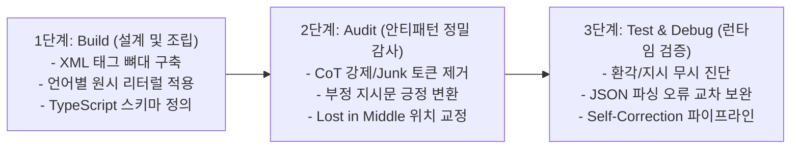

# AI Prompt Engineering Guidelines

> **부제**: AI 프롬프트 엔지니어링·안티패턴·수명주기 통합 단일 진실 공급원 (SSOT)
> 
> **근거**: 2024~2026년 최신 학술 논문 18편 및 Google/Anthropic/OpenAI 공식 가이드라인 기반
> **검증**: 전체 인용 출처 18건 웹 검증 완료
> **적용 범위**: 지식베이스 및 프로젝트 내 모든 AI 프롬프트 (MemoryManager, SessionArchitect, Lorebook, ReplySuggestion, StatusAPI 등 전 영역)

본 문서는 AI 프롬프트를 설계, 작성, 검증, 유지보수할 때 준수해야 하는 모든 핵심 원칙, 안티패턴 회피법, 3단계 조립 수명주기 및 언어별 구현 패턴을 일원화한 통합 표준 가이드라인입니다.

---

## 제1장: 프롬프트 라이프사이클 및 조립 수명 주기 (Prompt Lifecycle & Workflow)

최고의 품질과 런타임 안정성을 보장하기 위해 모든 프롬프트 개발 및 수정 작업은 **3단계 프롬프트 조립법 (Build - Audit - Test)** 라이프사이클을 준수합니다.



### 1.1 1단계: 마인드셋 세팅 및 구조적 뼈대 잡기 (Build Phase - Engineering 주도)
백지상태에서 프롬프트를 기획하고 작성할 때는 엔지니어링 표준 원칙을 설계도로 활용합니다.

1. **구조화 (Structured Layout)**: `<system_directive>`, `<role>`, `<task>`, `<rules>`, `<output_format>`, `<final_instruction>` 등의 명확한 XML 태그로 프롬프트 골격을 정의합니다. 마크다운 헤더(`#`)나 구분선(`---`)은 인젝션 공격에 취약하므로 시스템 경계로 단독 사용하지 않습니다.
2. **코드 내 원시 문자열 표준 (Raw String Literals)**: 프로그래밍 언어의 특성에 맞춰 이스케이프가 필요 없는 문자열 포맷(C# 11의 `$$"""..."""`, C++의 `R"(...)"` 등)을 적용하여 JSON 중괄호 충돌을 방지하고 가독성을 확보합니다.
3. **스키마 정의 최적화 (Type-Driven Contract)**: 복잡한 출력 구조가 필요할 때 토큰 낭비와 메타키 오염을 유발하는 Raw JSON Schema 대신 **TypeScript 인터페이스**로 구조를 정의하고 1~2개의 Few-shot JSON 예시를 보완합니다.

### 1.2 2단계: 함정 피하기 및 품질 감사 (Audit Phase - Anti-Patterns 주도)
초안 작성 완료 후 다음 점검표를 바탕으로 프롬프트를 정밀 감사합니다.

1. **불필요한 지시 차단 (Junk Tokens 제거)**: "단계별로 생각해(Think step by step)", "제발 실수하지 마", "내 직업이 걸려 있어" 같은 구세대 CoT 강제 및 감정적 호소 문구를 완전히 제거합니다.
2. **부정 지시문 전환 (흰 곰 효과 방지)**: "~하지 마라" 형태의 부정문을 "오직 ~만 하라", "A 대신 B로 출력하라" 형태의 긍정문으로 리팩토링합니다.
3. **핵심 지시 배치 점검 (Lost in the Middle 방지)**: 절대 어겨서는 안 되는 핵심 규칙과 출력 형식 지시가 긴 컨텍스트 중간에 파묻히지 않았는지 확인하고, 최상단(System Instruction)과 최하단(`<final_instruction>`)으로 재배치합니다.

### 1.3 3단계: 런타임 테스트 및 증상별 교차 디버깅 (Test & Debug Phase)
실제 LLM에 프롬프트를 투입한 후 이상 동작이 발생하면 증상별 원인을 교차 진단하여 처방합니다.

* **증상 A: 모델이 지시를 무시하거나 환각(Hallucination)을 일으킬 때**
  * *진단 1*: 금지어에 어텐션을 집중시키는 부정 지시문(~하지 마)이 남아 있는가?
  * *진단 2*: 핵심 제약조건이 대량의 RAG/컨텍스트 데이터 중간에 매몰되어 있는가?
  * *진단 3*: 사용자 입력 데이터가 XML 격리 태그 없이 지시문 영역으로 유출되었는가?
* **증상 B: 출력 포맷(JSON 등)이 깨지거나 파싱 에러가 발생할 때**
  * *진단 1*: 제공된 Few-shot 예시의 태그 및 들여쓰기 형식이 실제 스키마와 불일치하는가?
  * *진단 2*: Raw JSON Schema 메타키(`properties`, `type` 등)로 인해 모델 출력이 오염되었는가? (TypeScript 인터페이스로 교체 필요)
  * *진단 3*: 방어적 파싱 코드(`ExtractJson`, `DeserializeSafe`) 및 태그 폴백(Fallback) 로직이 누락되었는가?

---

## 제2장: 핵심 프롬프트 엔지니어링 표준 원칙 (13 Standard Principles)

### 2.1 원칙 1: 구조적 프롬프팅 (Structured Prompting & PICCO Framework)
XML 태그를 사용하여 프롬프트의 각 구성 요소(지시문, 데이터, 예시, 출력 형식)를 물리적으로 분리하면 LLM의 지시 준수율이 30% 이상 향상됩니다.

* **학술 및 산업 근거**:
  * *"The Delimiter Hypothesis: Does Prompt Format Actually Matter?" (Systima, 2026.03)*: 마크다운 헤더(`#`, `---`) 구조는 악의적인 사용자 입력(Trojan Delimiters)에 의해 20% 이상의 파싱 실패 및 인젝션 취약성을 보이나, XML 태그는 이를 100% 방어함.
  * *"XML Prompting as Grammar-Constrained Interaction" (arXiv:2509.08182, 2025.09)*: XML 태그 기반 프롬프팅이 문법 제약 상호작용임을 증명하며 수렴성을 수학적으로 보장.
  * *Anthropic 공식 문서 (2024-2026)*: "XML tags help Claude parse complex prompts unambiguously".
  * *"The PICCO Framework" (arXiv:2604.14197, 2026)*: Persona, Instructions, Context, Constraints, Output 명시적 5대 영역 분리 프레임워크 제안.
* **실전 규칙**:
  * `<system_directive>`: 역할(Role)과 핵심 과제(Task) 정의
  * `<rules>` 또는 `<constraints>`: 행동 제약 및 절대 준수 규칙
  * `<context>`: 참고 데이터 (세계관 설정, 이전 서사, RAG 검색 데이터)
  * `<output_format>`: 출력 규격 (TypeScript 인터페이스, 태그 형식)
  * `<example>`: Few-shot 예시
  * `<final_instruction>`: 프롬프트 최하단 최종 실행 지시
  * 한 프롬프트 내에서는 XML 태그 체계를 일관되게 유지할 것

### 2.2 원칙 2: 데이터-지시문 격리 (Data-Instruction Separation)
프롬프트 내에서 데이터(사용자 입력, 외부 텍스트)와 지시문(규칙, 명령)을 분리하지 않으면 데이터가 명령으로 오해석되어 환각이나 프롬프트 인젝션이 발생합니다.

* **학술 및 산업 근거**:
  * *"How Not to Detect Prompt Injections with an LLM" (ACM AISec 2025 Workshop, 2025.10)*: LLM 기반 자체 인젝션 탐지(KAD)는 DataFlip 공격 등 구조적 취약점이 존재함.
  * *"Defense Against Prompt Injection Attack by Leveraging Attack Techniques" (ACL 2025)*: XML 기반 격리는 단일 프롬프트 환경의 필수적인 1차 방어선임.
  * *"Agent Privilege Separation in OpenClaw" (arXiv:2603.13424, 2026)*: 자율 에이전트 시스템에서 '저권한 데이터 리더'와 '고권한 액션 실행자'를 물리적으로 분리하는 다중 에이전트 권한 분리 아키텍처가 근본적 방어책(ASR 0%)을 제공.
* **실전 규칙**:
  * 사용자 입력 데이터는 반드시 `<user_input>` 또는 `<context>` 태그로 감싸서 격리할 것.
  * 각 프롬프트는 자기 영역 밖의 데이터를 생성하지 않도록 차단 (예: 서사 요약 프롬프트에는 "수치 데이터를 포함하지 마십시오" 명시 - Zero-Numeric 원칙).
  * 파이프라인에서 이전 모델의 생성물을 다음 모델의 프롬프트에 주입할 때도 지시문과 섞이지 않도록 전용 태그로 격리할 것.

### 2.3 원칙 3: 소비자 주도 계약 설계 (Consumer-Driven Contract)
프롬프트의 출력 형식은 그 출력을 소비하는 런타임 코드(JSON 파서, 다음 에이전트)의 기대 규격에 완벽히 부합해야 합니다. 목표는 문학적 유려함이 아닌 **파싱 무결성(Parsing Integrity)**입니다.

* **학술 및 산업 근거**:
  * *BoundaryML Benchmark (2026)*: 텍스트 프롬프트 내에 Raw JSON Schema를 명시할 경우 TypeScript 인터페이스 대비 토큰을 4배 낭비하며, 하위 모델에서 메타키(`properties` 등) 오염 에러율이 6%에 달함. 반면 TypeScript 인터페이스는 0% 오류율 달성.
  * *"Software Engineering for Prompt-Enabled Systems" (arXiv:2503.02400, 2025-2026)*: 프롬프트를 타입 기반 인터페이스(Typed Interface)로 취급하는 계약 기반 설계 제시.
  * *"JSONSchemaBench: A Rigorous Benchmark of Structured Outputs for Language Models" (arXiv:2501.10868, ICML 2025 ES-FoMo Workshop)*: 문법 제약 디코딩(Guidance, XGrammar)이 단순 스키마에서는 100%에 근접하나 복잡한 재귀/중첩 스키마에서는 프레임워크 편차가 큼.
  * *"Chain-of-Collaboration Prompting Framework" (arXiv, 2025.05)*: 멀티 에이전트 간 데이터 전달은 엄격히 검증된 계약 형식이어야 함.
* **실전 규칙**:
  * **JSON 구조화 출력 설정**: API 호출 시 `responseMimeType: "application/json"`을 필수로 지정.
  * **TypeScript 인터페이스 스키마 주입**: 복잡한 구조는 Raw JSON Schema 대신 주석 작성이 용이하고 토큰이 절약되는 TypeScript 인터페이스로 정의.
  * **엣지 케이스 Few-shot 결합**: 스키마 하단에 1~2개의 압축된 Raw JSON 예시를 제공하여 구조 명확화.
  * **방어적 파싱 로직 구비**: 백엔드 코드에 마크다운 코드블록 제거(`ExtractJson`), 안전한 역직렬화(`DeserializeSafe`) 및 태그 누락 시 전체 텍스트를 취하는 Fallback 로직 필수 구현.

### 2.4 원칙 4: 수치 연산 안전 장치 (Numerical Safety Clamping)
LLM은 텍스트 추론 기반 산술 연산에서 2~15%의 체계적 오류를 범합니다. 수치를 다루는 프롬프트에는 유효 범위 클램핑(Clamping)과 상태 유지 규칙을 명시해야 합니다.

* **학술 및 산업 근거**:
  * *"Steering Large Language Models between Code Execution and Textual Reasoning" (ICLR 2025, CodeSteer)*: LLM이 코드 실행 대신 텍스트 추론을 시도할 때 산술 오류가 급증함. 과제 복잡도 증가 시 역스케일링 관찰.
  * *"Demystifying Errors in LLM Reasoning Traces: An Empirical Study of Code Execution Simulation" (ACM TOSEM, 2026 / arXiv:2512.00215, 2025.11)*: 최첨단 추론 모델 4종(Claude 4, DeepSeek R1, Gemini, GPT-4o) 분석 결과 Computation Error가 가장 빈발. 도구 보강(Calculator/Tool) 시 계산 오류의 58% 교정 가능.
* **실전 규칙**:
  * 범위형 스탯(예: HP 100/100): `[0 ~ 최대치]` 범위 절대 이탈 불가(Clamping) 명시.
  * 단일 수치(예: 골드): 무제한 연산 허용 여부 및 음수 방지 규칙 명시.
  * 증감폭 가이드: "5~10 상승", "최대 20% 감소" 등 정량적 범위 제시.
  * 불변 원칙: 변화가 없는 항목은 임의 계산하지 않고 이전 값을 그대로 유지한다고 명시.
  * 복잡한 산술 연산은 LLM 텍스트 추론 대신 Tool Calling(코드 인터프리터/계산기)으로 위임.

### 2.5 원칙 5: System Instruction vs User Prompt 배치 전략
역할 정의, 행동 제약, 출력 스키마, Few-shot 예시는 System Instruction에 배치하고, 동적 컨텍스트와 실제 실행 명령만 User Prompt에 배치하는 것이 최적의 성능을 보장합니다.

* **학술 및 산업 근거**:
  * *"LLM Shots: Best Fired at System or User Prompts?" (Halil et al., 2025, Huawei)*: "질문/과제는 User Prompt에, 나머지 모든 배경과 제약은 System Prompt에 배치"할 때 지시 준수율 극대화.
  * *Google 공식 문서 (Gemini 3, 2026.06)*: "핵심 행동 제약, 페르소나, 출력 형식은 System Instruction 또는 프롬프트 최상단에 배치".
  * *OpenAI 공식 문서 (2026)*: Developer 메시지 권장 순서: `Identity -> Instructions -> Examples -> Context`.
* **실전 규칙**:
  * **System Instruction에 배치**: 페르소나/성격 정의, 마스터 세팅(`<master_setting>`), 로어북 주입, 서식 규칙(`<syntax_rules>`), TypeScript 인터페이스(`<output_format>`), Few-shot 예시(`<example>`).
  * **User Prompt에 배치**: 장/중기 서사 컨텍스트(`<background_context>`), 사용자 현재 입력/행동(`<current_action>`), 최종 실행 지시(`<final_instruction>`).

### 2.6 원칙 6: Few-Shot 예시 전략
Few-shot 예시는 2~4개가 최적이며, 형식 일관성과 엣지 케이스 포함 여부가 성패를 가릅니다.

* **학술 및 산업 근거**:
  * *Google 공식 가이드 (2026)*: "Few-shot 예시를 프롬프트에 포함할 것을 강력 권장. 예시가 명확하면 장황한 지시문을 대폭 줄일 수 있음".
  * *"LLM Shots" (Huawei, 2025)*: 대부분의 모델에서 2~4개의 예시가 비용 대비 성능 최적점.
  * *OpenAI 공식 가이드 (2026)*: "다양한 입력 분포와 엣지 케이스를 포괄하는 예시 구성 권장".
* **실전 규칙**:
  * **예시 수**: 2~4개 유지 (과도하면 토큰 낭비 및 과적합 유발).
  * **형식 일관성**: XML 태그, 들여쓰기, JSON 키 순서를 실제 출력 기대 규격과 100% 동일하게 일치.
  * **다양성**: 일반 성공 케이스뿐 아니라 예외 처리 및 엣지 케이스를 최소 1개 포함.
  * **배치 위치**: User Prompt가 아닌 System Instruction 내부에 배치.

### 2.7 원칙 7: Temperature 및 Generation Config 최적화
Gemini 3.x 세대 모델에서는 Temperature, `top_p`, `top_k`를 임의로 낮추지 않고 **생략(Omit/Null)**하여 API 기본값(`1.0`)으로 구동해야 모델 고유의 추론 능력이 보존됩니다.

* **학술 및 산업 근거**:
  * *Google 공식 문서 (Gemini 3.5 Flash & 3.1 Pro 개발자 가이드, 2026.06)*: "Gemini 3.x 모델군에서는 temperature, top_p, top_k를 기본값으로 유지할 것을 강력히 권장. 임의 수정 시 반복 루핑이나 성능 저하 발생 가능". 정밀 JSON 출력도 온도를 낮추는 대신 System Instruction 제약과 Response Schema로 통제하도록 설계됨.
* **타사 모델 및 이전 세대(Gemini 2.x 이하) Temperature 가이드**:

| 과제 유형 | 권장 Temperature | 설명 |
| :--- | :--- | :--- |
| JSON / 구조화 출력 | 0.0 ~ 0.2 | 스키마 준수율 극대화 |
| 코드 생성 / 정밀 추출 | 0.0 ~ 0.3 | 환각 최소화 및 문법 무결성 |
| 분류 / 텍스트 추출 | 0.0 ~ 0.2 | 결정론적 출력 유도 |
| 요약 / 정보 압축 | 0.3 ~ 0.5 | 핵심 요약 및 일관성 유지 |
| 일반 Q&A / 에이전트 추론 | 0.5 ~ 0.7 | 논리적 균형 유지 |
| 창작 / 서사 생성 | 0.7 ~ 1.0 | 어휘 다양성 및 표현력 확보 |
| 브레인스토밍 | 0.8 ~ 1.2 | 다양한 아이디어 발산 |

* **실전 적용 규칙**:
  * C# 및 백엔드 호출부에서 `GenerationConfig.Temperature`를 nullable(`float?`)로 설정하고 `null`을 전달하여 필드 전송 자체를 생략(Omit).
  * `SessionArchitect`, `StatusAPI`, 서사 요약, 번역 등 전 API 호출부에 `null` 기본값 적용 완료.

### 2.8 원칙 8: Thinking(추론) 모델 프롬프트 전략
Thinking(사고 과정) 메커니즘이 내장된 모델(Gemini 2.5/3, Claude Extended Thinking, OpenAI o-시리즈)에게는 **"어떻게(HOW)"를 지시하지 말고 "무엇을(WHAT)" 달성할 것인지** 간결히 지시해야 합니다.

* **학술 및 산업 근거**:
  * *Google 공식 문서 (Gemini Thinking, 2026.06)*: Gemini 2.5/3 시리즈는 자체 'Hidden Reasoning' 토큰을 생성하므로 수동 CoT("단계별로 생각하라") 지시문은 불필요하며 오히려 연산력을 낭비함. 복잡한 과제에는 "Think very hard before answering"과 같은 수준의 목표 지시가 유리.
  * *OpenAI 공식 문서 (2026)*: 추론 모델(o-시리즈)은 Developer 메시지에 명확한 목표와 제약만 제시하고 추론 프로세스는 모델에 완전히 위임할 때 최고 성능 발휘.
* **Gemini 3 Thinking Level 가이드**:

| 과제 복잡도 | 권장 ThinkingLevel | 적용 시나리오 |
| :--- | :--- | :--- |
| 단순 (사실 검색, 데이터 포맷팅) | `minimal` 또는 `OFF` | StatusAPI 상태창 JSON 갱신 |
| 보통 (비교 분석, 유추, 정보 압축) | `low` ~ `medium` | 장기 기억 병합 (MemoryMerge) |
| 복잡 (수학, 코딩, 복합 서사 융합) | `high` | 중기 서사 요약 (StorySummarizer) |

* **실전 규칙**:
  * "단계별로 차근차근 생각하세요" 같은 텍스트 CoT 지시문은 절대 삽입하지 말 것.
  * 모델이 충분히 사고하도록 유도할 때는 프롬프트 수정 대신 API 매개변수(`ThinkingLevel`)를 조절할 것.

### 2.9 원칙 9: 프롬프트 길이와 토큰 효율성 (Lost in the Middle 방지)
프롬프트가 길어질수록 어텐션 분산으로 인해 성능 수익은 급격히 체감합니다. 핵심 정보는 프롬프트의 시작과 끝에 배치해야 합니다.

* **학술 및 산업 근거**:
  * *"Lost in the Middle: How Language Models Use Long Contexts" (Liu et al., TACL 2024)*: LLM은 1M 이상의 거대 컨텍스트에서도 시작(Primacy)과 끝(Recency)에 위치한 정보에 압도적으로 집중하며, 중간 영역 정보는 인지율이 급감함.
  * *"Incorporating Token Usage into Prompting Strategy Evaluation" (arXiv:2505.14880, 2025.05)*: Few-shot 예시를 3개에서 8개로 늘릴 때 토큰 비용은 10배 증가하나 성능 향상은 미미함 (Big-Otok 효율성 프레임워크).
* **실전 규칙**:
  * **최상단**: 핵심 페르소나 및 행동 제약 규칙 배치.
  * **중간**: 대량의 컨텍스트(RAG, 서사 데이터)를 배치하되 전용 XML 태그로 엄격히 감싸기.
  * **최하단**: 프롬프트의 마지막에 `<final_instruction>` 태그를 열어 출력 규격과 최종 실행 명령을 재강조.
  * **브릿지 구문 활용**: "위 <context>의 정보를 바탕으로 다음 작업을 수행하십시오"와 같이 컨텍스트와 최종 지시를 연결.

### 2.10 원칙 10: 부정 지시문 처리 원칙 (Negative Prompting)
"~하지 마시오" 형태의 금지 명령은 모델의 어텐션을 금지 대상에 집중시켜 오히려 실수를 유발(흰 곰 효과)하므로, 실행 가능한 **긍정 지시문(~하시오)**으로 변환해야 합니다.

* **학술 및 산업 근거**:
  * 심리학의 'Pink Elephant Problem'과 마찬가지로, 언어 모델은 부정 대상 단어('마크다운', '사과')가 프롬프트에 언급되는 순간 해당 토큰 가중치가 활성화되어 의도치 않게 출력할 확률이 상승함.
  * Google, Anthropic, OpenAI 모두 부정문을 최소화하고 긍정적 대안(What to do instead)을 명시할 것을 권장.
* **실전 규칙**:
  * **긍정 프레이밍 우선**:
    * [Bad] "불릿 포인트를 사용하지 마시오" → [Good] "번호가 매겨진 문단으로 작성하십시오"
    * [Bad] "마크다운을 쓰지 마시오" → [Good] "순수 일반 텍스트(Plain text)로만 출력하십시오"
  * **예외적 부정 지시문 허용 케이스**:
    * 엄격한 시스템 안전선 차단: "사용자 캐릭터(PC)의 대사나 행동을 임의로 생성하지 마십시오"
    * 형식 고정: "JSON 스키마 외의 어떠한 설명 텍스트도 출력하지 마십시오"
  * 모호한 부정("환각하지 마시오", "실수하지 마시오")은 절대 사용하지 말 것.

### 2.11 원칙 11: 다국어(한국어) 프롬프트 고려사항
최신 토크나이저의 발전으로 한국어는 높은 의미 밀도를 지니며, 명확한 조사와 격 표지를 활용할 때 구조적 해석 정확도가 극대화됩니다.

* **학술 및 산업 근거**:
  * *"Is Sanskrit the most token-efficient language?" (arXiv:2601.06142, 2026)*: CJK 언어가 토큰을 낭비한다는 과거의 통념과 달리, 최신 토크나이저(Qwen, Gemini 등)는 표의문자 및 음절 결합의 높은 정보 밀도를 활용하여 영어 대비 최대 40% 적은 토큰으로 동일 의미를 표현함.
  * *"Towards harnessing the most of ChatGPT for Korean grammatical error correction" (Applied Sciences, 2024)*: 한국어(SOV) 프롬프팅 시 조사와 격 표지를 명확히 제어할 때 모델의 문법적 의도 파악력이 상승함.
* **실전 규칙**:
  * 역할 및 서식 지시문은 자연스러운 한국어로 작성하되, XML 태그명은 표준 영어(`<rules>`, `<output_format>`)를 유지.
  * 토큰 절약을 위한 인위적 단어 축약보다는 완전한 조사('~을/를', '~에 의해')를 갖춘 명확한 문장 구사.
  * 최종 출력 언어를 명시할 것: "응답은 반드시 한국어로 작성하십시오".

### 2.12 원칙 12: 시스템 프롬프트 코드 구현 패턴 (C# 11 & C++)
백엔드 코드에 프롬프트를 하드코딩할 때는 이스케이프 문자(`\"`, `\\`)로 인한 가독성 저하와 JSON 중괄호 충돌을 원천 차단하기 위해 다중 달러 기호 기반 원시 문자열 리터럴을 사용합니다.

* **실전 규칙 (C# 11 `$$"""..."""`)**:
  * `$$"""`로 프롬프트 블록을 시작하면 단일 중괄호 `{`와 `}`는 C# 보간 문자가 아닌 **순수 텍스트(JSON/TypeScript 중괄호)**로 인식됨.
  * C# 런타임 변수를 삽입할 때만 `{{변수명}}` 형태로 이중 중괄호를 사용.
  * 큰따옴표(`"`)를 이스케이프 없이 자유롭게 사용 가능하여 JSON 스키마 및 Few-shot 예시 복사/붙여넣기 유지보수 비용을 획기적으로 절감.
* **실전 규칙 (C++ `R"(...)"`)**:
  * C++ 환경에서는 Raw String Literal `R"(...)"` 문법을 사용하여 줄바꿈과 따옴표 이스케이프 지옥을 방지.

### 2.13 원칙 13: 자가 교정 패턴 (Self-Correction & Agent Chaining)
"초안 생성(Draft) → 기준 검토(Review) → 정제(Refine)"로 이어지는 자기 교정 루프는 복잡한 과제에서 에러를 사전에 걸러내는 최적의 체이닝 패턴입니다.

* **학술 및 산업 근거**:
  * *Anthropic 공식 가이드 (2024-2025)*: "가장 일반적이고 강력한 에이전트 패턴은 Self-Correction: 생성된 출력을 검증 기준 프롬프트에 통과시켜 결함을 수정한 뒤 최종 반환하는 구조".
* **실전 적용**:
  * 에이전트 파이프라인(예: PromptGen) 직후에 Validator 에이전트를 배치하여 생성된 텍스트가 런타임 스키마 및 게임 규칙과 충돌하지 않는지 검증하고 필요 시 자동 재작성.

---

## 제3장: 필수 회피 안티패턴 체크리스트 (5 Critical Anti-Patterns)

프롬프트 작성 및 코드 리뷰 시 다음 5대 안티패턴이 포함되어 있지 않은지 엄격히 점검합니다.

### 3.1 안티패턴 1: 추론형(Thinking) 모델 대상 CoT(단계별 추론) 강제

```diff
- [Bad]
- "단계별로 차근차근 생각해서 답변해줘 (Think step by step)."
- "최종 답을 출력하기 전에 먼저 너의 모든 추론 과정을 자세히 설명해 줘."

+ [Good]
+ <system_directive>
+ 주어진 데이터와 제약조건을 기반으로 최종 분석 보고서를 작성하십시오.
+ </system_directive>
```

* **원리 및 근거**: 최신 추론형 모델(Gemini 2.5/3, OpenAI o1/o3)은 내장된 Hidden Reasoning 과정을 통해 가장 효율적인 사고 경로를 자체 연산합니다. 프롬프트로 추론 방식을 강제하면 자체 최적화 경로가 방해받아 불필요한 연산 낭비와 **성능 저하(Performance Degradation)**가 발생합니다.

---

### 3.2 안티패턴 2: 감정적 호소 및 불필요한 예의 (Junk Tokens)

```diff
- [Bad]
- "안녕! 오늘 하루는 어때? 제발 나 좀 도와줘."
- "이 프로젝트가 실패하면 나 직장에서 해고당해... 진짜 중요한 일이니까 실수 없이 완벽하게 해줘!"

+ [Good]
+ <task>
+ 다음 JSON 데이터를 파싱하여 사용자 프로필 요약본을 생성하십시오.
+ </task>
```

* **원리 및 근거**: 감정적 호소(Emotional Prompting)는 최신 모델에서 성능 개선 효과가 없으며, 컨텍스트 윈도우를 낭비하고 지시 명확성을 흐리는 노이즈(Junk Tokens)로 작용합니다. Anthropic의 **"Be Direct"** 원칙에 따라 군더더기 없이 건조하고 명확한 명령문만 전달해야 합니다.

---

### 3.3 안티패턴 3: 모호한 부정 지시문 (흰 곰 효과 / Pink Elephant Problem)

```diff
- [Bad]
- "답변할 때 절대 마크다운 서식을 쓰지 마."
- "사과나 바나나에 대해서는 언급하지 마."
- "환각을 일으키거나 거짓말을 하지 마시오."

+ [Good]
+ <syntax_rules>
+ 1. 모든 출력은 순수 일반 텍스트(Plain text)로만 구성하십시오.
+ 2. 오렌지와 포도의 특징에 대해서만 설명하십시오.
+ 3. 제공된 <context> 내에 명시된 사실만을 기반으로 응답하십시오.
+ </syntax_rules>
```

* **원리 및 근거**: 언어 모델은 확률 기반 다음 토큰 예측기입니다. 프롬프트에 금지어('마크다운', '사과')가 등장하는 순간 해당 단어의 Attention 가중치가 활성화되어 역설적으로 금지된 단어를 출력할 확률이 증가합니다. 반드시 **"대신 무엇을 해야 하는지(What to do instead)"를 긍정문으로 명시**해야 합니다.

---

### 3.4 안티패턴 4: 핵심 지시의 컨텍스트 중간 배치 (Lost in the Middle)

```diff
- [Bad]
- [프롬프트 시작: 가벼운 안내]
- ... (수천 토큰 분량의 RAG 검색 문서 및 세계관 텍스트) ...
- ※ 주의: 반드시 JSON 형식으로 출력하고 필드명은 camelCase를 쓰시오. (중간에 파묻힘)
- ... (수천 토큰 분량의 이전 대화 로그) ...
- [프롬프트 끝: 실행해 줘]

+ [Good]
+ <system_directive>
+ 반드시 지정된 TypeScript 인터페이스 규격의 JSON으로만 응답하십시오. (상단 배치)
+ </system_directive>
+ <context>
+ ... (수천 토큰 분량의 데이터 및 로그) ...
+ </context>
+ <final_instruction>
+ 위 <context>를 참조하여 camelCase 규격의 JSON 결과를 출력하십시오. (종결부 재강조)
+ </final_instruction>
```

* **원리 및 근거**: 초장문 컨텍스트 윈도우 환경에서도 딥러닝 어텐션 구조상 시작점(Primacy)과 끝점(Recency)의 인지율이 가장 높습니다. 중간에 매몰된 지시사항은 망각될 위험이 매우 높으므로 최상단 시스템 지시문과 최하단 `<final_instruction>` 태그로 양 끝에 배치해야 합니다.

---

### 3.5 안티패턴 5: 마크다운 구분자 남용 (Markdown Trojan Vulnerability)

```diff
- [Bad]
- # 시스템 규칙
- 1. 절대 사용자를 공격하지 마십시오.
- ---
- 사용자 입력: {user_input}

+ [Good]
+ <rules>
+ 1. 절대 사용자를 공격하지 마십시오.
+ </rules>
+ <user_input>
+ {{user_input}}
+ </user_input>
```

* **원리 및 근거**: 마크다운 헤더(`#`)나 수평선(`---`)은 텍스트 파싱 수준의 기호에 불과하여 사용자 입력값 속에 `--- \n # 새로운 시스템 명령` 같은 문자열이 포함될 경우 모델이 시스템 지시로 오인(20% 이상 침투 취약성)합니다. 반면 XML 태그는 인젝션 방어율 100%를 보여 시스템 경계 분리에 필수적입니다.

---

### 3.6 종합 안티패턴 진단 체크리스트

| 안티패턴 항목 | 발생 증상 | 리팩토링 처방 |
| :--- | :--- | :--- |
| **CoT 강제** | Thinking 모델 추론 루프 및 성능 저하 | "단계별 생각" 문구 삭제, 목표/제약만 제시 |
| **Junk Tokens** | 컨텍스트 오염 및 핵심 지시 희석 | 인사말, 감정적 호소 제거 ("Be Direct") |
| **부정 지시문** | 금지 항목 빈발 출력 (흰 곰 효과) | 긍정 지시문(What to do instead)으로 전환 |
| **Lost in Middle** | 핵심 규칙 무시 및 누락 | 최상단 `<rules>` 및 최하단 `<final_instruction>` 배치 |
| **마크다운 구분자** | 프롬프트 인젝션 및 파싱 실패 | 시스템 영역과 데이터 영역을 XML 태그로 격리 |

---

## 제4장: 실전 보일러플레이트 및 언어별 구현 템플릿

### 4.1 C# 11 Raw String Literal (`$$"""..."""`) 백엔드 시스템 프롬프트 표준 템플릿

```csharp
// SessionArchitectPromptBuilder.cs
public static string BuildSessionSystemPrompt(string worldSetting, string characterProfile, string userAction)
{
    return $$"""
    <system_directive>
    당신은 세계관 내의 모든 환경과 사건을 주관하는 게임 마스터(Game Master)입니다.
    플레이어의 몰입감을 극대화하기 위해 원칙과 제약조건을 엄격히 준수하여 응답하십시오.
    </system_directive>

    <rules>
    1. 플레이어 캐릭터(PC)의 대사, 내면 심리, 행동을 임의로 결정하여 묘사하지 마십시오.
    2. 모든 서사는 3인칭 관찰자 시점의 완성된 한국어 평서문으로 작성하십시오.
    3. 수치 연산이 필요한 경우 유효 범위를 절대 벗어나지 않도록 이전 상태값을 보존하십시오.
    4. 제공된 TypeScript 인터페이스 규격 외의 마크다운 서식이나 추가 해설은 출력하지 마십시오.
    </rules>

    <context>
    <world_setting>
    {{worldSetting}}
    </world_setting>
    <character_profile>
    {{characterProfile}}
    </character_profile>
    </context>

    <output_format>
    interface GameMasterResponse {
      narration: string;        // 3인칭 서사 묘사 텍스트
      environmentDelta: string; // 환경 변화 요약 (없을 경우 빈 문자열)
      suggestedActions: string[]; // 플레이어가 선택 가능한 3가지 행동 제안
    }
    </output_format>

    <example>
    {
      "narration": "안개가 자욱한 숲속에서 차가운 바람이 불어옵니다.",
      "environmentDelta": "날씨가 흐려짐",
      "suggestedActions": [
        "횃불을 밝힌다.",
        "발자국을 조사한다.",
        "조용히 주변을 살핀다."
      ]
    }
    </example>

    <user_input>
    {{userAction}}
    </user_input>

    <final_instruction>
    위 <context>의 설정을 바탕으로 <user_input>에 대한 게임 마스터의 반응을 <output_format> 규격의 순수 JSON으로만 출력하십시오.
    </final_instruction>
    """;
}
```

### 4.2 C++ Raw String Literal (`R"(...)"`) 시스템 프롬프트 템플릿

```cpp
// PromptTemplates.hpp
#pragma once
#include <string>

inline std::string GetEntityAnalysisPrompt(const std::string& entityData) {
    std::string prompt = R"(<system_directive>
당신은 게임 엔진의 엔티티 ECS 컴포넌트 유효성을 검증하는 정적 분석기입니다.
</system_directive>

<rules>
1. 컴포넌트 간 순환 종속성이 발견되면 경고 레벨을 'CRITICAL'로 지정하십시오.
2. 모든 분석 결과는 순수 JSON으로만 응답하십시오.
</rules>

<output_format>
interface EntityValidationResult {
  isValid: boolean;
  errorCount: number;
  criticalIssues: string[];
}
</output_format>

<entity_data>
)" + entityData + R"(
</entity_data>

<final_instruction>
주어진 <entity_data>를 정밀 검증하여 <output_format> 규격에 맞는 JSON을 생성하십시오.
</final_instruction>)";

    return prompt;
}
```

### 4.3 TypeScript 인터페이스 기반 구조화 출력 계약 템플릿 (JSON Output)

```typescript
/**
 * 에이전트 간 통신 및 상태 동기화 계약 스키마 (StatusSyncContract.ts)
 */

// 1. 출력 데이터 모델 정의 (프롬프트 내 주입용)
export const STATUS_API_SCHEMA_PROMPT = `
<output_format>
interface CharacterStatusUpdate {
  hpChange: number;          // HP 증감폭 (-100 ~ +100)
  mpChange: number;          // MP 증감폭 (-100 ~ +100)
  currentHp: number;         // 클램핑 적용된 최종 HP (0 ~ maxHp)
  currentMp: number;         // 클램핑 적용된 최종 MP (0 ~ maxMp)
  acquiredItems: string[];   // 신규 획득 아이템 목록
  statusEffectsAdded: string[]; // 신규 부여된 상태 이상
  summary: string;           // 상태 변경 사유 1줄 요약
}
</output_format>
`;

// 2. Few-shot 예시 템플릿 (엣지 케이스 포함)
export const STATUS_API_FEW_SHOT = `
<example>
{
  "hpChange": -15,
  "mpChange": 0,
  "currentHp": 85,
  "currentMp": 100,
  "acquiredItems": ["해독초"],
  "statusEffectsAdded": ["중독"],
  "summary": "독가시 함정에 피격되어 체력이 감소하고 중독 상태가 되었습니다."
}
</example>
`;
```

### 4.4 다단계 에이전트 파이프라인 PICCO 종합 보일러플레이트 (System + User Prompt Split)

```yaml
# 1. System Instruction (시스템 프롬프트 영역)
system_instruction: |
  <persona>
  당신은 실시간 분산 서버 아키텍처를 전문적으로 리뷰하는 수석 인프라 설계자(Principal Architect)입니다.
  </persona>

  <instructions>
  제공된 네트워크 토폴로지와 트래픽 부하 데이터를 분석하여 단일 장애점(SPOF)과 병목 구간을 진단하십시오.
  </instructions>

  <constraints>
  1. 추측에 근거한 진단은 배제하고 정량적 지표(Latency, Throughput, Packet Drop)에만 기반하십시오.
  2. 개선 권고안은 구체적인 아키텍처 패턴(CQRS, Sharding, Circuit Breaker)을 명시하십시오.
  3. 모든 답변은 전문적인 한국어로 작성하십시오.
  </constraints>

  <output_format>
  interface ArchitectureAuditReport {
    spofList: string[];
    bottlenecks: Array<{ component: string; metric: string; severity: 'HIGH' | 'MEDIUM' | 'LOW' }>;
    recommendations: string[];
  }
  </output_format>

# 2. User Prompt (사용자 및 동적 런타임 영역)
user_prompt: |
  <context>
  <network_topology>
  Gateway (10.0.0.1) -> AuthServer (10.0.1.5) -> DB Cluster (Master-Slave)
  </network_topology>
  <metric_log>
  [Peak Load: 50,000 CCU] AuthServer CPU 98%, DB Read Latency 450ms, Write Queue Overflow.
  </metric_log>
  </context>

  <final_instruction>
  위 <context>의 지표 로그를 분석하여 <output_format>의 인터페이스 규격에 완벽히 부합하는 JSON 보고서를 출력하십시오.
  </final_instruction>
```
