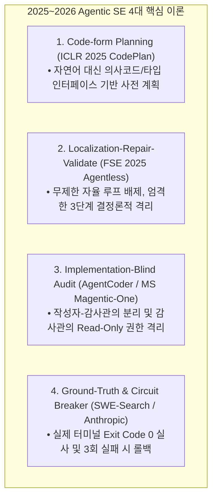
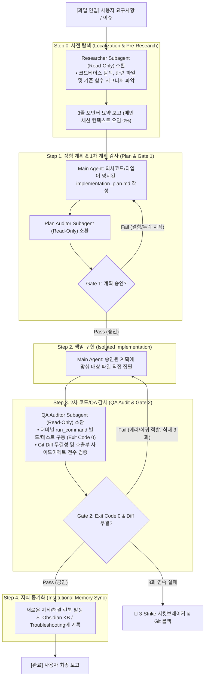

# Agent Collaboration Workflow Guidelines (일상 개발용 에이전트 협동 및 이중 계쇄 오케스트레이션 표준)

> **부제**: 2025~2026 최신 Agentic SE 연구 기반 이중 계쇄(Dual-Gated) 일상 개발 파이프라인

본 문서는 **2025~2026년 발표된 글로벌 빅테크 및 최고 권위 학계의 최신 AI 에이전트 소프트웨어 엔지니어링(Agentic SE) 연구 성과**를 집대성하여, 일상적인 기능 구현, 리팩토링, 버그 수정 시 **AI 환각을 원천 차단하고 오차율 0%의 코드 품질을 달성하기 위한 표준 오케스트레이션 프로토콜**을 정의합니다.

---

## 1. 핵심 철학 및 2025~2026 학술적 기반 (Foundations)



1. **사전 계획의 정형화 및 코드화 (*CodePlan, ICLR 2025*)**:
   * 모호한 자연어 계획 대신 타입 시그니처, 의존성 관계, 제어 흐름이 명시된 계획(Code-form Plan)을 수립하여 실행 전 논리적 결함을 사전에 컴파일러 수준에서 차단합니다.
2. **결정론적 격리 파이프라인 (*Agentless, UIUC 2024~2025*)**:
   * 에러가 누적되는 무제한 자율 ReAct 루프를 배제하고, `탐색(Localization) -> 패치(Repair) -> 검증(Validate)`의 3단계 파이프라인을 적용합니다.
3. **작성자-감사관의 비대칭 권한 격리 (*AgentCoder / Magentic-One, 2024~2025*)**:
   * 메인 에이전트(Leader/Coder)는 쓰기 권한을 갖고 책임을 집필하며, 서브에이전트(Auditor)는 **쓰기 권한이 배제된 Read-Only 컨텍스트**로 소환되어 자가 확증 편향(Confirmation Bias) 없는 객관적 감사를 수행합니다.
4. **결정론적 사후 검증 ও 서킷 브레이커 (*Anthropic & SWE-Search, 2024~2026*)**:
   * 멘탈 모델에 의존하는 눈먼 성공 보고(Blind Coding)를 금지하고, 실제 터미널 `Exit Code 0`을 유일한 Ground Truth로 삼으며 3회 실패 시 즉각 롤백합니다.

---

## 2. 일상 개발용 5단계 이중 계쇄 라이프사이클 (Dual-Gated Development Cycle)

일상적인 코드 작업(기능 추가, 리팩토링, 버그 수정) 시 에이전트가 반드시 순차적으로 거쳐야 하는 **표준 실행 루프**입니다.



---

## 3. 단계별 세부 실행 지침 및 역할 분담 (Step-by-Step SOP)

### Step 0: 사전 탐색 (Localization & Pre-Research)
* **목적**: 계획을 세우기 전, 메인 에이전트의 컨텍스트 윈도우를 깨끗하게 보존하면서 필요한 파일 경로와 의존성을 파악합니다.
* **실행 수칙**:
  1. 메인 에이전트는 직접 수십 개 파일을 열람하지 않고, `research` 서브에이전트를 소환합니다.
  2. 서브에이전트는 대상 파일을 조사한 뒤, 전체 덤프 대신 **"핵심 파일 경로 + 주요 함수 시그니처"를 3줄 내외 포인터(Pointer-Passing)**로 반환합니다.

### Step 1: 정형 계획 수립 및 1차 계획 감사 (Plan & Gate 1)
* **목적**: 코드를 한 줄이라도 치기 전에 설계적 결함, 누락된 엣지 케이스, 아키텍처 위반을 사전 차단합니다.
* **실행 수칙**:
  1. 메인 에이전트는 자연어 서술에 그치지 않고 변경 대상 파일, 의사코드, 인터페이스 시그니처가 포함된 계획서(`implementation_plan.md`)를 작성합니다.
  2. 독립된 `Plan Auditor` 서브에이전트를 소환하여 **Gate 1 심사**를 요청합니다.
* **Gate 1 통과 기준 (Lightweight Plan Rubric)**:
  * [ ] 기존 아키텍처 및 의존성 규칙 위반 0건
  * [ ] 누락된 영향권 파일 및 엣지 케이스 분기 0건
  * [ ] 단일 책임 원칙(SRP) 및 롤백 가능성 확보

### Step 2: 메인 에이전트의 책임 구현 (Isolated Implementation)
* **목적**: 아키텍처 전체 맥락(Big Picture)을 장악한 메인 에이전트가 직접 고품질의 소스코드를 작성합니다.
* **실행 수칙**:
  1. 승인된 `implementation_plan.md`의 범위 내에서만 수정(`replace_file_content` / `write_to_file`)을 진행합니다.
  2. 코딩 도중 계획에 없던 거대 설계 변경이 필요해지면, 코딩을 멈추고 Step 1로 돌아가 계획서를 갱신하고 재감사를 받습니다.

### Step 3: 2차 코드/QA 감사 (Code Audit & Gate 2)
* **목적**: 작성된 코드가 실제로 작동하며 기존 시스템에 회귀(Regression)를 일으키지 않는지 객관적으로 검증합니다.
* **실행 수칙**:
  1. 독립된 `QA Auditor` 서브에이전트를 소환합니다.
  2. 감사관은 `run_command`로 실제 빌드/테스트를 구동하여 **`Exit Code 0`과 에러 없는 로그**를 확인합니다.
  3. Git Diff를 전수 검토하여 의도치 않은 서식 변경이나 사이드 이펙트가 없는지 검증합니다.
* **Gate 2 통과 기준 (Lightweight Code Rubric)**:
  * [ ] 실제 터미널 빌드/테스트 `Exit Code 0` (오류 로그 0건)
  * [ ] 계획서 대비 구현 일치율 100%
  * [ ] 불필요한 파일 수정 및 회귀 버그 0건

### Step 4: 지식 동기화 및 세션 마감 (Institutional Memory Sync)
* **목적**: 페어 프로그래밍 중 획득한 새로운 도메인 지식과 해결 런북을 영구 지식베이스에 보존합니다.
* **실행 수칙**:
  1. 작업 중 발견된 특이점이나 버그 해결 시나리오는 즉시 `troubleshooting/` 또는 해당 프로젝트 `docs/`에 마크다운으로 기록합니다.
  2. 메인 대화 세션을 종료하거나 리셋하더라도 핵심 지식은 Obsidian KB에 영구 보존됩니다.

---

## 4. 서브에이전트 호출 및 프롬프트 규격 (Subagent Invocation Protocols)

### 4.1 Plan Auditor (계획 감사관) 호출 프롬프트 템플릿
```json
{
  "Subagents": [{
    "TypeName": "research",
    "Role": "Independent Plan Auditor (Read-Only)",
    "Prompt": "현재 작성된 implementation_plan.md 문서를 검토하라. 기존 아키텍처 위반 여부, 누락된 엣지 케이스, 의존성 결함 유무를 엄격히 감사하고 [PASS] 또는 [FAIL + 구체적 결함 3줄 요약] 판정을 제출하라. (파일 수정 금지)"
  }]
}
```

### 4.2 QA & Code Auditor (코드 감사관) 호출 프롬프트 템플릿
```json
{
  "Subagents": [{
    "TypeName": "research",
    "Role": "Independent QA & Code Auditor (Read-Only)",
    "Prompt": "방금 수정된 소스코드를 감사하라. 백그라운드 터미널에서 프로젝트 빌드/테스트 명령어를 직접 실행하여 Exit Code 0 및 에러 로그 여부를 확인하고, Git Diff를 검토하여 사이드이펙트 유무를 판정하라. 결과는 [PASS] 또는 [FAIL + 에러 로그 3줄 요약]으로 보고하라."
  }]
}
```

---

## 5. 위기 관리: 3-Strike 서킷 브레이커 연동 (Circuit Breaker Integration)

* **원칙**: 동일한 Gate(Gate 1 또는 Gate 2)에서 **3회 연속 실패가 발생하면 작업을 즉시 강제 중단**합니다.
* **행동 강령**:
  1. 에이전트는 코드를 원상 복구(Rollback)합니다.
  2. [Agent_Troubleshooting_Guidelines.md](./Agent_Troubleshooting_Guidelines.md)에 따라 `troubleshooting/<project>.md`에 `[Unresolved]` 로그를 남깁니다.
  3. 인간 개발자에게 즉각 상황을 보고하고 개입(Human-in-the-loop)을 요청합니다.

---

## 6. 결론 및 요약 체크리스트 (Summary Checklist)

| 단계 | 수행 주체 | 핵심 산출물 / 검증 오라클 | 권한 |
|---|---|---|:---:|
| **Step 0: 사전 탐색** | Researcher Subagent | 3줄 포인터 요약 (관련 파일/함수) | Read-Only |
| **Step 1: 정형 계획 & Gate 1** | Main Agent & Plan Auditor | `implementation_plan.md` & Gate 1 [PASS] | Read-Only Audit |
| **Step 2: 책임 구현** | Main Agent | 실제 소스코드 파일 수정 | Write |
| **Step 3: QA 검증 & Gate 2** | QA Auditor Subagent | 터미널 `Exit Code 0` & Gate 2 [PASS] | Read-Only Audit |
| **Step 4: 지식 동기화** | Main Agent | Obsidian KB / `troubleshooting/` 갱신 | Write |
