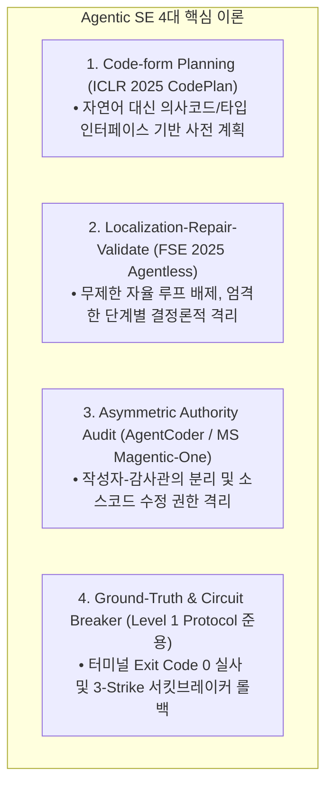
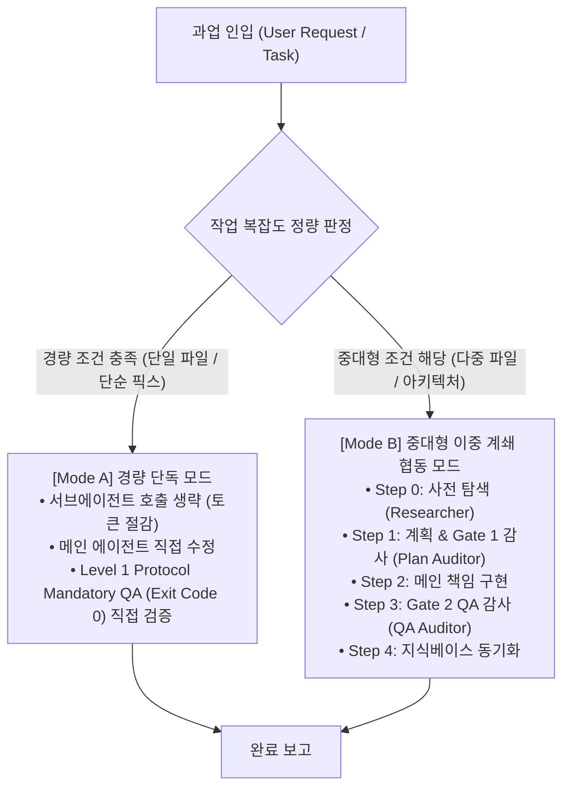
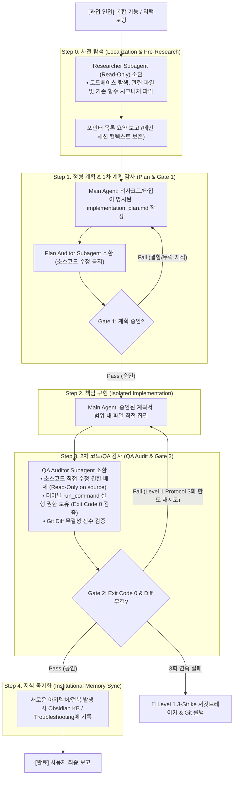

# Agent Collaboration Workflow Guidelines (에이전트 협동 및 이중 계쇄 오케스트레이션 - Level 2 SOP)

본 문서는 **최신 AI 에이전트 소프트웨어 엔지니어링(Agentic SE) 연구 성과**(*CodePlan, Agentless, AgentCoder, Magentic-One*)를 집대성하여, 일상적인 기능 구현, 리팩토링, 버그 수정 시 **AI 환각을 원천 차단하고 오차율 0%의 코드 품질을 달성하기 위한 표준 협동 오케스트레이션 규격(Level 2 SOP)**을 정의합니다.

> [!IMPORTANT]
> **거버넌스 계층 원칙 (Hierarchy & SSOT Invariant)**
> * 본 문서는 **다중 서브에이전트 소환 타이밍과 역할 분담(SOP)**만을 전담합니다.
> * 모든 코드 수정 후의 터미널 검증 기준(Exit Code 0 Ground Truth), 3-Strike 서킷 브레이커 임계치, 원자적 롤백(Atomic Rollback) 절차 및 `troubleshooting/` 런북 마크다운 규격은 **Level 1 헌법인 [`Agent_Runtime_Operations_Protocol.md`](./Agent_Runtime_Operations_Protocol.md)를 단일 진실 공급원(SSOT)으로 엄격히 준용**합니다.

---

## 1. 핵심 철학 및 2025~2026 학술적 기반 (Foundations)


```mermaid
flowchart TD
    subgraph "Agentic SE 4대 핵심 이론"
        F1["1. Code-form Planning (ICLR 2025 CodePlan)<br>• 자연어 대신 의사코드/타입 인터페이스 기반 사전 계획"]
        F2["2. Localization-Repair-Validate (FSE 2025 Agentless)<br>• 무제한 자율 루프 배제, 엄격한 단계별 결정론적 격리"]
        F3["3. Asymmetric Authority Audit (AgentCoder / MS Magentic-One)<br>• 작성자-감사관의 분리 및 소스코드 수정 권한 격리"]
        F4["4. Ground-Truth & Circuit Breaker (Level 1 Protocol 준용)<br>• 터미널 Exit Code 0 실사 및 3-Strike 서킷브레이커 롤백"]
    end
```

1. **사전 계획의 정형화 및 코드화 (*CodePlan, ICLR 2025*)**: 모호한 자연어 계획 대신 타입 시그니처, 의존성 관계, 제어 흐름이 명시된 계획(Code-form Plan)을 수립하여 실행 전 논리적 결함을 사전에 컴파일러 수준에서 차단합니다.
2. **결정론적 격리 파이프라인 (*Agentless, UIUC 2024~2025*)**: 에러가 누적되는 무제한 자율 ReAct 루프를 배제하고, `탐색(Localization) -> 패치(Repair) -> 검증(Validate)`의 단계별 파이프라인을 적용합니다.
3. **작성자-감사관의 비대칭 권한 격리 (*AgentCoder / Magentic-One, 2024~2025*)**: 메인 에이전트(Leader/Coder)는 소스코드 쓰기 권한을 갖고 구현을 집필하며, 서브에이전트(Auditor)는 **소스코드 직접 수정 권한이 배제된 독립 컨텍스트**로 소환되어 자가 확증 편향(Confirmation Bias) 없는 객관적 감사를 수행합니다.
4. **결정론적 사후 검증 및 서킷 브레이커 (*Level 1 SSOT 준용*)**: 멘탈 모델에 의존하는 눈먼 성공 보고(Blind Coding)를 금지하며, 터미널 `Exit Code 0` 검증 및 3회 연속 실패 시 원자적 롤백 정책은 Level 1 [`Agent_Runtime_Operations_Protocol.md`](./Agent_Runtime_Operations_Protocol.md)에 따릅니다.

---

## 2. 작업 복잡도 기반 정량적 스코핑 (Quantitative Scoping Thresholds)

에이전트는 작업의 규모와 복잡도를 정량적으로 판별하여 **[Mode A] 경량 단독 모드** 또는 **[Mode B] 중대형 이중 계쇄 협동 모드** 중 하나를 결정론적으로 선택해야 합니다.


```mermaid
flowchart TD
    Task["과업 인입 (User Request / Task)"] --> ScopeJudge{"작업 복잡도 정량 판정"}

    ScopeJudge -- "경량 조건 충족 (단일 파일 / 단순 픽스)" --> ModeA["[Mode A] 경량 단독 모드<br>• 서브에이전트 호출 생략 (토큰 절감)<br>• 메인 에이전트 직접 수정<br>• Level 1 Protocol Mandatory QA (Exit Code 0) 직접 검증"]
    
    ScopeJudge -- "중대형 조건 해당 (다중 파일 / 아키텍처)" --> ModeB["[Mode B] 중대형 이중 계쇄 협동 모드<br>• Step 0: 사전 탐색 (Researcher)<br>• Step 1: 계획 & Gate 1 감사 (Plan Auditor)<br>• Step 2: 메인 책임 구현<br>• Step 3: Gate 2 QA 감사 (QA Auditor)<br>• Step 4: 지식베이스 동기화"]

    ModeA --> Done["완료 보고"]
    ModeB --> Done
```

### 2.1 [Mode A] 경량 단독 모드 (Lightweight Solo Mode)
* **발동 조건 (아래 조건 중 하나라도 만족 시)**:
  1. 수정 대상 파일이 단 1개인 경우 (`ModifiedFiles.Count == 1`)
  2. 단순 오타, 주석, 로깅 문구, 문서 오탈자 수정
  3. 신규 인터페이스/타입 선언이 없는 30라인 미만의 국소 버그 픽스
* **실행 절차**:
  1. Step 0/1/3 서브에이전트 호출을 전면 생략하여 컨텍스트 오염과 토큰 낭비를 차단합니다.
  2. 메인 에이전트가 직접 소스코드를 수정합니다.
  3. 수정 완료 후, Level 1 [`Agent_Runtime_Operations_Protocol.md`](./Agent_Runtime_Operations_Protocol.md)에 따라 백그라운드 터미널에서 Mandatory QA(`run_command` Exit Code 0)를 직접 수행하여 무결성을 검증하고 작업을 마감합니다.

### 2.2 [Mode B] 중대형 이중 계쇄 협동 모드 (Dual-Gated Team Mode)
* **발동 조건 (아래 조건 중 하나라도 해당 시)**:
  1. 2개 이상의 파일을 동시 수정하는 경우 (`ModifiedFiles.Count >= 2`)
  2. 신규 모듈, 클래스, 인터페이스, 서비스 계층 또는 주요 서브시스템 컴포넌트 추가
  3. 공통 공개 계약(Public API, 스키마, 프로토콜, DTO, DB 모델) 또는 스레드/동시성/메모리 아키텍처 수정
  4. 사용자가 명시적으로 계획 검토나 이중 계쇄 감사를 요청한 경우
* **실행 절차**:
  - 아래 3절의 5단계 이중 계쇄 사이클을 단 하나의 생략 없이 엄격하게 준수합니다.

---

## 3. 중대형 작업용 5단계 이중 계쇄 라이프사이클 (Dual-Gated Cycle)

> [!CRITICAL]
> **단계별 서브에이전트 단독 소환 불변식 (Strict Single-Subagent Invariant)**
> * `invoke_subagent` 도구를 호출할 때 `Subagents` 배열에는 **반드시 현재 단계에서 필요한 서브에이전트 1개만 단독(`Subagents.Length == 1`)으로 전달**해야 합니다.
> * 직전 Gate의 공식 통과 판정(예: `[GATE 1 PASS]`, `Exit Code 0`)이 확정되기 전에 후속 단계 에이전트를 미리 호출하는 **조기 병렬화(Premature Parallelization)를 절대 금지**합니다.


```mermaid
flowchart TD
    Task["[과업 인입] 복합 기능 / 리팩토링"]

    subgraph Step0 ["Step 0. 사전 탐색 (Localization & Pre-Research)"]
        S0_Worker["Researcher Subagent (Read-Only) 소환<br>• 코드베이스 탐색, 관련 파일 및 기존 함수 시그니처 파악"]
        S0_Report["포인터 목록 요약 보고 (메인 세션 컨텍스트 보존)"]
        S0_Worker --> S0_Report
    end

    subgraph Step1 ["Step 1. 정형 계획 & 1차 계획 감사 (Plan & Gate 1)"]
        S1_Plan["Main Agent: 의사코드/타입이 명시된 implementation_plan.md 작성"]
        S1_Audit["Plan Auditor Subagent 소환 (소스코드 수정 금지)"]
        G1{"Gate 1: 계획 승인?"}
        S1_Plan --> S1_Audit --> G1
    end

    subgraph Step2 ["Step 2. 책임 구현 (Isolated Implementation)"]
        S2_Code["Main Agent: 승인된 계획서 범위 내 파일 직접 집필"]
    end

    subgraph Step3 ["Step 3. 2차 코드/QA 감사 (QA Audit & Gate 2)"]
        S3_QA["QA Auditor Subagent 소환<br>• 소스코드 직접 수정 권한 배제 (Read-Only on source)<br>• 터미널 run_command 실행 권한 보유 (Exit Code 0 검증)<br>• Git Diff 무결성 전수 검증"]
        G2{"Gate 2: Exit Code 0 & Diff 무결?"}
        S3_QA --> G2
    end

    subgraph Step4 ["Step 4. 지식 동기화 (Institutional Memory Sync)"]
        S4_Log["새로운 아키텍처/런북 발생 시 Obsidian KB / Troubleshooting에 기록"]
    end

    Task --> S0_Worker
    S0_Report --> S1_Plan
    G1 -- "Fail (결함/누락 지적)" --> S1_Plan
    G1 -- "Pass (승인)" --> S2_Code
    S2_Code --> S3_QA
    G2 -- "Fail (Level 1 Protocol 3회 한도 재시도)" --> S2_Code
    G2 -- "3회 연속 실패" --> Rollback["🛑 Level 1 3-Strike 서킷브레이커 & Git 롤백"]
    G2 -- "Pass (공인)" --> S4_Log
    S4_Log --> Done["[완료] 사용자 최종 보고"]
```

---

## 4. 단계별 세부 실행 지침 (Step-by-Step SOP)

### Step 0: 사전 탐색 (Localization & Pre-Research)
* **목적**: 계획을 세우기 전, 메인 에이전트의 컨텍스트 윈도우를 깨끗하게 보존하면서 필요한 파일 경로와 의존성을 파악합니다.
* **실행 수칙**:
  1. 메인 에이전트는 직접 수십 개 파일을 열람하지 않고, `research` 서브에이전트를 단독 소환합니다.
  2. 서브에이전트는 소스코드 본문 복사 대신, 변경 영향권에 있는 파일 경로와 주요 함수/인터페이스 시그니처 목록(Pointer List)을 정리하여 반환합니다.

### Step 1: 정형 계획 수립 및 1차 계획 감사 (Plan & Gate 1)
* **목적**: 코드를 한 줄이라도 작성하기 전에 설계적 결함, 누락된 엣지 케이스, 아키텍처 위반을 사전 차단합니다.
* **실행 수칙**:
  1. 메인 에이전트는 변경 대상 파일, 의사코드, 인터페이스 시그니처가 포함된 계획서(`implementation_plan.md`)를 작성합니다.
  2. 독립된 `Plan Auditor` 서브에이전트를 단독 소환하여 **Gate 1 심사**를 요청합니다.
* **Gate 1 통과 기준 (Lightweight Plan Rubric)**:
  * [ ] 기존 아키텍처 및 의존성 규칙 위반 0건
  * [ ] 누락된 영향권 파일 및 엣지 케이스 분기 0건
  * [ ] 단일 책임 원칙(SRP) 및 롤백 가능성 확보

### Step 2: 메인 에이전트의 책임 구현 (Isolated Implementation)
* **목적**: 아키텍처 전체 맥락을 장악한 메인 에이전트가 직접 고품질의 소스코드를 작성합니다.
* **실행 수칙**:
  1. 승인된 `implementation_plan.md`의 범위 내에서만 수정(`replace_file_content` / `write_to_file`)을 진행합니다.
  2. 코딩 도중 계획에 없던 거대 설계 변경이 필요해지면, 코딩을 멈추고 Step 1로 돌아가 계획서를 갱신하고 재감사를 받습니다.

### Step 3: 2차 코드/QA 감사 (QA Audit & Gate 2)
* **목적**: 작성된 코드가 실제로 작동하며 기존 시스템에 회귀(Regression)를 일으키지 않는지 객관적으로 검증합니다.
* **권한 규격 (Permission Boundary)**:
  - **소스코드 수정 권한**: **없음 (Read-Only on source code)**. 감사관은 소스코드를 직접 수정할 수 없으며, 발견된 결함은 보고서로 회신해야 합니다.
  - **터미널 실행 권한**: **있음 (Execution permission for `run_command`)**. 실제 빌드/테스트를 구동하여 Exit Code 0을 확인할 권한을 가집니다.
* **Gate 2 통과 기준 (Lightweight Code Rubric)**:
  * [ ] 백그라운드 터미널 빌드/테스트 `Exit Code 0` (오류 로그 0건)
  * [ ] 계획서 대비 구현 일치율 100%
  * [ ] 불필요한 파일 수정 및 회귀 버그 0건

### Step 4: 지식 동기화 및 세션 마감 (Institutional Memory Sync)
* **목적**: 획득한 새로운 도메인 지식과 해결 런북을 영구 지식베이스에 보존합니다.
* **실행 수칙**:
  1. 작업 중 발견된 특이점이나 버그 해결 시나리오는 Level 1 규격에 따라 `troubleshooting/<project>.md` 또는 해당 프로젝트 `docs/`에 마크다운으로 기록합니다.
  2. 완료된 계획서는 완료 배너를 적용하여 아카이빙합니다.

---

## 5. 서브에이전트 호출 및 동적 프롬프트 규격 (Subagent Invocation Protocols)

서브에이전트 호출 시 정보 부족(Underfitting: 경로 미지정으로 인한 탐색 낭비)과 경직성(Overfitting: 프로젝트 비종속 고정 문자열 오류)을 원천 차단하기 위해, 메인 에이전트는 아래의 **동적 4-슬롯 파라미터 스키마**에 맞춰 `<치환자>` 영역을 현재 작업 대상의 실제 절대 경로와 명령어로 채워 주입해야 합니다.

### 5.1 Plan Auditor (계획 감사관) 표준 호출 규격
* **동적 치환 슬롯**: `<Implementation_Plan_Absolute_Path>` (브레인 아티팩트 절대 경로)
```json
{
  "Subagents": [{
    "TypeName": "research",
    "Role": "Independent Plan Auditor (Read-Only)",
    "Prompt": "현재 작성된 `<Implementation_Plan_Absolute_Path>` 문서를 전수 심사하라.\n\n[감사 기준 - Gate 1 Lightweight Plan Rubric]\n1. 기존 아키텍처 및 시스템 불변식 위반 0건\n2. 누락된 영향권 파일 및 엣지 케이스 분기 0건\n3. 단일 책임 원칙(SRP) 및 롤백 가능성 확보\n\n위 기준을 엄격히 심사하고 최종 [PASS] 또는 [FAIL + 구체적 결함 요약] 판정을 회신하라. (소스코드 파일 수정 도구 사용 절대 금지, Read-Only)"
  }]
}
```

### 5.2 QA & Code Auditor (코드/QA 감사관) 표준 호출 규격
* **동적 치환 슬롯**:
  - `<Project_Build_Test_Commands>`: 해당 프로젝트 `.agents/AGENTS.md`의 `<critical_rules>`에 정의된 공식 빌드/테스트 명령어
  - `<Target_Git_Diff_Files>`: 이번 작업에서 수정한 대상 파일 경로
```json
{
  "Subagents": [{
    "TypeName": "research",
    "Role": "Independent QA & Code Auditor (Read-Only on Source, Terminal Executable)",
    "Prompt": "방금 수정된 소스코드를 전수 감사하라.\n\n[감사 지침 - Gate 2 Lightweight Code Rubric]\n1. 백그라운드 터미널에서 실제 빌드/테스트 명령어(`<Project_Build_Test_Commands>`)를 직접 실행하여 Exit Code 0 및 에러 로그 0건을 확인하라.\n2. Git Diff(`git diff <Target_Git_Diff_Files>`)를 전수 검토하여 계획서 대비 구현 일치율(100%), 의도치 않은 서식 변경 및 사이드이펙트 유무를 판정하라.\n\n소스코드 파일 직접 수정은 절대 금지되며(Read-Only), 결과는 최종 [PASS] 또는 [FAIL + 결함/에러 로그 요약]으로 엄격히 보고하라."
  }]
}
```

---

## 6. 위기 관리: Level 1 서킷 브레이커 연동 (Circuit Breaker Delegation)

* **원칙**: 동일한 Gate(Gate 1 또는 Gate 2)에서 **3회 연속 실패가 발생하면 작업을 즉시 강제 중단**합니다.
* **행동 강령**:
  1. 에이전트는 추가 수정을 즉시 멈추고 코드를 원자적 롤백(Atomic Rollback)합니다.
  2. 세부 롤백 절차, `[Unresolved]` 트러블슈팅 로그 작성 및 인간 개발자 인수인계 양식은 Level 1 [`Agent_Runtime_Operations_Protocol.md`](./Agent_Runtime_Operations_Protocol.md)의 규격을 100% 그대로 따릅니다.

---

## 7. 결론 및 요약 체크리스트 (Summary Checklist)

| 단계 | 수행 주체 | 핵심 산출물 / 검증 오라클 | 권한 범위 |
|---|---|---|---|
| **[Mode A] 경량 단독** | Main Agent | 직접 소스 수정 & 터미널 `Exit Code 0` | Write + Run (서브에이전트 0개) |
| **[Mode B] Step 0 탐색** | Researcher Subagent | 핵심 포인터 목록 (관련 파일/인터페이스) | Read-Only |
| **[Mode B] Step 1 계획/Gate 1** | Main Agent & Plan Auditor | `implementation_plan.md` & Gate 1 [PASS] | 소스 수정 금지 (Read-Only Audit) |
| **[Mode B] Step 2 책임 구현** | Main Agent | 실제 소스코드 파일 수정 | Write |
| **[Mode B] Step 3 QA/Gate 2** | QA Auditor Subagent | 터미널 `Exit Code 0` & Gate 2 [PASS] | 소스 수정 금지 + 터미널 `run_command` 실행 허용 |
| **[Mode B] Step 4 지식 동기화** | Main Agent | Obsidian KB / `troubleshooting/` 갱신 | Write |
