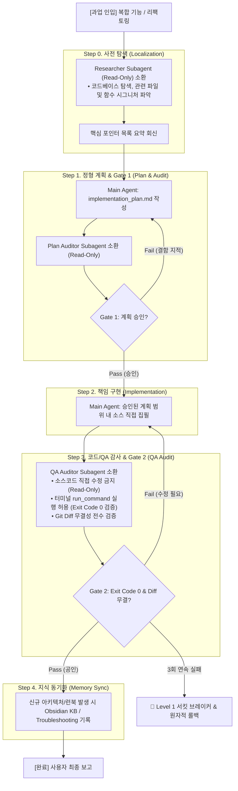

# Agent Collaboration Workflow Guidelines (이중 계쇄 에이전트 협동 오케스트레이션 - Level 2 SOP)

본 문서는 복잡한 기능 구현, 대규모 리팩토링 및 아키텍처 변경 시 AI 환각을 방지하고 무결점 코드 품질을 보장하기 위한 **이중 계쇄(Dual-Gated) 협동 오케스트레이션 규격(Level 2 SOP)**을 정의합니다.

> [!IMPORTANT]
> **거버넌스 계층 원칙 (Hierarchy & SSOT Invariant)**
> 본 문서는 **다중 서브에이전트 소환 타이밍과 역할 분담(SOP)**만을 규정합니다. 모든 코드 수정 후의 터미널 검증 기준(`run_command` Exit Code 0), 3-Strike 서킷 브레이커, 원자적 롤백 절차 및 `troubleshooting/` 런북 마크다운 규격은 **Level 1 [`Agent_Runtime_Operations_Protocol.md`](./Agent_Runtime_Operations_Protocol.md)를 단일 진실 공급원(SSOT)으로 엄격히 준용**합니다.

---

## 1. 3대 협동 불변식 (Core Invariants)

1. **사전 계획 정형화 (Code-form Planning)**: 모호한 자연어 계획 대신 대상 파일 경로, 의사코드, 타입 시그니처가 명시된 계획(`implementation_plan.md`)을 수립한 후 코딩합니다.
2. **비대칭 권한 격리 (Asymmetric Authority)**: 메인 에이전트만 소스코드 쓰기 권한을 가지며, 감사관(Auditor) 서브에이전트는 **소스코드 수정 권한이 배제된 Read-Only 컨텍스트**로 소환되어 자가 확증 편향 없는 독립 감사를 수행합니다.
3. **단계별 서브에이전트 단독 소환 (Single-Subagent Invariant)**: `invoke_subagent` 호출 시 배열에는 **반드시 현재 단계의 서브에이전트 1개만 단독(`Subagents.Length == 1`)으로 전달**합니다. 직전 Gate의 공식 통과(`[PASS]`) 전 조기 병렬화(Premature Parallelization)를 엄격히 금지합니다.

---

## 2. 활성화 원칙 (On-Demand Activation Gatekeeper)

* **원칙 (사용자 명시적 요청 필수)**: 본 가이드라인의 5단계 이중 계쇄 협동 워크플로우는 **사용자가 명시적으로 지시한 경우에만 가동**합니다. 
* **기본 모드 (Solo Mode)**: 사용자의 별도 지시가 없는 모든 일상 작업은 Level 1 [`Agent_Runtime_Operations_Protocol.md`](./Agent_Runtime_Operations_Protocol.md)에 따라 메인 에이전트가 단독으로 코딩하고 터미널 Mandatory QA(`run_command` Exit Code 0)를 직접 수행하여 신속히 종결합니다.

---

## 3. 5단계 이중 계쇄 라이프사이클 (Dual-Gated Cycle)

```mermaid
flowchart TD
    Task["[과업 인입] 복합 기능 / 리팩토링"]

    subgraph Step0 ["Step 0. 사전 탐색 (Localization)"]
        S0_Worker["Researcher Subagent (Read-Only) 소환<br>• 코드베이스 탐색, 관련 파일 및 함수 시그니처 파악"]
        S0_Report["핵심 포인터 목록 요약 회신"]
        S0_Worker --> S0_Report
    end

    subgraph Step1 ["Step 1. 정형 계획 & Gate 1 (Plan & Audit)"]
        S1_Plan["Main Agent: implementation_plan.md 작성"]
        S1_Audit["Plan Auditor Subagent 소환 (Read-Only)"]
        G1{"Gate 1: 계획 승인?"}
        S1_Plan --> S1_Audit --> G1
    end

    subgraph Step2 ["Step 2. 책임 구현 (Implementation)"]
        S2_Code["Main Agent: 승인된 계획 범위 내 소스 직접 집필"]
    end

    subgraph Step3 ["Step 3. 코드/QA 감사 & Gate 2 (QA Audit)"]
        S3_QA["QA Auditor Subagent 소환<br>• 소스코드 직접 수정 금지 (Read-Only)<br>• 터미널 run_command 실행 허용 (Exit Code 0 검증)<br>• Git Diff 무결성 전수 검증"]
        G2{"Gate 2: Exit Code 0 & Diff 무결?"}
        S3_QA --> G2
    end

    subgraph Step4 ["Step 4. 지식 동기화 (Memory Sync)"]
        S4_Log["신규 아키텍처/런북 발생 시 Obsidian KB / Troubleshooting 기록"]
    end

    Task --> S0_Worker
    S0_Report --> S1_Plan
    G1 -- "Fail (결함 지적)" --> S1_Plan
    G1 -- "Pass (승인)" --> S2_Code
    S2_Code --> S3_QA
    G2 -- "Fail (수정 필요)" --> S2_Code
    G2 -- "3회 연속 실패" --> Rollback["🛑 Level 1 서킷 브레이커 & 원자적 롤백"]
    G2 -- "Pass (공인)" --> S4_Log
    S4_Log --> Done["[완료] 사용자 최종 보고"]
```

---

## 4. 단계별 실행 규격 및 통과 루브릭 (Step-by-Step SOP)

### Step 0: 사전 탐색 (Localization)
* 메인 에이전트는 대규모 파일을 직접 열람하지 않고, `research` 서브에이전트 1개를 소환하여 영향권 내 파일 경로와 주요 인터페이스 시그니처 목록(Pointer List)만 요약받아 컨텍스트를 보존합니다.

### Step 1: 정형 계획 수립 및 1차 계획 감사 (Gate 1)
* 메인 에이전트가 `implementation_plan.md`를 작성한 후 `Plan Auditor` 서브에이전트에게 Gate 1 심사를 요청합니다.
* **Gate 1 통과 루브릭**:
  - [ ] 기존 아키텍처 및 시스템 불변식 위반 0건
  - [ ] 누락된 영향권 파일 및 엣지 케이스 분기 0건
  - [ ] 단일 책임 원칙(SRP) 및 롤백 가능성 확보

### Step 2: 메인 에이전트의 책임 구현 (Implementation)
* 메인 에이전트가 승인된 계획서 범위 내에서만 소스코드를 직접 작성/수정합니다.
* 코딩 중 중대한 설계 변경이 필요해지면 작업을 멈추고 Step 1로 복귀하여 계획서를 갱신하고 재감사를 받습니다.

### Step 3: 2차 코드/QA 감사 (Gate 2)
* `QA Auditor` 서브에이전트를 소환하여 구현 결과와 회귀 여부를 독립 검증합니다.
* **감사관 권한 경계**: 소스코드 수정 권한 **없음(Read-Only)** / 터미널 실행(`run_command`) 권한 **있음**.
* **Gate 2 통과 루브릭**:
  - [ ] 백그라운드 터미널 빌드/테스트 `Exit Code 0` (오류 로그 0건)
  - [ ] 계획서 대비 구현 일치율 100%
  - [ ] 불필요한 파일 수정(Git Diff 오염) 및 사이드이펙트 0건

### Step 4: 지식 동기화 (Institutional Memory Sync)
* 작업 중 발견된 특이점이나 장애 조치 내역은 Level 1 규격에 따라 `troubleshooting/<project>.md`에 기록하고 계획서를 아카이빙합니다.

---

## 5. 서브에이전트 프롬프트 호출 규격 (Invocation Guidelines)

`invoke_subagent` 호출 시 다음 필수 정보를 동적으로 주입하여 호출합니다:

1. **Plan Auditor (Gate 1)**:
   - `Role`: `Independent Plan Auditor (Read-Only)`
   - `Prompt`: 계획서 아티팩트의 절대 경로 주입 + **소스코드 파일 수정 도구 사용 절대 금지(Read-Only)** 명시 + Gate 1 통과 루브릭 검증 및 `[PASS]` 또는 `[FAIL + 결함 요약]` 회신 요구.
2. **QA & Code Auditor (Gate 2)**:
   - `Role`: `Independent QA & Code Auditor (Read-Only on Source, Terminal Executable)`
   - `Prompt`: 해당 프로젝트의 공식 빌드/테스트 명령어 및 대상 `git diff` 파일 경로 주입 + **소스코드 수정 금지** 명시 + 터미널 `Exit Code 0` 확인 및 Gate 2 루브릭 검증 회신 요구.

---

## 6. 위기 관리: Level 1 서킷 브레이커 연동

Gate 1 또는 Gate 2에서 **3회 연속 실패 발생 시 즉시 작업을 강제 중단**하고, Level 1 [`Agent_Runtime_Operations_Protocol.md`](./Agent_Runtime_Operations_Protocol.md)에 따라 원자적 롤백(Atomic Rollback) 집행, `[Unresolved]` 런북 기록 및 사용자 인수인계를 수행합니다.
