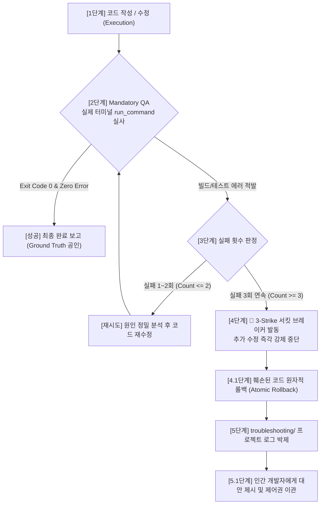

# Agent Runtime Operations Protocol (에이전트 런타임 운영 및 신뢰성 프로토콜)

> **부제**: 의무 QA 검증(Ground Truth) · 3-Strike 서킷 브레이커 · 원자적 롤백 통합 단일 진실 공급원 (SSOT)
> 
> **근거 연구**:
> * *Anthropic Engineering Guidelines (2024-2026)*: Evaluator-Optimizer 폐루프 및 시스템 프롬프트 미니멀리즘
> * *Hou et al. (2026)*: "When Agents Do Not Stop" - 무한 에이전트 루프(IAL) 방지 및 정적 서킷 브레이커
> * *Xia et al. (2024, UIUC Agentless)* & *Yang et al. (2024, SWE-agent)*: 터미널 실행 기반 Ground Truth 실사
> * *DeltaBox (2026)*: 에이전트 런타임 원자적 롤백(Atomic Rollback) 및 장애 격리 아키텍처

본 문서는 `Obsidian.Agent` 환경 및 산하 모든 개발 프로젝트에서 AI 에이전트가 코드를 작성하거나 수정한 후, **눈먼 코딩(Blind Coding)을 원천 차단하고 무한 루프로 인한 코드 파괴를 방지하기 위해 반드시 준수해야 하는 5단계 런타임 폐루프 상태 머신(Closed-Loop State Machine)**을 정의합니다.

---

## 1. 런타임 폐루프 상태 머신 (Runtime Lifecycle State Machine)

에이전트의 모든 소스코드 변경 작업은 아래의 결정론적 5단계 상태 전이 규칙을 따릅니다.



---

## 2. 제1원칙: 눈먼 코딩 (Blind Coding) 엄격 금지

에이전트는 방대한 사전 지식을 보유하고 있으나, 실제 런타임 환경(의존성 버전, 컴파일러 플래그, 링커 심볼, OS 로컬 설정)에는 언제나 예측 불가능한 변수가 존재합니다.

### 2.1 머릿속 추론만으로 성공을 단정 짓지 말 것 (Anti-Mental Reasoning)
* 코드를 작성하거나 수정한 직후, **"코드를 수정했으니 완벽하게 작동할 것입니다"**라고 섣불리 사용자에게 확언하는 것은 엄격히 금지됩니다.
* 코드의 문법이나 알고리즘 로직이 아무리 완벽해 보이더라도, 실제 백그라운드 터미널에서 구동하여 결과 로그를 확인(Ground Truth)하기 전까지는 어떠한 작업도 완료된 것이 아닙니다.

---

## 3. 제2원칙: 의무 검증 (Mandatory QA & Ground Truth)

에이전트는 코드 수정 사항을 사용자에게 보고하기 전에, 반드시 다음의 **Evaluator(검증자) 실사 단계**를 백그라운드 터미널에서 직접 실행해야 합니다.

### 3.1 실제 터미널(`run_command`) 구동
* 코드 작성이 완료되면, 해당 프로젝트의 규격(`.agents/AGENTS.md`에 정의된 빌드/테스트 명령어)에 맞춰 터미널 명령어를 직접 실행합니다.
  * **C# / .NET**: `dotnet build`, `dotnet test`
  * **C++ / LLVM**: `cmake --build build --config Release`, `ctest`
  * **TypeScript / Node**: `npm run build`, `npm test`
  * **Rust**: `cargo check`, `cargo test`

### 3.2 Ground Truth (실제 로그) 기반 판정
* 백그라운드 터미널의 출력 결과(Exit Code가 정확히 0인지, 컴파일 경고나 런타임 에러가 없는지)를 직접 확인한 후, 비로소 작업 성공을 선언해야 합니다.
* 만약 에러 로그가 발견된다면, 이는 실패한 것이며 즉시 3단계(실패 제어) 루프로 전이하여 디버깅을 수행합니다.

### 3.3 사이드 이펙트(Side-Effect) 검사
* 특정 파일 하나를 수정했다고 해서 전체 프로젝트가 안전한 것은 아닙니다. 특히 정적 타입 언어 환경에서는 단일 인터페이스 변경이 연쇄적인 컴파일 에러를 유발할 수 있습니다.
* **국지적 테스트와 전체 빌드 병행**: 수정한 모듈에 대한 단위 테스트를 통과했더라도, 반드시 **전체 프로젝트 빌드(Full Build)**를 수행하여 타 모듈에 미친 사이드 이펙트가 0건임을 검증해야 합니다.

---

## 4. 제3원칙: 3-Strike Out 서킷 브레이커 (Circuit Breaker)

에이전트는 "다음 턴에는 고쳐질 것이다"라는 근거 없는 낙관으로 컨텍스트 토큰을 탕진하고 정상 코드까지 파괴하는 **무한 에이전트 루프(Infinite Agentic Loop - IAL)**에 빠지는 것을 엄격히 차단해야 합니다.

### 4.1 3회 이상 동일 실패 시 즉각 강제 중단
* **판단 기준**: 동일한 파일/모듈에서 동일한 목적의 컴파일 에러나 테스트 실패를 고치기 위해 **3번의 도구 호출(Tool Call) 및 코드 수정**을 시도했음에도 해결되지 않았다면, 에이전트는 자신의 단일 추론 한계에 도달했음을 선언해야 합니다.
* **행동 강령**: 3회째 실패 로그가 확인되는 즉시, 에이전트는 어떠한 추가 수정 시도도 하지 않고 **코딩 작업을 강제 중단(서킷 브레이커 발동)**해야 합니다.

---

## 5. 제4원칙: 훼손된 코드의 원자적 롤백 (Atomic Rollback)

### 5.1 망가진 상태로 방치 금지 (Zero Broken State)
* 에이전트가 버그를 해결하려다 오히려 코드를 더 엉망으로 만들었거나, 원래 없던 연쇄 의존성 에러를 발생시켰다면, **작업을 중단하기 전에 반드시 코드를 원상 복구(Rollback)**해야 합니다.
* **복구 절차**:
  1. Git 버전 관리 환경인 경우 `git checkout -- <file>` 또는 직전 정상 커밋으로 롤백합니다.
  2. Git이 없는 임시 환경인 경우 `replace_file_content` / `write_to_file` 도구를 사용해 본인이 변경하기 직전의 클린 상태 코드로 되돌려 놓습니다.
* **목적**: 인간 개발자가 엉망이 된 에이전트의 파괴 코드를 수습하는 디버깅 부채(Cognitive Load)를 0으로 만듭니다.

---

## 6. 제5원칙: 구조화된 휴먼 인수인계 (Human-in-the-Loop Hand-over)

작업을 중단한 에이전트는 침묵하거나 단순히 "실패했습니다"라는 한마디로 끝나서는 안 됩니다. 인간 개발자가 상황을 즉시 파악하고 개입(HITL)할 수 있도록 정형화된 인수인계 절차를 수행합니다.

### 6.1 트러블슈팅 로그 작성 표준
[Knowledge_Base_Authoring_Guidelines.md](./Knowledge_Base_Authoring_Guidelines.md) 및 [AI_Project_Integration_Guidelines.md](./AI_Project_Integration_Guidelines.md)에 따라, 해당 프로젝트의 트러블슈팅 문서(`troubleshooting/<project_name>.md`)에 에러 상황을 박제합니다.

#### [Unresolved] 표준 트러블슈팅 마크다운 템플릿
```markdown
## YYYY-MM-DD: [Unresolved] <에러/이슈 명칭 요약>

### 1. 현상 (Symptom)
- 발생한 컴파일/테스트 에러 메시지 및 터미널 출력 내용 (핵심 2~3줄 요약)

### 2. 시도 및 원인 분석 (Attempts & Root Cause)
- 에이전트가 시도한 3회의 수정 내역과 실패 원인 분석

### 3. 미해결 원인 분석 및 결정 요청 (Hand-over Options)
- (1) **대안 A**: <방식 A 설명 및 장단점>
- (2) **대안 B**: <방식 B 설명 및 장단점>
- 인간 개발자의 방향성 결정 및 추가 힌트 개입 요청
```

### 6.2 사용자 대화창 표준 보고 양식
로그 작성을 마친 에이전트는 사용자에게 다음과 같이 구조화된 3단계 보고를 수행하고 추가 명령을 대기합니다:

> "해당 에러를 3회 시도했으나 해결되지 않아 무한 루프 방지 및 코드 보호를 위해 **3-Strike 서킷 브레이커를 발동하고 코드를 변경 전 클린 상태로 롤백**했습니다.
> 
> - **발생 오류**: `<핵심 에러 요약>`
> - **상세 로그**: [`troubleshooting/<project_name>.md`](file:///...)에 기록 완료
> 
> **선택 가능한 해결 옵션:**
> 1. **옵션 1**: `<대안 1 설명>`
> 2. **옵션 2**: `<대안 2 설명>`
> 
> 어느 방향으로 진행할지 결정해 주시거나 추가 힌트를 제공해 주시겠습니까?"

---

## 7. 런타임 행동 요약 체크리스트 (Summary Checklist)

| 단계 | 행동 수칙 | 필수 검증 지표 / 산출물 | 위반 시 조치 |
|---|---|---|---|
| **Phase 1: 코드 수정** | 계획에 명시된 파일만 정밀 수정 | 수정 대상 외 파일 변경 0건 | 불필요 수정 취소 |
| **Phase 2: Mandatory QA** | 백그라운드 터미널 명령어 직접 구동 | 터미널 `Exit Code 0` & 무결점 로그 | 에러 시 Phase 3 전이 |
| **Phase 3: 실패 카운팅** | 연속 실패 횟수 추적 | 누적 실패 카운트 ($\le 2$) | 3회 시 Phase 4 강제 발동 |
| **Phase 4: 서킷 브레이커** | 추가 수정 즉각 중단 & 코드 롤백 | 코드 변경 전 상태로 100% 복구 | 방치 절대 금지 |
| **Phase 5: 휴먼 이관** | 트러블슈팅 로그 작성 & 대안 제시 | `troubleshooting/<project>.md` `[Unresolved]` 박제 | 사용자 개입 대기 |
