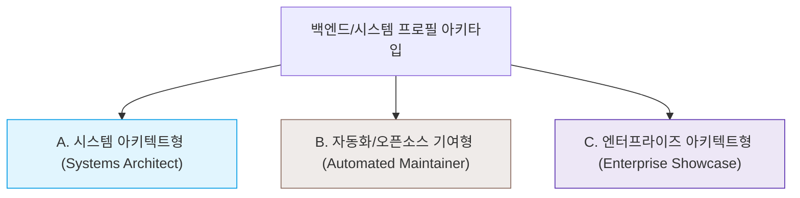

# Developer Profile README Guide: Backend, Systems, Compiler, C++ & C# Archetypes

프론트엔드 개발자들이 화려한 CSS, SVG 애니메이션, 그래픽 위젯을 주로 사용하는 것과 달리, **시스템 프로그래밍, 백엔드, 컴파일러, 임베디드 등의 저수준 개발자들의 프로필은 코드의 아키텍처 깊이, 오픈소스 기여도(Impact), 기술적 정갈함을 보여주는 것이 훨씬 전문적이고 신뢰감을 줍니다.**

이 문서는 고수 개발자들의 프로필 README를 분석하여 얻어낸 핵심 아키타입(Archetype), 레이아웃 패턴 및 우수 사례들을 정리한 가이드라인입니다.

---

## 1. 3가지 핵심 백엔드/시스템 프로필 아키타입 (Archetypes)

시스템 및 백엔드 개발자의 프로필은 크게 세 가지 아키타입으로 나뉩니다.

### 아키타입 A: 시스템 아키텍트 / 인프라 중심형 (Systems Architect)
*   **성향**: 텍스트 중심, 정갈한 마크다운 구조, 그래픽 배지 최소화, 복잡한 시스템 구현 이력 강조.
*   **추천 스택**: 저수준 프로그래밍(C++, C, Rust, Assembly), DB 커널 개발자, 컴파일러 및 가상머신 설계자, 분산 네트워킹 엔지니어.
*   **핵심 요소**:
    *   **핵심 철학/슬로건**: 본인이 지향하는 시스템 제약조건(예: Zero-allocation, Lock-free, Cache-friendliness, local-first) 선언.
    *   **프로젝트 난이도 중심 분류**: "Active Development", "Systems Experiments", "Toy Engines" 등으로 나누고, 각 프로젝트마다 어떤 복잡한 엔지니어링 문제를 해결했는지 1문장 요약 (예: "C++을 사용하여 바이트코드 인터프리터 및 가비지 컬렉터를 바닥부터 구현").
    *   **오픈소스 기여 이력(Upstream Contributions)**: 대형 오픈소스(LLVM, Python, .NET Runtime, Linux Kernel 등)에 기여한 Pull Request 링크 목록 제공.
*   **대표 사례**:
    *   [LouisBrunner](https://github.com/LouisBrunner) - macOS Valgrind 포팅 메인테이너, Godot Rust 바인딩 작성자. (오픈소스 기여 이력을 매우 정갈하게 정리)
    *   [lionkor](https://github.com/lionkor) - 자체 C 컴파일러, TCP 리버스 프록시, C++ 멀티플레이어 게임 서버를 바닥부터 구현한 이력 소개.

### 아키타입 B: 동적 피드 / 자동화형 (Automated Maintainer)
*   **성향**: 자신의 활발한 개발 생산성과 배포 주기를 증명하는 동적인 프로필.
*   **추천 스택**: 도구 빌더, 오픈소스 라이브러리 메인테이너.
*   **핵심 요소**:
    *   **자동 갱신 피드**: GitHub Actions 스케줄러를 통해 블로그 RSS 피드, 최신 패키지 배포 내역, 최근 작성한 TIL(Today I Learned) 커밋 등을 프로필 README에 자동으로 실시간 반영.
    *   **통합 뱃지 매트릭스**: Shields.io를 활용해 라이브 다운로드 수나 라이브 릴리즈 버전을 연동.
*   **대표 사례**:
    *   [simonw](https://github.com/simonw) - Django 공동 창립자. GitHub Actions를 이용한 프로필 자동 업데이트 가이드를 대중화한 대표적 인물.
    *   [marcauberer](https://github.com/marcauberer) - SAP 컴파일러 엔지니어. 자작 Spice 프로그래밍 언어 배포 현황 및 LLVM 기여 내역을 실시간 액션 피드로 연동.

### 아키타입 C: 엔터프라이즈 아키텍트 / 클라우드 아키텍트형 (Enterprise Showcase)
*   **성향**: 대규모 비즈니스 설계 능력, 디자인 패턴, 엔터프라이즈 기술 스택의 깊이 강조.
*   **추천 스택**: Senior C#/.NET Core 아키텍트, Java/Spring Boot 개발자, AWS/Azure 클라우드 네이티브 설계자.
*   **핵심 요소**:
    *   **설계 방법론 강조**: Clean Architecture, DDD(Domain-Driven Design), CQRS, Event-Driven Architecture, Microservices 설계 역량 강조.
    *   **정돈된 통계 카드**: GitHub Readme Stats 카드를 컴팩트 레이아웃으로 적용하여 백엔드 언어(C#, Java 등) 비중이 압도적인 지표를 시각화.
*   **대표 사례**:
    *   [vimalvataliya1904](https://github.com/vimalvataliya1904) - DDD, CQRS, Microservices를 다루는 .NET Enterprise 아키텍트의 정석적인 프로필 구조.

---

## 2. 고수 느낌의 프로필을 완성하는 5단계 가이드라인

### 1단계: 첫 문장에서 "가치관(Philosophy)" 선언
단순히 "안녕하세요"가 아니라, 엔지니어로서 **소프트웨어를 어떻게 작성하는지** 한 문장으로 정의합니다.
*   *Good*: `"I focus on local-first, vendor-independent software that prioritizes execution speed and memory efficiency."` (나는 실행 속도와 메모리 효율을 우선시하는 로컬 퍼스트, 공급자 독립형 소프트웨어에 집중합니다.)
*   *Good*: `"Designing controllable order within highly autonomous, asynchronous systems."` (높은 자율성과 비동기성을 가진 시스템 속에서 통제 가능한 질서를 설계합니다.)

### 2단계: 기술 스택의 세분화 및 계층화
프로필을 보는 사람들은 "언어 스택"보다 이 사람이 **"어느 레이어까지 이해하고 도구를 다룰 수 있는지"**를 보고 싶어 합니다.
*   **Languages**: 단순 언어 나열이 아닌 `Modern C++ (17/20)`, `C# (.NET Core)` 등으로 버전이나 성향 표기.
*   **Low-Level & Infrastructure**: `LLVM/Clang Toolchain`, `gRPC/Protobuf`, `TCP/IP Sockets` 등을 따로 묶어 코어 시스템 역량 부각.
*   **Tools**: `CMake`, `vcpkg` 등을 넣어 C++ 빌드 파이프라인 제어 역량 증명.

### 3단계: 프로젝트 설명에 "기술적 복잡성" 녹이기
"~를 만들었습니다"가 아닌, **어떤 챌린지가 있었고 어떻게 해결했는지** 적습니다.
*   *Bad*: `Project Mundus Vivens: C#과 C++로 만든 NPC 시뮬레이션 게임 서버입니다.`
*   *Good*: `Project Mundus Vivens (AI NPC Ecosystem Engine): C++로 물리 및 공간 해싱(Spatial Hashing) 기반의 3-스레드 리액터 모델을 설계하고, C# AI 인지 서버와 gRPC 파이프라인으로 연결하여 실시간 동기화를 구축했습니다.`

### 4단계: 오픈소스 기여 이력(Upstream Contributions) 기재
대형 오픈소스 리포지토리에 커밋이나 버그 픽스를 보낸 적이 있다면 짧은 목록으로 작성해 둡니다. 이는 "협업 능력"과 "레거시/대형 코드 베이스 해독력"의 강력한 증거가 됩니다.

### 5단계: 불필요한 위젯 걷어내기
움직이는 복잡한 GIF 배너, 무의미한 방문자 카운터, 화려한 마스코트 애니메이션 등은 저수준/백엔드 아키텍트 프로필에서는 전문성을 낮춰 보이게 할 수 있으므로 생략하는 것이 좋습니다.

---

## 3. 벤치마킹할 만한 추천 프로필 링크 리스트

1.  **[LouisBrunner (시스템 프로그래머)](https://github.com/LouisBrunner)**: 마크다운 텍스트와 오픈소스 기여 이력만으로 압도적인 포트폴리오를 구성한 사례.
2.  **[lionkor (C++/Rust 네트워킹 개발자)](https://github.com/lionkor)**: 자신이 바닥부터 구현한(From Scratch) 라이브러리와 게임 서버의 성능 지표를 담은 심플하고 강렬한 프로필.
3.  **[marcauberer (LLVM/컴파일러 엔지니어)](https://github.com/marcauberer)**: 컴파일러 연구와 LLVM 기여 이력을 매우 깨끗한 마크다운 레이아웃으로 설계.
4.  **[vimalvataliya1904 (.NET/WPF/WCF 엔지니어)](https://github.com/vimalvataliya1904)**: 기업형 아키텍처 방법론을 정석적으로 구조화하여 신뢰감을 극대화한 사례.
