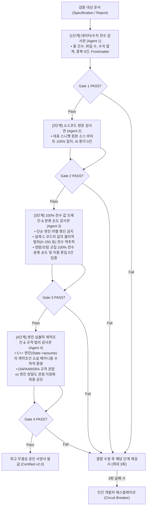

# Independent Audit Protocol Guidelines (v2.0)

> **부제**: 순차적 4단계 심층 계쇄 독립감사 표준 지침 (Sequential Deep Gated Independent Audit Protocol)

본 문서는 소프트웨어 정적/동적 분석 사양서, 아키텍처 명세서, 공인 시험평가 보고서 등 **국방/공공/인증기관에 제출되는 고신뢰성 기술 문서의 사실 무결성(Ground Truth)을 보증하기 위한 4단계 심층 계쇄 독립감사 표준 절차 v2.0**을 정의합니다.

---

## 1. 독립감사 핵심 철학 (Core Philosophy)

1. **독립성 및 단일 역할 격리 (Single Role Isolation)**:
   * 문서를 작성한 에이전트는 감사를 수행할 수 없으며, 각 감사 단계는 상호 편향이 배제된 독립된 서브에이전트가 단독으로 수행합니다.
2. **사고 기반 검증(Blind Coding) 및 표면적 라벨 매칭 절대 금지**:
   * "머릿속 추론"이나 "엔진 진단 메시지 라벨"만으로 정탐/오탐을 기계적으로 분류하는 행위를 엄격히 금지합니다. 실제 원본 로그, 물리적 소스코드의 값 도메인(Value Domain), 제약조건 불변식, 컴파일러 엔진 AST/심볼릭 상태에 대한 직접적 실사를 기반으로 증명되어야 합니다.
3. **서킷 브레이커 (Circuit Breaker)**:
   * 동일한 Gate에서 3회 연속 `[FAIL]` 발생 시, 즉시 작업을 롤백하고 인간 개발자에게 에스컬레이션합니다.

---

## 2. 순차적 4단계 심층 계쇄 감사 파이프라인 (Sequential Deep Gated Pipeline)

---

## 3. 단계별 전담 임무 및 엄격한 Gate 판정 기준

### [1단계] 데이터 및 수치 전수 감사 (Data & Numerical Integrity)
* **목표**: 원본 로그와 문서 간의 정량적 데이터 일치 및 테이블 간 완전 상호 배타성 검증.
* **전담 임무**:
  1. 원본 로그(`jsonl`, `csv`, `db`) 파싱 후 총 데이터 건수 및 고유 파일 수 100% 일치 확인.
  2. 정탐/오탐 및 하위 패턴별 건수 합계가 총 건수와 수학적으로 완벽히 일치하는지 검증.
  3. 모든 테이블의 행(`(파일명, 라인 번호)` 또는 `식별자`)이 원본 로그에 1:1로 실재하는지 전수 대조.
  4. **테이블 간 중복 0건 (Zero Cross-Table Duplication)**: 동일한 항목이 복수의 분류 테이블에 중복 등재되지 않았는지 전수 검사.
  5. **YAML Frontmatter 정합성**: `total_count`, `session_id`, `compliance_rule` 등 메타데이터가 실제 로그와 일치하는지 확인.
  6. **상단 서술 텍스트와 하단 도표 간 동적 수치 100% 일치** 검증.
* **Gate 1 통과 기준**: 수치 오차 0건 + 항목 누락/허구 0건 + 테이블 간 중복 0건 + 메타데이터 정합.

---

### [2단계] 소스코드 원문 감사 (Source Verbatim Fidelity)
* **목표**: 문서 내 인용된 대표 코드 스니펫(정탐 대표 사례 + 오탐 대표 사례)의 물리적 진실성 보증.
* **전담 임무**:
  1. 각 패턴의 대표 코드 스니펫이 실제 소스 파일과 **100% 원문 일치(Verbatim)**하는지 바이트 및 들여쓰기 단위 대조.
  2. 인위적 생략 부호(`...`), AI 가상 주석, 임의 수정된 변수/함수명 등 AI 환각 요소 잔존 여부 전수 스캔.
* **Gate 2 통과 기준**: 문서 내 모든 대표 코드 스니펫의 원본 소스코드 대비 100% Verbatim 일치 + AI 가상 환각 0건.

---

### [3단계] 100% 전수 값 도메인 & 분류 순도 감사 (Value Domain & Exhaustive Typology)
> [!CAUTION]
> **표면적 메시지 라벨 매칭 및 임의 샘플링 절대 금지**: 엔진이 진단 메시지를 띄웠다고 해서 이를 무비판적으로 신뢰해서는 안 됩니다. 반드시 실제 C 소스코드의 **'런타임 값의 물리적 범위(Value Domain)'**를 100% 전수 역추적하여 정탐과 오탐을 엄격히 분리해야 합니다.

* **목표**: 런타임 값 범위 역추적을 통한 정탐/오탐의 수학적 분리 및 이종 결함 혼입 0건 보증.
* **전담 임무**:
  1. **100% 전수 값 도메인 역추적**: 도표에 등재된 **모든 항목(전수)**에 대해 C 소스코드 본문, 연산자, 제어 흐름 가드 조건을 분석하여 실제 런타임 값의 범위를 계산.
     * 예: `unsigned char` 간의 비트 연산(`0..255 ^ 0..255`)은 `int`로 승격되더라도 무조건 `0..255` 양수이므로 **'엔진 오탐 군집'**으로 분류.
     * 예: `uint64 >> 32` 연산 후 `uint32` 캐스트는 이미 상위 비트가 제거되었으므로 **'엔진 오탐 군집'**으로 분류.
     * 예: 선행 가드가 없거나 포인터 차이가 음수가 될 수 있는 경우는 **'진성 정탐 군집'**으로 분류.
  2. **이종 결함 혼입(Heterogeneous Merge) 0건 입증**: 정탐 군집과 오탐 군집, 그리고 각 세부 패턴 간에 부당한 혼입이 없음을 100% 전수 입증.
* **Gate 3 통과 기준**: 523건 전수 항목의 물리적 값 도메인 일치 + 정탐/오탐 군집 순도 100% + 이종 혼입 0건.

---

### [4단계] 엔진 심볼릭 제약조건 & 규격 법리 감사 (Engine Symbolic Constraint & Normative Law)
* **목표**: 정적분석 엔진의 제약조건 소실 메커니즘 수학적 증명 및 상위 산업/국방 표준 규격에 대한 이원화 법리 최종 확정.
* **전담 임무**:
  1. **경고 메시지 3자 일치 (3-Way Consistency)**: 엔진 소스코드의 진단 메시지 포맷 ↔ 원본 로그 메시지 ↔ 최종 보고서 서술 간의 100% 문자열 일치 검증.
  2. **엔진 제약조건 소실 메커니즘 증명**: C++ 엔진(AST Matcher 또는 Clang Static Analyzer `State->assume`)이 왜 제약 조건을 잃어버리고 가짜 분기(Infeasible Path)를 탐색했는지 결함 원인을 규명.
  3. **이원화 법리(Dual Verdict) 최종 공인**:
     * **Tier A (규격 관점)**: DAPA, MISRA, CWE 표준이 형식적 명시적 캐스트/가드를 요구하는 관점에서의 조치 기준 확정.
     * **Tier B (엔진 정밀도 관점)**: 물리적 런타임 안전성 기준에서의 진성 오탐(False Positive)과 정탐(True Positive)의 정확한 비율과 수치를 최종 확정.
* **Gate 4 통과 기준**: 엔진 결함 원인 증명 + 경고문 3자 일치 + 이원화 법리 정탐/오탐 100% 타당성 확정.

---

## 4. 도메인별 범용 확장 가이드

| 도메인 | Stage 1 (데이터/수치) | Stage 2 (원문/스니펫) | Stage 3 (값 도메인/순도) | Stage 4 (엔진 제약/규격 법리) |
|---|---|---|---|---|
| **정적/동적 결함 분석서** | 로그 건수, 테이블 중복 0건 | C/C++ 소스 100% Verbatim | 실제 값 범위 100% 역추적 | CSA 심볼릭 분기 결함 & DAPA 규격 |
| **시스템 아키텍처 명세서** | API/엔드포인트 전수 카운트 | 프로토콜 명세 100% Verbatim | 데이터 도메인 경계 순도 | 아키텍처 결합도 & 보안 규격 |
| **공인 시험평가 결과서** | TC 전수 합계 일치 | 입출력 데이터 원본 일치 | 정상/예외 케이스 도메인 순도 | TTA/KTL 공인 시험 기준 법리 |
| **보안 취약점 감사서** | CVE/CWE 집계 수치 | 취약점 발생 함수 원본 | 공격 페이로드 유효 도메인 순도 | OWASP Top 10 & 국정원 보안 규격 |
