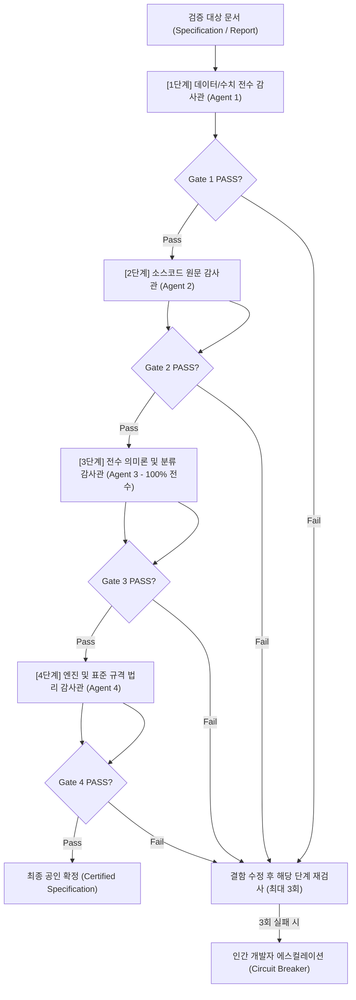

# Independent Audit Protocol Guidelines

> **부제**: 순차적 4단계 계쇄 독립감사 표준 지침 (Sequential Gated Independent Audit Protocol)

본 문서는 소프트웨어 정적/동적 분석 사양서, 아키텍처 명세서, 공인 시험평가 보고서 등 **국방/공공/인증기관에 제출되는 고신뢰성 기술 문서의 사실 무결성(Ground Truth)을 보증하기 위한 4단계 계쇄 독립감사 표준 절차**를 정의합니다.

---

## 1. 독립감사 핵심 철학 (Core Philosophy)

1. **독립성 및 단일 역할 격리 (Single Role Isolation)**:
   * 문서를 작성한 에이전트는 감사를 수행할 수 없으며, 각 감사 단계는 상호 편향이 배제된 독립된 서브에이전트가 단독으로 수행합니다.
2. **사고 기반 검증(Blind Coding) 절대 금지**:
   * "머릿속 추론"이나 "개념적 타당성"만으로 합격을 선언하는 행위를 엄격히 금지합니다. 모든 검증은 실제 원본 로그, 물리적 소스코드, 컴파일러 엔진 AST, 표준 규격서에 대한 직접적 실사를 기반으로 증명되어야 합니다.
3. **서킷 브레이커 (Circuit Breaker)**:
   * 동일한 Gate에서 3회 연속 `[FAIL]` 발생 시, 즉시 작업을 롤백하고 인간 개발자에게 에스컬레이션합니다.

---

## 2. 순차적 4단계 계쇄 감사 파이프라인 (Sequential Gated Pipeline)

감사는 반드시 이전 단계가 `[PASS]` 판정을 받아야만 다음 단계로 진입할 수 있는 **계쇄(Gated) 방식**으로 진행됩니다.

---

## 3. 단계별 전담 임무 및 엄격한 Gate 판정 기준

### [1단계] 데이터 및 수치 전수 감사 (Data & Numerical Integrity)
* **목표**: 원본 로그와 문서 간의 정량적 데이터 일치 및 테이블 간 완전 상호 배타성 검증.
* **전담 임무**:
  1. 원본 로그(`jsonl`, `csv`, `db`) 파싱 후 총 데이터 건수 및 고유 파일 수 100% 일치 확인.
  2. 하위 패턴/분류별 건수 합계가 총 건수와 수학적으로 완벽히 일치하는지 검증.
  3. 모든 테이블의 행(`(파일명, 라인 번호)` 또는 `식별자`)이 원본 로그에 1:1로 실재하는지 전수 대조.
  4. **테이블 간 중복 0건 (Zero Cross-Table Duplication)**: 동일한 항목이 복수의 분류 테이블에 중복 등재되지 않았는지 전수 검사 (동일 라인 복수 결함 시 연산자/식별자 접미사 분리 검증).
  5. **YAML Frontmatter 정합성**: `total_count`, `session_id`, `compliance_rule` 등 메타데이터가 실제 로그와 일치하는지 확인.
  6. **상단 서술 텍스트와 하단 도표 간 동적 수치 100% 일치** 검증.
* **Gate 1 통과 기준**: 수치 오차 0건 + 항목 누락/허구 0건 + 테이블 간 중복 0건 + 메타데이터 정합.

---

### [2단계] 소스코드 원문 감사 (Source Verbatim Fidelity)
* **목표**: 문서 내 인용된 대표 코드 스니펫 및 기술적 예시의 물리적 진실성 보증.
* **전담 임무**:
  1. 각 패턴의 대표 코드 스니펫이 실제 소스 파일과 **100% 원문 일치(Verbatim)**하는지 바이트 및 들여쓰기 단위 대조.
  2. 인위적 생략 부호(`...`), AI 가상 주석, 임의 수정된 변수/함수명 등 AI 환각 요소의 잔존 여부 전수 스캔.
* **Gate 2 통과 기준**: 문서 내 모든 대표 코드 스니펫의 원본 소스코드 대비 100% Verbatim 일치 + AI 가상 환각 0건.

---

### [3단계] 100% 전수 의미론 및 분류 순도 감사 (Exhaustive Typology & Semantic Purity)
> [!CAUTION]
> **임의 표본(2~3건) 샘플링 검증 절대 금지**: 소수의 이종 결함(예: 200건 중 5~10건의 타입/연산자 오분류)은 표본 샘플링 시 통계적으로 누락됩니다. 따라서 **반드시 대상 데이터 100% 전수에 대한 의미론 대조(Exhaustive Audit)**를 수행해야 합니다.

* **목표**: 분류 체계의 기술적 순도 보증 및 이종 결함 혼입(Heterogeneous Merge)의 원천 배제.
* **전담 임무**:
  1. **100% 전수 의미론 대조**: 도표에 등재된 **모든 항목(전수)**에 대해 소스코드 본문, AST 노드, 연산자, 제어 흐름을 대조하여 해당 패턴 정의에 정확히 부합하는지 1:1 전수 검증.
  2. **이종 결함 혼입(Heterogeneous Merge) 0건 수학적 입증**: 서로 다른 기술적 원인이나 AST 메커니즘을 가진 결함이 하나의 대표 패턴 도표에 부당하게 뭉뚱그려 합쳐지지 않았음을 입증.
  3. **대표 스니펫의 전형성 판정**: 대표 스니펫이 해당 패턴 군집의 모든 항목을 오류 없이 대변하는 표준 사례인지 확인.
* **Gate 3 통과 기준**: 도표 내 100% 전수 항목의 의미론 부합 + 이종 결함 혼입 0건 입증.

---

### [4단계] 엔진 및 표준 규격 법리 감사 (Engine & Domain Compliance)
* **목표**: 분석 엔진(컴파일러/정적분석기)의 알고리즘 정합성 및 상위 산업/국방 표준 규격에 대한 법리적 타당성 최종 확정.
* **전담 임무**:
  1. **경고 메시지 3자 일치 (3-Way Consistency)**: 엔진 소스코드의 진단 메시지 포맷 ↔ 원본 로그 메시지 ↔ 최종 보고서 서술 간의 100% 문자열 일치 검증.
  2. **엔진 구현 무결성**: AST Matcher, 심볼릭 실행기, 제약 조건 해석기, 예외 처리(명시적 캐스트 허용 등) 로직의 결함 유무 확인.
  3. **표준 규격 법리 심사**: 국방무기체계 SW 개발 매뉴얼(DAPA), MISRA C/C++, CWE, ISO 26262 등 적용 규격 관점에서 정탐(True Positive)/오탐(False Positive) 판정의 법리적 타당성 최종 공인.
* **Gate 4 통과 기준**: 엔진 소스 로직 무결성 + 경고문 3자 일치 + 상위 규격 기반 법리적 정탐/오탐 100% 타당성 확정.

---

## 4. 도메인별 범용 확장 가이드 (Universal Application Guide)

본 감사 프로토콜은 소프트웨어 정적분석 외에도 다양한 고신뢰성 엔지니어링 문서에 즉시 적용 가능합니다.

| 도메인 | Stage 1 (데이터/수치) | Stage 2 (원문/스니펫) | Stage 3 (전수 의미론) | Stage 4 (엔진/규격 법리) |
|---|---|---|---|---|
| **정적/동적 결함 분석서** | 로그 건수, 테이블 중복 0건 | C/C++ 소스 100% Verbatim | 결함 원인별 100% 전수 분류 | DAPA / MISRA / CWE 규격 법리 |
| **시스템 아키텍처 명세서** | API 엔드포인트 수, 데이터 모델 수 | 인터페이스 정의(Protobuf/JSON) | 계층 분리 및 호출 흐름 순도 | 클라우드 표준 / 보안 아키텍처 규격 |
| **공인 시험평가 결과서** | 테스트 케이스 전수 카운트 | 테스트 코드 및 입출력 데이터 | 정상/예외/경계 테스트 분류 순도 | TTA / KTL 공인 시험 기준 규격 |
| **보안 취약점 감사서** | 취약점 CVE/CWE 집계 수치 | 취약점 발생 함수 및 페이로드 | 공격 벡터(XSS, SQLi 등) 순도 | OWASP Top 10 / 국정원 8대 보안 규격 |

---

## 5. 실행 체크리스트 (Auditor Action Protocol)

1. **감사관 독립 호출**: 각 단계는 단일 목적을 가진 별도의 서브에이전트로 호출하며, 이전 Gate의 `[GATE PASS]` 증적을 프롬프트에 포함합니다.
2. **실패 시 롤백 (On Gate Fail)**:
   * Gate 실패 시 즉시 해당 단계의 결함을 원인 분석하여 수정하고, 동일 단계에 대한 재실사(Re-Test)를 수행합니다.
   * 수정 작업은 기존 합격한 선행 Gate의 무결성을 훼손해서는 안 됩니다.
3. **최종 공인 확정 (Final Certification)**:
   * 4개 관문을 모두 통과한 문서에 한하여 마스터 계획서에 `✅ 최종 공인 완료` 상태를 부여하고 배포/제출용 아티팩트로 전환합니다.
