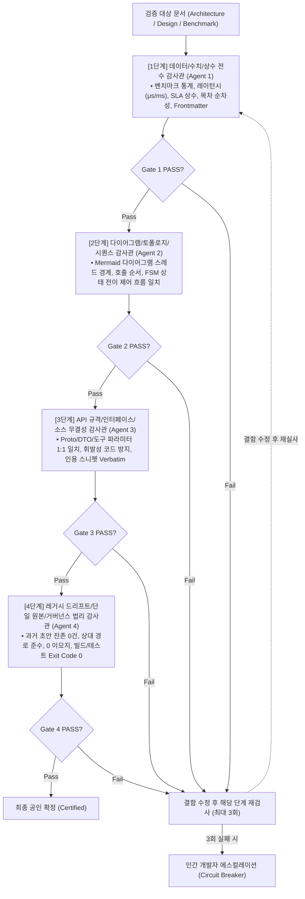
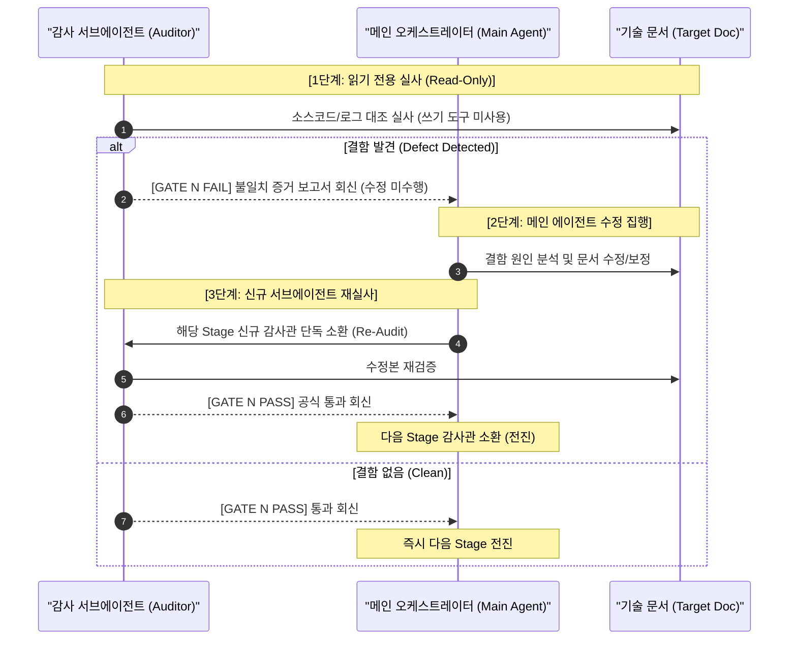
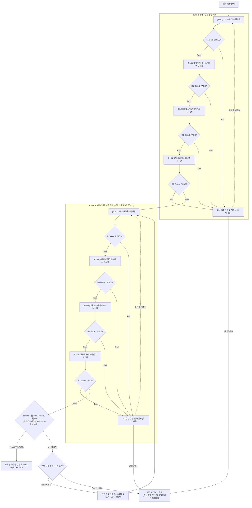

# Independent Audit Protocol Guidelines

> **부제**: 순차적 4단계 심층 계쇄 독립감사 표준 지침 (Sequential Deep Gated Independent Audit Protocol)

본 문서는 소프트웨어 시스템 아키텍처 명세서, 다이어그램, 동시성 스레드 모델, AI 에이전트 추론 사양서, 실측 성능 벤치마크 및 공인 시험평가 결과서 등 **지식베이스(Obsidian) 기술 문서가 실제 코드베이스 및 런타임 실측 데이터와 100% 일치함을 보증하기 위한 순차적 4단계 심층 계쇄 독립감사 표준 절차**를 정의합니다.

> [!NOTE]
> **운영 모드 안내 (Operational Levels)**
> * **기본 표준 모드 (Standard Mode - 1회 4단계 계쇄)**: 기술 문서 및 아키텍처 사양서 검증 시 기본 적용되는 균형 잡힌 고신뢰성 파이프라인.
> * **초고신뢰성 수렴 모드 (Ultra-High Assurance Mode - 2회 연속 수렴)**: 국방/공공 인증, 법적 분쟁 방지, LLM 비결정론(Non-determinism)의 100% 원천 배제가 요구되는 **극도의 신뢰성이 필요한 환경에서 선택적으로 활성화하는 확장 프로토콜**.

---

## 1. 독립감사 핵심 철학 (Core Philosophy)

1. **독립성 및 감사-수정 분리 (Separation of Audit and Fix)**:
   * **작성자 감사 절대 금지**: 문서를 작성한 에이전트는 해당 문서의 감사를 수행할 수 없으며, 각 감사 단계는 상호 편향이 배제된 독립된 서브에이전트가 단독으로 수행합니다.
   * **감사관의 직접 수정 금지 (Read-Only Isolation)**: 감사 서브에이전트는 검사 대상 문서를 직접 수정할 수 없습니다(자체 감사 및 이해상충 방지). 결함 발견 시 오직 구체적 증거와 함께 `[GATE N FAIL]` 보고서만을 메인 세션에 회신합니다.
   * **메인 에이전트의 수정 및 재감사 의무 (Fix & Re-Audit Protocol)**: 결함 수정은 메인 에이전트가 집행하며, 수정 완료 후 해당 단계 감사관을 새로 소환하여 재실사를 받아야 합니다. `[GATE N PASS]` 확정 전에는 절대 다음 단계로 전진할 수 없습니다.
2. **사고 기반 검증(Blind Coding) 및 표면적 라벨 매칭 절대 금지**:
   * "머릿속 추론"이나 "문서의 그럴듯한 서술"만으로 정합성을 판정하는 행위를 엄격히 금지합니다. 실제 원본 소스코드, 빌드 설정, 커널/프로토콜 스키마, 테스트 로그(`jsonl`, `csv`, `stdout`), 물리적 런타임 메트릭에 대한 직접적 실사를 기반으로 증명되어야 합니다.
3. **휘발성 코드 방지 원칙 (Anti-Volatile Code Policy)**:
   * 아키텍처 및 시스템 사양서 본문에 언제든 리팩토링으로 변경될 수 있는 내부 소스코드 클래스 구현체를 통째로 박제하는 행위를 금지합니다.
   * 코드는 소스코드 저장소의 파일/심볼 링크(`[ClassName](path/to/file#L10-L20)`)로 위임하고, 문서는 스레드 모델, 동시성 경계, 데이터 흐름, 프로토콜 계약 및 불변식(Invariants)을 중심으로 기술되어야 합니다.
4. **서킷 브레이커 (Circuit Breaker)**:
   * 동일 Gate 3회 연속 실패 또는 다회차 감사 4회 초과 시, 작업을 즉시 자동 정지하고 인간 개발자에게 에스컬레이션합니다.

> [!CRITICAL]
> **단계별 서브에이전트 단독 소환 불변식 (Strict Single-Subagent Invariant)**
> * **[적용 범위]**: 모든 워크플로우, 모든 감사 모드 및 모든 라운드에 **예외 없이 100% 강제 적용**됩니다.
> * `invoke_subagent` 도구를 호출할 때 `Subagents` 배열에는 **반드시 현재 단계에서 필요한 서브에이전트 1개만 단독(`Subagents.Length == 1`)으로 전달**해야 합니다.
> * 직전 Gate의 공식 통과 판정(예: `[GATE N PASS]`, `Exit Code 0`)이 메인 대화 세션에 수신 및 확정되기 전에 후속 단계 에이전트를 미리 호출하거나 일괄 소환하는 **조기 병렬화(Premature Parallelization 안티패턴)를 절대 금지**합니다.

---

## 2. 순차적 4단계 심층 계쇄 감사 파이프라인 (표준 1회 모드)

### 결함 발생 시 자가 치유 및 재감사 절차 (Fail-Fix-Reaudit Lifecycle)

감사관(서브에이전트)과 오케스트레이터(메인 에이전트)는 '감사와 수정의 분리' 원칙에 따라 다음과 같은 폐루프로 결함을 치유합니다.

1. **[결함 적발 및 회신]**: 감사 서브에이전트는 문서를 임의 수정하지 않고 `[GATE N FAIL]` 판정과 함께 구체적인 불일치 행, 수치, 코드 증거를 담은 보고서를 메인 세션에 반환합니다.
2. **[메인 에이전트 보정]**: 메인 에이전트는 보고서의 결함을 검토하고 문서(또는 코드)를 올바른 Ground Truth로 수정합니다.
3. **[독립 재감사 (Re-Audit)]**: 수정 완료 후, 메인 에이전트는 해당 단계의 독립 서브에이전트를 새로 단독 소환(`Subagents.Length == 1`)하여 수정 내용의 무결성을 재검증받습니다.
4. **[서킷 브레이커]**: 동일 Gate에서 3회 연속 `FAIL`이 발생할 경우 자가 치유를 즉시 중단하고 인간 개발자에게 에스컬레이션합니다.

---

## 3. 단계별 전담 임무 및 엄격한 Gate 판정 기준

### [1단계] 데이터, 수치, 상수 및 메타데이터 전수 감사 (Numerical, Constant & Metadata Integrity)
* **목표**: 문서에 기재된 모든 정량적 수치, 통계, 시간 상수, 테이블 데이터가 실제 원본 로그 및 코드베이스와 수학적으로 100% 일치함을 검증.
* **전담 임무**:
  1. **정량 수치 및 벤치마크 메트릭 검증**: 레이턴시(μs, ms, s), 처리량(ops/sec), 반복 횟수(Iterations), 샘플 수, P95/P99 지연시간이 실제 테스트 출력 로그(`stdout`, `json`, `csv`)와 100% 일치하는지 확인.
  2. **시스템 상수 및 SLA 계약 단위 검증**: 워치독 타임아웃(예: 10,000ms / 50,000ms), ReAct 루프 한계(`MaxSteps = 5`), FPS 렌더링 주기(16ms) 등의 상수값과 단위(μs vs ms)가 코드의 실제 정의와 완벽히 일치하는지 검증 (1,000배 단위 오기 0건 입증).
  3. **목차 및 섹션 넘버링 순차성 검증**: 상위 헤더(`## 1.`, `## 2.`, ...)의 중복 충돌(Duplicate Numbering)이 없는지 확인.
  4. **테이블 간 데이터 상호 배타성 및 중복 0건**: 동일한 항목이나 식별자가 복수의 분류 테이블에 중복 등재되지 않았는지 전수 대조.
  5. **YAML Frontmatter 정합성**: `description`, `related` 링크 등 메타데이터가 파일의 실제 성격과 일치하는지 확인.
* **Gate 1 통과 기준**: 수치 오차 0건 + 시간 단위 오기 0건 + 헤더 번호 충돌 0건 + 테이블 중복 0건 + Frontmatter 정합.

---

### [2단계] 다이어그램, 시스템 토폴로지 및 시퀀스 흐름 감사 (Diagram, Topology & Sequence Fidelity)
* **목표**: 문서 내 시각화 다이어그램(Mermaid flowchart, sequenceDiagram, stateDiagram)이 실제 런타임의 계층 구조, 스레드 모델, 제어 흐름과 100% 일치함을 보증.
* **전담 임무**:
  1. **스레드 모델 및 컴포넌트 토폴로지 검증 (Flowchart)**: 다이어그램에 표현된 스레드 분리(예: I/O 스레드, 메인 스레드, 워커 스레드), 큐(Queue), 버퍼 경계가 실제 소스코드의 스레드 기동 루틴 및 동기화 메커니즘과 일치하는지 확인.
  2. **시퀀스 다이어그램 호출 순서 및 프로토콜 검증 (SequenceDiagram)**: 컴포넌트 간 요청/응답 시퀀스, 비동기 RPC 발송, 콜백 스왑 및 큐 적재 단계가 실제 네트워크/IPC 핸드셰이크 순서와 바이트 단위로 논리적 모순이 없는지 검증.
  3. **상태 머신 전이 완전성 검증 (FSM / StateDiagram)**: 동결(Suspend), 사살(Kill), 복구(Resume), 타임아웃 연장(Extend) 등 모든 수명주기(Lifecycle) 전이 조건과 조기 탈출(Early-Exit) 분기가 실제 로직과 완벽히 일치하는지 확인.
* **Gate 2 통과 기준**: 다이어그램 내 허구 컴포넌트 0건 + 스레드 경계 오류 0건 + 호출 시퀀스 역전 0건.

---

### [3단계] API 규격, 인터페이스 및 소스 무결성 감사 (API, Contract & Source Fidelity)
* **목표**: 통신 프로토콜, DTO 스키마, 도구 매개변수 명세의 정확성을 검증하고, 휘발성 코드 박제 방지 원칙을 준수했는지 감사.
* **전담 임무**:
  1. **프로토콜 및 DTO 스키마 1:1 원문 대조**: `phalanx.proto` 등 프로토콜 버퍼 정의, JSON 입출력 스키마, 열거형(Enum) 필드가 실제 소스 파일과 100% Verbatim 일치하는지 확인.
  2. **도구(Tool) 및 인터페이스 파라미터 무결성**: 에이전트가 호출하는 도구의 매개변수명(`targetPid`, `encodedCommand`), 타입, 반환값 구조가 C#/C++ 구현체의 메서드 시그니처와 1:1로 일치하는지 대조.
  3. **휘발성 코드 방지 원칙 (Anti-Volatile Code Policy) 심사**:
     - 아키텍처/설계 문서에 리팩토링 시 쉽게 깨질 수 있는 C++/C# 내부 구현 클래스 코드가 불필요하게 직접 박제되어 있지 않은지 심사.
     - 구체적 구현은 단일 원본 소스 파일 링크(`[FileName.h](path/to/file)`)로 위임하고, 문서에는 아키텍처 불변식과 데이터 레이아웃만 남겼는지 확인.
  4. **인용 코드 스니펫 실사 (필요 시)**: 문서에 불가피하게 인용된 핵심 알고리즘 스니펫이 있다면 원본 소스 파일과 들여쓰기/변수명/반환값까지 100% Verbatim 일치하는지 검증 (AI 환각 코드 0건).
* **Gate 3 통과 기준**: API/DTO/Proto 스키마 100% 일치 + 휘발성 코드 직접 삽입 0건(링크 위임 준수) + 인용 스니펫 원문 일치.

---

### [4단계] 레거시 드리프트, 단일 원본(SSOT) 및 거버넌스 법리 감사 (Legacy Drift, SSOT & Governance Law)
* **목표**: 과거 프로토타입 잔존물 배제, 단일 원본(SSOT) 경로 규격 준수, 지식베이스 작성 원칙 및 실제 빌드/테스트를 통한 최종 법리 확정.
* **전담 임무**:
  1. **레거시 드리프트 전수 스캔**: 과거 초안에 쓰였던 구버전 모델명(예: `Gemini 2.0 Flash`, `gemini-3.8`), 폐기된 프로젝트명/네임스페이스, 변경 전 타임아웃 수치가 문서 내에 잔존하지 않는지 전수 검색하여 0건 입증.
  2. **단일 원본 및 상대 경로 규격 준수**: 문서 간 및 형제 저장소(`../Phalanx`, `../MundusVivens`) 간 참조 시 `C:\Users\...` 등 로컬 머신 종속적 절대 경로가 0건인지 확인 (순수 상대 경로 사용 필수).
  3. **Obsidian 지식베이스 작성 원칙 준수**: 장식용 유니코드 이모지(Emoji) 0건 정책, 클린 엔지니어링 마크다운 톤앤매너 유지 확인.
  4. **실제 테스트 실행 결과 공인 (Ground Truth Certification)**: 문서에 서술된 기능 및 컴포넌트가 실제 프로젝트의 빌드/테스트 러너(예: `dotnet test`, `ctest`, PowerShell 풀체인 스크립트)에서 **`Exit Code 0`**으로 통과함을 실측하여 최종 인증 발급.
* **Gate 4 통과 기준**: 레거시 잔존물 0건 + 절대 경로 0건 + 장식용 이모지 0건 + 실제 테스트 Exit Code 0 공인.

---

## 4. [확장 옵션] 초고신뢰성 2회 연속 수렴 프로토콜 (Ultra-High Assurance Option)

국방 무기체계 공인 인증, 감항 인증, 법적 증빙 자료 제출 등 LLM의 비결정론적 편향을 100% 원천 배제해야 하는 환경에서는 **「2회 연속 동일 수렴(Dual-Round Convergence) 파이프라인」**을 선택적으로 가동합니다.

### 초고신뢰성 옵션 운영 규칙
1. **전 라운드 4단계 순차 심층 계쇄 불변식 (Strict 4-Stage Invariant per Round)**:
   * Round 2를 단일 에이전트 1인에게 위임하여 4개 단계를 축약하는 행위는 엄격히 금지됩니다.
   * Round 1과 동일하게 Round 2 역시 4인의 독립 에이전트를 1인씩 순차 단독 소환(`Subagents.Length == 1`)하여 총 8회 순차 계쇄를 완수해야 합니다.
2. **2회 연속 동일 수렴 (Dual-Round Convergence)**:
   * 1차와 2차의 모든 정량적 수치, 다이어그램 제어 흐름 분석, API 스키마 검증 결과가 100.0% 오차 없이 동일하게 수렴할 때만 `[ULTRA-HIGH CONVERGENCE CERTIFIED]`가 발급됩니다.
3. **4회 한도 서킷 브레이커 (Circuit Breaker)**:
   * 총 4회 라운드를 초과할 때까지 2회 연속 수렴에 도달하지 못하면 작업을 즉시 중단하고 인간 개발자에게 에스컬레이션합니다.

---

## 5. 도메인별 범용 확장 가이드

본 독립감사 파이프라인은 지식베이스 내 다양한 기술 문서 유형에 맞추어 다음과 같이 대응 적용됩니다.

| 도메인 유형 | Stage 1 (데이터/수치/상수) | Stage 2 (다이어그램/시퀀스) | Stage 3 (API/인터페이스) | Stage 4 (레거시/거버넌스) |
| :--- | :--- | :--- | :--- | :--- |
| **시스템 아키텍처 및 파이프라인 명세서** | • 큐 용량, 배치 타이머 주기 • 메모리 상한선(MB), Tombstone 한도 | • 스레드 모델(I/O, 메인, 워커) • 양방향 스트리밍 시퀀스 | • Protobuf 서비스 RPC 계약 • CQRS 이벤트 스키마 1:1 대조 • 휘발성 클래스 코드 배제 | • 이전 아키텍처 모델명 드리프트 • 형제 저장소 상대 링크 유효성 • E2E 통합 테스트 Exit Code 0 |
| **AI 에이전트 및 오케스트레이션 설계서** | • ReAct 최대 턴 수(`MaxSteps`) • 워치독 10s/50s, CTS 타임아웃 • 확신도(Confidence) 임계치 | • ReAct FSM 상태 전이도 • 도구 호출 및 Observation 피드백 루프 | • 5대 수사 도구 파라미터/반환값 • 구조화 JSON 출력 규격 • 도구 구현체 파일 링크 위임 | • 과거 LLM 모델명(Gemini 2.0 등) • Fail-Secure 격리 정책 일치 • 에이전트 단위 테스트 통과 |
| **성능 벤치마크 및 프로파일링 레지스트리** | • 전체 소요시간, 평균/P95/P99 • 초당 처리량, 카나리 누수량 • 섹션 번호 순차성 (충돌 0건) | • 공격 윈도우 vs 방어 간트 차트 • 타임라인 누수 방어 시각화 | • 벤치마크 테스트 메서드 매핑 • 입출력 페이로드 데이터 규격 | • 테스트 환경 변수 및 인증 규격 • 0 이모지 지침 준수 • 벤치마크 재현 Exit Code 0 |
| **정적/동적 소프트웨어 결함 분석서** | • 총 결함 건수, 고유 파일 수 • 정탐/오탐 및 패턴별 합계 | • 제어 흐름 그래프(CFG) • 가짜 분기(Infeasible Path) 흐름 | • 실제 C 코드의 값 도메인 역추적 • 대표 결함 스니펫 100% Verbatim | • CSA/DAPA/MISRA 규격 법리 • 정탐/오탐 이종 결함 혼입 0건 • 공인 시험 통과 결과서 일치 |
