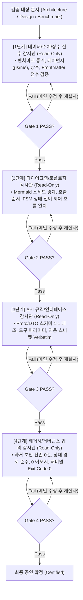

# Independent Audit Protocol Guidelines (고신뢰성 기술문서 4단계 심층 계쇄 독립감사 표준 지침)

본 문서는 아키텍처 명세서, 동시성 스레드 모델, AI 에이전트 설계서, 벤치마크 결과서 등 **지식베이스(Obsidian) 기술 문서가 실제 코드베이스 및 런타임 실측 데이터와 100% 일치함을 보증하기 위한 순차적 4단계 심층 계쇄 독립감사 표준 절차**를 정의합니다.

> [!NOTE]
> **운영 모드 안내**
> * **기본 표준 모드 (Standard Mode)**: 기술 문서 검증 시 기본 적용되는 1회 4단계 순차 계쇄 감사.
> * **초고신뢰성 수렴 모드 (Ultra-High Assurance Mode)**: 국방/공공 인증 등 극도의 무결성이 요구될 때 완전 신규 에이전트 4인으로 2회차를 반복하는 **2회 연속 동일 수렴(Dual-Round Convergence)** 확장 프로토콜.

---

## 1. 독립감사 핵심 철학 및 4대 불변식

1. **감사와 수정의 엄격한 분리 (Separation of Audit and Fix)**:
   * **작성자 감사 절대 금지**: 문서를 작성한 에이전트는 감사를 수행할 수 없으며, 각 단계는 독립된 서브에이전트가 단독 수행합니다.
   * **감사관 수정 권한 배제 (Read-Only Isolation)**: 감사관은 문서를 직접 수정할 수 없습니다(이해상충 방지). 결함 발견 시 오직 구체적 증거가 담긴 `[GATE N FAIL]` 보고서만 반환합니다.
   * **메인 에이전트 수정 및 재감사**: 수정은 메인 에이전트가 집행하며, 수정 후 해당 단계 신규 감사관을 소환하여 재실사를 받아야 합니다. `[PASS]` 확정 전에는 절대 다음 단계로 전진할 수 없습니다.
2. **단계별 서브에이전트 단독 소환 (Strict Single-Subagent Invariant)**:
   * `invoke_subagent` 호출 시 **반드시 현재 단계의 감사관 1개만 단독(`Subagents.Length == 1`)으로 호출**합니다. 직전 Gate 통과 전 후속 단계 에이전트를 미리 호출하는 **조기 병렬화(Premature Parallelization)를 절대 금지**합니다.
3. **휘발성 코드 박제 금지 (Anti-Volatile Code Policy)**:
   * 리팩토링으로 쉽게 변경되는 내부 클래스/함수 구현체 코드를 사양서에 통째로 복사해 박제하는 행위를 금지합니다.
   * 소스 파일 링크(`[ClassName](path/to/file#L10-L20)`)로 위임하고, 문서는 스레드 모델, 상태 전이, 프로토콜 계약, 불변식(Invariants)을 중심으로 기술합니다.
4. **사고 기반 검증(Blind Coding) 절대 금지**:
   * 머릿속 추론이나 단순 텍스트 일치로 합격을 주어서는 안 되며, 실제 원본 소스코드, 빌드 설정, 커널/프로토콜 스키마, 테스트 로그를 물리적으로 직접 대조하여 증명해야 합니다.

---

## 2. 순차적 4단계 심층 계쇄 감사 파이프라인

```mermaid
flowchart TD
    Doc["검증 대상 문서 (Architecture / Design / Benchmark)"]

    Stage1["[1단계] 데이터/수치/상수 전수 감사관 (Read-Only)<br>• 벤치마크 통계, 레이턴시(μs/ms), 상수, Frontmatter 전수 검증"]
    Gate1{"Gate 1 PASS?"}
    
    Stage2["[2단계] 다이어그램/토폴로지 감사관 (Read-Only)<br>• Mermaid 스레드 경계, 호출 순서, FSM 상태 전이 제어 흐름 일치"]
    Gate2{"Gate 2 PASS?"}

    Stage3["[3단계] API 규격/인터페이스 감사관 (Read-Only)<br>• Proto/DTO 스키마 1:1 대조, 도구 파라미터, 인용 스니펫 Verbatim"]
    Gate3{"Gate 3 PASS?"}

    Stage4["[4단계] 레거시/거버넌스 법리 감사관 (Read-Only)<br>• 과거 초안 잔존 0건, 상대 경로 준수, 0 이모지, 터미널 Exit Code 0"]
    Gate4{"Gate 4 PASS?"}

    FinalPass["최종 공인 확정 (Certified)"]

    Doc --> Stage1 --> Gate1
    Gate1 -- "Pass" --> Stage2 --> Gate2
    Gate1 -- "Fail (메인 수정 후 재실사)" --> Stage1
    Gate2 -- "Pass" --> Stage3 --> Gate3
    Gate2 -- "Fail (메인 수정 후 재실사)" --> Stage2
    Gate3 -- "Pass" --> Stage4 --> Gate4
    Gate3 -- "Fail (메인 수정 후 재실사)" --> Stage3
    Gate4 -- "Pass" --> FinalPass
    Gate4 -- "Fail (메인 수정 후 재실사)" --> Stage4
```

### 자가 치유 및 재실사 폐루프 (Fail-Fix-Reaudit Protocol)
1. **결함 적발 회신**: 감사관은 문서를 직접 수정하지 않고, 불일치 행 번호와 증거 로그를 명시한 `[GATE N FAIL]` 보고서를 메인 세션에 반환합니다.
2. **메인 에이전트 수정**: 메인 에이전트가 보고서를 검토하고 문서를 올바른 Ground Truth로 수정합니다.
3. **독립 재감사(Re-Audit)**: 수정 완료 후 해당 Stage의 신규 감사관을 단독 소환(`Subagents.Length == 1`)하여 통과(`[PASS]`)할 때까지 재검증을 완수합니다.

---

## 3. 단계별 전담 임무 및 엄격한 Gate 판정 기준

### [1단계] 데이터, 수치, 상수 및 메타데이터 전수 감사
* **임무**: 레이턴시(μs/ms), 처리량(ops/sec), 반복 횟수, P95/P99 지연시간이 실제 테스트 출력 로그(`jsonl`, `csv`, `stdout`)와 일치하는지 전수 검증. 타임아웃, 루프 한계, 시간 단위(1,000배 단위 오기 0건) 및 YAML Frontmatter 무결성 확인.
* **Gate 1 통과 기준**: 수치 오차 0건 + 시간 단위 오기 0건 + 테이블 중복 0건 + Frontmatter 정합.

### [2단계] 다이어그램, 시스템 토폴로지 및 시퀀스 감사
* **임무**: 문서 내 Mermaid(flowchart, sequenceDiagram, stateDiagram)가 실제 런타임의 스레드 분리(I/O, 메인, 워커), 큐/버퍼 경계, 비동기 RPC 호출 순서, FSM 상태 전이(Suspend/Kill/Resume 등)와 일치하는지 검증.
* **Gate 2 통과 기준**: 다이어그램 내 허구 컴포넌트 0건 + 스레드 경계 오류 0건 + 제어 흐름 모순 0건.

### [3단계] API 규격, 인터페이스 및 소스 무결성 감사
* **임무**: Protobuf 정의, JSON 입출력 스키마, 열거형(Enum), 에이전트 도구 매개변수(`targetPid` 등)가 C#/C++ 구현체와 1:1 일치하는지 검증. 휘발성 구현 코드가 박제되지 않고 소스 파일 링크로 올바르게 위임되었는지 확인.
* **Gate 3 통과 기준**: API/DTO/Proto 스키마 100% 일치 + 휘발성 코드 박제 0건(링크 위임 준수) + 인용 스니펫 원문 Verbatim 일치.

### [4단계] 레거시 드리프트, 단일 원본(SSOT) 및 거버넌스 법리 감사
* **임무**: 과거 폐기된 모델명/프로젝트명 잔존 여부 전수 검색(0건 입증), 로컬 절대 경로(`C:\...`) 배제 및 형제 저장소 순수 상대 경로 준수 확인, 장식용 이모지 0건 확인. 실제 빌드/테스트 러너에서 **`Exit Code 0`**으로 통과함을 실측하여 최종 인증 발급.
* **Gate 4 통과 기준**: 레거시 잔존물 0건 + 절대 경로 0건 + 장식용 이모지 0건 + 실제 테스트 Exit Code 0 공인.

---

## 4. [확장 옵션] 초고신뢰성 2회 연속 수렴 프로토콜 (Ultra-High Assurance)

국방/공공 인증 등 극도의 신뢰성이 요구될 때 선택적으로 가동합니다.

1. **완전 신규 에이전트 4인에 의한 2차 실사**: Round 1(Stage 1~4) 통과 직후, 이전 라운드와 완전히 격리된 신규 에이전트 4인을 순차 소환하여 Round 2(Stage 1~4)를 독립 재실사합니다.
2. **2회 연속 동일 수렴 (Dual-Round Convergence)**: 1차와 2차의 모든 정량 수치, 다이어그램 분석, API 스키마 검증 결과가 100.0% 오차 없이 동일하게 수렴할 때만 `[ULTRA-HIGH CONVERGENCE CERTIFIED]`를 발급합니다. 불일치 발생 시 수정 후 Round 1부터 재시작합니다.

---

## 5. 위기 관리: Level 1 서킷 브레이커 연동

감사 도중 동일 Gate에서 3회 연속 실패가 발생하거나, 초고신뢰성 모드에서 4회 라운드를 초과할 때까지 수렴에 실패하면 작업을 즉시 강제 중단합니다. 
세부 롤백 절차, `[Unresolved]` 런북 기록 및 사용자 에스컬레이션은 Level 1 [`Agent_Runtime_Operations_Protocol.md`](./Agent_Runtime_Operations_Protocol.md)의 규격을 100% 그대로 따릅니다.
