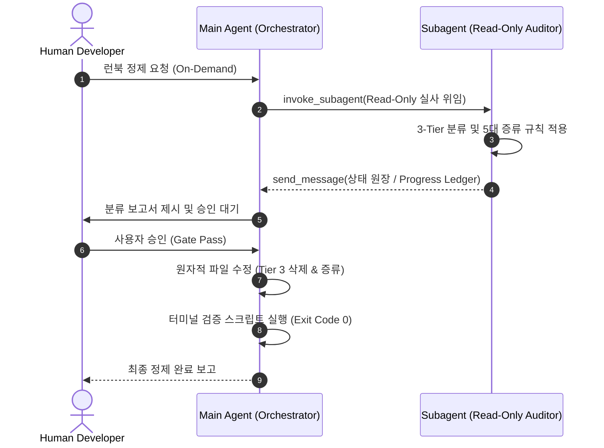

# Troubleshooting Pruning Guidelines

본 문서는 `troubleshooting/` 디렉토리 내 런북 엔트리를 정제할 때, 컨텍스트 오염을 방지하고 에이전트의 주의력을 보호하기 위한 **압축·최적화·가지치기 표준 가이드라인**을 정의합니다.

> [!IMPORTANT]
> **거버넌스 계층 원칙 (Hierarchy & SSOT Invariant)**
> 최초 런북 작성 규격(Symptom ➔ Root Cause ➔ Resolution)은 Level 1 [`Agent_Runtime_Operations_Protocol.md`](./Agent_Runtime_Operations_Protocol.md)를 단일 진실 공급원(SSOT)으로 준용합니다. 본 문서는 작성된 엔트리의 사후 정제 및 압축 기준만을 규정합니다.

## 1. 핵심 철학 및 보존 기준 (Litmus Test)
* **컨텍스트 오염 방어**: 원시 로그, 폐기 코드, 자명한 버그 내역 잔존 시 실패 경로 편향(Action Thrashing) 및 지시사항 망각(Instruction Amnesia) 유발. 노이즈 원천 배제.
* **보존 판별 질문 (Litmus Test)**:
  > *"이 항목이 시스템 크래시, 데드락, 메모리 누수 등 치명적 결함으로 재발할 수 있는 기술적 함정(Gotcha)인가, 아니면 단순 기능 구현 및 코드 정리 일지인가?"*
* **온디맨드 실행 원칙 (On-Demand Execution)**: 정기 자동 감사/크론 금지. 사용자 명시적 지시 시에만 실행.

## 2. 3-Tier 보존 및 가지치기 분류 체계
모든 H2 엔트리는 아래 3개 등급으로 엄격히 분류합니다.

| 분류 등급 | 대상 및 특성 | 처리 방침 |
| :--- | :--- | :--- |
| **Tier 1 (필수 보존)** | • 엔진/프로세스 크래시, 데드락, 메모리 누수 • OS/커널/컴파일러 제약 (P/Invoke, AST 단언 실패) • 보안/인증 및 아키텍처 SSOT 불변식 위반 | **영구 보존** (세부 수치는 압축) |
| **Tier 2 (유지 권장)** | • 프레임워크 바인딩/스레딩 함정 (STA/WPF, gRPC 스트림) • 직렬화 파서 충돌, 비직관적 라이브러리 Gotchas | **유지** (핵심 함정 위주 정제) |
| **Tier 3 (가지치기/삭제)** | • 신규 기능 개발(Feature Implementation) 일지 • 단순 UI/UX 스타일링, 애니메이션, 테마 정규화 • 단순 리팩토링 (클래스명 변경, Dead Code 삭제) • 벤치마크/테스트 성적표, 개발 마일스톤 보고서 | **완전 삭제** |

## 3. 엔트리 내부 무손실 압축 5대 규칙 (Semantic Distillation)
Tier 1 및 Tier 2 보존 엔트리는 다음 5대 규칙으로 노이즈를 증류합니다.

1. **규칙 1 (텔레메트리 제거)**: 과거 시점의 `dotnet build Exit Code 0`, `29/29 통과` 등 회귀 검증 로그 및 벤치마크 표 전면 삭제.
2. **규칙 2 (기능 명세 가지치기)**: `Resolution` 내 신규 UI 레이아웃, 화면 명세 등 비즈니스 로직 설명 제거. 에러 회피 핵심 로직만 보존.
3. **규칙 3 (부정 제약 및 교차 참조)**: 동일 근본 원인 엔트리는 링크(`[참조](#...)`)로 통합하고, **"절대 X 방식을 사용하지 말 것 (Never use X)"** 형태의 부정 제약으로 증류.
4. **규칙 4 (번들 분리 및 선별 제거 - Bundle Splitting)**: 1:N 복수 이슈는 원자적 분리. Tier 1/2와 Tier 3가 혼재된 경우 **Tier 3 서술/코드는 도려내어 삭제**.
5. **규칙 5 (내러티브 다이어트 - Verbose Narrative Pruning)**:
   * **디버깅 일기 삭제**: "처음에는 A를 시도했으나..." 식의 시행착오 내러티브 삭제 ➔ 최종 `Root Cause` 1~2줄로 직결.
   * **코드 덤프 배제**: 거대 소스코드 전문 붙여넣기 금지 ➔ 버그 유발 핵심 스니펫(2~3줄) 또는 원포인트 diff로 압축.

## 4. 온디맨드 정제 프로토콜 (Execution Protocol)
[`AI_Agent_Architecture_Paradigms_Guidelines.md`](./AI_Agent_Architecture_Paradigms_Guidelines.md)의 **평가자-최적화자(Evaluator-Optimizer) 및 비대칭 권한 격리**를 준수합니다.

1. **1단계: 독립 Read-Only 감사관 실사 (Auditor Subagent)**
   * 메인 에이전트는 `research` 서브에이전트(Read-Only)를 소환하여 3-Tier 분류 및 5대 증류 규칙 전수 실사 위임.
   * 감사관은 메인에게 **압축 상태 원장(Progress Ledger)**만 반환하여 메인의 컨텍스트 오염 및 자가 편향(Self-Review) 차단.
2. **2단계: 취합 보고 및 사용자 승인 대기 (Human Gate)**
   * 메인 에이전트는 원장을 취합하여 `[Tier 1/2 보존 / Tier 3 삭제 대상 / 예상 절감치]` 보고. 사용자 명시적 승인(`승인`) 대기.
3. **3단계: 원자적 정제 및 무결성 검증 (Terminal Ground Truth)**
   * 승인된 내역에 한해 메인이 원자적 파일 수정 집행.
   * 백그라운드 터미널에서 검증 스크립트로 마크다운 문법 및 상대 경로 유효성의 `Exit Code 0` 확인 후 종료.

### 4.1 서브에이전트 프롬프트 호출 규격 (Invocation Guidelines)
* **`TypeName`**: `research` (파일 수정 도구가 원천 차단된 Read-Only 컨텍스트)
* **`Role`**: `Troubleshooting Pruning Auditor (Read-Only)`
* **`Prompt` 필수 주입 구성 요소**:
  1. **대상 파일**: 정제 대상 트러블슈팅 문서의 절대 경로.
  2. **준거 규격**: 본 문서의 3-Tier 분류 기준(제2장) 및 5대 증류 규칙(제3장) 전수 적용 명시.
  3. **권한 제약**: 파일 직접 수정 금지 (Read-Only 실사).
  4. **반환 포맷 (Progress Ledger)**: 원시 본문 덤프 금지. 아래 테이블 포맷으로만 회신:
     `| H2 엔트리명 | Tier 판정 | 구체적 분류 근거 | 조치 권고 (보존/삭제/증류) |`
