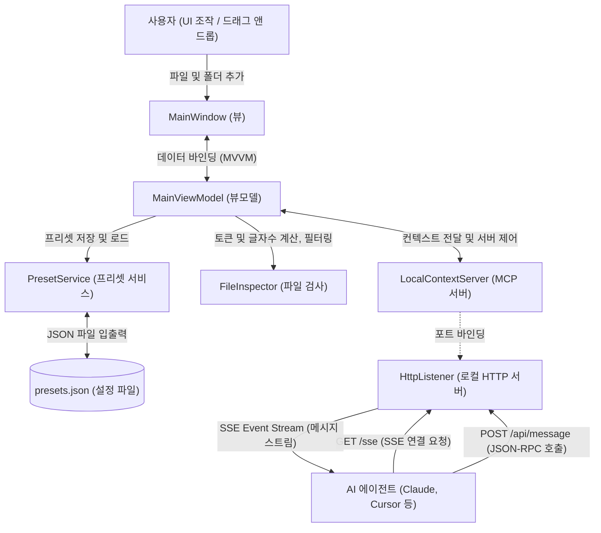

# Mermaid 다이어그램 작성 및 파싱 오류 해결 가이드

Obsidian, GitHub, VS Code 등의 마크다운 환경에서 Mermaid 다이어그램을 작성할 때 발생하는 대표적인 구문 오류(Syntax Error)의 원인과 예방 규칙을 정리한 가이드라인입니다.

---

## 1. 핵심 설계 규칙 (Core Rules)

###  Rule 1: `graph` 대신 `flowchart` 엔진 사용하기
Mermaid에는 구형 엔진인 `graph`와 신형 엔진인 `flowchart`가 있습니다. 
* **`graph TD`**: 오래된 파서 엔진을 사용하여 특수문자, 괄호, 따옴표가 조금만 들어가도 구문 에러를 쉽게 발생시킵니다.
* **`flowchart TD`**: 렌더링 속도가 빠르고 괄호, 기호의 이스케이프 처리가 훨씬 유연하며 버그가 적습니다.
* **권장**: 다이어그램 작성 시 항상 `flowchart TD` 또는 `flowchart LR`로 시작하세요.

---

###  Rule 2: 특수문자/공백/샵(#)이 포함된 노드는 반드시 큰따옴표(`""`) 사용
노드 텍스트에 특수문자나 공백이 포함되어 있다면 반드시 큰따옴표로 감싸야 합니다.
* **대상 문자**: 괄호 `()`, 대괄호 `[]`, 슬래시 `/`, 더하기 `+`, 공백 ` `, 한글/영문 혼용 등
* **올바른 사용법**: `ID["텍스트 내용 (상세 정보)"]`

> [!WARNING]
> * 큰따옴표 없이 괄호 등을 사용하면 파서가 이를 노드의 형태 정의(예: `ID(둥근 노드)`)로 잘못 인식하여 `got 'PS' (Parenthesis Start)` 에러를 뿜어냅니다.
> * **특히 샵 `#` 기호의 치명적인 함정:** 
>   일부 구형/단순 마크다운 및 Mermaid 엔진은 토큰을 해석하기 전에 **문장 전체에서 `#` 뒤의 글자를 무조건 주석으로 날려버리는 버그**가 있습니다. 이 경우 큰따옴표 안에 감싸진 `#`도 예외 없이 잘라내어 문법 에러(`"C` 형태로 남음)를 냅니다.
>   * **해결책**: 다이어그램 텍스트 안에는 `#` 기호의 직접 사용을 아예 회피하고 **`CSharp`** 또는 **`C-Sharp`** 등으로 철자를 풀어서 작성하는 것이 가장 안전합니다.

---

###  Rule 3: 연결선 레이블(Edge Label)의 `&` (Ampersand) 예약어 피하기
Mermaid에서 `&` 기호는 여러 노드를 동시에 연결하는 **문법 예약어**입니다.
* **예 예시**: `A & B --> C` (A와 B 노드 둘 다 C로 연결)
* 이로 인해 연결선 설명 `|A & B 제어|` 내부에 `&`를 그냥 쓰면 파서가 문법 구조 자체를 오해하여 전혀 엉뚱한 라인에서 에러를 표시합니다.
* **해결책**:
  1. `&` 대신 한글 `및` 또는 영문 `and`를 사용합니다. (권장)
  2. 불가피하게 사용해야 할 경우 엣지 레이블 전체를 큰따옴표로 감싸 텍스트 리터럴로 만듭니다: `-->|"A & B 제어"|`

---

###  Rule 4: 레이블 내부에 따옴표를 표시할 때는 HTML 엔티티 사용
노드 텍스트 내부에 강조 등의 이유로 리터럴 큰따옴표(`"`)를 넣고 싶다면, 이스케이프(`\"`)가 작동하지 않으므로 HTML 엔티티 코드를 사용해야 합니다.
* **HTML 엔티티**: `&quot;` 또는 `#quot;`
* **사용 예시**: `Node["이것은 &quot;강조&quot;된 노드입니다"]`

---

###  Rule 5: 비교 연산자 기호 (`<`, `>`, `>=` 등) 대신 한글/영어 텍스트 사용
라벨 텍스트에 `<`, `>`, `>=` 등의 부등호 기호가 들어가면 마크다운 파서가 이를 HTML 태그의 시작/끝으로 오해하여 다이어그램 렌더링을 완전히 망가뜨립니다.
* **해결책**:
  1. 기호 대신 `미만`, `초과`, `이상`, `이하` 등의 한글 텍스트 또는 `under`, `over` 등 영문으로 기재합니다. (강력 권장)
  2. 기호를 불가피하게 써야 할 경우 HTML 엔티티(`&lt;`, `&gt;`)를 사용하고 전체를 큰따옴표로 감싸서 문자열 리터럴로 고립시킵니다.

---

###  Rule 6: 숫자 순서 형식 (`1. `, `2. ` 등) 사용 시 마크다운 리스트 충돌 예방
노드 텍스트가 숫자로 시작하고 마침표와 띄어쓰기가 이어지면 (예: `1. 공간 스캔`), 일부 마크다운 엔진이 이 내부 텍스트를 마크다운 순서 리스트로 오인하여 `Unsupported markdown: list` 오류가 발생합니다.
* **해결책**:
  1. 마침표 뒤의 공백을 지우거나 (예: `1.공간 스캔`), 마침표 대신 대괄호 형식(예: `[1] 공간 스캔`) 또는 둥근 괄호(예: `(1) 공간 스캔`) 형식으로 작성하여 리스트 파서를 우회합니다.

---

## 2. 올바른 표현 (Good vs Bad)

| 상태 | 잘못된 예시 (Bad) | 올바른 예시 (Good) | 비고 |
| :--- | :--- | :--- | :--- |
| **괄호/공백 포함** | `Agent[AI 에이전트 (Claude / Cursor)]` | `Agent["AI 에이전트 (Claude / Cursor)"]` | 괄호로 인한 구문 해석 오류 방지 |
| **특수문자 포함** | `LocalHTTP[HttpListener (127.0.0.1:15050+)]` | `LocalHTTP["HttpListener (127.0.0.1:15050+)"]` | `+` 기호 및 IP 주소 괄호 처리 |
| **연결선 특수문자** | `VM <-->\|컨텍스트 & 서버 제어\| Server` | `VM <-->\|"컨텍스트 및 서버 제어"\| Server` | `&` 예약어 우회 및 따옴표 감싸기 |
| **따옴표 내포** | `A["이름: \"홍길동\""]` | `A["이름: &quot;홍길동&quot;"]` | 내부 따옴표 깨짐 방지 |
| **비교 연산자 포함** | `Check[에너지 < 20]` | `Check["에너지 20 미만"]` 또는 `Check["에너지 &lt; 20"]` | HTML 태그 오인으로 인한 차트 깨짐 방지 |
| **순서 번호 포함** | `A[1. 공간 스캔]` | `A["[1] 공간 스캔"]` 또는 `A["1.공간 스캔"]` | `Unsupported markdown: list` 문법 오류 방지 |

---

## 3. 종합 실전 템플릿 (Reference Template)

다음은 실제 성공적으로 빌드 및 렌더링이 검증된 **MCP Context Feeder** 시스템 구성도 샘플입니다. 템플릿 작성 시 참고하세요.

